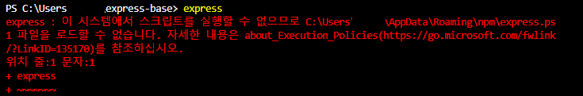
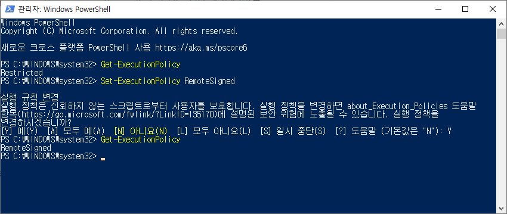
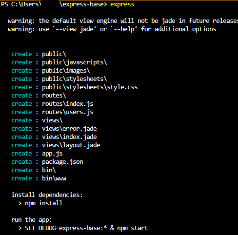

# express 실행 오류

## 에러 내용

 

> express : 이 시스템에서 스크립트를 실행할 수 없으므로 
> C:\Users\사용자명\AppData\Roaming\npm\express.ps 1 파일을 로드할 수 없습니다.  
> 자세한 내용은 [about_Execution_Policies](https://go.microsoft.com/fwlink/?LinkID=135170)를 참조하십시오.  

## 해결 방법

 

1.PowerShell을 관리자 권한 실행 

2.Get-ExecutionPolicy 입력 
-> Restricted 상태 출력 확인 
 
1. Set-ExecutionPolicy RemoteSigned 입력 
-> 실행 규칙 변경 
실행 정책은 신뢰하지 않는 스크립트로부터 사용자를 보호합니다. 실행 정책을 변경하면 about_Execution_Policies 도움말
항목(https://go.microsoft.com/fwlink/?LinkID=135170)에 설명된 보안 위험에 노출될 수 있습니다. 실행 정책을 변경하시겠습니까? 
[Y] 예(Y) [A] 모두 예(A) [N] 아니요(N) [L] 모두 아니요(L) [S] 일시 중단(S) [?] 도움말 (기본값은 "N"): 
 
1. Y 입력 
 
1. Get-ExecutionPolicy 입력 
-> RemoteSigned 상태 출력 확인 

6.명령어 재실행 시, 정상작동 확인 가능 

  

