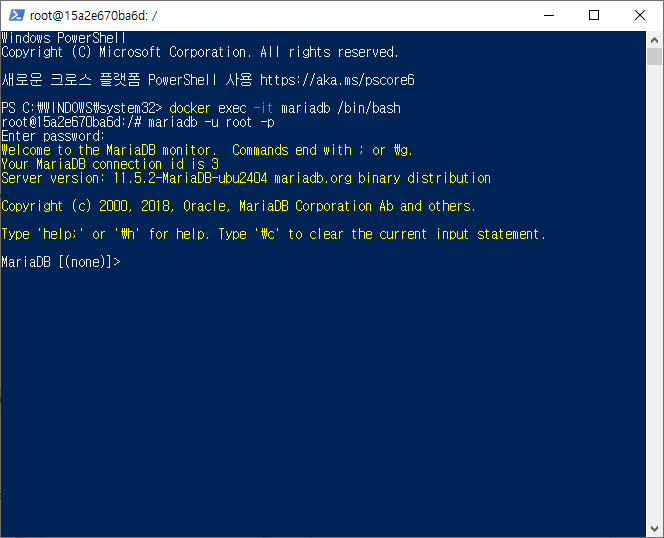

# 🌊 mariaDB 접속 방법

<span style="color:lightseagreen">💫 **mariaDB 접속 방법**</span><br>

<br>

1. docker를 켜줌<br>

2. powershell 관리자 권한으로 실행 후 명령어 입력!<br>
    ```bash
    docker exec -it mariadb /bin/bash
    ```
3. mariadb 실행 :<br>
    ```bash
    mariadb -u root -p
    ```
4. 비밀번호 root 입력하면 mariadb 성공적으로 접속완료!<br>

<br>


