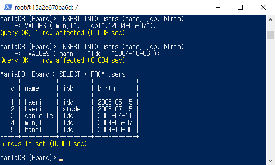
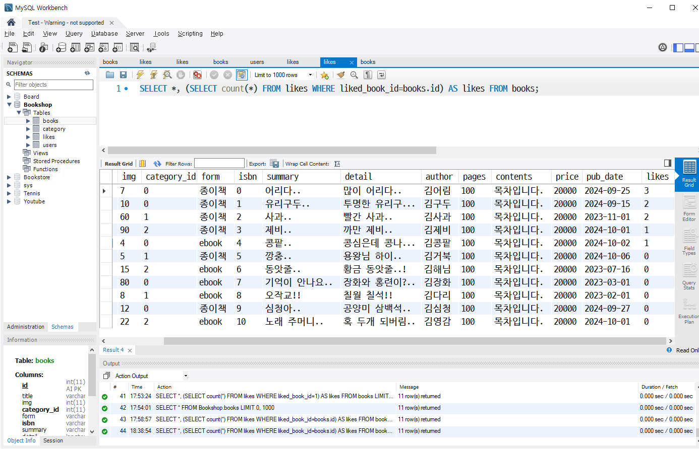

# 🌊 백엔드심화SQL

<span style="color:lightseagreen">💫 **백엔드심화SQL**</span><br>

1. **"Board"스키마 생성**<br>
    ```sql
    CREATE DATABASE Board;
    USE Board;
    ```
    <br>

2. **사용자 테이블 생성**<br>
- 테이블 이름은 기본적으로 복수형 추천(테이블 안에 여러 개가 들어가므로)!<br>
- AUTO_INCREMENT : 자동 숫자 증가(기입 기능)<br>
    ```sql
    CREATE TABLE users (
        id INT NOT NULL AUTO_INCREMENT,
        name VARCHAR(30) NOT NULL,
        job VARCHAR(100),
        birth DATE,
        PRIMARY KEY (id)
    );
    ```
    <br>

3. **사용자 데이터 삽입**<br>
- VALUES ("haerin", "idol","100101");을 해도 위의 2번에서 birth DATE덕분에 자동으로 적혀짐! 그래도 입력할 때 맞춰서 입력해주는 게 좋음!<br>
- NOT NULL -> 무조건 값을 넣기!(이름이 null이여도 X)<br>
    ```sql
    INSERT INTO users (name, job, birth)
    VALUES ("haerin", "idol","20060515");
    ```
    ```sql
    INSERT INTO users (name, job, birth)
    VALUES ("haerin", "student","2006-07-15");
    ```
    ```sql
    INSERT INTO users (name, job, birth)
    VALUES ("danielle", "idol","2005-04-11");
    ```    
    ```sql
    INSERT INTO users (name, job, birth)
    VALUES ("minji", "idol","2004-05-07");
    ```  
    ```sql
    INSERT INTO users (name, job, birth)
    VALUES ("hanni", "idol","2004-10-06");
    ```  
    <br>

4. **게시글 테이블 생성**<br>
- 작성 일자 : created_at(보편적으로 사용)<br>
- 수정 일자 : updated_at(보편적으로 사용)<br>
    ```sql
    CREATE TABLE posts (
        id INT NOT NULL AUTO_INCREMENT,
        title VARCHAR(100) NOT NULL,
        content VARCHAR(2000),
        created_at TIMESTAMP DEFAULT NOW(),
        PRIMARY KEY (id)
    );
    ```
    <br>

5. **게시글 데이터 삽입**<br>
- TIMESTAMP DEFAULT NOW()을 통해 created_at 값을 적지 않아도 자동입력됨!<br>
    ```sql
    INSERT INTO posts (title, content)
    VALUES ("title1", "content1");
    ```
    <br>

6. **게시글 테이블에 수정일자 추가**<br>
- ALTER을 통해 수정일자를 추가하기<br>
    ```sql
    ALTER TABLE posts
    ADD COLUMN updated_at DATETIME
    DEFAULT NOW()
    ON UPDATE NOW();
    ```
    <br>

7. **게시글 테이블 id 2 수정**<br>
- UPDATE를 이용하여 update된 시간 갱신해보기<br>
    ```sql
    UPDATE posts
    SET content="updated!"
    WHERE id = 2;
    ```
    <br>

8. **게시글 테이블에 작성자 컬럼 FK 추가**<br>
- MUL(MULTIPLE) : 기본키 값을 가져다 쓰고 있는 외래키지만 중복이 가능하므로 MUL!<br>
    ```sql
    ALTER TABLE posts
    ADD COLUMN user_id INT;
    ```
    ```sql
    ALTER TABLE posts
    ADD FOREIGN KEY(user_id)
    REFERENCES users(id);
    ```
    <br><br>
    [**FK 제약조건 이름 짓기**]<br>
    fk_기준 테이블명_참조테이블명_참조키<br>
    **cartItems.user_id > users.id** : fk_cartItems_users_id<br>
    **likes_user_id > users.id** : fk_likes_users_id<br>


9. <span style="color:lightseagreen">**✨조인(정규화)✨**</span><br>
- **SELECT 할 때만 보기 편하라고 해주는 것임!!(실제로 테이블을 생성하진 않음!!)**<br>
(가상의 테이블을 임시로 돌려주는 것)<br>
- 게시글의 사용자 번호와 사용자의 사용자 번호가 같으면 붙이는 조건<br>
    ```sql
    SELECT * FROM posts LEFT
    JOIN users ON posts.user_id = users.id;
    ```
    ```sql
    SELECT posts.id, title, content, created_at, updated_at, name, job, birth  FROM posts LEFT
    JOIN users ON posts.user_id = users.id;
    ```
    <br>

10.  **조건을 만족하는 행 개수**<br>
- count()를 쓰면 조건을 만족하는 행 개수 출력 가능<br>
    ```sql
    SELECT count(*) FROM likes WHERE liked_book_id = 1;
    ```
    <br>

11.  **좋아요 개수가 포함된 books 테이블 조회**<br>
- 서브 쿼리를 사용해 출력하기<br>
    ```sql
    SELECT *, (SELECT count(*) FROM likes WHERE liked_book_id=books.id) AS likes FROM books;
    ```
    <br>

12.  **개별 도서 조회 시, 사용자가 좋아요를 했는지 여부를 포함**<br>
- 특정 책의 상세 정보를 가져오는 동시에<br>
- **좋아요 수\(likes)를 계산**하고<br>
- **특정 유저가 좋아요를 눌렀는지 여부\(liked)를 확인**<br>
- 또한 **해당 책의 카테고리 정보**도 함께 가져옴<br>
- 결론 : 사용자 인터페이스에서 책의 상세 페이지를 보여줄 때 유저가 좋아요를 눌렀는지 여부와 좋아요 수를 함께 표시<br>
    ```sql
    SELECT *, 
        (SELECT count(*) FROM likes WHERE liked_book_id=books.id) AS likes,
        (SELECT EXISTS (SELECT * FROM likes WHERE user_id=1 AND liked_book_id=1)) AS liked 
        FROM books 
        LEFT JOIN category 
        ON books.category_id = category.category_id
        WHERE books.id=1;
    ```
    <br>
<br><br/>


