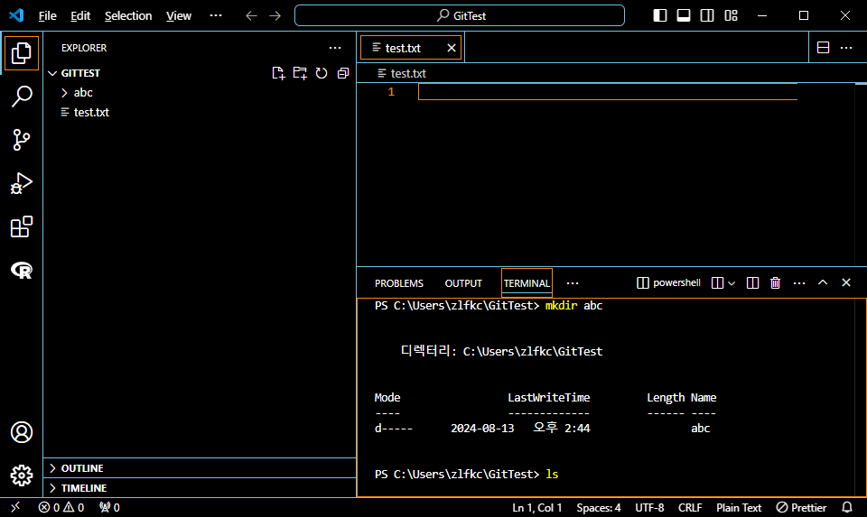
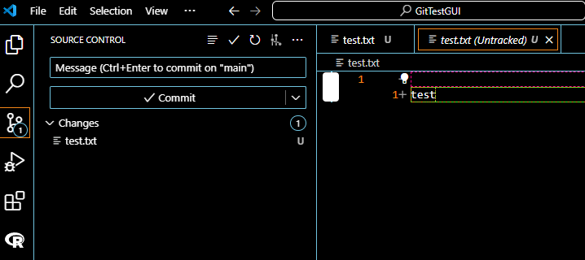
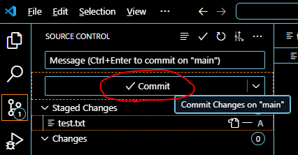

## 프로그래머스 풀스택 02
협업 환경 구성(2)

### 🌊 깃 기본 개념

💫 깃은 분산식 버전 관리 시스템! 
- 필요한 프로젝트가 있을 경우 통째로 빼서 쓰는 것. 
- 로컬 시스템이라 내 컴퓨터에 설치됨. 
- 협업을 가능하게하는 각자의 깃! 
- 유의미한 수정(버전)이 일어남(프로젝트 통으로도 버전 변경이 가능)  

💫 깃 허브는 원격으로 중앙에서 프로젝트를 백업, 버전 관리, 협업하게 해줌. 
- 깃허브는 프로젝트의 버전을 언제든지 다 가지고있음. 
- 프로젝트의 히스토리를 깃허브가 대신 관리해줌!  

💫 동기화를 시킨 상태에서 버전 수정을 하면 로컬의 버전이 수정됨. 
- ex) 1.0을 깃허브와 로컬을 동기화시켜놓고 수정하면 로컬의 버전은 1.1취급. 
- 깃허브는 결론적으로 편하게 컴퓨터에서 버전 관리를 가능하게 함!  

**✔ 따라서 깃은 내 컴퓨터 안에서 버전을 관리 해주는 시스템이자, 깃허브와 소통하는 시스템.** 
- 내 컴퓨터에 깃이 깔려 있으면 버전 관리 로컬로 가능, 깃허브와 소통(백업, 복구) 가능.  

**✔ 깃허브는 원격 컴퓨터에서 백업을 담당하는 시스템이자, 내 컴퓨터와 별도로 버전 관리도 해주는 친구** 
- 깃허브에서 동기화된 프로젝트를 언제든지 다른 컴퓨터에서 사용할 수 있음!(깃이 깔려있으면)  

### 🌊 깃 설치하기

공식 홈페이지 https://git-scm.com/ 에서 다운 가능! 

 
Windows 기준 git bash을 통해 git -v 또는 git --version을 하면 현재 git버전 확인가능함!   

### 🌊 CLI VS GUI

✔ CLI: 커맨드 라인 인터페이스; 명령 줄 인터페이스 
- 셸에서 글자를 입력해서 컴퓨터에 명령을 내림.  
- ex) MS DOS, 명령 프롬프트(cmd), 파워셸, 배쉬, Terminal, Windows Terminal, ⋯

✔ GUI: 그래픽 유저 인터페이스
- 그래픽으로 컴퓨터에 명령을 내릴 수 있도록 사용자에게 화면 제공.  

### 🌊 깃 명령어

**✨ ls (list segments): 폴더의 목록을 보여주는 명령어** 

  

**✨ mkdir (make directory) : 새로운 디렉토리 생성** 

abc라는 이름의 폴더 생성!  

**✨ cd (change directory) : 디렉토리 위치 변경** 
**✨ cd .. : 이전 폴더로 이동** 

  

**✨ git init(initialize) : git 초기화 후 버전 관리를 가능한 폴더로 변경** 
- 기본 폴더안에 .git라는 파일을 만들어서 관리해주는 것임. 
- 하지만 시작부터 모든 파일을 추적(tracking)하고 있지는 않음.  

**✨ git status : 현재 git 상태 확인** 
- 맨 처음에는 git이 관리하는 파일이 아니라서 git init을 먼저 해야함. 
- 버전 관리를 위해서는 파일 하나 하나를 부탁해야함. 
)
  

**✨ git add 파일명 : git에게 이 파일을 추적(tracking)해 달라고 하는 것.** 
- 이 파일들을 모아달라는 것임. 

  

**✨ git commit :  파일 및 폴더의 추가/변경 사항을 저장소에 기록하는 것** 
- 버전으로 저장할 것(폴더, 파일 등)들을 지금까지 모은 걸로 버전을 만드는 것임. 

 
commit을 하고 c를 치고 엔터를 하면 하단에 --INSERT--가 뜨는데 
이때 커밋에 변경사항, 할 말 등을 쓸 수 있음. ex) first commit 
그 다음에 'ESC'를 누르고 'Shift + :'을 입력하면 하단으로 다시 입력 바가 이동하며 
':wq'을 입력하면 이 창을 저장하고 닫는다는 의미. 

 
커밋이 완료된 모습.
  

**✨ git log : 커밋의 기록을 볼  수 있음** 

  

### 🌊 GUI init, add, commit

 
이렇게 간단하게 git init을 할 수 있음!  

 
U표시는 Untraked 상태이고 
 
 
'+'버튼을 누르면 add가 됨.   

 
✔ Commit 버튼을 누르고 메세지를 작성한 뒤 
 
오른쪽 상단의 체크 표시를 누르면 커밋이 됨!   

### 🌊 Git History 설치

 
Extensions에서 Git History를 검색하면 바로나옴. 
 
History 버튼을 누르면 커밋했던 것들이 자세하게 나옴!
  

### 🌊 git remote -v

**✨ git remote -v : 현재 디렉토리와 연결된 원격 저장소가 어디인지 확인** 

 

test용도라 연결된 원격저장소가 없기때문에 나오지않음.
  

### 🌊 과제 실습

✨과제 NanYoung.txt 실습 접기/펼치기✨

1. ls 명령어 

  

2. mkdir 명령어 

  

3. cd 명령어 

  

4. init과 status 명령어 

  

5. add 명령어 

  

6. commit 명령어 

  

7. log 명령어 

  

8. 깃 히스토리 

  

### 🌊 느낀 점

깃허브를 기존에 사용하고 있지만 커밋과 관련해서 구글링으로 혼자 아득바득🙄 검색해가면서 배웠던 기억이 났다. 
당시에 GUI로 커밋하는 거 말고 GIT BASH를 이용해 직접 커밋을 해서 항상 커밋오류나고 그랬는데(지금은 VSC에서 편하게 하지만...) 
오늘 강의를 들으며 다시 한번 자세히 원리에 대해 알 수 있어서 좋았다. 
앞으로 협업의 시작이라고 생각하니 두근두근하다.

