# 프로그래머스 풀스택 03
협업 환경 구성(3)

## 🌊 깃허브 회원가입

💫 https://github.com/ 에 접속해서
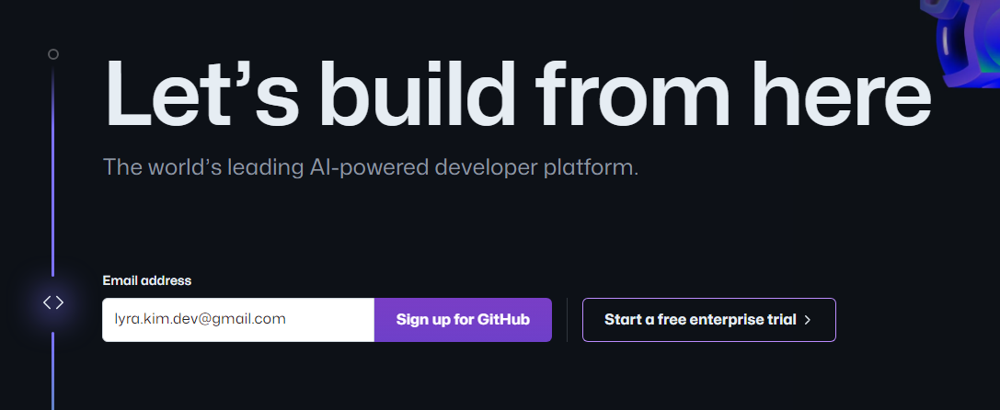 
가운데에 사용할 이메일 주소를 적어준다.
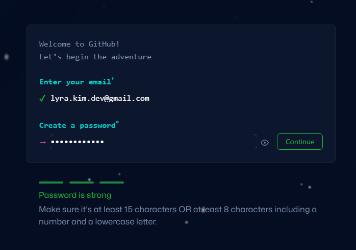 
나는 이미 기존에 사용중인 깃허브 계정이 있어서 추가로 진행하지 않았다! 
이 다음부터는 **username 설정** 
(나같은 경우 https://github.com/Algoruu 처럼 Algoruu가 username이다.) 
다음 항목은 **이메일 수신 동의 항목**, 
마지막으로 **퍼즐 인증**을 통과하면 이메일 주소로 인증 코드가 날라와서 
번호를 복사하거나, open GitHub를 눌러주면 된다.  
설문조사 항목을 지나 **Free 계정**으로 생성해주면 회원가입이 완료된다.   

## 🌊 깃허브 레포지토리 생성

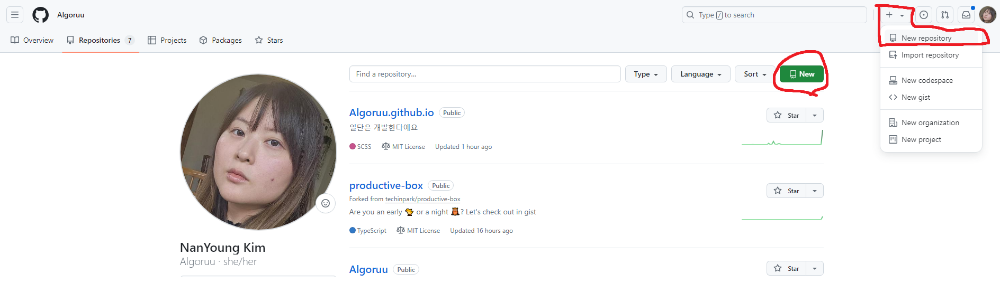 
기존에 이미 레포지토리가 존재해서 스크린샷에 표시한 버튼 두 개 다 레포지토리 생성이 가능하다. 
레포지토리의 이름과 프로젝트의 명은 달라도 상관없음!  

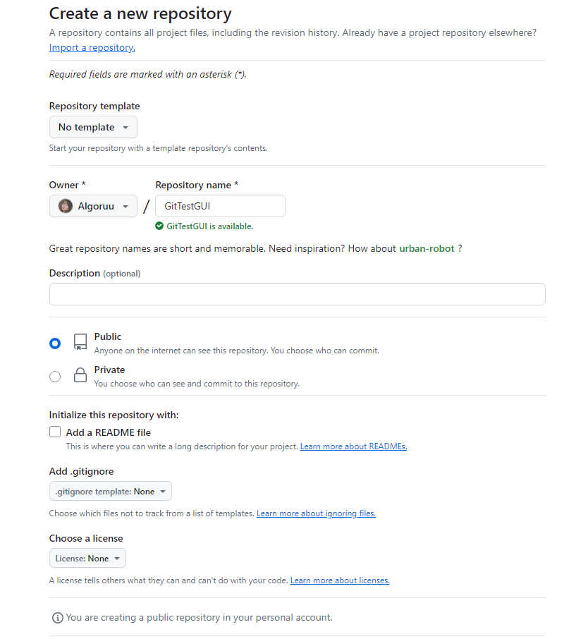 
Public과 Private 설정으로 공개/비공개 여부를 선택할 수 있다.  

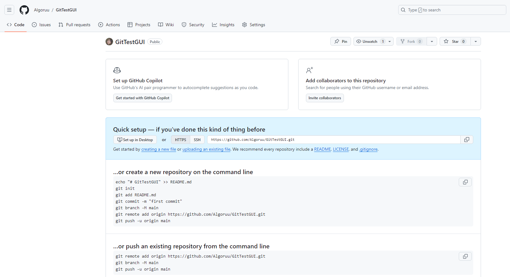 
처음 시작시 어떤 명령어를 입력해야하는지 알려줌. 
or create ⋯: 새 프로젝트를 관리할건지 알려주는 명령어들 
or push ⋯: 존재하고 있는 프로젝트를 레포지토리로 백업할건지 알려주는 명령어들  

## 🌊 깃허브에 로컬 프로젝트 업로드

**✨ git remote add 원격저장소(깃허브 레포지토리)별칭 원격저장소URL: 원격저장소에 로컬 프로젝트를 연결하는 명령어** 
- ex) git remote add origin https://github.com/Algoruu/GitTestGUI.git 

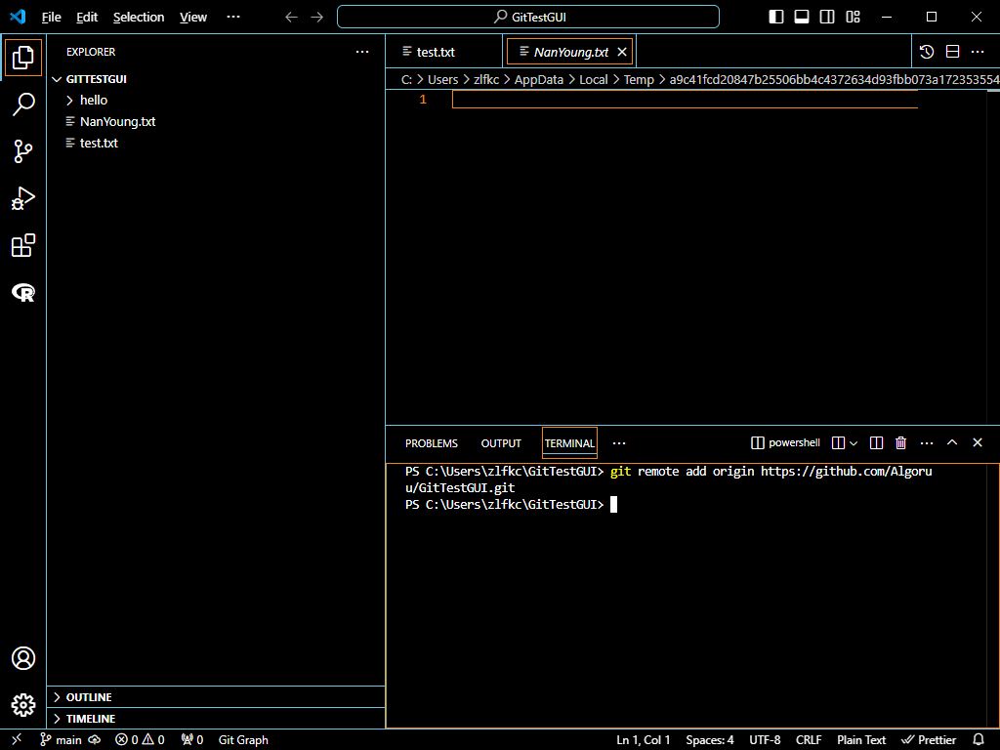 

여기서 git remote -v를 입력하면 
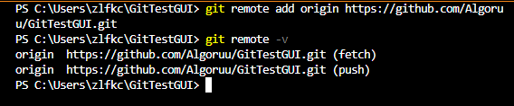 
✨ fetch: 서버에 있는 코드를 가져올 때 사용하는 것. 
✨ push: 로컬 컴퓨터 안에 있는 코드를 깃허브에 업로드할 때 사용하는 것. 
연동이 된 것을 확인할 수 있음!  

**✨ git push [원격 이름] [브랜치 이름] : 로컬의 브랜치를 깃허브의 브랜치로 push 한다** 
-  git push origin main(master, ⋯) 는 로컬의 main 브랜치를 깃허브의 main 브랜치에 push한다는 뜻.  

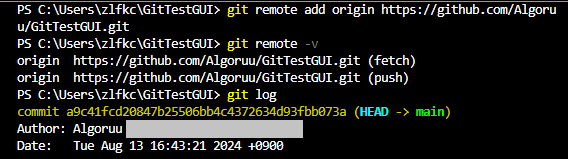 

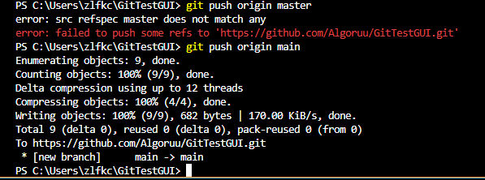 
master를 사용하면 main과 일치하지 않아서 main으로 다시 진행해야 연결이 됨. 

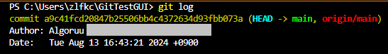 
연결이 잘 되었다!  

## 🌊 토큰 생성

연결하다가 비밀번호를 입력하라고 뜨면 github의 비밀번호가 아닌 토큰 발급 필요! 
Settings -> Developer Settings -> Personal access tokens (classic) 
https://github.com/settings/tokens/new (클래식 토큰 바로 생성 링크) 
원하는 대로 repo, workflow, ⋯ 선택하여 토큰을 생성하면 됨!  

## 🌊 CLI clone 과 GUI clone은 같다.

**✨ git clone 원격저장소URL: 깃허브의 프로젝트를 로컬 저장소로 가져오는 것** 
- ex) git clone https://github.com/Algoruu/GitTestGUI.git 
(기존 폴더가 아닌 새로운 로컬 저장소 폴더임) 

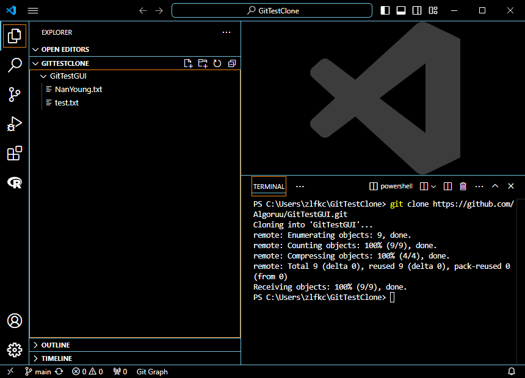 
연결과 소스코드를 동시에 가져온 걸 확인할 수 있음!  

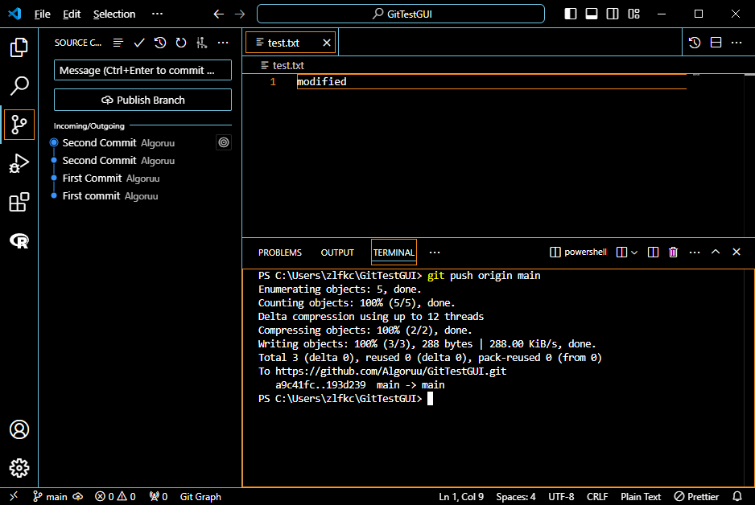 
기존 폴더에서 수정한 걸 수동커밋한 것. 
하지만 이 상태에서 새로운 로컬 저장소 폴더로 다시 돌아가보면 

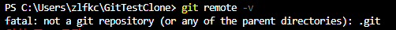 
오류가 발생하여 
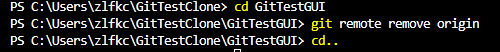 
직접 경로를 들어가 삭제해야함 
(사실은 오류가 아님 그냥 경로를 어디다 두냐의 차이) 
**✨ git remote remove origin : 연결해놨던 원격저장소를 지움**  

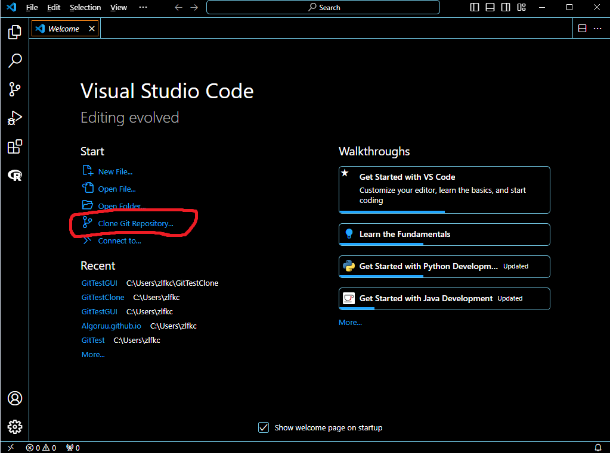 
clone 레포지토리를 누르고 상단 검색바에 링크를 적어주면 

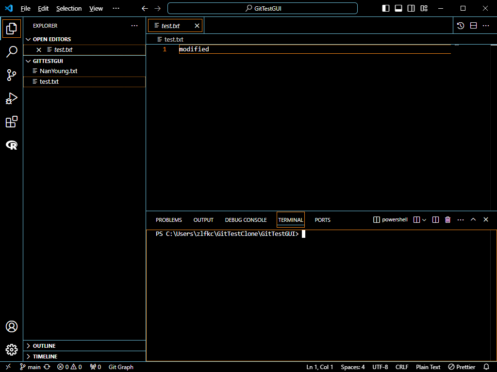  
클론이 알아서 되고 터미널 부분을 확인해보면 경로가 이미 GitTestGUI로 알아서 접속되어 있음! 

**✔ 사실상 CLI clone과 GUI clone은 똑같고 경로를 직접 들어가냐, GUI가 알아서 잡아주냐 차이임.**  

## 🌊 깃허브에 올린 프로젝트 내려받기 / 반대로 업로드하고 내려받기

**✨ git pull [원격 이름] [브랜치 이름] : 깃허브의 브랜치를 로컬의 브랜치로 pull 받는다** 
- git pull origin main(master, ⋯) 는 깃허브의 main 브랜치를 로컬의 main 브랜치에 pull받는다 뜻. 

✔ 왼쪽에서 수정하고 push하고, 오른쪽에서 pull 받은 모습. 
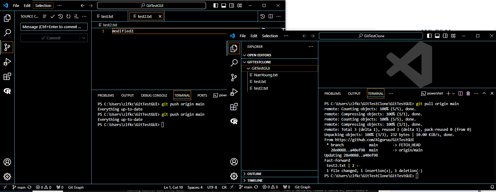  

✔ 오른쪽에서 수정하고 push하고, 왼쪽에서 pull 받은 모습. 
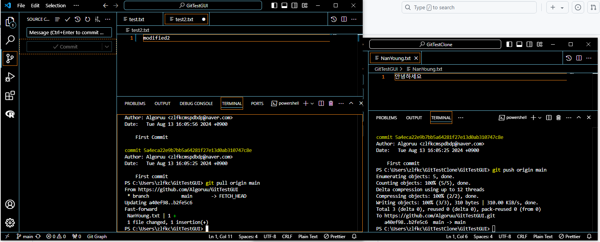  

## 🌊 브랜치란?

- 프로젝트 하나를 여러 갈래로 복사해서 사용하는 일 
- 병렬적으로 기능을 구현하고 싶을 때 가능함 
- 나중에 하나로 합치기 위해 가지를 치는 것이라고 생각해야 좋음!  

## 🌊 브랜치 실습

**✨ git branch : 현재 브랜치의 목록을 확인함** 
- '*'표시는 현재 그 브랜치에 있다는 뜻. 

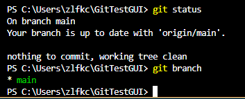 
현재 main 브랜치에 있다는 뜻이다. 

**✨ git branch [브랜치 이름]: [브랜치 이름]의 브랜치를 생성함** 

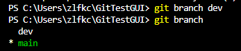 
dev 브랜치 생성 

**✨ git checkout [브랜치 이름] : [브랜치 이름]이라는 브랜치로 이동** 
- git checkout - : 이전 브랜치로 이동 
  
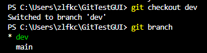  

## 🌊 느낀 점

깃허브에 관해 자세히 가르쳐주셔서 좋았다! 
CLI clone할 때 헷갈렸던 부분때문에 항상 GUI clone만 사용하고 있었는데 
사실은 똑같고 경로를 어떻게 두냐의 차이였단 점이 허탈할지도... 
그래도 더 잘 쓸 수 있을테니까 이제야 알았으니 오히려 좋아!! 

