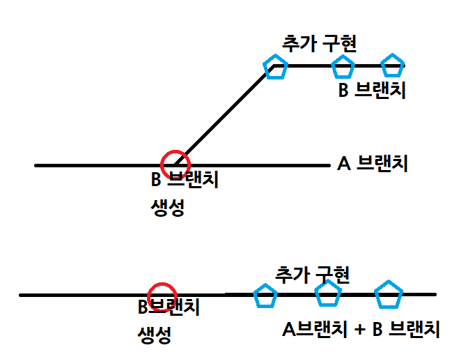
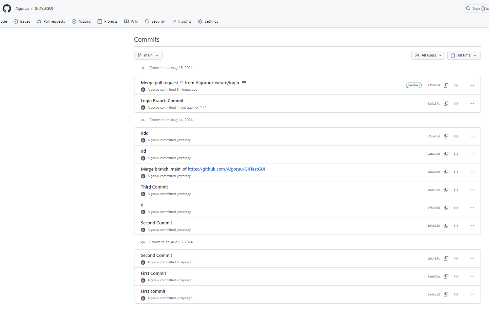

## 프로그래머스 풀스택 04
협업 환경 구성(4)

### 🌊 브랜치 이름 규칙과 테스트

💫 메인 브랜치(v1.2)에서 브랜치를 복사하는 경우! 
- 기능 개발: feature/login, feature/select-product 
- 출시 준비: release-1.3, release-1.4 
- 긴급 수정: hotfix-1.2.1 

 
feature/login, feature/select-product브랜치를 생성하고 
이동하는 모습. 
  
**✨git branch -d [브랜치 이름]: [브랜치 이름]의 브랜치를 삭제하는 명령어** 

  

### 🌊 커밋을 완료해야 브랜치가 완성됨!

💫 브랜치는 곧 C언어의 포인터와 같은데, 복사를 해왔어도 커밋이 되지 않으면 
시작이 되지 않는다고 봐야함! 

 
항상 커밋할 때 왼쪽 하단의 브랜치를 잘 확인하고 할 것! 지금은 feature/login에 커밋해놓은 상태. 

 
feature/select-product 브랜치에서 Git History를 확인하면 없는 것을 볼 수 있음.  

### 🌊 원격 브랜치 실습

**✨git branch -r: 현재 깃허브에 원격으로 연결된 브랜치 확인 명령어** 

 
현재 위치하는 브랜치를 확인하고, 원격 브랜치를 확인. 
그 다음 로컬 브랜치를 원격 브랜치에 연결해준다! 

 
깃허브 레포지토리에서 feature/login 브랜치가 생성된 걸 볼 수 있음!  

### 🌊 깃 브랜치 전략: fast-forward

깃 플로우라고도 함. 전략은 다양하게 사용 가능. 
크게 두가지로 
- fast-forward 
- 3-ways 

**💫 fast-forward 전략: 잘 안쓰이는 전략** 
- A 브랜치에서 B 브랜치를 생성한 시점부터, 
A 브랜치에는 추가 구현 X, B 브랜치에만 추가 구현 O 
- 그 뒤 B 브랜치와 A 브랜치를 합치면 👉 A 브랜치에 B 브랜치가 붙으면서 끝! 

  

### 🌊 깃 브랜치 전략: 3ways

**💫 3-Way 전략: 일반적으로 가장 많이 사용하는 전략** 
- A 브랜치에서 B 브랜치를 생성한 시점부터, 
A 브랜치도, B 브랜치도 모두 추가 구현 O 
- 그 뒤 B 브랜치와 A 브랜치를 합치면 👉 A 브랜치와 B 브랜치가 서로 비교, 바뀐 것을 정리 후 합침! 

  

**💫 3-Way + fast-forward: 일반적으로 가장 많이 사용하는 전략** 
- fast-forward와 3-Way을 적절히 혼합하여 사용 

  

### 🌊 Pull request & merge (병합과 충돌)

**💫 병합(Merge)** 
- 브랜치를 생성하는 것 -> 협업을 위한 것 
- 브랜치 병합(추가 가지 -> base 가지)을 "깃허브" 
-  **merge commit: 병합이 일어날 때도 커밋이 일어남.**  

💫 main 브랜치 보호 
- 추가 브랜치 -> main 브랜치 병합 시켜달라 = Pull Request 
- 충돌 자동 감지 
- **PR 메시지** : 협업에서 중요하므로 잘 적을 것. 

💫 branch 삭제  

✔ main 브랜치는 보호 받아야함! 
 
병합하기전에 pull request 받을건지 체크! 

✔ Pull request 진행 방법
 
 

병합 후 필요없는 브랜치는 삭제 해주는 것이 좋음! 
 
(어차피 복구가능) 

커밋 리스트 확인 
  

### 🌊 merge된 깃허브 -> 깃에 동기화

**✨ 깃허브에서 브랜치 병합 후 vsc 상에서 남아 있을 때 삭제 방법 ✨** 

git fetch -p (깃허브 브랜치 목록 동기화) 👉 git checkout main (main으로 브랜치 위치 변경) 👉 git pull origin main(깃허브 main 정보 받기) 👉 git branch -d feature/login (그 다음 브랜치삭제하기) 
순서대로 입력하면 잘 삭제가 됨!  

 
깃허브에서 병합하고 난 뒤 삭제한 브랜치가 vsc 상에서 남아있는 걸 확인하면 위에 대로 진행하면 됨 

-------------------------------------------------------------
**✨git fetch -p: 깃허브에 브랜치 목록을 동기화 하는 명령어** 

**✨git remote prune origin: 로컬 데이터가 원격엔 삭제되었지만 아직 남아있는 브랜치 목록을 정리하는 명령어** 
  

### 🌊 충돌 해결하기

**✨git checkout -t [필요한 브랜치 경로]: 깃허브에 있는 브랜치를 받아오는 명령어** 
- ex) git checkout -t origin/feature/1: 깃허브에서 생성한 feature/1이라는 이름의 브랜치를 가져옴 

 

충돌이 생겼을 때는 
 
Pull request할 때 상단에 알림이 뜬다! 

 
 

충돌이 난 코드 부분을 삭제하여 원하는 부분을 남겨주면 충돌이 해결됨 
그 뒤 삭제된 브랜치를 삭제하려면 
git fetch -p (깃허브 브랜치 목록 동기화) 👉 git checkout main (main으로 브랜치 위치 변경) 👉 git pull origin main(깃허브 main 정보 받기) 👉 git branch -d feature/login (그 다음 브랜치삭제하기)  
작업 똑같이 해주고 원본쪽에 다시 한번 git pull origin main 해줄 것!  

### 🌊 느낀 점

깃 브랜치 전략과 병합(merge), main 브랜치 보호, branch 삭제, 충돌 시 해결법 등 
몰랐던 것들에 대해 많이 배울 수 있었다. 
특히 Pull Request 설명 부분은 깔끔하면서도 명확하게 작성해야겠단 생각을 했음! 

