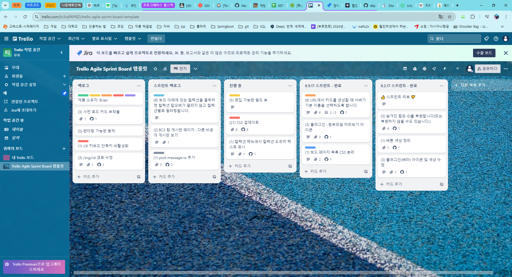
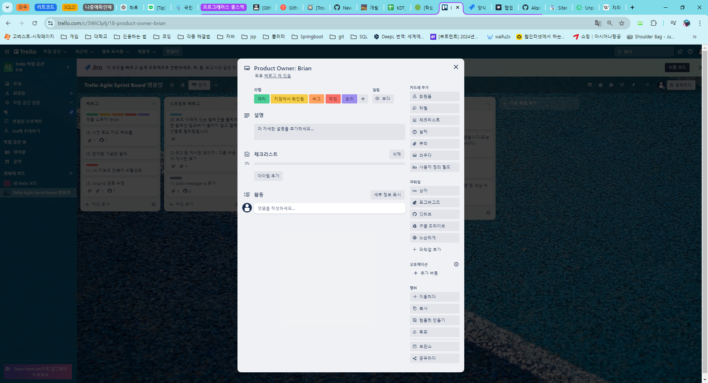
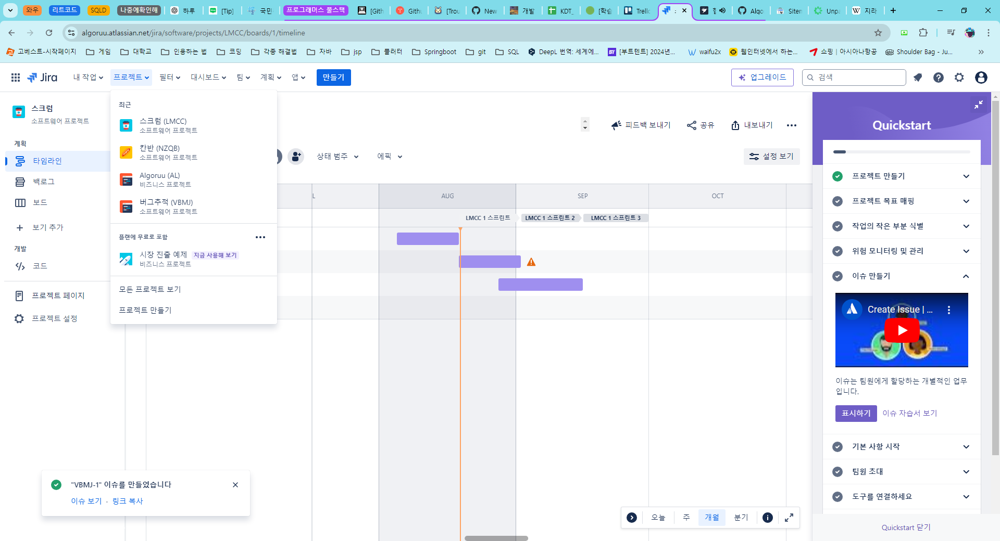
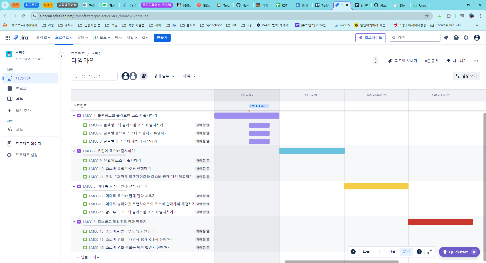
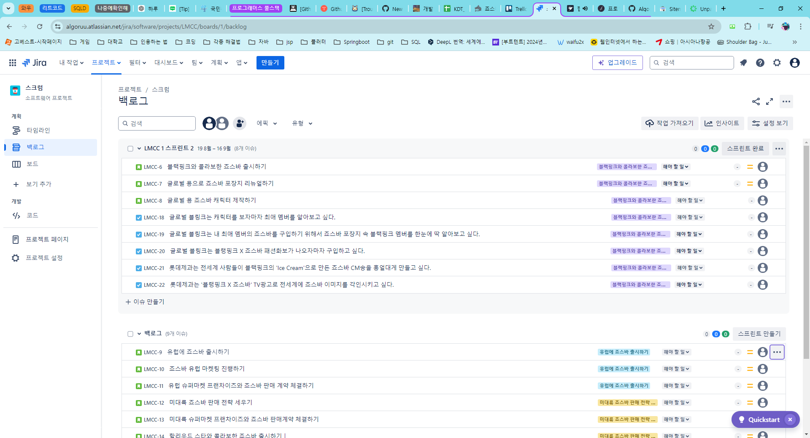
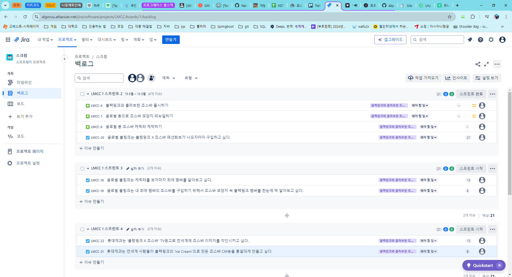
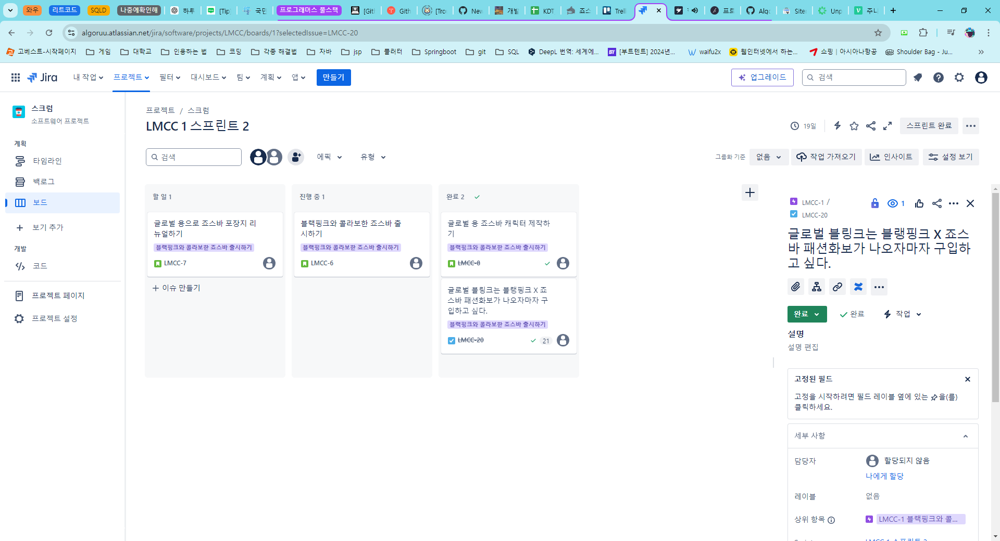
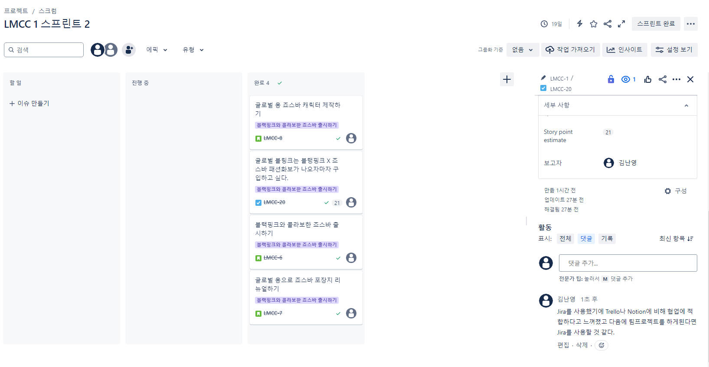

## 프로그래머스 풀스택 05
협업 환경 구성(5)

### 🌊 Trello

💫 이슈 트래커 중의 하나! 

- 고도화 사용은 Jira가 더 적합하고 개인(소규모), 프로젝트(대규모) 관리가 가능 
- 하나의 Task 밑에 Checklist 등 다양한 기능 이용 가능 
(보드 → 리스트 → 카드 → 설명, 댓글, 체크리스트, 첨부파일 등으로 구성)  

Trello의 구성 화면 
 

상세 화면 
  

### 🌊 Jira

💫 이슈 트래커 중의 하나! 

- 이슈 추적과 프로젝트 관리에 많이 사용하게 됨 

- 칸반 
    - 프로젝트 관리를 할 때 사용함 
    - 로드맵, 보드 등 구성
- 버그추적 
    - 버그추적을 할 때 사용함 
    - 이슈를 리스트로 보여주는 형태! 
- 스크럼 
    - 기간은 기본 2주로 시작됨(최소 1주~4주까지) 
    - 로드맵에서 에픽을 추가(유저 스토리)하면 백로그가 생성됨!
    - 백로그를 스프린트에 넣어 시작하기 전까진 시작이 자동으로 되지않음(트렐로와 다름)  

<Jira의 구성 화면> 

  

### 🌊 Notion

💫 메모, 홈페이지, 문서 작업에 적합 
- Trello에 가까운 칸반 보드 형태 
- 하나의 내용을 다양한 형태로 볼 수 있음 
- 스크럼이나 애자일을 위한 것은 아님 
- 자유도가 높고, 메인 화면에 효과적으로 정리되는 게 매력적인 툴  

### 🌊 협업 Tool 공통점

1. &nbsp;스프린트 
- 최소 일주일에서 최대 한 달 동안 집중에서 일하는 기간 
- 반복해서 일하며 더 점진적으로 나아지도록 일하는 방식 
2. &nbsp;모든 업무가 투명하게 공유 
- 협업의 기초! 
- 정보의 공유를 통해 해결책을 쉽게 마련할 수 있음 
- 기록이 잘 남겨져 있을 경우 인수인계에 탁월함 
3. &nbsp;우선순위 
- 일하는 데 있어서 굉장히 중요한 요소! 
- 제일 중요한 것부터 해야함(자원낭비를 막기위해)
4. &nbsp;담당자 및 관련된 사람 지정 
- 담당자 분배할 때 사용
5. &nbsp;업무 시작일과 완료일 
- 합리적인 작업 시간을 결정해서 완료일을 결정해야함 
6. &nbsp;서브 태스크 
- Trello는 Checklist, Jira는 하위 이슈로 생성  

### 🌊 협업 Tool 차이점

| 종류                                                                                                  | 비용  | 스크럼/스프린트 | 진입장벽 | 기술문서 | 창의력 |
| :---------------------------------------------------------------------------------------------------- | :---: | :-------------: | :------: | :------: | :----: |
|  |   👍   |        👌        |    👍     |    👎     |   👍    |
|  |   👎   |        👌        |    👎     |    👍     |   👍    |
|      |   👌   |        👍        |    👎     |    👌     |   👎    |

### 🌊 로드맵

<Jira로 로드맵을 구현한 모습> 

 

프로젝트를 분기별로 구현할 수 있음!  

### 🌊 프로덕트 백로그

💫 유저 스토리로 쓰면 좋은 점: 사용자의 입장에서 생각하며 좋은 디자인을 할 수 있게 됨 

- [사용자 → WHO]는 [목적 → WHY ]을 위해서 [활동/작업 → WHAT]하기를 원한다. 

좋은 유저 스토리(INVEST) 

- Independent:  **독립적**이어야 함. 다른 유저 스토리에 지나치게 의존 X 
- Negotiable: 규모적에서 **협상 가능**해야 함. 자원을 고려해 규모를 유동적으로 설정 
- Valuable: **가치**가 있어야 함. 고객 관점에서 평가하는 것 
- Estimatable: 유저 스토리 개발에 필요한 자원은 **측정 가능** 해야 함 
- Small: 유저 스토리의 자원 범위는 **작다.** 그래야 측정의 정밀도 상승과 독립성을 확보 가능 
- Testable: 유저 스토리가 잘 개발됐는지 확인하기 위해 **테스트 가능**해야 함 

<프로덕트 백로그를 유저 스토리로 적은 모습> 

  

### 🌊 릴리즈 플래닝

💫 릴리즈 플래닝 하는 법 
1. &nbsp;플래닝 포커로 프로덕트 백로그 아이템의 스토리 포인트 추정 
2. &nbsp;프로덕트 백로그 우선순위에 따라 정렬 
3. &nbsp;스프린트 1개의 기간 설정 
4. &nbsp;스프린트 마다 프로덕트 백로그 아이템 할당 

<스토리 포인트(릴리즈 포인트)를 지정해준 모습> 

 

릴리즈 포인트는 커봐야 5정도..!! 3, 5정도로 진짜 작게 나눠 쓴다 생각할 것 
실제 일정에서 소화할 수 있는 포인트! 
최대 숫자가 스프린트에서 최대로 사용할 수 있는 것이라고 생각하기!  

### 🌊 스프린트 플래닝, 백로그, 태스크 보드

💫 스프린트 플래닝 

<스프린트 진행하고 완료하는 모습> 

  

### 🌊 리뷰 & 회고

💫 리뷰 

 

💫 회고(YWT사용) 

Y: Trello와 Jira에 대해 잘 몰랐는데 사용법과 이제 프로덕트 백로그, 릴리즈 플래닝, 스프린트 플래닝 등 다양하게 배울 수 있었다. 
W: 아예 몰랐던 지식들이라서 구글링을 통해 더 자세히 검색해서 배웠다! 
T: 앞으로 팀프로젝트나 업무를 할 때 효과적으로 일을 분담하여 사용할 수 있을 것으로 예상된다!  

### 🌊 느낀 점

Trello와 Jira에 대해 잘 몰랐는데 사용법과 이제 프로덕트 백로그, 릴리즈 플래닝, 스프린트 플래닝 등 다양하게 배울 수 있었다. 
갑자기 용어들을 다 안다는 전제하에 말씀해주셔서 당황하긴했는데 그래도 구글링을 열심히해서 다 이해하려고 노력했음. 

