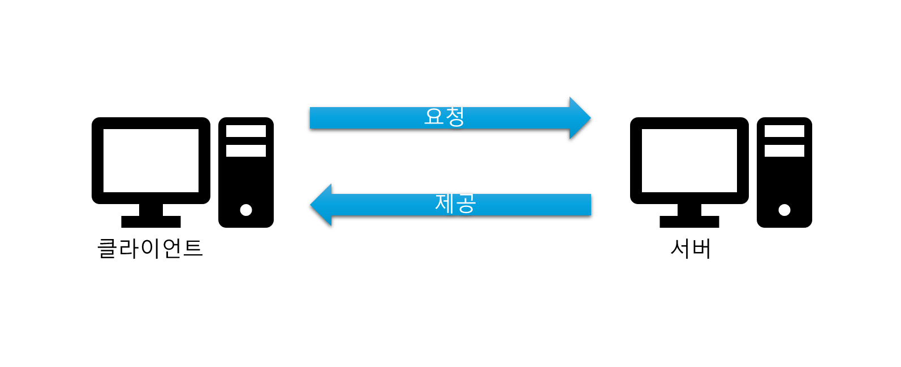
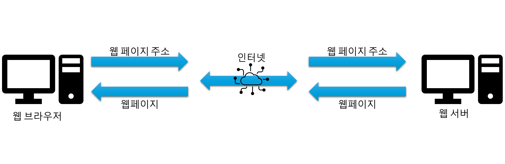
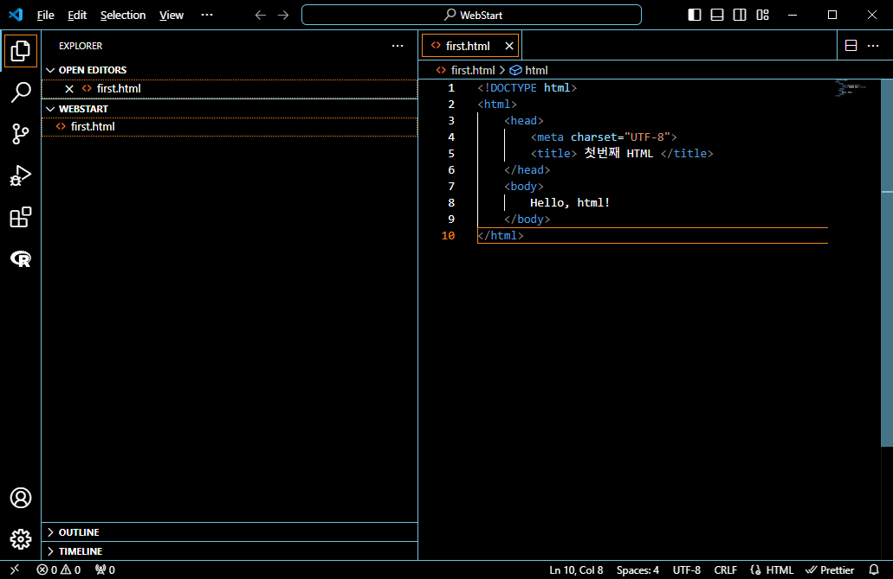
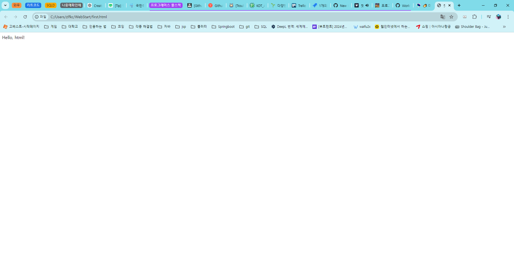
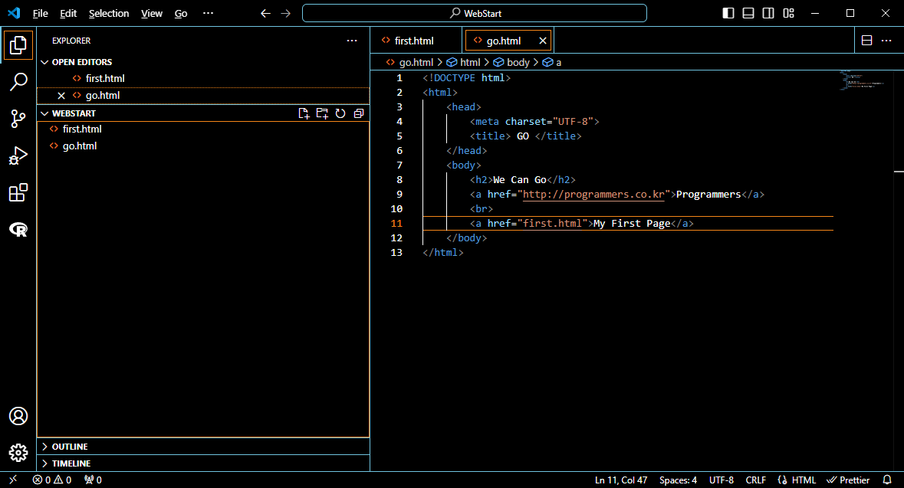
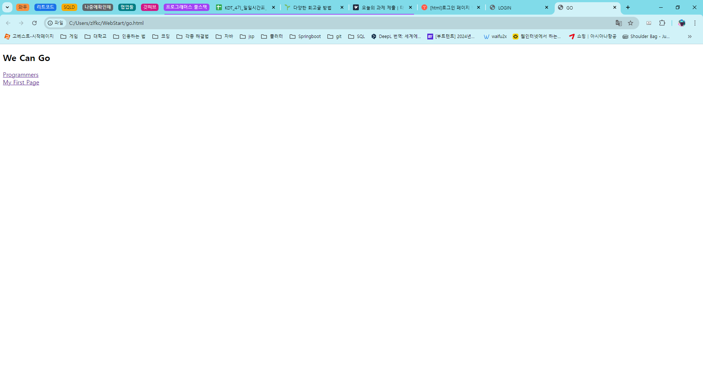
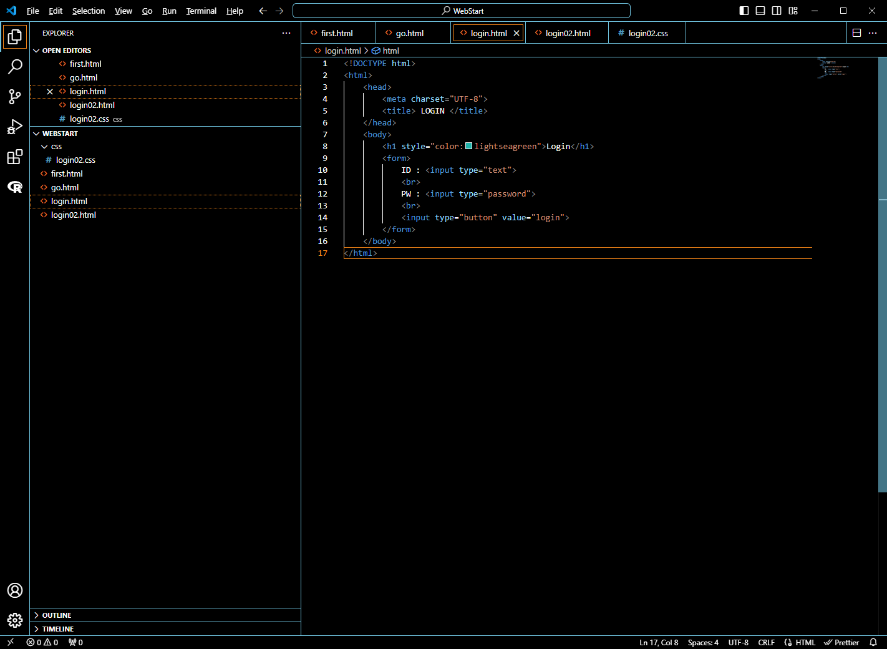
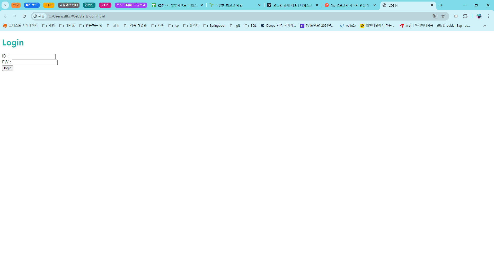

## 프로그래머스 풀스택 06
웹 서비스의 이해: 웹 생태계부터 웹 브라우저, 그리고 데이터베이스까지(1)

### 🌊 웹의 이해

💫 인터넷(International Network)이란?<br>

- 인터넷을 소개하기 전에 *네트워크*에 대한 이해가 필요함. 네트워크는 서로 연결된 컴퓨터나 기타 장치의 그룹.<br>
이러한 모든 네크워크가 함께 연결되면 인터넷이 형성됨.<br>

>즉, 인터넷은 네트워크들의 집합체.

<br>

💫 웹(Web)이란?<br>

- 월드 와이드 웹(World Wide Web)이란, **인터넷에 연결된** 컴퓨터를 통해 사람들이 정보를 공유할 수 있는 공간.<br>
- 간단하게 WWW, W3, 그리고 월드 와이드 웹을 줄여 웹(Web)이라고 부름.<br>
- 1980년대, 스위스 유럽 입자 물리 연구소(CERN)의 컴퓨터과학자 팀 버너스-리에 의해 탄생함<br>
- 웹의 특징 : 정보를 하이퍼텍스트 형식으로 표현. 하이퍼텍스트(링크)를 따라 이동하며 다양한 정보/문서들을 연결, 제공함.<br>
    - **하이퍼 텍스트(hypertext)** : '단순히 글자가 아닌 그 이상의 기능을 가진 텍스트'란 의미로 주로 <span style="color:lightseagreen">링크, 참조의 역할을 하는 기술</span><br>
  
💫 웹 페이지 VS 웹 사이트<br>

- 웹 페이지 : 페이지 한 장 한 장! <br>
- 웹 사이트 : 웹 페이지 한 장 한 장을 엮어서 만든 책이라 보면 됨!<br>
- 웹 서핑, 웹 브라우징 : 웹 페이지 링크를 타고 이동하는 것<br>

💫 웹 브라우저(Web brower)란?<br>

- 어떤 것(웹 페이지 또는 웹 상의 데이터)을 찾거나 읽을 때 사용하는 것을 웹 브라우저라고 부름.
<br><br/>


### 🌊 웹의 구조

💫 클라이언트와 서버<br>

- 클라이언트(Client) : 서비스를 이용하는(요청하는) 컴퓨터<br>
- 서버(Server) : 서비스를 제공하는 컴퓨터<br>

클라이언트와 서버의 구조<br>
<br>


<br>

💫 클라이언트와 서버 간의 약속, 프로토콜<br>

- 서로 정보를 주고 받을 때에 지켜야 하는 약속이 존재함<br>
- 반드시 이 약속을 지켜야 통신해야 하며, 이 약속을 프로토콜이라 함!<br>
  
<br>

💫 우리가 웹을 사용하고 있는 방식!<br>

- 인터넷으로 연결된 클라이언트와 서버는 웹 프로토콜인 HTTP(HyperText Transfer Protocol)를 사용하여 데이터를 주고 받음<br>

웹의 작동 방식<br>
<br><br/>

### 🌊 웹 개발 직무 이해

💫 프론트엔드<br>

- 웹 서비스(웹 사이트)에서 사용자의 측면(Client-side)의 GUI를 통해, 사용자와 상호작용을 담당.<br>
  
<br>

💫 백엔드<br>

- 웹 서비스(웹 사이트)에서 사용자의 눈에 보이지 않는 서버 측(Server-side)에서 프론트엔드에서 전달받은 데이터와 요청을 내부 데이터와 연산을 활용하여 처리 후 프론트엔드에 결과 전달<br><br/>

### 🌊 HTML, CSS, Javascript 소개

💫 **웹 = HTML + CSS + Javascript!**<br>

- HTML : 웹 페이지 구성 요소들의 <span style="color:lightseagreen">**구조**</span><br>
- CSS : 웹 페이지 구성 요소들을 <span style="color:lightseagreen">**꾸밈**</span><br>
- Javascript : 웹 페이지 구성 요소들에게 <span style="color:lightseagreen">**생명력을!**</span><br>

<br><br/>

### 🌊 IDE 개요, Visual Studio Code 설치

💫 웹 개발을 하는 곳은?<br>

- 바로 IDE!<br>
    - IDE(Integrated Development Environment, 통합 개발 환경)<br>
    - Visual Studio Code, Code::Blocks, eclipse 등 다양함!<br>

현재 VSC가 깔려있고 사용중이므로 설치 과정은 스킵!<br><br/>

### 🌊 첫 HTML 파일 만들기

💫 HTML이란?<br>

- 하이퍼텍스트 즉, 웹 페이지를 연결하는 기능을 가진 텍스트이자<span style="color:lightseagreen">/</span>웹페이지의 구조를 명시하는 언어<br>
    - Hyper Text<span style="color:lightseagreen">/</span>Markup Language<br>
- \<태그>감싸진 글자가 그 태그의 역할을 맡음.\</태그>

HTML 실습<br>
<br>

실행<br>
<br><br/>

### 🌊 자주 쓰는 HTML 태그

| 종류      | 설명                                                                                                                               | 기본형                                            |
| --------- | ---------------------------------------------------------------------------------------------------------------------------------- | ------------------------------------------------- |
| \<html>   | HTML 문서의 최상위 요소(root 요소)를 나타냄. 다른 모든 요소는 이 요소의 자손.                                                      | \<html>내용\</html>                               |
| \<head>   | HTML 문서의 속성 범위를 지정하기 위한 태그. 이 태그 안에 타이틀이나 메타 태그 등을 넣음                                            | \<head>내용\</head>                               |
| \<body>   | HTML 문서의 내용을 나타냄. 문서에는 이러한 요소가 하나만 있을 수 있음.                                                             | \<body>내용\</body>                               |
| \<title>  | HTML의 문서 제목을 선언하는 태그.                                                                                                  | \<title>문서 제목\</title>                        |
| \<meta>   | HTML의 부가 정보를 선언하는 태그.<br>예를 들어 charset 속성을 쓰면 인코딩을 선언. 예시는 UTF-8로 인코딩                               | \<meta charset="UTF-8">                           |
| \<div>    | 박스 또는 레이어. CSS를 사용하여 스타일을 지정할 때까지 콘텐츠나 레이아웃에 영향을 미치지 않음.                                    | \<div>내용\</div>                                 |
| \<a>      | 하이퍼링크를 생성하는 태그. Anchor의 줄임말.                                                                                       | \<a href="링크할 페이지">내용\</a>                |
| \<script> | 스크립트 타입을 지정해서 사용.(type 생략시 일반적으로 사용되는 자바스크립트로 인식)                                                | \<script type="text/javascript"> ... \</script>   |
| \<link>   | 외부 CSS 파일, 파비콘 등을 연결하는 태그.                                                                                          | \<link rel="rel 속성 값" href="외부 리소스 위치"> |
| \    | 이미지 파일 삽입                                                                                                                   | \  |
| \<span>   | \<div>의 인라인 버전(\<div>는 줄바꿈O, \<span>은 줄바꿈X)                                                                          | \<span>내용\</span>                               |
| \<p>      | 텍스트 단락. 내용이 길면 웹 브라우저 창의 너비에 맞게 자동으로 줄 바꿈.                                                            | \<p>내용\</p>                                     |
| \<li>     | 순서 있는 목록이나 순서 없는 목록의 각 항목을 나타냄. <br> 단독으로 쓰이지 않으며 \<ul>\</li> 혹은 \<ol>\</ol> 태그 내부에 들어감. | \<li>내용\</li>                                   |
| \<ul>     | 순서 없는 목록의 시작과 끝을 나타냄.                                                                                               | \<ul>내용\</ul>                                   |
| \<style>  | CSS 사용. 되도록이면 <link> 태그를 쓰기를 권장.                                                                                    | \<style>CSS 내용\</style>                         |
| \<br>     | 문단 내 줄바꿈(line break). 강제개행을 하는 태그.                                                                                  | \<br>                                             |
| \<hn>     | 제목. \<h1> ~ \<h6>까지 사용가능. 숫자가 커질수록 글자 크기는 작아짐                                                               | \<hn>제목\</hn>                                   |
| \<input>  | 입력값 요소를 지정. type에 따라 다른 입력값을 취함.                                                                                |                                                   |
| \<form>   | 폼을 만드는 기본 태그.                                                                                                             | \<form [속성="속성값"]>여러 폼 요소\</form>       |

<br>

실습 <br>

<br>

<br><br/>

### 🌊 CSS

💫 CSS란?<br>

- CSS는 Cascading Style Sheet의 약어.<br>
- HTML로 부터 디자인적인 요소를 분리해 꾸밈.<br>
- 잘 정의된 CSS는 서로 다른 웹페이지에 적용할 수 있음. -> 템플릿/테마<br>
- 자바스크립트와 연계해 동적인 콘텐츠 표현이나 반응형 디자인 적용 가능.<br>

💫 CSS 적용 방법<br>

1. 내부 스타일 시트<br>
   - html 파일에 스타일을 기술하는 방법<br>
   - \<style> \</style> 태그 부분에 작성하지만 작업이 쉽고 간편하지만 CSS 재활용 불가 -> 외부 스타일 시트 사용 권장 <br>
2. 외부 스타일 시트<br>
    - 가장 기본적인 방법. 별도의 파일에 CSS 문서를 작성하고 필요한 HTML문서에 불러와서 사용함<br>
    ```CSS
    <link rel="stylesheet" type="text/css" href="mystyle.css">
    <link rel="stylesheet" type="text/css" href="http://cdn.site.com/css/mystyle.css">
    ```
    <br>
3. 인라인 스타일<br>
   - html 태그에 필요한 디자인 속성을 직접 작성하는 형식(일관된 디자인 체계를 유지하는 데는 방해)<br>
   ```CSS
   <h1 style="color:blue; margin-left:30px;">This is a heading</h1>
   ```

<br>

💫 CSS 캐스케이딩과 우선순위<br>

1. 캐스케이딩 의미<br>
    - CSS에서 Cascading은 사전적 의미로 **폭포처럼 떨어져 내리는**과 같은 의미임!<br>
    - CSS에서 디자인 속성이 HTML 문서의 구조 즉 DOM(Document Object Model) Tree 구조에서 상위 요소에서 정의한 디자인 속성이 하위 요소로 전달되는(상속 개념) 의미에서 유래됨.<br>
      - 상위 태그에서 정의된 디자인 속성은 하위 태그로 상속<br>
      - 하위 태그에서 상위 태그에 정의된 디자인 속성을 변경O<br>

2. 우선 순위<br>
일반적인 우선순위(낮은순 -> 높은순)<br>
브라우저 디자인 정의 -> 외부 스타일시트 -> 내부 스타일시트 -> 인라인 스타일시트<br><br/>

### 🌊 로그인 화면 만들기

로그인 제목 색깔 변경<br>

<br>

실행 결과<br>
<br>

<br><br/>

### 🌊 느낀 점

기본적인 웹의 지식들과 HTML, CSS에 대해 배울 수 있었다!<br>
다 조금씩만 해봤던 거라 막 낯설지는 않는데 응용을 잘해야겠죠 역시..<br>


