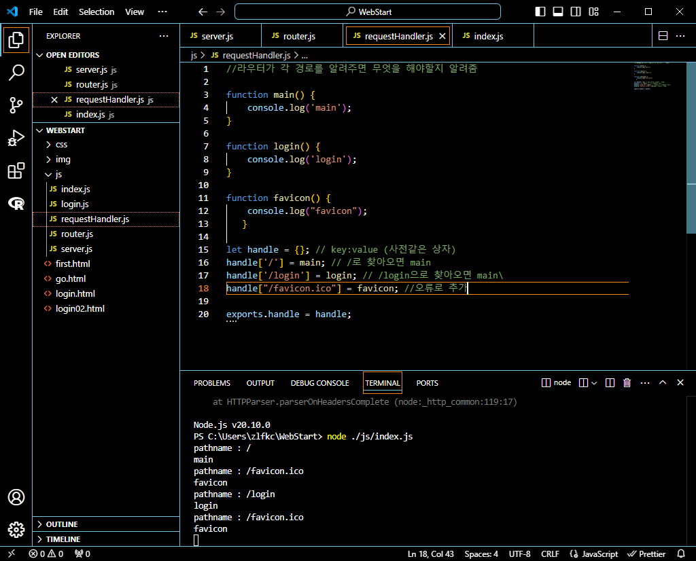

## 프로그래머스 풀스택 08
웹 서비스의 이해: 웹 생태계부터 웹 브라우저, 그리고 데이터베이스까지(3)

### 🌊 쇼핑몰 프로젝트 실습

💫 메인 페이지<br>

<br>


<br>

💫 오더 리스트 페이지<br>

<br><br/>


### 백엔드의 구조

<br>

💫 웹 서버(Web Server)<br>

- 정적 페이지에 대응<br>
- 동적 페이지에 대한 처리는 직접 처리하지 않음!! 웹 어플리케이션 서버에 전달!<br>

<br>
  
|정적 페이지   | 동적 페이지           | 
| ------ | ------------------ | 
| 화면의 내용/데이터 변동 X| 데이터 처리/연산을 통해 화면의 내용/데이터 변동 O | 

<br>

💫 웹 어플리케이션 서버와 데이터베이스<br>

- 웹 어플리케이션 서버(Web Application Server)는 동적 페이지를 처리<br>
- 필요한 데이터 연산을 위해 데이터베이스와 연결되어 있음!<br>
- 데이터 조회/수정/삭제에 대한 처리 요청<br><br/>

### 🌊 Node.js 소개 및 설치

💫 Node.js란<br>
- 자바스크립트를 스크립트 언어 이상으로 프로그래밍 언어 역할을 할 수 있도록 지원하는 플랫폼<br>
- 따라서 Node.js를 이용하여 자바스크립트로 백엔드를 구현 가능!<br>
- 자바스크립트를 통한 웹서버 구현OK<br>

\<Node.js를 통해 서버를 구현한 모습><br>

<br>

실행 완료<br>

<br><br/>

### 🌊 HTTP 템플릿

**💫 서버 작동 설명!**<br>
```node.js
let http = require('http');

function onRequest(request, response) {
    response.writeHead(200, {'Content-Type' : 'text/html'});
    response.write('Hello Node.js');
    response.end();

}

http.createServer(onRequest).listen(8888);
// localhost:8888
```
<br>

**💫 let http = require('http');**<br>

- 통신을 하는 규약인 http을 활용할 수 있도록 node.js가 제공하므로<br>
require 함수(모듈을 불러옴!)를 사용해 모듈을 받아오는 것!<br>

**💫 function onRequest(request, response)**<br>

- 클라이언트한테 요청이 오면 응답할 수 있도록 만든 함수!<br>
- node.js가 알아서 이제 요청과 응답을 할 수 있도록 만들어줌!<br>

**💫 response.writeHead(200, {'Content-Type' : 'text/html'});**<br>

- head를 적을 것! 200(정상)이다. 내가 줄 응답의 타입은 html임.

**💫 response.write('Hello Node.js');**<br>

- 화면에 넣을 데이터 값!<br>

**💫 response.end();**<br>

- 응답 끝! 이제 전송하면 됨.<br>

<br>

**💫 포트 번호**<br>

http.createServer(onRequest).listen(8888); -> 클라이언트와 서버는 같은 주파수로 접속을 해야하므로 8888로 접속을 해야함!<br>

<br>

**💫 HTTP 프로토콜 템플릿**<br>

<br>

Head에는
1. 통신 상태
   ex) 200: 정상<br>
       404: 클라이언트가 원하는 걸 못 찾겠음.<br>
       500: 서버가 이상함.<br>
우리는 이 숫자들을 HTTP (status) code 라고 부름.<br>
1. 응답이 어떤 형태인지 적어줌. ex) html<br><br/>

### 🌊 server.js 모듈화

💫 다른 파일에서도 사용할 수 있도록 모듈화하기!<br>

- Node.js가 미리 만들어둔 모듈을 require('모듈 이름'); 불러오는 것처럼<br>
  만든 server도 모듈처럼 다른 javascript 파일에서 사용 가능!<br>

<br >
다른 파일에서 모듈처럼 불러오면 실행이 되는 걸 확인 가능<br>

<br>

<br>

**💫 고도화하기(유연성 UP)**<br>

서버를 맘대로 껐다 켰다를 할 수 없기 때문에 start 함수를 만들어서 넣어줌<br>
(이 경우는 실행하고 싶을 때)exports.start = start;를 마지막 줄에 넣어주며<br>
- 외부에서 start를 사용할 수 있도록 함!<br>
- 외부의 start 함수에게 이 파일 내의 start로 실행될 수 있게 함!<br>

<br>

<br>

index.js에서 server.start();를 넣어줌<br>
<br>

<br><br/>

### 🌊 URL 읽어내기

**💫 Uniform Resource Locator**<br>

- 인터넷 상에서 웹 페이지가 어디 있는지 **위치**를 알려주는 주소!<br>
- <span style="color:lightseagreen">웹 페이지 주소</span><br>

<br>
<br>
<details>
<summary>✨각각의 js 파일 작동 설명 접기/펼치기✨</summary>
<div markdown="1">

<br>

index -> 서버 기동 <br>
router -> 경로에 따라서 일을 해줌<br>
server -> request, response만 해줌<br>
의존성을 낮추고 유연성 UP<br>

**여기서 작동 순서는 index -> (router 사용해라) -> server -> router가 됨**<br>

\<index.js 파일><br>

<br>

- 라우터도 start를 호출했던 것처럼 router를 모듈로 불러와 호출<br>
- router 모듈이 가지고 있는 route를 server에 전달<br>
- console log는 결과적으로 router.js가 찍게 됨<br>

<br>

\<router.js 파일><br>

<br>

- 마지막으로 server로부터 pathname를 넘겨받아 console log를 찍음.<br>

<br>

\<server.js 파일><br>

<br>

- start(route) 함수: router의 route 함수를 받음.(index로부터 router사용하라고 넘겨받음)<br>
- request를 받아서 그 request의 url의 경로 확인<br>
- 그 경로를 start 함수가 호출될 때 전달받았던 route 함수의 매개변수(pathname)에 넣어줌 -> router로 가게 됨<br>

<br>

</div>
</details>

<br><br/>

### 🌊 URL에 따라 다른 콘솔 찍기 (백엔드만 구별)

💫 Server와 Router의 역할<br>

Server : request를 받음<br>
Router : request의 URL에 따라 루트(route)를 정해줌. = 경로만 지정<br>

각 루트(route)에서 할 일은 그럼 누가 하나요?<br>
**작동 순서는 index -> server -> router가 됨**<br>

\<requestHandler.js>를 생성<br>
(실행 오류나서 favicon 함수도 추가함)<br>
<br>

<br>

\<index.js 파일><br>
<br>

- requestHandler.js를 추가했으므로 불러와주고, server로 전달함<br>

<br>

\<router.js 파일><br>
<br>

- console log에 pathname이 무엇을 나타내는지 알려주고 있음!

<br>

\<server.js 파일><br>
<br>

- requestHandler.js를 추가했으므로 router로 handle를 전달함<br>


<br><br/>

### 🌊 URL에 따라 프론트엔드에 다른 response 보내기

**💫 server의 response를 requestHandler로 넘겨주기!**<br>

- route -> handle를 통해 가면 됨!<br>
- response를 requestHandler로 넘겨줘서 할 일을 넘김!<br>

<br>

\<server.js 파일><br>
<br>

- server에 있던 response를 requestHandler로 옮긴 모습 + route에 reponse 전달<br>

<br>

\<requestHandler.js><br>
<br>

<br>

<br>

- 각 함수 별로 response를 하여 /main이 오면 Main page, /login이 오면 Login page를 출력<br>


<br>

\<router.js 파일><br>
<br>

<br>

- response를 추가해줌<br>
- 404오류가 뜰 시 메세지도 뜨게 함<br>

<br><br/>

### 🌊 과제 제출

\<메인페이지 브라우저 화면><br>
<br>

\<start() 함수><br>

<br>

- start 함수 생성과 하단에 handle을 생성해줌!<br>

실행화면<br>
<br>


<br><br/>

### 🌊 느낀 점(YWT)

**Y 일을 통해 명확히 알게 되었거나 이해한 부분(한 일)에 대해 정리 :**<br>
각 js 파일은 index -> server -> router순으로 작동함! <br>
server의 response를 requestHandler로 넘겨줄 수 있다!<br>

**W 배운 점과 시사점 :**<br>
Node.js에 대해 처음 배워서 작동방식을 이해하는데 영상을 계속 돌려봐야했다.<br>
주말에 복습하면서 완전히 습득하려고 해야겠음!<br>
서버를 만들고 작동할 수 있는 게 재밌었다!<br>

**T 응용하여 배운 것을 어디에 어떻게 적용할지:**<br>
Node.js를 통해 서버를 만들 줄 알게되었으니 프론트엔드쪽과 연결하는 방법을 잘 배우고 싶다!<br>


