## 프로그래머스 풀스택 09
웹 서비스의 이해: 웹 생태계부터 웹 브라우저, 그리고 데이터베이스까지(4)

### 🌊 데이터베이스란

💫 데이터베이스란 

- 데이터 통합, 효율적으로 관리하기 위한 데이터 집합체 -> 데이터베이스(Database; DB)라고 함. 
- 데이터를 구조화하여 관리함으로써 데이터 중복을 막고, 효율적이고 빠른 데이터 연산 가능O 

💫 DBMS 

- 데이터베이스를 운영, 관리하기 위한 DBMS(DataBase Management System)를 통해 데이터베이스를 사용함. 

💫 DBMS의 종류 

- 운영 회사는 다름 / 데이터베이스에 연산을 요청하기 위한 주요 명령어는 동일함. 
- ex) Oracle Database, MySQL, MariaDB   

💫 SQL (Structured Query Language) 

- SQL은 데이터베이스에 연산을 요청하기 위해 사용되는 언어임 
- 데이터를 생성, 조회, 수정, 삭제 등과 같은 기능 수행 

대표적인 SQL 

- 데이터 삽입 : INSERT 
- 데이터 조회 : SELECT 
- 데이터 수정 : UPDATE 
- 데이터 삭제 : DELETE 

  

### 🌊 Docker 개요, 도커 설치, mariaDB 설치

💫 Docker 

- Docker는 Docker를 먼저 설치하고 어플을 설치하는 역할! 
- 즉 컨테이너를 여러 개 들고 다닌다고 생각하면 됨! 
- 필요할때마다 컨테이너를 주는 것(실행환경과 모든 것들을) 
- 어플리케이션의 독립성을 높이기 위한 것! 

설치가 계속 오류가 나서.. WSL2든 Hyper-V든 왜 안되는지 모르겠다.. 
몇 시간째 이거저거 다 해보는데 다 안되는 중이다 ㅠㅠ 
(6시간 지나서 해결 완료) 

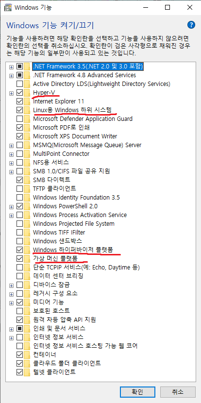 

Windows 기능에서 표시된 4개 여부 확인! 
BIOS에서도 Intel Virtualization Technology 말고도 VT-d 켜져있는 것 확인하기 
그리고 **관리자 권한으로 cmd를 실행 후** 
> bcdedit  
입력한다.
 

hypervisorlaunchtype    Off 일 경우 
> bcdedit /set hypervisorlaunchtype auto
 
적용하고 재부팅한다. 시간이 좀 걸릴 수 있음. 

그래도 여전히 docker와 ubuntu 등이 반응이 없다면... 
용량을 한 번 꼭 확인해보세요...6시간..소중한 시간 꼭 지키시기 

  

### 🌊 SQL : CREATE

💫 Docker로 MariaDB 실행 

1. Docker desktop 프로그램 실행 
2. cmd(윈도우) 또는 터미널(맥) 실행 
3. mariadb가 있는 컨테이너 접속: docker exec  -it mariadb /bin/bash 
4. mariadb 실행 : mariadb -u root -p (11버전 이후로는 mysql로 하면 오류남!) 

💫 데이터를 저장할 방 만들기! 

- 데이터베이스의 방을 파준다고 생각할 것! 
    - 방 확인 : SHOW DATABASES; 
    - 방 만들기 : CREATE DATEBASE Tennis; 
    - 방 들어가기 : USE Tennis; 

 

💫 방 안에서 저장소 만들기 

\<실습> 
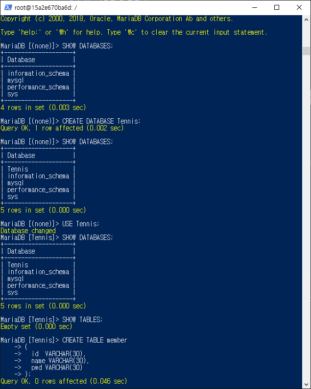 

CREATE TABLE member 
    -> ( 
    ->   id  VARCHAR(30), 
    ->   name VARCHAR(30), 
    ->   pwd VARCHAR(30) 
    -> ); 

표 형태로 저장소를 만들어주는 것임!  

### 🌊 SQL : SELECT, INSERT

💫 데이터 조회, 삽입 

- 테이블 데이터 조회 

    - SELECT 컬럼명 FROM 테이블명; 
    - SELECT * FROM 테이블명; (모든 테이블 출력) 
- 특정 테이블 조회 
    - SELECT 컬럼명 FROM 테이블명 
      WHERE 조건; 
- 테이블 데이터 삽입 
    -  INSERT 컬럼명1, 컬럼명2, ... INTO 테이블명 
        VALUES (컬럼1 데이터, 컬럼2 데이터,...); 

 

\<실습> 
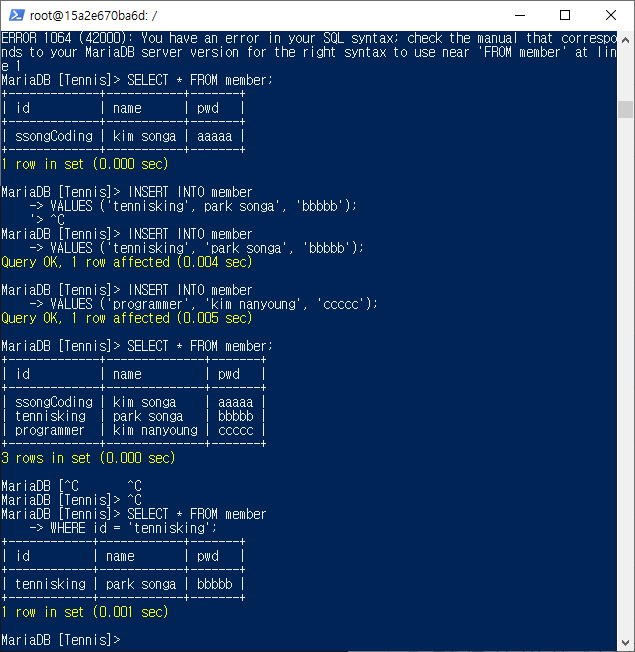 

  

### 🌊 SQL : UPDATE, DELETE

💫 데이터 수정 

- 테이블 데이터 수정 

    - UPDATE 테이블명 SET 컬럼명 = 수정할 값 WHERE 조건; 
    ex) UPDATE member SET pwd = 'zzzzz' WHERE id = 'tennisking'; 
     (조건을 안걸면 테이블 전체가 영향을 받음) 
- 테이블 데이터 삭제 
    -  DELETE FROM 테이블명 WHERE 조건; 
    ex) DELETE FROM member WHERE name = 'park songa'; 

 

\<실습> 

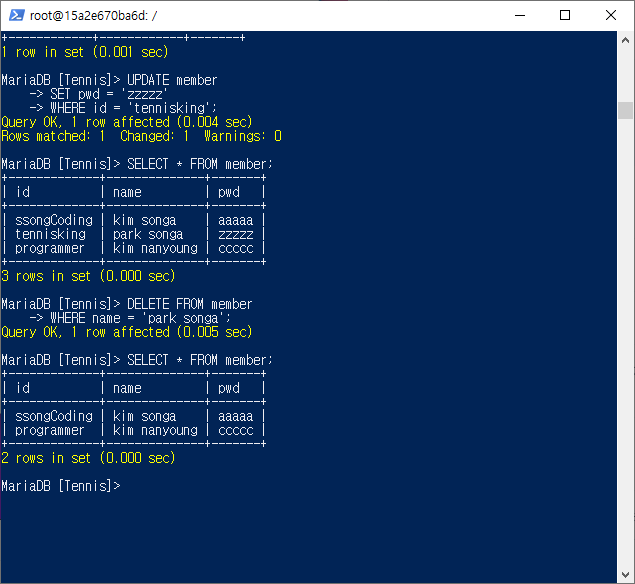  

### 🌊 node.js에 db 연동 준비, 설정 파일 만들기 SELECT 테스트

💫 연결을 위한 데이터베이스 생성! 

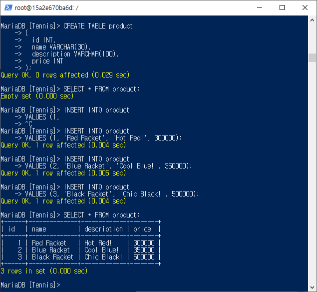 

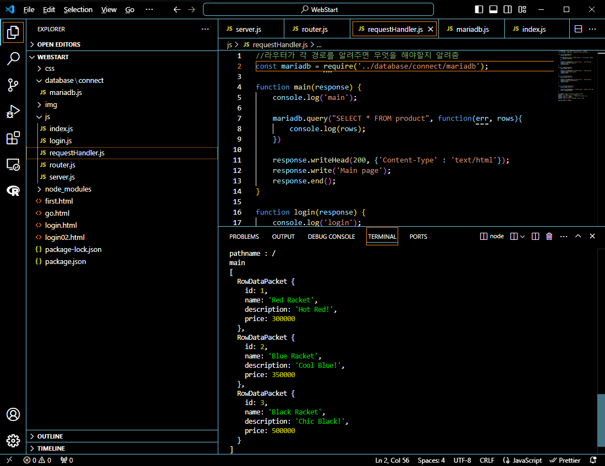 

- 경로 설정을 잘 해주자..! 현재 파일의 상위 파일일 경우 ../을 사용할 것! 
- 처음에 경로때문에 오류나서 왜 안되나 고민하고 찾아봄!  

### 🌊 메인 페이지 연동하기 - 1

\<실습> 
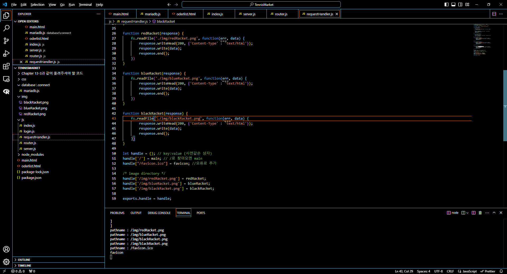 

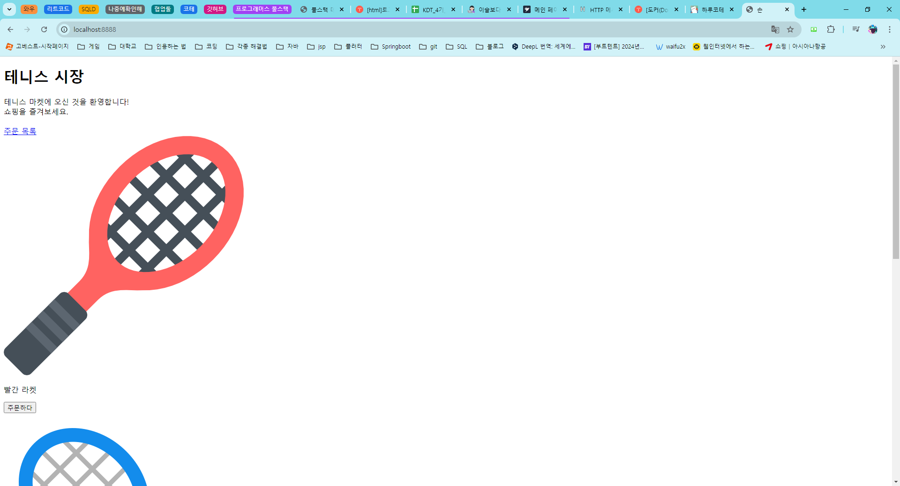 

- 프론트엔드 작업을 했던 파일에 서버를 작동하면 이미지를 불러올 수 있게 연결! 

  

### 🌊 메인 페이지 연동하기 - 2

\<실습> 
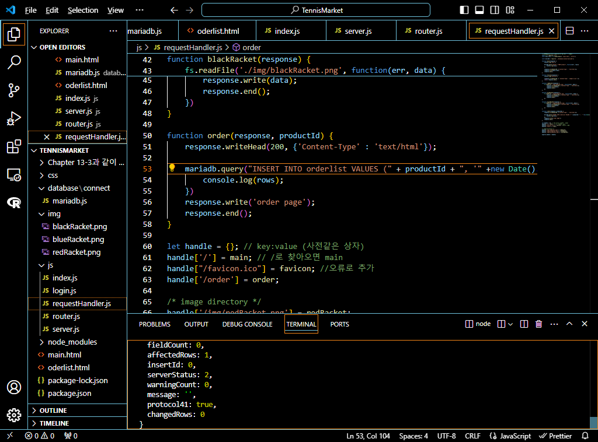 

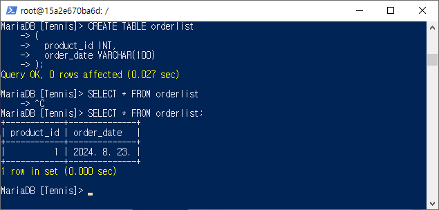 

- 데이터베이스와 잘 연결된 모습을 확인할 수 있음! 

  

### 🌊 프로젝트 마무리

\<실습> 
 

 

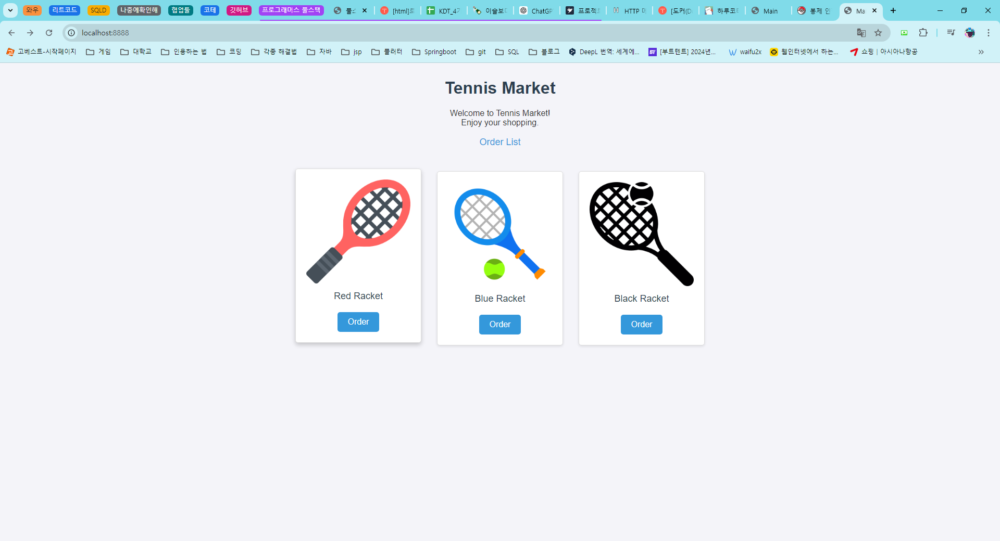 

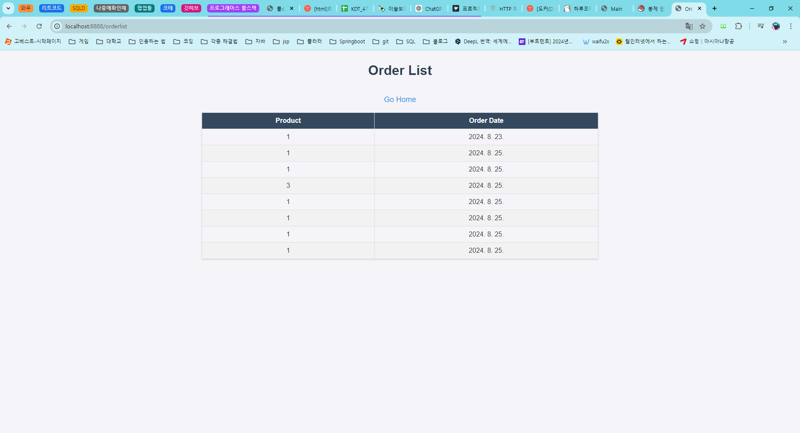 

- 데이터베이스와 잘 연결된 모습을 확인할 수 있음! 

  

### 🌊 느낀 점(YWT)

**Y 일을 통해 명확히 알게 되었거나 이해한 부분(한 일)에 대해 정리 :** 
SQL 기본 명령어를 알게됨!  
 

**W 배운 점과 시사점 :** 
프론트엔드 부분은 바로바로 반응이 오니까 그 점이 재밌다. 
DOCKER 설치 부분에서 애를 많이 먹었는데 용량부족 시 그럴 수 있다는 게 신기했다. 

**T 응용하여 배운 것을 어디에 어떻게 적용할지:** 
프론트엔드 부분에 좀 더 능숙해지고, 백엔드쪽은 아직 많이 약하니까 차차 더 배워가면서 숙달할 것이다. 

