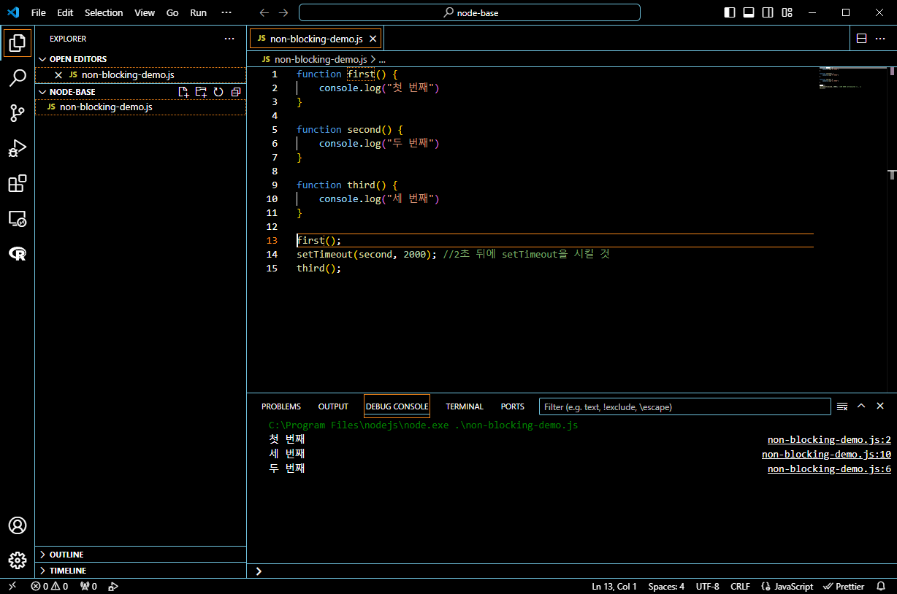
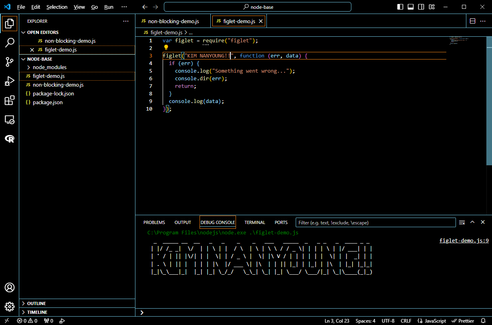
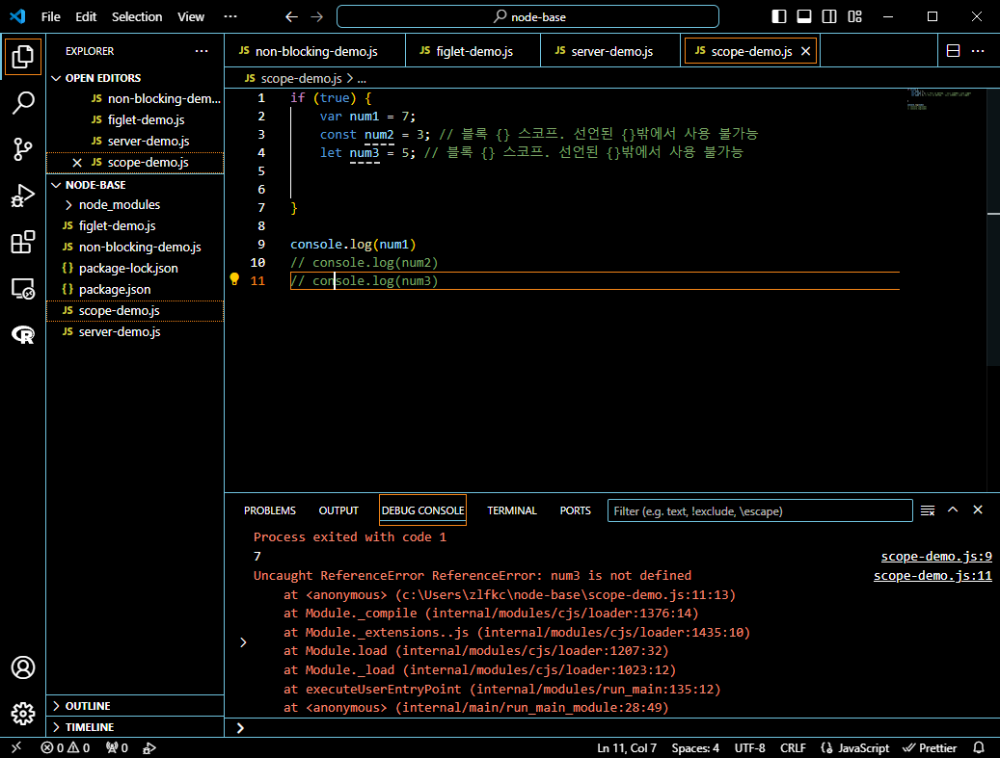
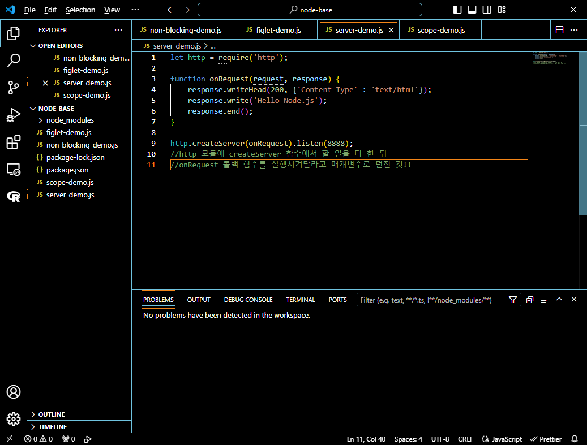
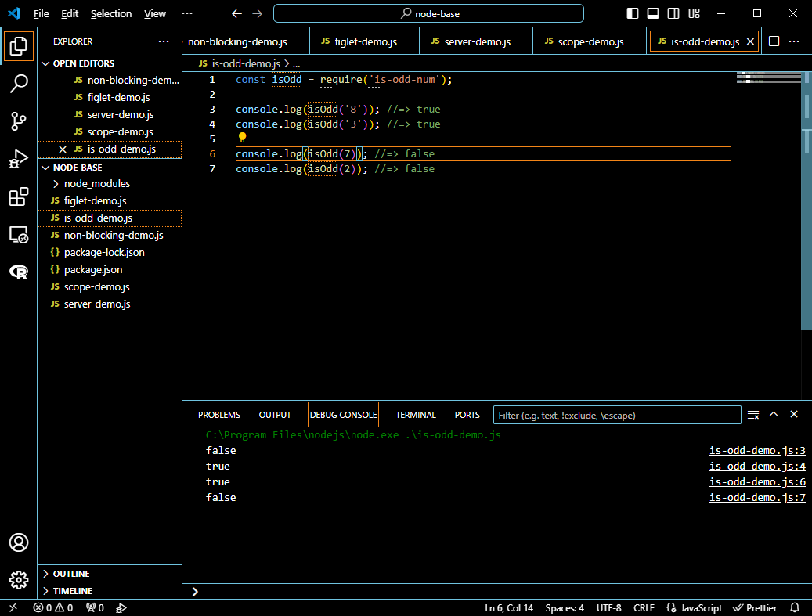

## 프로그래머스 풀스택 11
백엔드 기초: Node.js + Express 기본(2)

### 🌊 HTTP method

💫 HTTP(규약) Method(목적)<br>

- **GET: 데이터 조회**<br>
ex) 게시판 리스트 불러오기
(GET를 통해 해당 리소스를 조회. 리소스를 조회하고 해당 도큐먼트에 대한 자세한 정보를 가져옴.)<br>

- **POST: 데이터 생성(등록)**<br>
ex) 회원가입/로그인(POST를 통해 해당 URI를 요청 -> 리소스 생성)<br>

- **PUT: 데이터 수정(덮어쓰기)**<br>
ex) 회원정보 전체 수정(PUT를 통해 해당 리소스를 수정)<br>

- **PATCH: 데이터 수정(일부 수정)**<br>
ex) 회원정보 일부 수정(Update에 가장 가깝게 쓰임)<br>

- **DELETE: 데이터 삭제**<br>

- **HEAD: 서버 리소스의 헤더(메타 데이터의 취득)**<br>

- **OPTIONS: 리소스가 지원하고 있는 메소드의 취득**<br>

- **CONNECT: 프록시 동작의 터널 접속을 변경**<br>

- **TRACE: 웹 서버로 가는 네트워크 경로를 체크**<br>

<br><br/>

### Node.js를 알아야하는 이유

💫 Node.js<br>

- 자바스크립트를 스크립트 언어 이상으로 프로그래밍 언어 역할을 할 수 있도록 함.<br>
- 객체지향적이고, 웹브라우저 밖에서도 자바스크립트로 작동하는 코드를 짜고 싶어서 사용<br>
- 백엔드에만 쓰이는 게 아님!<br>
- Node.js기반 리액트, 뷰, ..., 프론트엔드<br>
- ex) 넷플릭스, 에어비앤비, 링크드인, 우버, NASA, 페이팔, 이베이..<br>

<br>

💫 Node.js가 비중이 높은 이유<br>

- 풀스택으로 개발하기 좋음!<br>
- 한국은 Spring이 공공기관의 비율때문에 높음!<br><br/>

### Node.js 특징

💫 싱글 스레드, 이벤트 기반, 논블로킹 I/O<br>

요리사가 한 명!<br>

<span style="color:lightseagreen">싱글 스레드</span> -> **주문이 밀려도 한 명이 악으로 깡으로 해야함..😭**<br>

<span style="color:lightseagreen">논블로킹 I/O</span> -> **한명이 일을 하는데, 요리를 순차적으로 X, 중간중간 비는 시간이 있다면 다른 요리O**<br>
ex) 라면 1개(10분 중 물 끓는 시간 5분: 요리사는 물만 쳐다봄.), 볶음밥(완성 5분)
<br>
라면 물 끓여놓고 => 볶음밥 요리 => 라면 요리<br>

<span style="color:lightseagreen">이벤트 기반</span> -> **주문이 들어와야만 일을 함.(없으면 안함!!!)**<br><br/>

### 🌊 논블로킹 실습 / setTimeout

💫 논블로킹 I/O<br>

\<실습><br>

<br>

- setTimeout(): 함수의 매개변수로 변수 또는 값을 전달하는 것이 아니라, **함수를 전달!!!**<br>
== "콜백 함수" <br>
- 2초가 비어있기 때문에 1번 바로 뒤에 3번을 먼저 출력하고 2초 뒤 2번을 마지막으로 출력!<br>
<br><br/>

### 🌊 모듈

💫 모듈이란?<br>

- 내가 만든 게 아닌, **이미 만들어져 있는 코드 덩어리**<br>
- 모듈을 만들 때 어디서부터 어디까지 칭하는지는 내 마음!<br>

💫 모듈을 가져가 쓰고 싶을 때는?<br>
1.  기본으로 내장된 모듈: 내장 모듈, 표준 모듈이라고 함<br>
ex) setTimeout(), ... <br>
2.  **외부 모듈 어떻게 사용하지? NPM**<br>

>**"Node.js 덕분에 자바스크립트 모듈을 만들 수도 있게 되었고 사용도 가능하게 됨!"**
<br>

모듈 = "라이브러리"<br><br/>

### 🌊 라이브러리 VS 프레임워크

💫 라이브러리(Library)<br>

- 도서관: 분류 -> 상세 주제의 한권의 책을 골라냄! 기준: "출판사, 작가, 내용, ..."<br>
  - 장점 : 내가 원하는 걸 **<U>빌릴 수 있음</U>**<br>
  - 단점 : 너무 방대해서 고르기 힘듦, 물리적인 시간이 오래 걸림(도서관 가는 시간, 찾는 시간 등)<br>
 
  = 라이브러리 = 모듈<br>

💫 프레임워크(Framework)<br>

- 만들고 싶은 서비스를 구현하는데 필요한 모든 일을 틀 안에서 하는 것<br>
- **필요해보이는 라이브러리(모듈)를 미리 다 틀 안에 넣어둠**<br>
- (Node.js는 프레임워크가 아님!)<br><br/>

### 🌊 npm, figlet 사용해보기

💫 npm<br>

- 외부 모듈을 사용할 수 있게 함!<br>
- 일종의 모듈 관리자라고 생각하기!<br>

💫 figlet<br>

- ASCII 아트 모듈 사용할 수 있게함!<br>

\<실습><br>
<br>

<br><br/>

### 🌊 figlet 뜯어보며 콜백 함수 확인

<br>

1. figlet이라는 모듈을 가지고옴!<br>
2. figlet\("KIM NANYOUNG!!", function (err, data) :<br>
매개변수로 콜백 함수인 익명의 함수가 들어감!<br>

    익명의 함수를 쓰는 이유 = 이 함수를 다른 데 쓸 일은 없음<br>
    figlet 만든 사람이, 매개변수로 함수를 받기로 했기 때문<br>

    첫번째 매개변수 "KIM NANYOUNG!!"이라는 문자열을 받아서,<br>
    "아스키 아트를 만든 다음에"<br>
    두번째 매개변수 function 함수를 실행 = 콜 백<br>

3. 함수를 실행 후 에러가 나면 에러메세지 띄우고<br>
4. 아니면 데이터("KIM NANYOUNG!!"을 아스키 아트로 바꾼 데이터)가 출력됨<br>


<br><br/>

### 🌊 http 모듈 뜯어보면서 콜백 함수 다시 확인

💫let const는 {} 밖에서 사용할 수 없음!<br>
<br>

- let, const: 블록 {} 스코프. 선언된 {}밖에서 사용 불가능<br>

<br>

💫http 모듈 뜯어보기<br>
<br>

- http.createServer(onRequest).listen(8888);<br>
- http 모듈에 createServer 함수에서 할 일을 다 한 뒤<br>
- onRequest 콜백 함수를 실행시켜달라고 매개변수로 던진 것!!<br>

<br><br/>

### 🌊 let, const 값 변경 가능 / 템플릿 문자열

💫 **가능하면 var보다 let, const를 사용할 것!**<br>

- const: 상수 값. 블록 {} 스코프, 초기화 이후 값 변경 X<br>
- let: 블록 {} 스코프, 초기화 이후 값 변경 O<br>

<br>

💫 **템플릿 문자열**<br>
<br>

```javascript
    console.log(num1 + " X " + num2 + " = " + num3);
    //2015년 이후 자바스크립트에는 + 연산은 지양됨

    console.log(`${num1} X ${num2} = ${num3}`);
    //템플릿 문자열 지향하기
```

<br><br/>

### 🌊 npm 좀 더 뜯어보기

💫 모듈 삭제하기<br>

- npm uninstall 모듈이름


💫 package.json<br>

- dependencies(의존성) : 필요한 외부 모듈을 적어둠!<br>

💫 npm i 모듈이름 -g<br>

- 내 컴퓨터의 모든 프로젝트에서(안쓰는 것까지) 해당 모듈을 설치하겠다는 것<br>
- 따라서 npm i 모듈이름 -g는 굳이 안쓰는 게 좋음.<br>

💫 is-odd-num<br>

홀수: true 반환<br>
짝수: false 반환<br>

<br><br/>

### NPM 정리

- 외부 모듈을 내 프로젝트에 설치할 수 있게 해주는 멋진 칭구.<br>
- npm이 저장소에 "외부 모듈"의 설치를 우리가 원하는 프로젝트에 자동으로 해줌!<br>
= "프로그램"설치 파일 다운로드 받아서 더블 클릭<br>
= npm install 모듈<br>

npm은 빠르고 간편하게 삭제도 가능 = npm uninstall 모듈<br>
<br><br/>

### 🌊 느낀 점(YWT)

**Y 일을 통해 명확히 알게 되었거나 이해한 부분(한 일)에 대해 정리 :**<br>
HTTP method, Node.js의 특징을 알게 되었다!<br>
Node.js의 특징: 싱글 스레드, 이벤트 기반, 논블로킹 I/O<br>
모듈(라이브러리) VS 프레임워크, 콜백함수, npm<br>

**W 배운 점과 시사점 :**<br>
어제 메소드 부분이 갑자기 나온 느낌이라 당황했는데 알고보니 오늘 바로 나와서 좋았고 미리 공부한 느낌이라 이해가 잘 됐다!<br>
Node.js가 프레임워크인 줄 알았는데 아니었다..! 이건 못잊을 것 같다.<br>

**T 응용하여 배운 것을 어디에 어떻게 적용할지:**<br>
자바스크립트 코드를 짤 때 콜백 함수 활용하기!<br>
npm을 통해 node.js을 쉽게 사용할 수 있음!<br>


