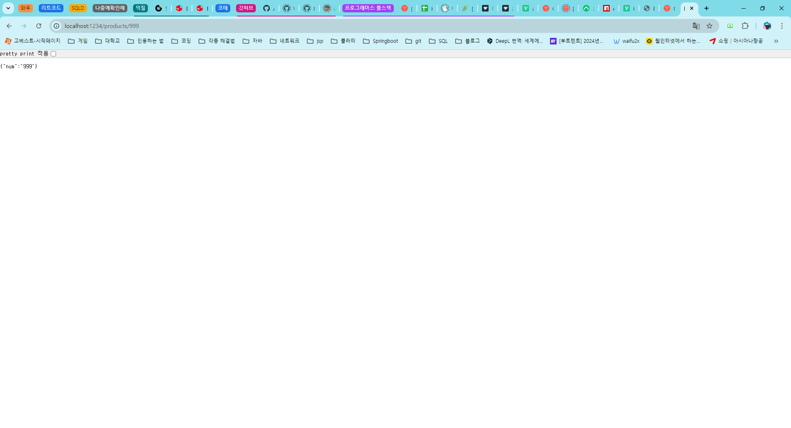

# 프로그래머스 풀스택 12
백엔드 기초: Node.js + Express 기본(3)

## 🌊 express 설치, 코드 뜯어보기, 포트 충돌 해결

💫 HTTP VS express 
- HTTP는 웹 서버 역할을 하게 만듦. 
- express 모듈 안에 HTTP가 내장되어있음! 
- express 모듈 사용시 간편한 라우팅 처리, 직관적인 코드 작성 가능! 
- index.js -> 첫 페이지로 이름을 많이 쓰임! 

 

- const app = express() 
app이라는 변수에 express 호출 
(서버를 담았다고 생각하기!) 

- app.get('/', function (req, res) \{ 
여기서 '/'은 http://localhost:3000/이 생략된 뜻임! 
아래에 포트 넘버 3000으로 되어있으므로.. 
콜백 함수(req, res)호출! 
request:요청이 날라올 때 가져오는 것 
response: 대답을 해줄 때 날라가는 것 

- res.send('Hello World') 
콜백 함수를 통해 Hello World 출력! 

- app.listen(3000) 
포트 번호(클라이언트와 서버가 대화할 때 필요)는 3000! 
포트 번호는 가능하면 의미 있는 번호로! 
다른 프로젝트에서 포트 번호를 이미 사용중이라면 오류가 날 수 있음!! 
(현재 사용중인 게 없어서 바로 오류 없이 사용함) 

 

  

## 🌊 express REST API 실습

💫 \<실습> 

 

 

 

 

- "", ''은 짝만 잘 맞춰주면 똑같은 의미니까 상관없음!! 

  

## 🌊 express REST API 응용

💫 hello 
💫 bye 
💫 nicetomeetyou 

 

 

- GET 메소드로, '/hello', '/bye', '/nicetomeetyou'이 날아오면 
  매개변수로 전달받은 콜백 함수를 호출하겠음 -> 서버에 셋팅 

  

## 🌊 데이터를 그냥 텍스트로 보내면 X & 객체란?

💫 객체란? 
- 데이터를 하나씩 X -> 데이터를 모아 **덩어리**로!! 
"객체" 
ex) 
    - **"Node.js를 공부해보자. 라는 책"** 
    - 상품명: Node.js를 공부해보자. 
    - 상품가격: 20000 
    - 상품소개: 이 책 좋음 왜? OOO 지음 
 

**우리 세상은 객체로 이루어짐** 
**주어 자리에 왔을 때 문장이 만들어지면 그건 다 객체!!** 

프론트엔드는 모두 자바스크립트이기때문에 자바스크립트 객체로 보내면 됨.  

## 🌊 json이란?

💫 json이란? 

- 자바스크립트 객체모양(**j**ava**s**cript **o**bject **n**otation) 
:자바 스크립트 객체가 어떻게 생겼나 = 어떤 형태? 
데이터를 쉽게 '**교환**'하고 '**저장**'하기 위한 텍스트 기반의 데이터 교환 표준 

{ key : value } 
JSON의 형태는 키(Key)와 값(value)의 쌍 

ex) 
    let person = { 
  name: "nanyoung", 
  age: 20 
} 
    - **"Node.js를 공부해보자. 라는 책"** 
    - 상품명: Node.js를 공부해보자. 
    - 상품가격: 20000 
    - 상품소개: 이 책 좋음 왜? OOO 지음 
 

\<이 형태로 바뀌어야함!> 
let book = { 
  title: "Node.js를 공부해보자.", 
  price: 20000, 
  description: "이 책 좋음 왜? OOO 지음" 
} 

 

 
 
- key, value 쌍의 값인 json 출력이 됨! 

  

## 🌊 진짜 객체 보내기

 
- res.send -> res.json으로 바꿔줌 
- 보는 입장에서 큰 차이는 없지만 명확하게 하기위함! 속도UP 

 

\<실습> 
 
  

- json 객체를 만들어서 보내주기! 

## 🌊 products/1,2,...n 하는 법!

\<실습> 
 
 
- app.get\('/products/:n', function (req, res) \{ 
      : -> 어? 나한테 URL로 매개변수를 전달해줄 건가봐! 
    req.params(일단은 params에 네가 말한 걸 다 담을겡) 
    products/__ 빈칸에 오는 값을 n이라는 변수에 담기 

- console.log(req.params) 
이걸 찍으면 순서쌍이 나오고 

- console.log(req.params.n) 
이걸 찍으면 n값만 나오므로 req.params.n을 사용함! 
  

## 🌊 느낀 점(YWT)

**Y 일을 통해 명확히 알게 되었거나 이해한 부분(한 일)에 대해 정리 :** 
💫 express, 객체, json에 대해 알게 되었다! 
1. express 모듈 안에 HTTP가 내장되어있음! 
express 모듈 사용시 간편한 라우팅 처리, 직관적인 코드 작성 가능! 

2. 객체란? 데이터를 하나씩 X -> 데이터를 모아 **덩어리**로!! 

3. json(자바스크립트 객체모양(**j**ava**s**cript **o**bject **n**otation)) 

**W 배운 점과 시사점 :** 
json으로 객체를 보내는 것에 대해 많이 연습해야 될 것 같다. 
개인적으로 풀스택 프로젝트를 하나 진행하는 게 실력향상이 될 것 같다! 

**T 응용하여 배운 것을 어디에 어떻게 적용할지:** 
백엔드에서 프론트엔드쪽으로 데이터를 넘겨줄 때 구조를 잘 짤 수 있을 것임! 

