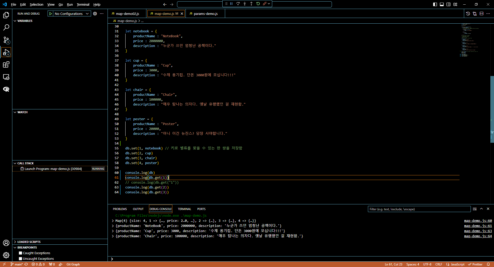
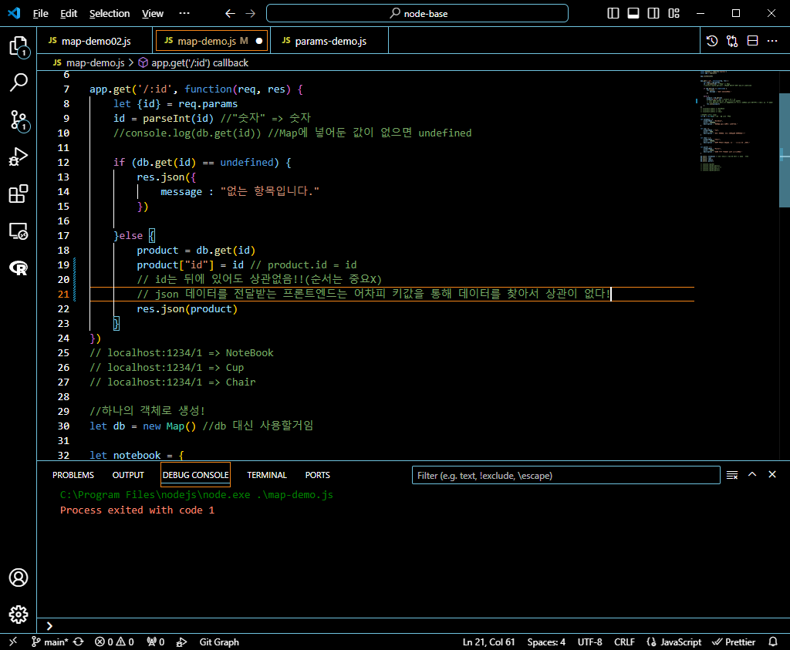
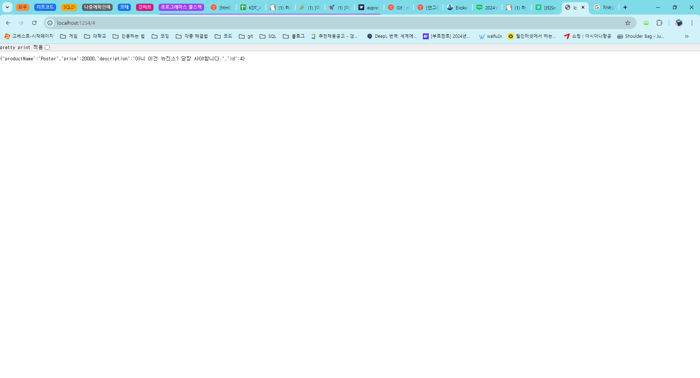
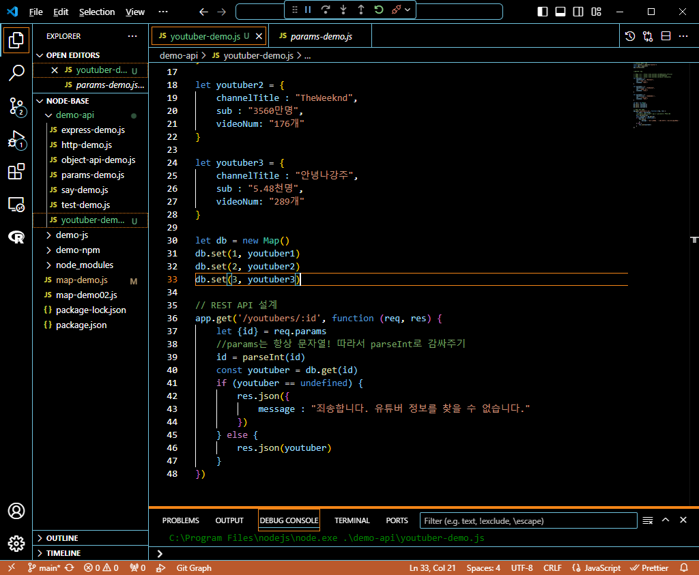
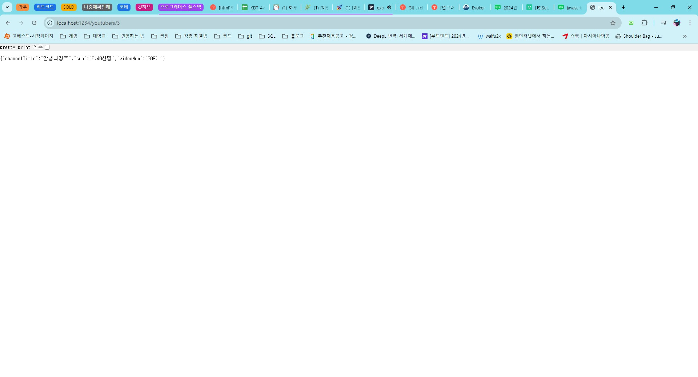
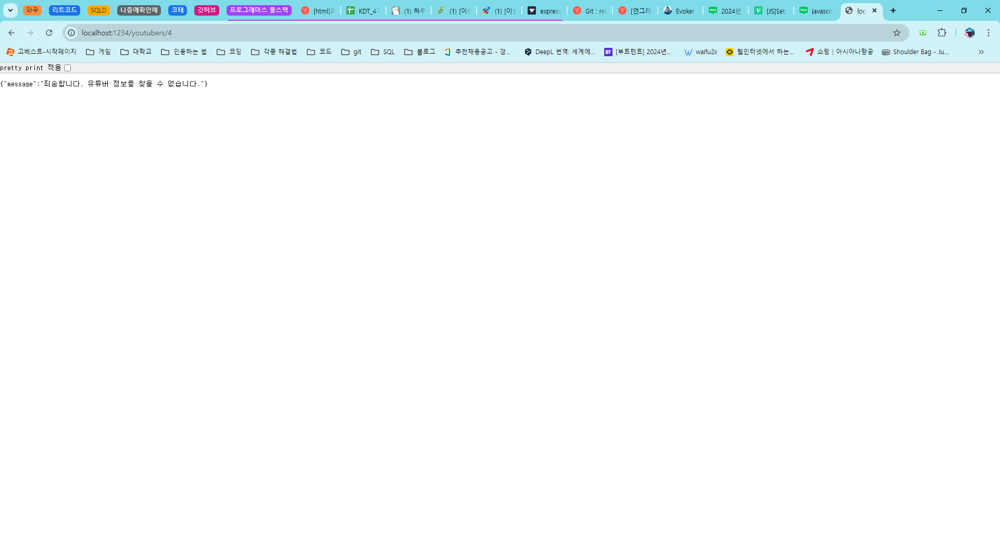
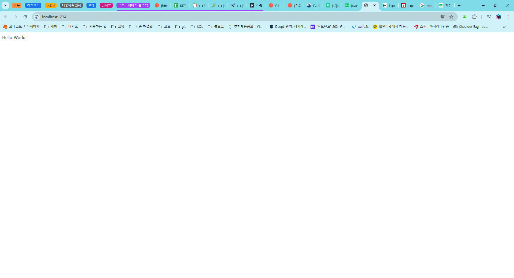
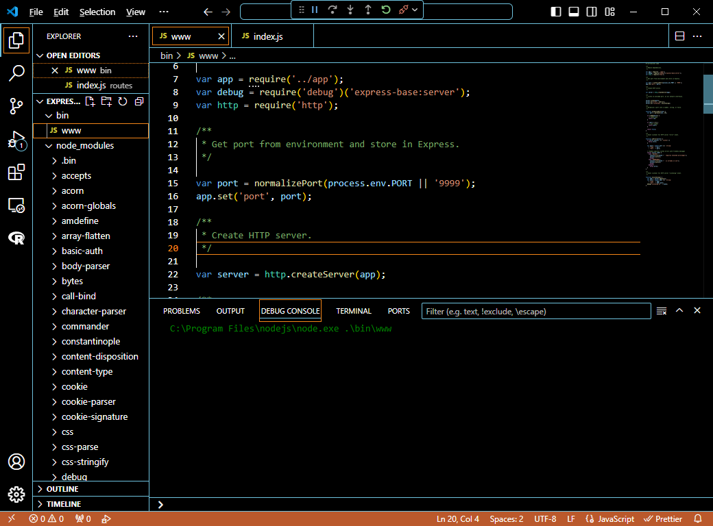
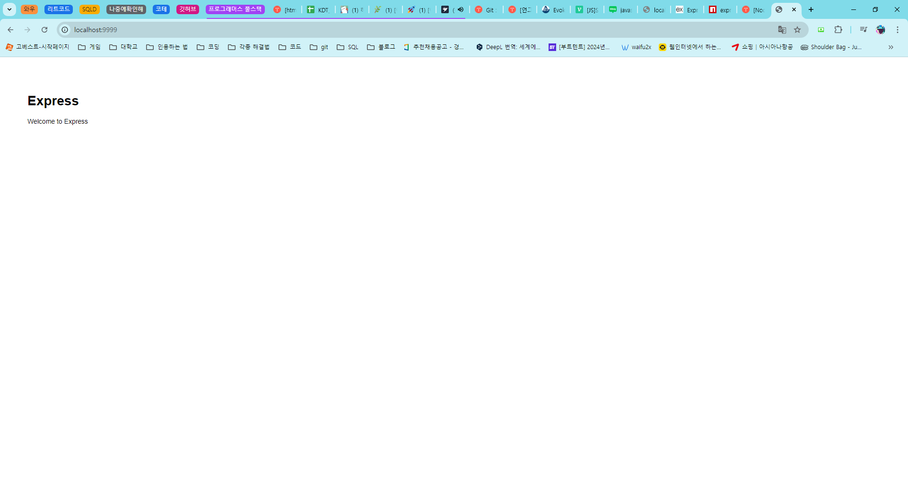
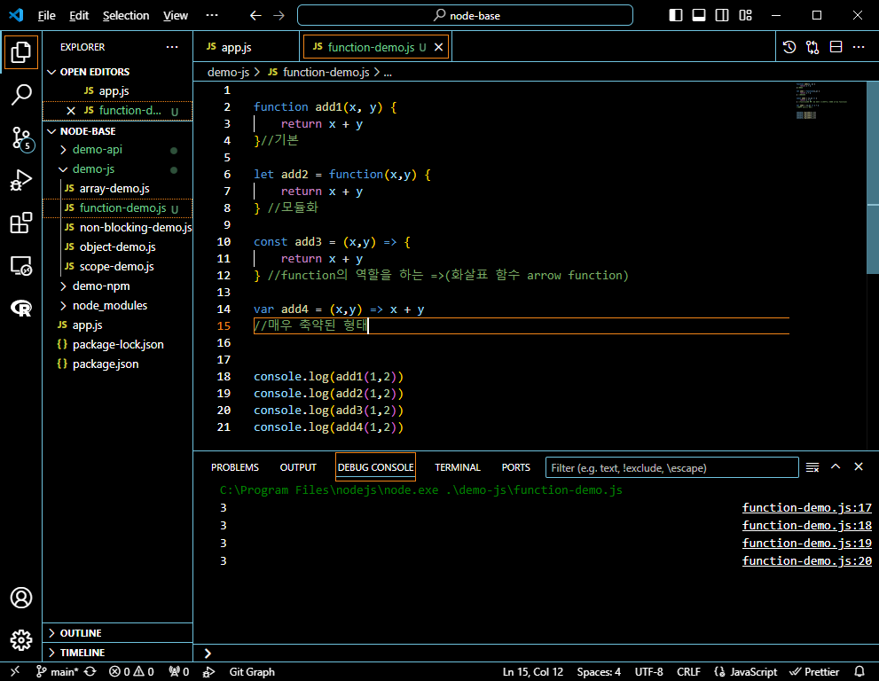

## 프로그래머스 풀스택 14
백엔드 기초: Node.js + Express 기본(5)

### 🌊 map object

💫 String만 담던 Map<br>

| Key(id) | Value(productName)                                              |
| ------- | --------------------------------------------------------------- |
| 1       | "NoteBook" / 2000000 / 누군가 쓰던 엄청난 공책이다.             |
| 2       | "Cup" / 3000 / 수제 옹기컵. 단돈 3000원에 모십니다!!!           |
| 3       | "Chair" / 100000 / 매우 탐나는 의자다. 옛날 유행했던 걸 재현함. |
| 4       | "Poster" / 20000 / 아니 이건 뉴진스? 당장 사야합니다.           |

<br>

💫 \<실습><br>
<br><br/>

### express + 객체

💫 \<실습><br>

<br>

<br>

``` javascript
product = db.get(id)
product["id"] = id // product.id = id
```

- id는 뒤에 있어도 상관없음!!(순서는 중요X)<br>
- json 데이터를 전달받는 프론트엔드는 어차피 키값을 통해 데이터를 찾아서 상관이 없다!<br><br/>

### express + map + 객체 추가 실습

💫 \<실습><br>

<br>

<br>

<br><br/>

### 🌊 express 구조 이해

💫 express 구조 이해<br>
- express(편리한 모듈) = http 모듈 + @ / http보다 간결!<br>
- 웹 프레임워크 = 내가 만들고 싶은 웹 서비스를 구현하는 데 필요한 모든 일을 틀 안에서 할 수 있는 것!!!<br>
- npm install express-generator -g 을 통해 express의 기본 구조를 생성함!

💫 \<Hello World 실습><br>
<br>

<br>

<br>

**💫 \<express generator로 생성한 폴더>**<br>
**💫 \<www 뜯어보기>**<br>

💫 www 파일에서 모듈을 가져오는 부분!<br>
``` javascript
var app = require('../app');
var debug = require('debug')('express-base:server');
var http = require('http');
```
- debug : 콘솔창에 로그를 찍어주는 모듈<br>
<br>

💫 www 파일에서 포트 설정 부분!<br>
``` javascript
var port = normalizePort(process.env.PORT || '3000');
app.set('port', port);
```
<br>

💫 www 파일에서 서버가 http에서 생성 부분!<br>
``` javascript
var server = http.createServer(app);
```
<br>

💫 www 파일에서 포트, 에러 설정 부분!<br>
``` javascript
server.listen(port);
server.on('error', onError);
server.on('listening', onListening);
```
- 포트로 리슨을 하고 / 에러가 나거나 이벤트 발생시 리슨 맵핑.<br>
<br>
----------------
**💫 \<app.js 뜯어보기>**<br>

``` javascript
var app = express();
```
- express 모듈을 직접 불러다가 app에다가 미리 담아둠!<br>
<br>

``` javascript
app.set('views', path.join(__dirname, 'views'));
app.set('view engine', 'jade');
```
- app.set 메소드에 이 프로젝트 셋팅 ~~이거 해두자(추가셋팅) / 우리가 수정할 경우는 잘 없음!<br>
<br>

``` javascript
app.use(logger('dev'));
app.use(express.json());
app.use(express.urlencoded({ extended: false }));
app.use(cookieParser());
app.use(express.static(path.join(__dirname, 'public')));

app.use('/', indexRouter);
app.use('/users', usersRouter);
```
- 미들웨어(http 외 모듈)<br>
<br>


``` javascript
module.exports = app;
```
- 다른 곳에서 사용할 수 있게 모듈화!<br><br/>

### 🌊 generator 돌려보기

- 프로젝트 규모가 커질수록 한땀 한땀 app.js을 작성하기엔 힘드니까<br>
- 프로젝트의 기본적인 틀을 마련해줄 수 있는 express(프레임워크)를 통해 app.js을 사용하게 됨<br>

npm install 을 하면 프로젝트 내에서 사용되는 필요한 dependencies을 다운받음!<br>

<br>

**💫 \<index.js 뜯어보기>**<br>

``` javascript
var express = require('express');
var router = express.Router();

/* GET home page. */
router.get('/', function(req, res, next) {
  res.render('index', { title: 'Express' });
});

module.exports = router;
```
- express 모듈을 가져오고<br>
- router를 심어둠(분기처리)<br>
- index라는 문자열을 렌더링해서 보낸다는 뜻!<br>

<br>

💫 \<실행><br>
<br>

<br>
- 이 화면은 views 폴더의 index.jade, error.jade로 만들어졌다고 생각하면 됨!!<br><br/>

### 🌊 자바스크립트 함수 4가지 종류

``` javascript
function add1(x, y) {
    return x + y
}
```
- 기본 형태<br>
<br>

``` javascript
let add2 = function(x,y) {
    return x + y
}
```
- 모듈화<br>
<br>

``` javascript
const add3 = (x,y) => {
    return x + y
} 
```
- function의 역할을 하는 =>(화살표 함수 arrow function)<br>
<br>

``` javascript
var add4 = (x,y) => x + y
```
- 매우 축약된 형태<br>
<br>

<br>
- 로그를 찍으면 다 같은 결과임을 알 수 있음!<br><br/>

### 🌊 느낀 점(YWT)

**Y 일을 통해 명확히 알게 되었거나 이해한 부분(한 일)에 대해 정리 :**<br>
express의 파일 구조(www, app.js) / 자바스크립트의 함수 4가지 종류<br>


**W 배운 점과 시사점 :**<br>
map object 다시 찾아서 정리하기!<br>


**T 응용하여 배운 것을 어디에 어떻게 적용할지:**<br>
서버를 짤 때 효율적으로 짤 수 있도록 함!<br>


