## 프로그래머스 풀스택 15
백엔드 기초: Node.js + Express 기본(6)

### 🌊 post는 웹브라우저로 테스트X /  postman의 등장

💫 HTTP(규약) Method(목적)<br>

- **POST: 데이터 생성(등록)**<br>
ex) 회원가입 = 나 좀 등록해줘 = id, password, name, email, contact<br>

- **GET: 데이터 조회**<br>
ex) URL로 데이터 보냈는데?<br>

- **PUT: 데이터 수정(덮어쓰기)**<br>
ex) 회원정보 전체 수정(PUT를 통해 해당 리소스를 수정)<br>

- **PATCH: 데이터 수정(일부 수정)**<br>
ex) 회원정보 일부 수정(Update에 가장 가깝게 쓰임)<br>

- **DELETE: 데이터 삭제**<br>

- **HEAD: 서버 리소스의 헤더(메타 데이터의 취득)**<br>

- **OPTIONS: 리소스가 지원하고 있는 메소드의 취득**<br>

- **CONNECT: 프록시 동작의 터널 접속을 변경**<br>

- **TRACE: 웹 서버로 가는 네트워크 경로를 체크**<br>

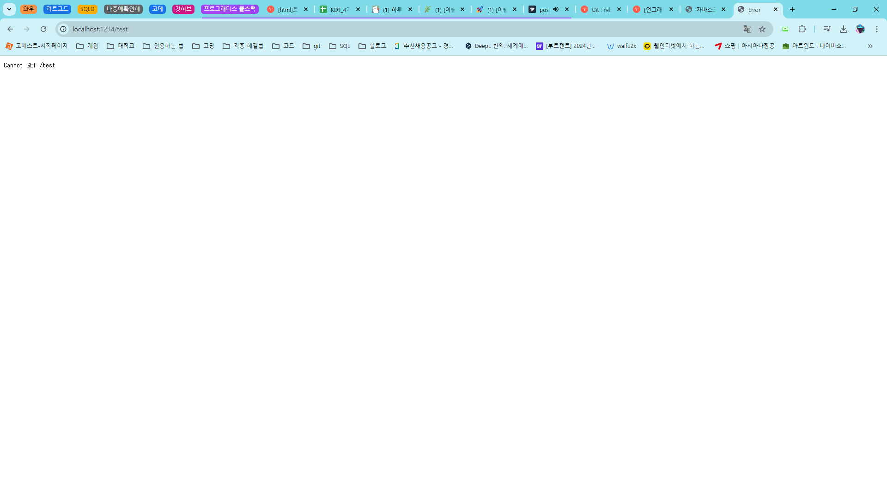<br>

💫 오류가 나는 이유!<br>
> API 입장에서는 POST로 개인정보를 주소값으로 받으면 큰일남..ㅎ<br>
> URL로 id, password, name, email, contact 등을 보내지않고 숨겨서 보낼 것임 -> HTTP 바디 부분에 숨김<br>
> 웹 브라우저에는 바디에 데이터를 숨길 수 없으니까 URL로 받을 수 있는 GET만 사용<br>
> POST = 데이터가 바디에 같이 숨겨져와야만 POST 인줄 앎.<br>
> 그래서 POSTMAN 프로그램을 통해 구현가능!<br>

💫 POSTMAN이 나온 이유<br>
POST의 경우 html 클라이언트에서 form, 버튼, 이벤트, 이벤트 등록, 등등등... 백엔드를 구현하기 전 미리 만들어놓아야 하는 것들이 있음. 그럼 백엔드가 프론트엔드가 구현되기를 기다려야하는 상황이 발생. => 이러한 단점들을 개선하기 위해 POSTMAN 등장!
<br><br/>

### postman get, post 테스트

💫 \<GET 실습><br>
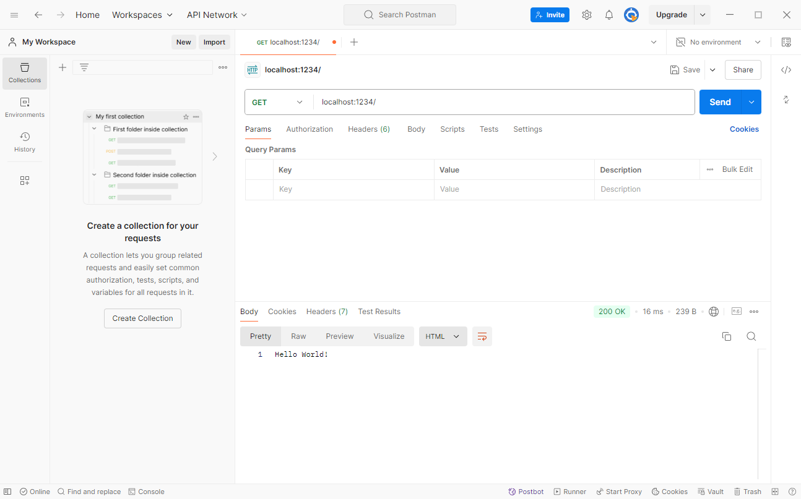<br>
- 하단에 바로 출력이 되는 모습!<br>
<br>

💫 \<GET 실습><br>
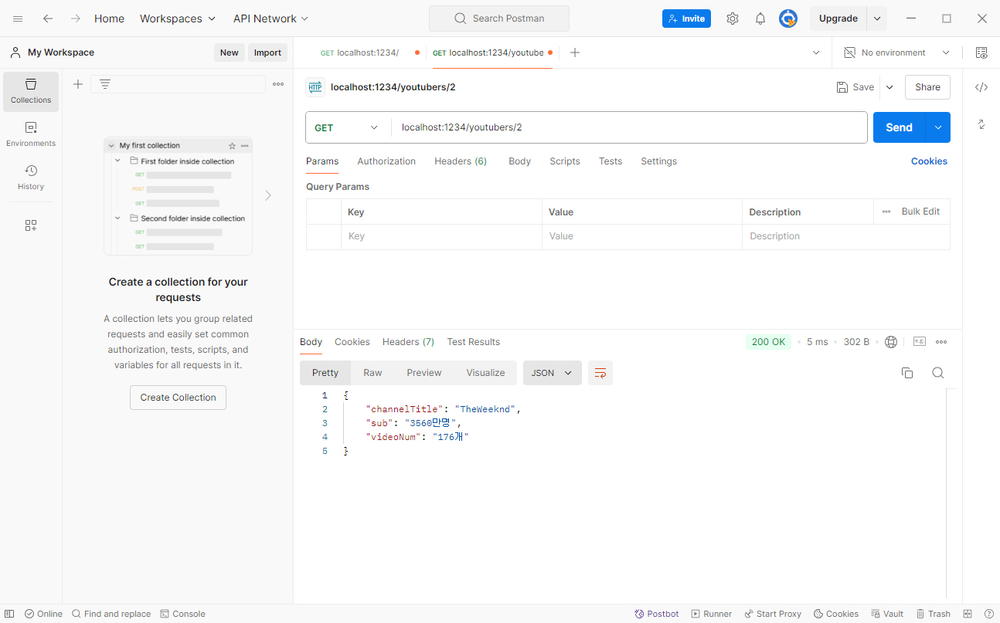<br>
- json 형태로 날라온 걸 Pretty 탭에서 깔끔하게 출력해줌!<br>
<br>

💫 \<POST 실습><br>
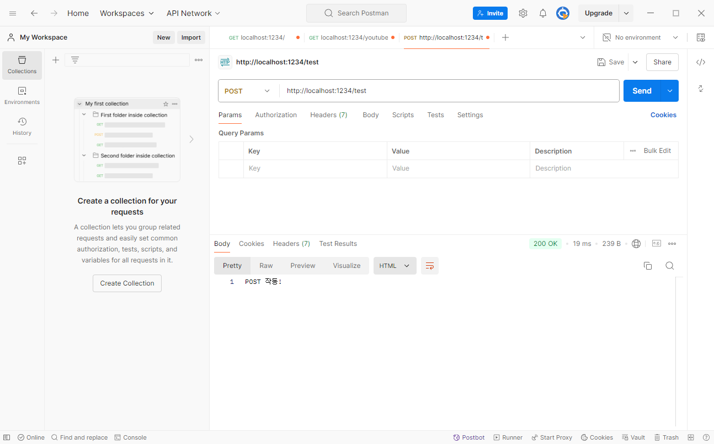<br>
- 아까와 다르게 오류가 나지않고 출력이 잘 됨!<br><br/>

### post req, res 구현 & 테스트

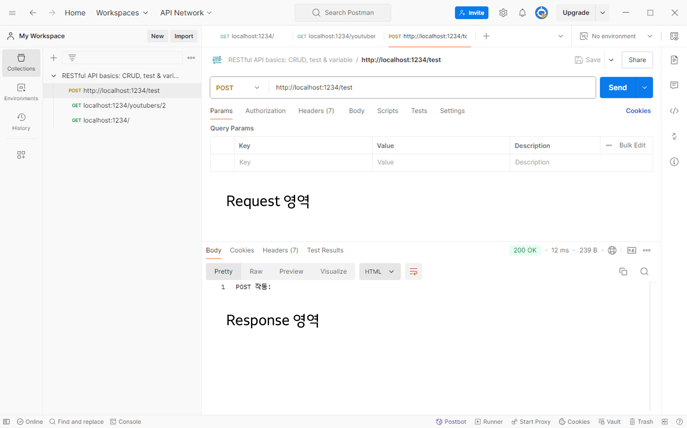<br>

Request, Response 영역이 구별되어있음!<br>

**💫 \<app.js 파일 부분>**<br>
``` javascript
app.use(express.json())

app.post('/test', (req, res) => {
  //body에 숨겨져서 들어온 데이터를 화면에 나타내줄 수 있음!
  console.log(req.body)

  res.send('')
})
```
- app.use(express.json())<br>
    - 미들웨어(http 외 모듈) 사용<br>
    - express.json -> express 모듈 중 하나. json이라는 미들웨어를 사용하면 request로 날아오는 body값을 json으로 읽어볼 수 있음!<br>
<br>

💫 \<실습><br>
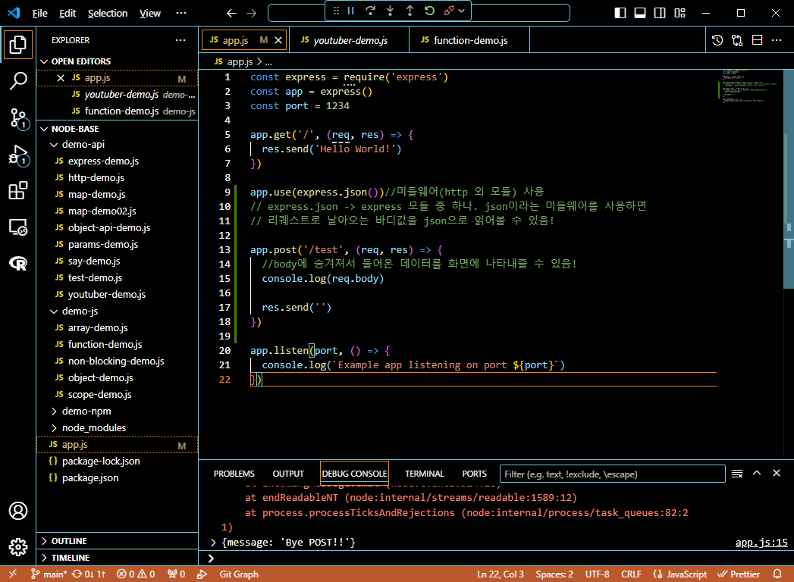<br>
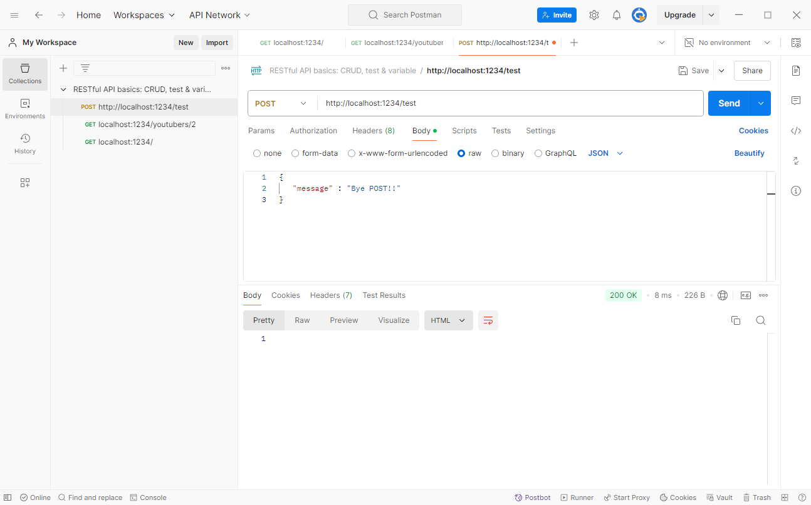<br>
<br>

```javascript
app.post('/test', (req, res) => {
  console.log(req.body) //이 부분을 message만 받아주기 위해

  res.send('')
})
``` 

```javascript
app.post('/test', (req, res) => {
  console.log(req.body.message) //.message를 추가하여 내용만 추출한다.

  res.send('')
})
```

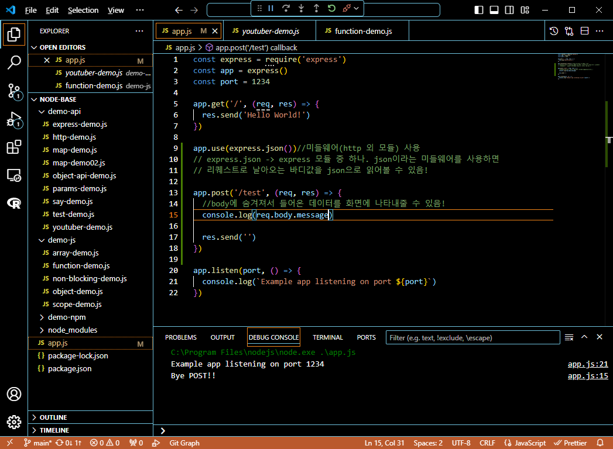<br>
- 변경하면 이렇게 메세지의 내용만 출력된다.<br>
<br>

```javascript
app.post('/test', (req, res) => {
  console.log(req.body.message) //.message를 추가하여 내용만 추출한다.

  res.send(req.body.message) //여기도 req.body.message추가하면 POSTMAN에서 볼 수 있음!
})
```
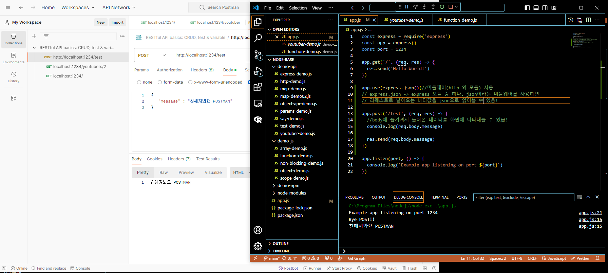<br>
- POSTMAN에서도 출력확인 되는 모습!<br>
<br>

```javascript
app.post('/test', (req, res) => {
  //body에 숨겨져서 들어온 데이터를 화면에 나타내줄 수 있음!
  console.log(req.body.message)

  res.json(req.body) //json으로 바꾸면 body를 받은 걸 돌려주면 됨!
})
```
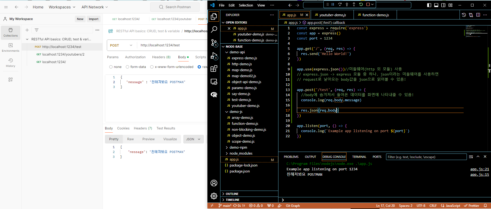<br>
- res.json(req.body)을 통해 body를 받은 걸 돌려줘서 바로 출력함!<br><br/>

### 🌊 유튜버 등록
1. 기존 유튜버 3명만 정보 반환 가능 / 새로운 유튜버 등록 불가<br>
2. 1, 2, 3 유튜버에 대한 api만 존재<br>
<br>

**✨POST를 활용해서!! 유튜버 추가하기**<br>

\<API 설계 (URL, method)><br>
🌟 0. 전체 유튜버 "조회" GET /youtubers/<br>
- req : X<br>
- res : map을 전체 조회<br>
<br>
1) 개별 유튜버 "조회" GET /youtubers/:id : id로 map에서 객체를 찾아서, 그 객체의 정보를 뿌려줌<br>
    - req : params.id <= map에 저장된 key 값을 전달<br>
    - res : map에서 id로 객체를 조회해서 전달<br>
  <br>
1) 유튜버 "등록" => POST /youtubers<br>
    - req : body <= channelTitle, sub = 0, videoNum = 0 신규 유튜버 정보 전달<br>
    db에 저장까지 해줌!<br>
    - res : "channelTitle님, 유튜브 채널 생성을 축하합니다!"<br>
<br>

💫 \<실습><br>

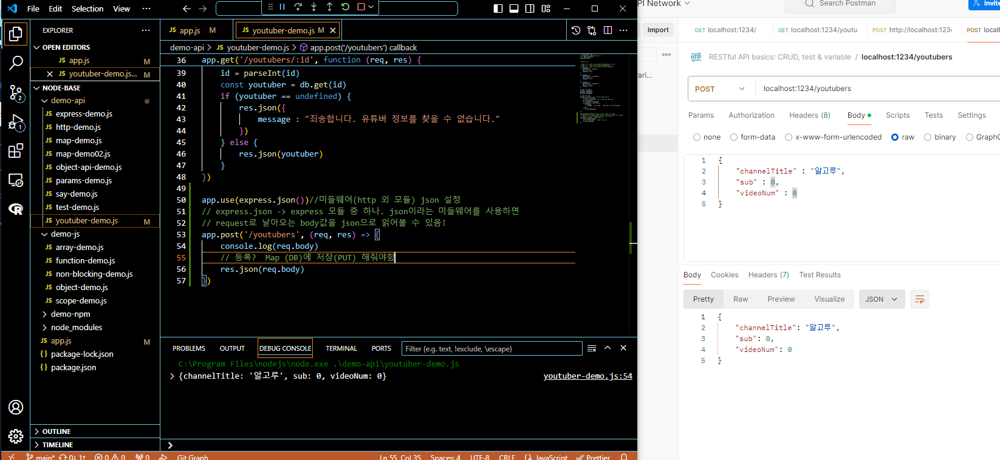<br>
- 유튜버 등록 : POST로 내 채널의 정보를 전달함<br>
<br>

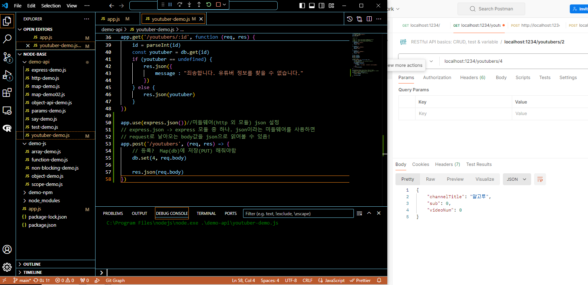<br>
- db.set(4, req.body) 문장을 GET으로 확인해보니 db에 저장이 잘 됨!<br>
<br>

```javascript
    res.json({
        message : db.get(4).channelTitle + "님, 유튜브 채널 생성을 축하합니다!"
    })
```
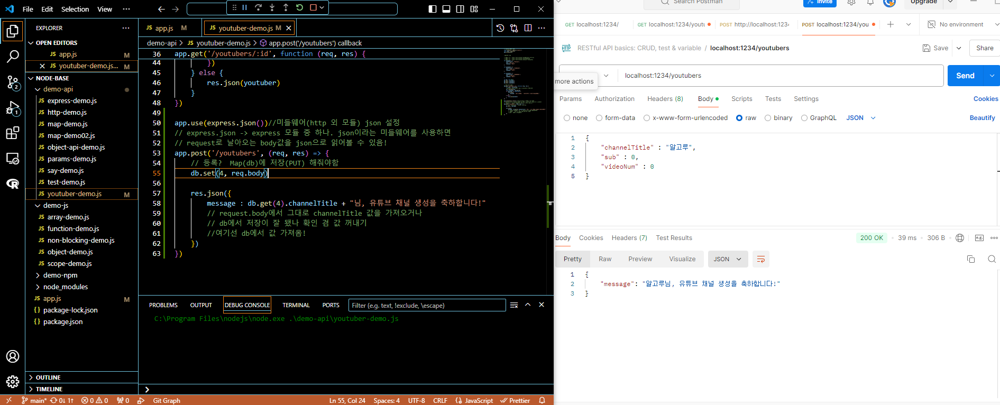<br>
- request.body에서 그대로 channelTitle 값을 가져오거나 db에서 저장이 잘 됐나 확인 겸 값 꺼내기<br>
- 여기선 db에서 값 가져옴!<br>
<br>

💫 \<고도화하기><br>
```javascript
    res.json({
        message : `${db.get(4).channelTitle}님, 유튜브 채널 생성을 축하합니다!`
    })
```
- 템플릿 문자열을 사용하여 고도화하기!(실행결과는 당연히 같음)<br><br/>

### 🌊 등록 고도화

```javascript
let db = new Map()
let id = 1

db.set(id++, youtuber1)
db.set(id++, youtuber2)
db.set(id++, youtuber3)

//...(생략)
db.set(id++, req.body)
    db.set(id++, req.body)

    res.json({
        message : `${db.get(id-1).channelTitle}님, 유튜브 채널 생성을 축하합니다!`
    })
```
- 변수 선언에 var는 사용하지 않을 것!
-  message : `${db.get(id-1).channelTitle} id 값이 +1이 됐기때문에 다시 -1을 해서 현재 값을 조회<br>

💫 \<실습><br>
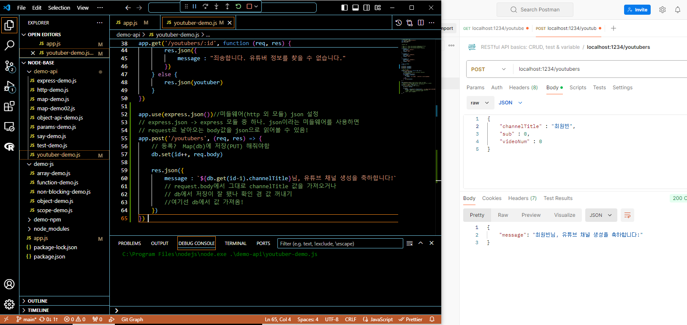<br><br/>

### 🌊 전체 조회 : 오류 해결하기

```javascript
app.get(/youtubers, function (req, res) {
    //req:X
    res.json({
        message : "test"
    })
})
```
💫 \<실습><br>
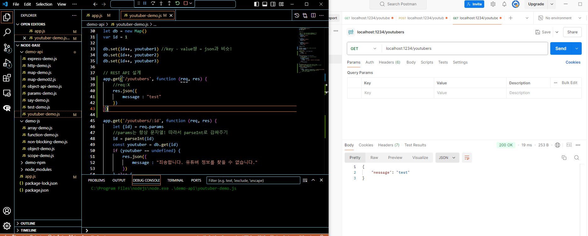<br>
- 실습할 때 오류가 나지 않고 나는 출력이 잘 되었음!<br>
- 내 생각: 나는 /youtubers로 다 맞추고 시작했고(복수형을 지키기 위해) 영상은 다른 걸 /youtuber로 해서
에러가 난 거 같음!<br>
- 오류난 이유(진실): postman에 주소 복붙을 잘못하면 문자오류가 날 수도 있음!<br>

💫 stackoverflow<br>
- 프로그래밍 에러가 나면 모두 질문을 할 수 있도록 하는 사이트!<br><br/>

### 🌊 느낀 점(YWT)

**Y 일을 통해 명확히 알게 되었거나 이해한 부분(한 일)에 대해 정리 :**<br>
post는 웹브라우저로 테스트X / postman get, post 실습<br>


**W 배운 점과 시사점 :**<br>
GET, POST 주고받는 연습을 POSTMAN을 통해 더 연습하기!<br>


**T 응용하여 배운 것을 어디에 어떻게 적용할지:**<br>
POSTMAN을 사용해 다른 사람들과 협업하기 쉬워질 것이고, REST API를 표현하기 매우 간단할 것임! <br>


