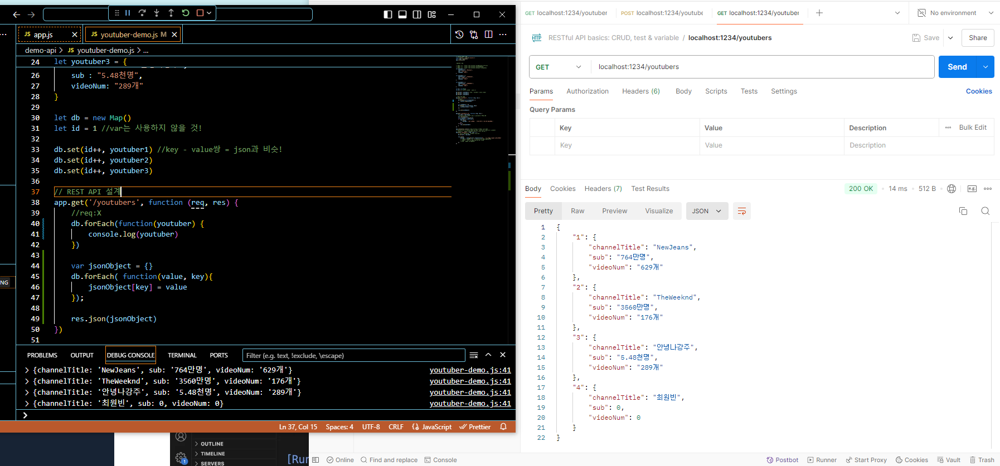
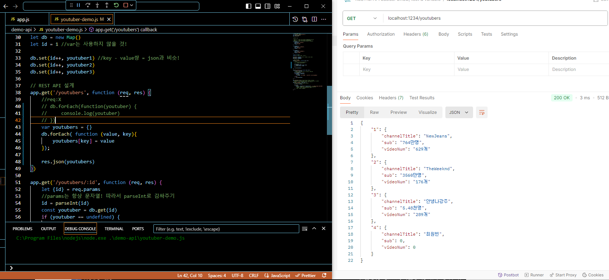
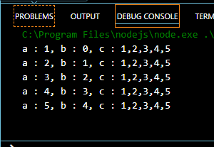
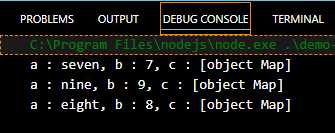
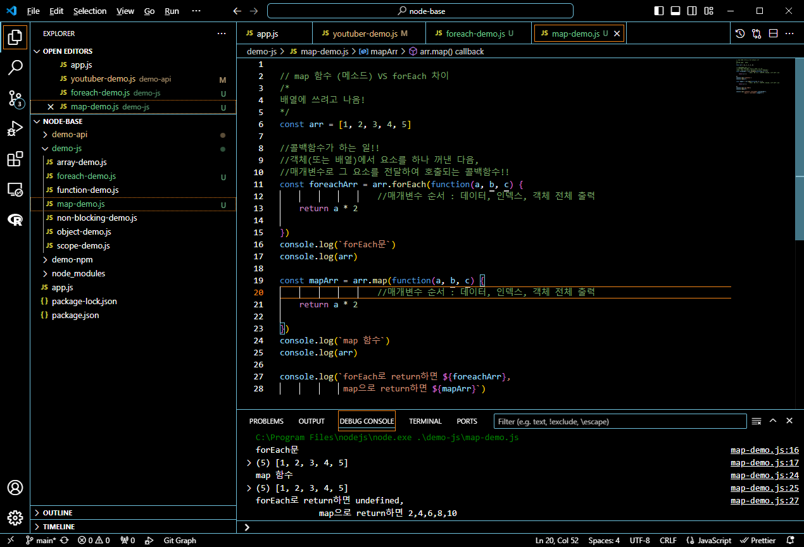
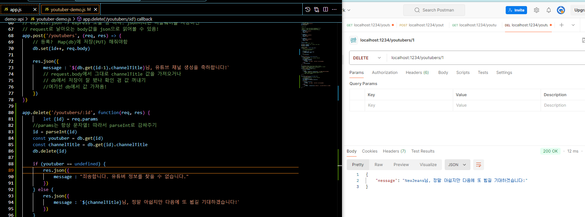
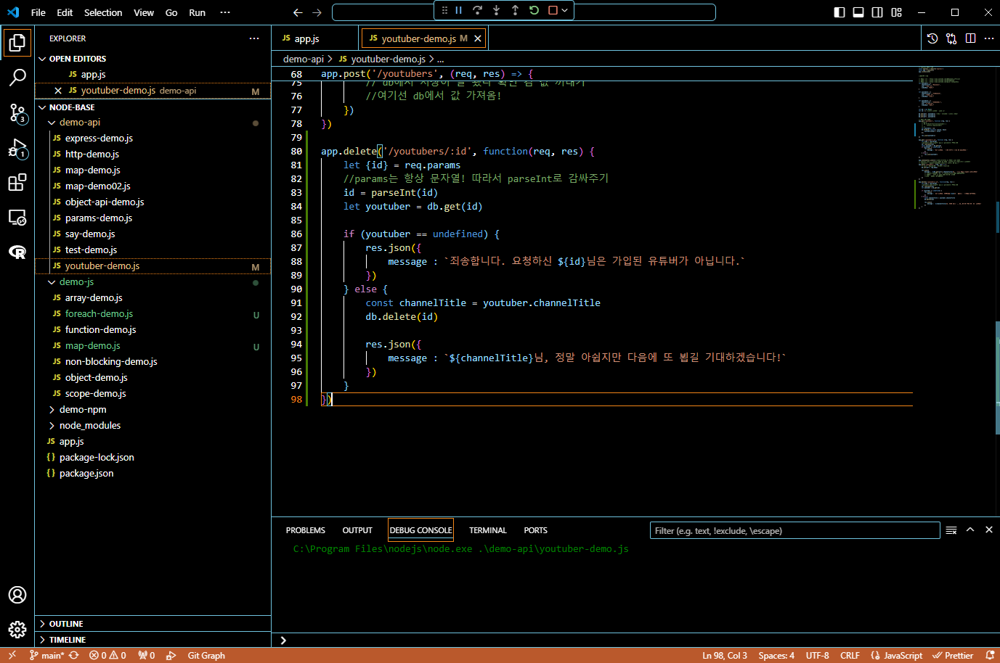
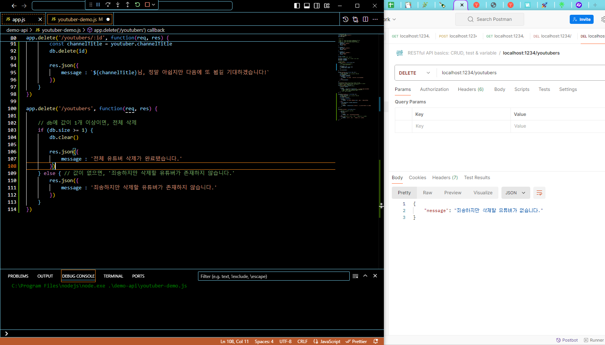
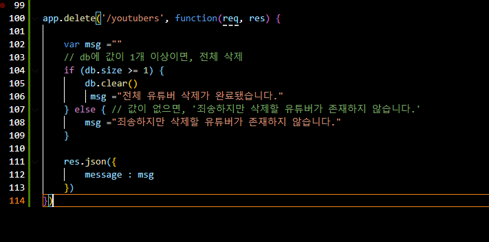
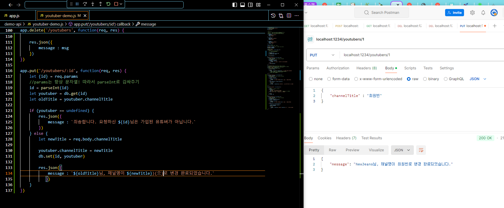

## 프로그래머스 풀스택 16
백엔드 기초: Node.js + Express 기본(7)

### 🌊 전체 조회 feat. 구글링

**💫 forEach문**<br>

```javascript
app.get('/youtubers', function (req, res) {
    db.forEach(function(youtuber) {
        console.log(youtuber)
    })
    res.json(db.values())
})
```
- 객체들이 시퀀스 모양(줄지어서 리스트, 맵 등의 형태)로 모여서 꺼낼 수 있음.<br>
- index 값 없이! 무조건 순서대로 출력함.<br>

<br>

**💫 Map to JSON에서 JSON.stringify() 메서드 사용**<br>

```javascript
let detail = new Map()
detail.set('Name', 'Lora');
detail.set('Country', 'England');
detail.set('Age', '24');
let jsonObject = {};
detail.forEach((value, key) => {jsonObject[key] = value});
console.log(JSON.stringify(jsonObject))
```
1. Map 객체를 생성하고 키-값 쌍을 추가.<br>
2. forEach 메소드를 사용하여 Map의 모든 요소를 순회하며 일반 객체에 키-값을 추가.<br>
3. 이 객체를 JSON.stringify() 메서드를 사용하여 JSON 문자열로 변환.<br>

<br>

```javascript
detail.forEach((value, key) => {jsonObject[key] = value});
console.log(JSON.stringify(jsonObject))
```
- 위의 예시 코드에서 이 부분만 가져와서 수정함!<br>
- JSON.stringify()가 Postman에서 출력이 깔끔하지 않은데, 그 이유는 기본적으로 JSON.stringify()는 JSON 데이터를 단일 라인 문자열로 반환하기 때문!<br>
- 따라서 실습할 때는 JSON.stringify부분을 삭제하고 출력했음!<br>

<br>

\<실습><br>
<br>

<br>
- jsonObject을 youtubers 객체로 수정<br>
- forEach문을 통해 잘 출력이 되는 걸 확인!<br>

프론트엔드에서 키가 1, 2, 3, 4, ...순으로 데이터를 받아서 쓸 수 있음!<br><br/>

### 🌊 자바스크립트 forEach

**💫 forEach문**<br>

- 향상된 for문!<br>
- forEach 사용하는 이유: 객체는 객체가 기본적으로 가지고 있는 내장함수 존재함. forEach 메소드도 그러한 내장함수임!<br> 

예시 1. \<기본 형태><br>
```javascript
배열이름.forEach(function(i){
	console.log(i);
});
```
예시 2. \<화살표함수><br>
```javascript
배열이름.forEach(i => {
	console.log(i);
});
```
예시 3. \<forEach문 만드는 법><br>
```javascript
배열이름.forEach(요소이름 => {
	실행문(요소이름)
});
```
\<실습><br>
```javascript
const arr = [1, 2, 3, 4, 5]
arr.forEach(function(a, b, c) {
                    //매개변수 순서 : 데이터, 인덱스, 객체 전체 출력
    console.log(`a : ${a}, b : ${b}, c : ${c}`)

})
```
<br>
- 콜백함수 : 객체(또는 배열)에서 요소를 하나 꺼낸 다음, 매개변수로 그 요소를 전달하여 호출되는 콜백함수!!<br>
- 요소이름은 정할 수 있고, 그 배열이 가지고 있는 요소들을 한 번씩 반환하여 반복.
- 매개변수의 순서 : 데이터, 인덱스, 객체 전체 출력<br>

<br>

**💫 Map + forEach문**<br>
\<실습><br>
```javascript
let map = new Map()
map.set(7, "seven")
map.set(9, "nine")
map.set(8, "eight")

map.forEach(function(a, b, c) {
    console.log(`a : ${a}, b : ${b}, c : ${c}`)
})
```
<br>
 - 매개변수 1번째 자리는 무조건 데이터, 2번째 자리는 인덱스 값이 들어옴.<br>
 - 배열 = 인덱스 , 객체(map) = 키값이 들어옴<br><br/>

### 🌊 자바스크립트 map 함수

**💫 map 함수(메소드)**<br>
- forEach문과 돌아가는 방식은 비슷하지만 반환의 차이가 있음<br>
- forEach문은 return 값 X, Map은 return 값 O<br>

<br>

<br>

### 🌊 map 함수 (메소드) VS forEach 차이

**💫 forEach()**<br>
기본 형태<br>
```javascript
배열이름.forEach(요소이름 => {
	실행문(요소이름)
});
```
- 반환 값: 없음 (undefined) <br>
- 용도: 배열의 각 요소에 대해 작업을 수행<br>
- 특징: 원본 배열을 변경하지 않음, 'break;'사용 불가. <br>

**💫 map()**<br>
기본 형태<br>
```javascript
배열이름.map(요소이름 => {
	실행문(요소이름)
});
```
- 반환 값: 새로운 배열<br>
- 용도: 배열의 각 요소를 변환하여 **새로운 배열을 생성**<br>
- 특징: 원본 배열을 변경하지 않음, 'break;'사용 불가.<br><br/>

### 🌊 자바스크립트 delete

<details>
<summary>✨API 설계 (URL, method) 접기/펼치기✨</summary>
<div markdown="1">

<br>
💫 유튜버 데모 업그레이드!<br>

1. 기존 유튜버 3명만 정보 반환 가능 / 새로운 유튜버 등록 불가<br>
2. 1, 2, 3 유튜버에 대한 api만 존재<br>
<br>

**✨POST를 활용해서!! 유튜버 추가**<br>
**✨NEW!! DELETE를 활용해서!! 유튜버 삭제**<br>

\<API 설계 (URL, method)><br>
🌟 0. 전체 유튜버 "조회" GET /youtubers/<br>
- req : X<br>
- res : map을 전체 조회<br>
<br>
1) 개별 유튜버 "조회" GET /youtubers/:id : id로 map에서 객체를 찾아서, 그 객체의 정보를 뿌려줌<br>
    - req : params.id <= map에 저장된 key 값을 전달<br>
    - res : map에서 id로 객체를 조회해서 전달<br>
  <br>
2) 유튜버 "등록" => POST /youtubers<br>
    - req : body <= channelTitle, sub = 0, videoNum = 0 신규 유튜버 정보 전달<br>
    db에 저장까지 해줌!<br>
    - res : "channelTitle님, 유튜브 채널 생성을 축하합니다!"<br>
  <br>
3) 개별(id값 받기) 유튜버 "삭제" => DELETE /youtubers/:id<br>
    (URL은 같아도 되는 이유 : HTTP Method가 다르니까!!)
    - req : params.id<br>
    db에 저장까지 해줌!<br>
    - res : "channelTitle님, 정말 아쉽지만 다음에 또 뵙길 기대하겠습니다!"<br>
  <br>
4) 전체 유튜버 "삭제" => DELETE /youtubers<br>
    - req : X (전체 조회할 때나 마찬가지)<br>
    - res : "전체 유튜버 삭제가 완료됐습니다."<br>
  <br>
5) 개별 유튜버 "수정" => PUT /youtubers/:id<br>
    - req : params.id / body <= channelTitle<br>
    - res : "(이전)channelTitle님, 채널명이 (새로운)channelTitle로 변경 완료되었습니다."<br>
  <br>
  <br>

</div>
</details>

<br>

<br>
- app.delete을 통해 메세지를 출력하는 모습<br>
- 위 사진은 혼자 예외처리 실습(if, else문 추가) 해봤으나 오류가 남 ㅠㅠ<br><br/>

### 🌊 예외 처리 => “안정성”

- 예외처리를 통해 프로그램의 안정성 UP!<br>
- 사용자가 편안하게 사용할 수 있는 걸 고려할 것<br>
<br>

\<실습><br>
<br>
- 예외처리가 잘 된 모습!<br><br/>

### 🌊 리팩토링 : 수정 후 추가

- 리팩토링(refactoring): 소프트웨어의 코드 내부(구조)를 변경하는 것<br>

1. 이해하기 쉽게<br>

2. 성능 고려<br>

3. 안정성<br>

=> 클린 코드를 가질 수 있게 됨!<br>

> 클린 코드(Clean Code)란? : 읽기 쉽고, 이해하기 쉬운 코드 / 리팩토링으로 만들 수 있는 좋은 코드<br>

💫 리팩토링은 언제 하지?<br>

1. 에러(문제점)이 n회 발견됐을 때, 리팩토링을 해야함.<br>

2. 리팩토링을 하면서 에러(문제점)를 발견 가능<br>

3. **기능을 추가하기 전,**<br>
ex) API URL "설계" 수정<br>

4. 코드 리뷰할 때<br>

**리팩토링을 하면 안되는 시점! : ✨배포, 운영 직전✨ 절대 코드 수정X**<br><br/>

### 🌊 전체 + 전체 조회 : 없다 메세지

아이콘 TIP<br>
직육면체 : 변수, 필드, 프로퍼티(자바스크립트)<br>
정육면체 : 함수, 메소드<br>

💫 \<실습><br>
<br>

\<고도화하기!><br>
<br><br/>

### 🌊 PUT

```javascript
let youtuber2 = {
    channelTitle : "TheWeeknd",
    sub : "3560만명",
    videoNum: "176개"
}
```
- 현재 사용자가 수정할 수 있는 건 channelTitle이므로 params.id / body <= channelTitle를 해준다.<br>

💫 \<실습><br>
<br><br/>

### 🌊 HTTP Code(HTTP 상태 코드)

- HTTP(인터넷 상에서 통신할 때 사용하는 규약) 안에 작성되어서 들어가는 "상태"<br>

✔ 1XX: Informational(정보 제공)<br>
임시 응답으로 현재 클라이언트의 요청까지는 처리되었으니 계속 진행하라는 의미.<br>

✔ 2XX: Success(성공)<br>
클라이언트의 요청이 서버에서 성공적으로 처리되었다는 의미.<br>

✔ 3XX: Redirection(리다이렉션)<br>
완전한 처리를 위해서 추가 동작이 필요한 경우. 주로 서버의 주소 또는 요청한 URI의 웹 문서가 이동되었으니 그 주소로 다시 시도하라는 의미.<br>

✔ 4XX: Client Error(클라이언트 에러)<br>
없는 페이지를 요청하는 등 클라이언트의 요청 메시지 내용이 잘못된 경우를 의미.<br>

✔ 5XX: Server Error(서버 에러)<br>
서버 사정으로 메시지 처리에 문제가 발생한 경우. 서버의 부하, DB 처리 과정 오류, 서버에서 익셉션이 발생하는 경우를 의미.<br>

- 조회/수정/삭제 성공 : 200 OK / 서버가 요청을 성공적으로 처리<br>
- 등록 성공 : 201 Created / 요청이 처리되어서 새로운 리소스가 생성<br>
- 요청한 연산(처리)을 할 때 필요한 데이터가 덜 왔을 때 : 400<br>
- 찾는 페이지 X(URL에 맞는 API X) : 404 Not Found / API를 던졌을 때, 서버에서 찾을 수 없음!<br>
- 서버가 죽었을 때(서버가 크리티컬한 오류를 맞았을 때) : 500 Internal Server Error / 서버에 에러가 발생<br><br/>

### 🌊 느낀 점(YWT)

**Y 일을 통해 명확히 알게 되었거나 이해한 부분(한 일)에 대해 정리 :**<br>
forEach문과 Map()차이, 예외처리, 리팩토링, HTTP Code<br>

**W 배운 점과 시사점 :**<br>
forEach문과 Map()차이 : forEach문은 return 값 X, Map은 return 값 O<br>
HTTP Code를 통해 페이지의 동작을 확인할 수 있게 됨!<br>
  
**T 응용하여 배운 것을 어디에 어떻게 적용할지:**<br>
forEach문과 Map()을 적절하게 사용하여 프로그램을 보다 효율적으로 짜고, 예외처리와 리팩토링을 항상 명심해두고 코드를 짤 것이다! <br>


