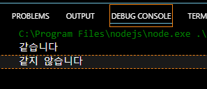

## 프로그래머스 풀스택 17
백엔드 기초: Node.js + Express 기본(8)

### 🌊 핸들러, if(객체) : if 긍정문, route

**💫 핸들러**<br>

- 일반적인 큰 의미는, **요청에 의해 호출되는 메소드**<br>
(넓은 의미로 사용되는 단어라, 쓰는 환경에 따라 뜻하는 의미가 조금씩 다름.<br>

- HTTP request가 날아오면 자동으로 호출되는 메소드!<br>

- node.js : 콜백함수로 app.HTTPMETHOD (path, 핸들러)<br>
ex) app.delete('/youtubers/:id', function(req, res)<br>

- Request로 호출되는 Controller의 "메소드"(Spring기준)<br>

<br>

**💫 if(객체) : if 긍정문**<br>

- 부정문을 먼저 물어보는 것보다, 긍정문으로 먼저 실행하는 게 좋음!(클린코드 관점)<br>

```javascript
    if (youtuber) {
        const channelTitle = youtuber.channelTitle
        db.delete(id)
            
        res.json({
            message : `${channelTitle}님, 정말 아쉽지만 다음에 또 뵙길 기대하겠습니다!`
        })
    } else {
        res.json({
            message : `죄송합니다. 요청하신 ${id}님은 가입된 유튜버가 아닙니다.`
        })
    }
```
- if 부정문(youtuber == undefined)으로 시작하던걸 긍정문((youtuber)으로 바꿔줘도 잘 실행됨!<br>

<br>

**💫 route**<br>

- 단순한 문자열이 아니라, Express가 이를 **객체**로 처리하여 라우팅 로직을 관리<br>
- Express는 클라이언트의 요청에서 오는 문자열 경로를 받아, 그 경로에 맞는 **핸들러 함수**(미들웨어나 컨트롤러)를 호출하여 요청을 처리.<br>

1. Express.js 내부에서 **라우팅 객체**로 처리.<br>
2. Express.js는 클라이언트의 요청 URL과 일치하는 경로를 찾기 위해 해당 경로를 문자열로 인식하고, 그에 맞는 미들웨어 및 핸들러 함수를 호출. <br>
3. 이 과정에서 route 객체는 여러 라우트와 미들웨어를 관리하며, 경로와 요청 메서드(GET, POST 등)를 기반으로 요청을 처리<br><br/>

### json array, find(), 예외 처리

**💫 json array**<br>
<br>
- 프론트엔드 방향으로 json을 보낼 때 사용하는 json 배열!<br>

<br>

**💫 find()**<br>

- 자바스크립트에서 배열에서 사용<br>
- 이 배열에서 어떤 값을 찾을 거임. 이 값의 id와 같은 객체를 찾을거다!<br>

```javascript
    var findFruit = 
        fruits.find(f => f.id == id)
```
<br>
- fruits 배열 안에 있는 객체 중, id 값이 params.id와 같은 객체를 찾겠다는 뜻!<br>

<br>

**💫 "찐" 예외처리**<br>

- HTTP코드도 활용하고, 프론트엔드가 확인했으면 좋겠는 예외.<br>
- 에러를 맞이하진 않아도 사실 예외라고 프론트에게 알려주는 예외처리!<br>

<br>
- 예외처리를 직접해주어 프론트엔드에 전달함!<br>
- send앞에 status코드만 끼인것 뿐!!(json으로 보내줘도 OK)<br>
- HTTP 상태 코드 : **✨클라이언트(사용자, 화면)와 소통을 정확하게 하기 위한 것✨**<br><br/>

### '== vs ==='

**💫 ==, ===의 차이**<br>
```javascript
if (1 == "1") { //자료형은 상관없이, 값만 비교
    console.log("같습니다")
} else {
    console.log("같지 않습니다")
}

if (1 === "1") { // 자료형이 상관 있음!! 값도 상관 있음
    console.log("같습니다")
} else {
    console.log("같지 않습니다")
}
```
<br>
- == : 자료형은 상관없이, 값만 비교<br>
- === : 자료형이 상관 있음!! 값도 상관 있음<br><br/>

### YouTuber demo 예외 고도화 : map은 undefined X

**💫  map은 undefined X**<br>

Map 객체는 아무리 안에 요소가 없어도 null 값 즉, undefined가 되지 않음!<br>
그래서 예외 추가를 해주면 됨.<br>
```javascript
if (youtuber == undefined) {
    res.status(404).json({
        message : "죄송합니다. 유튜버 정보를 찾을 수 없습니다."
    })
```
- res.status(404).json을 통해 예외처리!<br><br/>

### 🌊 YouTuber demo 예외 고도화 : post

- body 값에 아무것도 안날라올 때를 고려할 것<br>

**💫 \<실습>**<br>
<br>
- 요청 값을 처리 하지 못했기에 400 코드 추가!<br>

<br>
- 201 등록 성공 코드 추가!<br><br/>

### 🌊 프로젝트 시작

💫 유튜브 운영하는 것처럼 하는 미니 프로젝트!<br>

**회원**<br>
1. 로그인<br>
로그인 페이지 (1) 화면 완성 API X (2) 로그인 버튼 클릭 => <span style="color:lightseagreen">id, pwd 로그인 시켜줄 API</span><br>

2. 회원 가입<br>
회원 가입 페이지 (1) 화면 생성 API X (2) 회원 가입 버튼 클릭 시, <span style="color:lightseagreen">id, pwd, 이름 => 회원 가입 시켜줄 API</span><br>

3. 회원 정보 조회<br>
   
4. 회원 탈퇴<br>
마이 페이지 (1) 화면 생성 => <span style="color:lightseagreen">회원 정보 조회 API</span> (2) 회원 탈퇴 클릭 시, <span style="color:lightseagreen">회원 탈퇴를 시켜줄 API</span><br>

회원은 계정 1개당 채널 100개를 가질 수 있음!<br>

**채널**<br>
- 채널 생성<br>
- 채널 수정<br>
- 채널 삭제<br><br/>

### 🌊 회원 API 설계

**회원**<br>
1. 로그인 : POST /login<br>
get과 post의 가장 큰 차이 : body의 유무!!(body 있으면 post!!)
    - req : body(id, pwd)<br>
    - **res : \`${name}님 환영합니다!`** //👉 메인 페이지 출력<br>

2. 회원 가입 : POST /join<br>
    - req : body(id, pwd, name)<br>
    - **res : \`${name}님 회원 가입을 축하드립니다!`** //👉 로그인 페이지<br>

3. 회원 개별 "조회" : GET /users/:id<br>
    - req : URL(id)<br>
    - res : userId, name<br>

4. 회원 개별 탈퇴 : DELETE /users/:id<br>
    - req : URL(id)<br>
    - **res : \`${name}님 아쉽지만, 다음에 또 뵙겠습니다!`** or 메인 페이지 출력<br>

<br>    
설계는 언제든지 고칠 수 있다는 걸 명심할 것! <br>
더 효율적으로 클린코드로 짤 수 있다면 과감히 바꿀 것!<br><br/>

### 🌊 회원 API 코드 틀

```javascript
// express 모듈 셋팅
const express = require('express')
const app = express()
app.listen(7777)
```
<br>
- 이렇게 페이지 접속이 된다면 잘 연결 된 것!<br>

<br>

💫 \<API 틀 작성><br>
<br>
<br/>

### 🌊 회원가입 구현

💫 \<실습><br>
<br>
<br>
- const isEmpty = !Object.keys(req.body).length; 라는 isEmpty 객체를 통해
빈 객체를 확인한다.<br>

<br><br/>

### 🌊 회원 개별 조회, 회원 개별 삭제

💫 \<회원 개별 조회><br>
<br>
<br>
<br>

💫 \<회원 개별 삭제><br>
<br>
- 회원 개별 삭제 기본 코드 작성<br>
<br>

<br>
- app.route()을 사용해 여러 개의 핸들러를 지정한다!<br>

<br><br/>

### 🌊 느낀 점(YWT)

**Y 일을 통해 명확히 알게 되었거나 이해한 부분(한 일)에 대해 정리 :**<br>
핸들러, route, json array, find(), 예외 처리<br>

**W 배운 점과 시사점 :**<br>

**💫 핸들러**<br>
일반적인 큰 의미는, **요청에 의해 호출되는 메소드**<br>
HTTP Code를 통해 페이지의 동작을 확인할 수 있게 됨!<br>
node.js : 콜백함수로 app.HTTPMETHOD (path, 핸들러)<br>
ex) app.delete('/youtubers/:id', function(req, res)<br>

**💫 route**<br>
- 단순한 문자열이 아니라, Express가 이를 **객체**로 처리하여 라우팅 로직을 관리<br>
- Express는 클라이언트의 요청에서 오는 문자열 경로를 받아, 그 경로에 맞는 **핸들러 함수**(미들웨어나 컨트롤러)를 호출하여 요청을 처리.<br>

**💫 json array**: 프론트엔드 방향으로 json을 보낼 때 사용하는 json 배열!<br>

**💫 find()**<br>
- 자바스크립트에서 배열에서 사용<br>
- 이 배열에서 어떤 값을 찾을 거임. 이 값의 id와 같은 객체를 찾을거다!<br>

**💫 예외 처리**<br>
- HTTP코드도 활용하고, 프론트엔드가 확인했으면 좋겠는 예외.<br>
- 에러를 맞이하진 않아도 사실 예외라고 프론트에게 알려주는 예외처리!<br>
  
**T 응용하여 배운 것을 어디에 어떻게 적용할지:**<br>
오늘 배운 핸들러, route, json array, find(), 예외 처리와 미니 프로젝트를 통해 <br>
혼자 프로젝트를 복습하는 겸 잘 활용할 수 있을 것 같다!<br>


