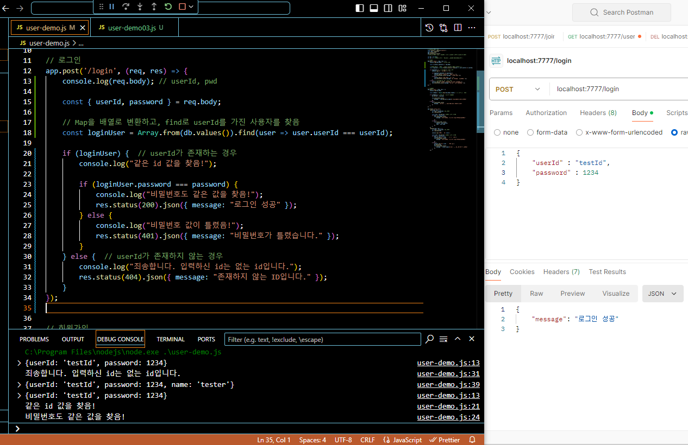

## 프로그래머스 풀스택 18
백엔드 기초: Node.js + Express 기본(9)

### 🌊 로그인 기본 로직

**💫 로그인**<br>

- 로그인을 get을 쓰면 개인정보 노출이 되기때문에 post로!!<br>

```javascript
app.post('/login', (req, res) => {
    console.log(req.body) //userId, pwd

    // userId가 db에 저장된 회원인지 확인해야함!
    const {userId} = req.body
    db.forEach( (a, b, c) => {
        console.log(`a: ${a}, b: ${b}, c: ${c}`)
    })
    // pwd도 맞는지 비교
```
- a : value, b : key, c : Map<br>
- db.forEach( (a, b, c) -> db.forEach( (user, id)으로 변경(Map 당장안쓰므로)<br>

<br>

💫 \<실습><br>
<br><br/>

### 🌊 로그인 예외 처리

**💫 로그인 예외 처리**<br>

- 현재 userId 유무에 따른 예외 처리가 없기에 필요함!<br>
- function내의 매개 변수는 밖에서 사용하려면 밖에서 변수 정의를 하고 해야함!<br><br/>

### 🌊 자바스크립트 Object.keys()

**💫 빈 객체 확인하는 방법**<br>

1. **Object.keys()**<br>
- **obj.constructor === Object** : 데이터가 객체인지 확인하기 위해 constructor를 확인<br>
- **Object.keys(obj).length === 0** : Object.keys() 함수는 파라미터로 입력받은 객체의 key 목록을 배열로 리턴<br>
따라서 Object.keys()를 호출할 때 배열의 길이가 0이면 빈 객체임<br>

2. **for in 반복문**<br>
- **for(let prop in obj)** : 객체의 모든 속성(property)을 순회하기 위해 for...in 구문을 사용<br>

3. **lodash library : isEmpty**<br>
- **isEmpty()** : object, collection, map, set이 비어있는지를 확인해주는 함수.<br>
간단하게 이 lodash의 isEmpty() 함수를 사용할 수 있음.<br>

💫 \<실습><br>
<br>
- 여기서 console.log(isEmpty(str1)), console.log(isEmpty(str2))가 undefined 출력이 된 이유는<br>
obj.constructor === Object 구문은 obj가 실제로 Object 타입인지 확인하는 조건이고<br>
String 객체는 Object의 하위 타입이 아니므로 undefined 출력이 된다.<br>

💫 \<isEmpty 수정><br>
```javascript
function isEmpty(obj) {
    if (typeof obj === "object" && obj.constructor === Object) {
        return Object.keys(obj).length === 0;
    } else if (typeof obj === "string") {
        return obj.length === 0;
    }
    return false;
}
```
- 따라서 문자열도 체크하려면 typeof를 사용해 타입을 확인하는 것도 고려할 것<br><br/>

### 🌊 로그인 고도화

💫 \<실습><br>
<br>
- 로그인 예외 처리와 잘 작동하는 걸 확인할 수 있음!<br>

<br>

💫 \<따로 고도화한 부분><br>
<br>
**간소화된 부분 설명:**<br>
1. Array.from(db.values()) : Map 객체의 values() 메소드를 사용하여 Map의 값들을 배열로 변환. 이 배열을 기반으로 find 메서드를 사용하여 userId가 일치하는 사용자를 검색.
이를 통해 forEach 대신 훨씬 간결하게 데이터를 검색가능.<br>

1. loginUser 검증: isExist 함수를 제거하고, loginUser가 존재하는지 바로 확인하여 코드 흐름을 간단하게 만듦.<br>

2. **응답 처리** : res.status().json()을 사용하여 로그인 성공 및 실패에 대한 메시지를 바로 처리.<br><br/>

### 🌊 채널 API 설계 1탄(URL, HTTP Method/Status, req, res)

**채널**<br>
- 채널 생성<br>
- 채널 수정<br>
- 채널 삭제<br><br/>

**채널**<br>
1. 채널 "생성" : POST /channels<br>
get과 post의 가장 큰 차이 : body의 유무!!(body 있으면 post!!)
    - req : body(channelTitle)<br>
    - **res 201 : \`${channelTitle}님 채널 생성을 축하드립니다!`** 👉 다른 페이지 띄워주고 싶음.. ex 채널 관리 페이지<br>

2. 채널 "수정" : PUT /channels/:id<br>
    - req : URL(id), body(channelTitle)<br>
    - **res 200 : \`채널명이 성공적으로 수정되었습니다! 기존 : ${channelTitle} -> 수정 : ${channelTitle}`**<br>

3. 채널 개별 "삭제" : DELETE /channels/:id<br>
    - req : URL(id)<br>
    - **res 200 : \`${channelTitle}이 정상적으로 삭제되었습니다. 아쉽지만 다음에 뵙겠습니다!`** 👉 메인 페이지<br>

4. 채널 전체 "조회" : GET /channels<br>
    - req : X<br>
    - **res 200 : 채널 전체 데이터 list, json array**<br>

5. 채널 개별 "조회" : GET /channels/:id<br>
    - req : URL(id)<br>
    - **res 200 : 채널 개별 데이터**<br><br/>

### 🌊 채널 API 설계 2탄

**채널**<br>

1. 채널 생성<br>
채널 생성 페이지 : 채널 생성 버튼 클릭 시 => 입력 받은 채널명을 받아서, <span style="color:lightseagreen">채널 생성(등록)API</span><br>

2. 채널 관리<br>
채널 관리 페이지 (1) 화면 출력 => 이 회원이 소유한 <span style="color:lightseagreen">전체 채널 조회 API</span> (2) 삭제 버튼 클릭 시 => <span style="color:lightseagreen">개별 채널 삭제 API</span><br>

3. 채널 수정<br>
채널 수정 페이지 (1) 기존 <span style="color:lightseagreen">개별 채널 정보 조회 API </span> (2) 수정 완료 버튼 클릭 시 => <span style="color:lightseagreen">개별 채널 수정 API</span><br><br/>

### 🌊 채널 API 코드 틀 route

```javascript
const express = require('express')
const app = express()
app.listen(7777)
app.use(express.json()) 

let db = new Map()
var id = 1

app
    .route('/channels')
    .get((req, res) => {
        res.send("전체 조회")
    }) // 채널 전체 조회
    .post((req, res) => {
        res.send("개별 생성")
    })// 채널 개별 생성

app
    .route('/channels/:id')
    .get((req, res) => {
        res.send("개별 조회")
    }) //채널 개별 조회
    .put((req, res) => {
        res.send("개별 수정")
    }) //채널 개별 수정
    .delete((req, res) => {
        res.send("개별 삭제")
    }); //채널 개별 삭제
```
<br>
- route로 묶어 잘 동작하는 걸 확인할 수 있음!<br><br/>

### 🌊 채널 생성, 채널 개별 조회

💫 \<채널 생성 실습><br>
<br>

<br>

💫 \<채널 개별 조회 실습><br>
<br><br/>

### 🌊 채널 개별 삭제, 개별 수정

💫 \<채널 개별 삭제 실습><br>
<br>

<br>

💫 \<채널 개별 수정 실습><br>
<br><br/>

### 🌊 채널 전체 조회

- 그냥 value만 넘겨주면 프론트엔드에서 알아서 값을 가져감<br>
- console.log(channels[0])부터 시작해서 인덱스로 잘 출력되는 걸 확인가능<br>


💫 \<채널 전체 조회 실습><br>
<br>

### 🌊 느낀 점(YWT)

**Y 일을 통해 명확히 알게 되었거나 이해한 부분(한 일)에 대해 정리 :**<br>
빈 객체 확인법: Object.keys(), for in 반복문, lodash library : isEmpty<br>
Array.from(db.values())<br>

**W 배운 점과 시사점 :**<br>

**💫 빈 객체 확인하는 방법**<br>

1. **Object.keys()**<br>
- **obj.constructor === Object** : 데이터가 객체인지 확인하기 위해 constructor를 확인<br>
- **Object.keys(obj).length === 0** : Object.keys() 함수는 파라미터로 입력받은 객체의 key 목록을 배열로 리턴<br>
따라서 Object.keys()를 호출할 때 배열의 길이가 0이면 빈 객체임<br>

2. **for in 반복문**<br>
- **for(let prop in obj)** : 객체의 모든 속성(property)을 순회하기 위해 for...in 구문을 사용<br>

3. **lodash library : isEmpty**<br>
- **isEmpty()** : object, collection, map, set이 비어있는지를 확인해주는 함수. 문자열도 체크하려면 typeof를 사용<br>

💫 Array.from(db.values()) : Map 객체의 values() 메소드를 사용하여 Map의 값들을 배열로 변환. 이 배열을 기반으로 find 메서드를 사용하여 userId가 일치하는 사용자를 검색.
이를 통해 forEach 대신 훨씬 간결하게 데이터를 검색가능.<br>

  
**T 응용하여 배운 것을 어디에 어떻게 적용할지:**<br>
오늘 배운 빈 객체 확인하는 방법과 Array.from(db.values()을 이용해 코드를 좀 더 간결하게 짤 수 있도록 노력할 것이다!<br>


