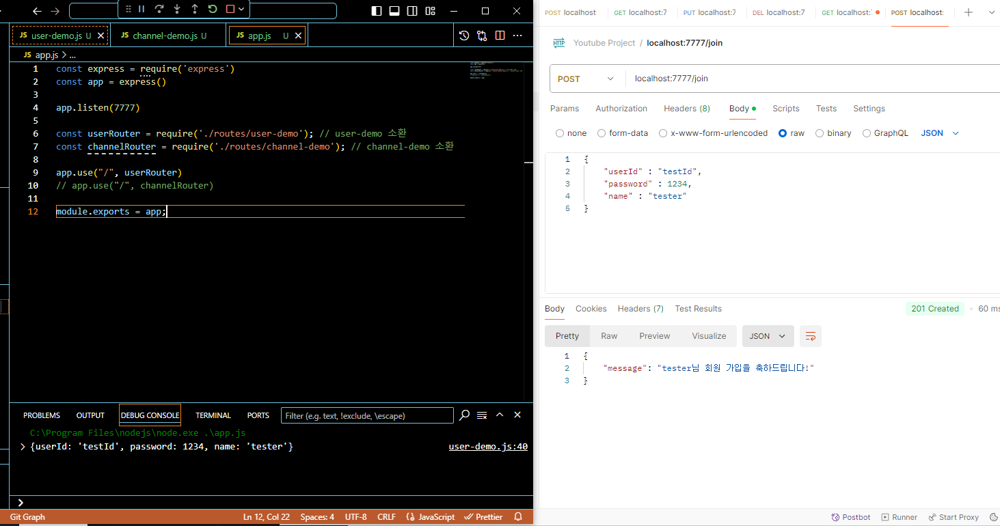
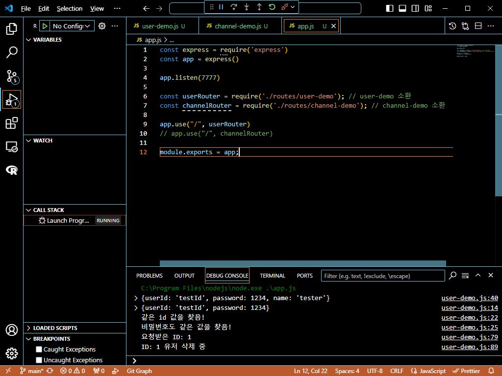
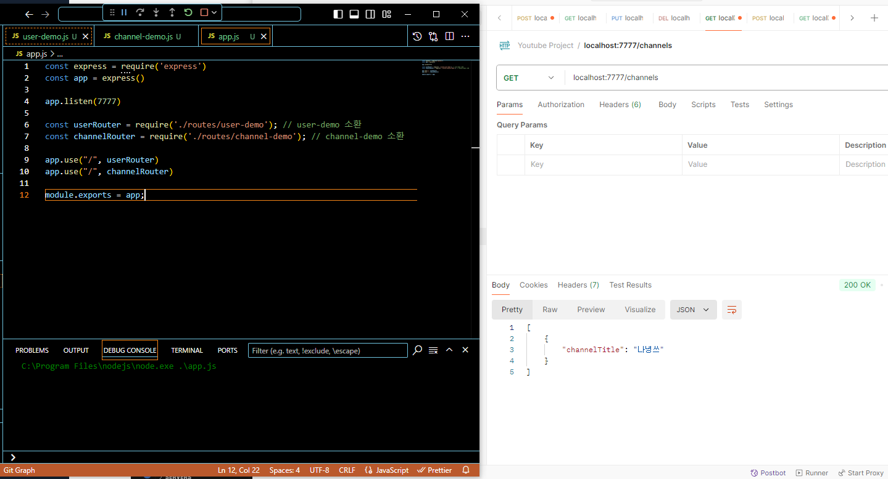
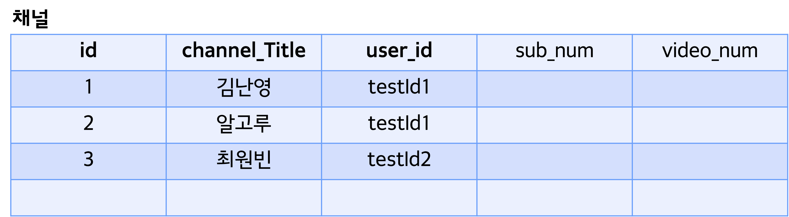
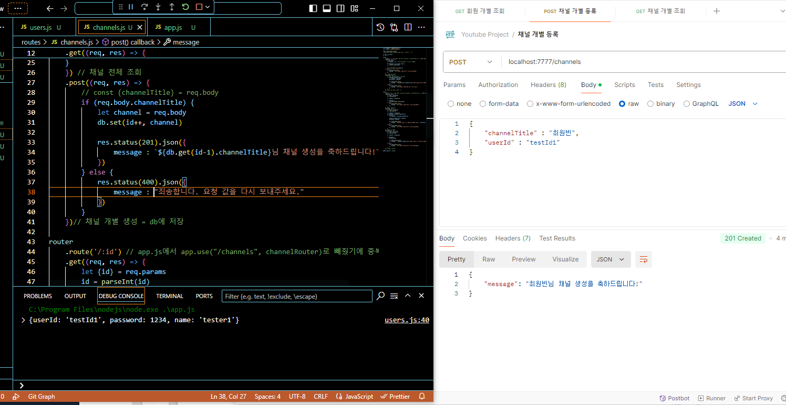
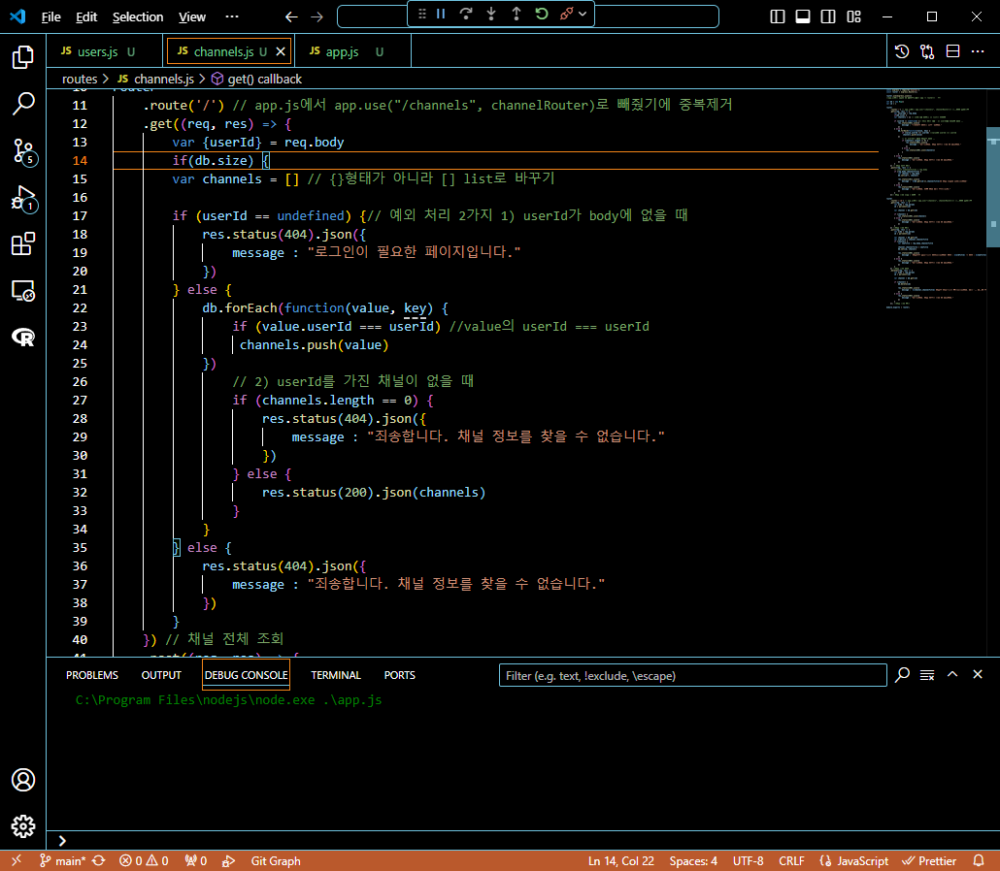
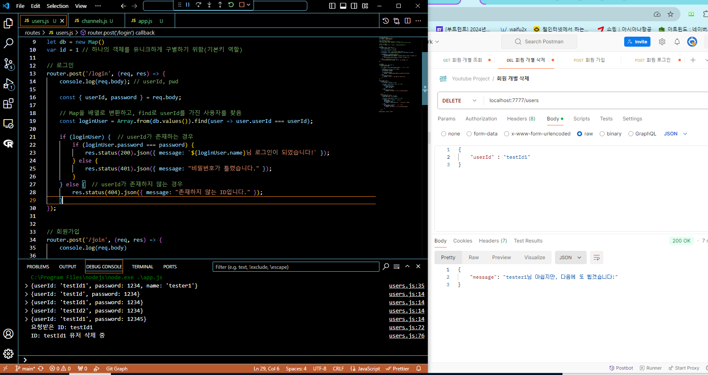

# 프로그래머스 풀스택 19
백엔드 기초: Node.js + Express 기본(10)

## 🌊 router

**💫 Server와 Router의 역할**<br>
- Server : Request를 받음<br>
- Router : Request의 URL에 따라 루트(route)를 정해줌 => 어디로 갈지 길을 정해줌!<br>
- .route로 분류하는 건 express만의 장점!<br>

<br>

**💫"Node.js에서의" 라우팅이란?**<br>

- Request(요청)가 날아왔을 때, 원하는 경로에 따라 적절한 방향으로 경로를 안내해주는 것<br>
- URL, Method => 호출 "콜백 함수"<br>

<br>

**💫 user-demo 연결 실습!**<br>
```javascript
router.use(express.json()) 
```
- app.js에서 app을 다 가져갔으므로 app -> router로 대체!<br>
- use: http 외 모듈 'json'. body에서 꺼내서 json처럼 쓸거야!(미들웨어 설정)<br>
<br>

<br>
<br>
- 잘 작동하는 걸 확인!<br><br/>

## rename, channel-demo 연결, 모듈 이름 변경, use URL 설명

**💫 Refactoring**<br>
- 리팩토링 자체는 Ctrl + Shift + R!<br>
- 한번에 이름을 바꾸려면 블록을 잡은 뒤 **Rename symbol(F2번)** 해주면 됨!<br>

<br>

**💫 channel-demo 연결 실습!**<br>
<br>

<br>

**💫 모듈 이름 변경**<br>

- user-demo -> users<br>
- channel-demo -> channels<br>

<br>

**💫 use URL 설명**<br>

💫 \<app.js파일><br>
```javascript
app.use("/", userRouter)
app.use("/channels", channelRouter) 
```
<br>

💫 \<channels.js 파일><br>
```javascript
router
    .route('/') 
//...생략
router
    .route('/:id')
```
- app.js에서 app.use("/channels", channelRouter)로 빼줬기에 channels.js에서 route 중복제거<br><br/>

## 🌊 회원마다 채널 가지게 ERD 그려보기

**💫 회원마다 채널 가지게 ERD 그려보기**<br>

<br>
<br>

채널<br>
- 어떤 회원이 만든 채널인지 체크할 수 있으면 좋겠음!<br>
- 채널 하나의 row를 가지고 어떤 회원이 가지고 있는지 뿐만 아니라 id를 찾아가며 이름, 비밀번호까지 확인 가능<br>
- 채널 -> 회원에 대한 정보에 접근 가능<br><br/>

## 🌊 채널 API 설계 수정, 채널 생성 테스트


**💫 채널 API 설계 수정**<br>

**채널**<br>
1. 채널 "생성" : POST /channels<br>
get과 post의 가장 큰 차이 : body의 유무!!(body 있으면 post!!)
    - req : body(channelTitle, <span style="color:lightseagreen">**userId**</span>) *cf. userId는 body X header 숨겨서 Token*<br>
    - **res 201 : \`${channelTitle}님 채널 생성을 축하드립니다!`** 👉 다른 페이지 띄워주고 싶음.. ex 채널 관리 페이지<br>

2. 채널 "수정" : PUT /channels/:id<br>
    - req : URL(id), body(channelTitle)<br>
    - **res 200 : \`채널명이 성공적으로 수정되었습니다! 기존 : ${channelTitle} -> 수정 : ${channelTitle}`**<br>

3. 채널 개별 "삭제" : DELETE /channels/:id<br>
    - req : URL(id)<br>
    - **res 200 : \`${channelTitle}이 정상적으로 삭제되었습니다. 아쉽지만 다음에 뵙겠습니다!`** 👉 메인 페이지<br>

4. 회원의 채널 전체 "조회" : GET /channels<br>
    - req : <span style="color:lightseagreen">**body(userId)**</span><br>
    - **res 200 : 채널 전체 데이터 list, json array**<br>

5. 채널 개별 "조회" : GET /channels/:id<br>
    - req : URL(id)<br>
    - **res 200 : 채널 개별 데이터**<br><br/>

**💫 채널 생성 테스트**<br>
```javascript
    .post((req, res) => {
        // const {channelTitle} = req.body
        if (req.body.channelTitle) {
            let channel = req.body
            db.set(id++, channel)
            
            res.status(201).json({
                message : `${db.get(id-1).channelTitle}님 채널 생성을 축하드립니다!`
            })
        } else {
            res.status(400).json({
                message : "죄송합니다. 요청 값을 다시 보내주세요."
            })
        }
    })
```
<br>
- let channel = req.body, db.set(id++, channel)가 변경된 것!<br>
- 데이터베이스가 아니라서 testId가 있는지 아닌지 판단을 해야함!<br><br/>

## 🌊 회원 채널 조회, id없으면 예외 처리

**💫 회원 채널 조회**<br>

- forEach를 돌리는 동안 value 값이 id값이 맞는지 확인!<br>

**💫 id없으면 예외 처리**<br>

- 회원 채널 전체 조회시 body 값에 userId 값이 없으면 예외처리!(userId가 body에 없을 때)<br>
- body 값에 userId 값이 채널이 생성된 값이 아닐 때도 예외처리!(userId를 가진 채널이 없을 때)<br>

<br>
```javascript
if (userId == undefined) {// 예외 처리 2가지 1) userId가 body에 없을 때
    res.status(404).json({
         message : "로그인이 필요한 페이지입니다."
    })
```
- 고도화가 필요한 모습!(if문 중첩이 너무 많이됨)<br><br/>

## 🌊 id없으면 예외 처리 if문 고도화

**💫 if문 중첩 해결법**<br>

- 논리 연산자로 묶기<br>
- includes() 함수로 조건을 배열에 넣어 처리하기<br>
- **비구조화 고려!(제일 추천)**<br>

```javascript
    .get((req, res) => {
        var {userId} = req.body
        var channels = [] // {}형태가 아니라 [] list로 바꾸기
        if(db.size && userId) { // 예외 처리 2가지 1) userId가 body에 없을 때
                db.forEach(function(value, key) {
                    if (value.userId === userId) //value의 userId === userId
                        channels.push(value)
                })
                    // 2) userId를 가진 채널이 없을 때
                if (channels.length) {
                    res.status(200).json(channels)
                } else {
                    notFoundChannel()
                }
            } else {
                notFoundChannel()
        }
    }) // 채널 전체 조회
    //...생략
    function notFoundChannel() {
    res.status(404).json({
        message : "죄송합니다. 채널 정보를 찾을 수 없습니다."
    })
} 
```
- if문 고도화 한 모습!<br><br/>

## 🌊 백엔드 기초 마무리

**회원**<br>
1. 로그인 : POST /login<br>
get과 post의 가장 큰 차이 : body의 유무!!(body 있으면 post!!)
    - req : body(id, pwd)<br>
    - **res : \`${name}님 환영합니다!`** //👉 메인 페이지 출력<br>

2. 회원 가입 : POST /join<br>
    - req : body(id, pwd, name)<br>
    - **res : \`${name}님 회원 가입을 축하드립니다!`** //👉 로그인 페이지<br>

3. 회원 개별 "조회" : GET /users/:id<br>
    - req : <span style="color:lightseagreen">**body(userId)**</span><br>
    - res : userId, name<br>

4. 회원 개별 탈퇴 : DELETE /users/:id<br>
    - req : <span style="color:lightseagreen">**body(userId)**</span><br>
    - **res : \`${name}님 아쉽지만, 다음에 또 뵙겠습니다!`** or 메인 페이지 출력<br>

<br>

💫 \<실습><br>
<br>
- users.js를 고도화하여 실행한 모습!<br><br/>

## 🌊 느낀 점(YWT)

**Y 일을 통해 명확히 알게 되었거나 이해한 부분(한 일)에 대해 정리 :**<br>
.route로 분류하는 건 express만의 장점!, Node.js에서의 라우팅이란?<br>

**W 배운 점과 시사점 :**<br>

**💫 Server와 Router의 역할**<br>
- Server : Request를 받음<br>
- Router : Request의 URL에 따라 루트(route)를 정해줌 => 어디로 갈지 길을 정해줌!<br>
- .route로 분류하는 건 express만의 장점!<br>

**💫"Node.js에서의" 라우팅이란?**<br>

- Request(요청)가 날아왔을 때, 원하는 경로에 따라 적절한 방향으로 경로를 안내해주는 것<br>
- URL, Method => 호출 "콜백 함수"<br>
  
**T 응용하여 배운 것을 어디에 어떻게 적용할지:**<br>
백엔드 기초과정이 끝났는데 작은 프로젝트를 하나 진행해보는 게 쉽고 빠르게 복습할 수도 있고 능력을 발전시킬 수 있을 것이다!<br>


