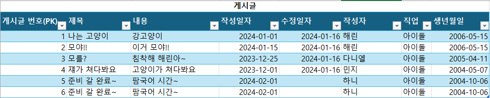
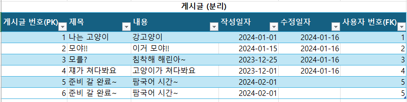
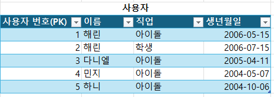
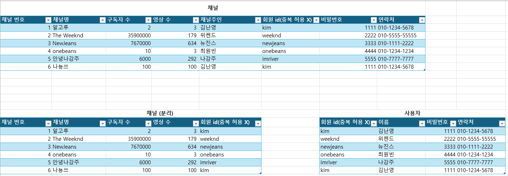
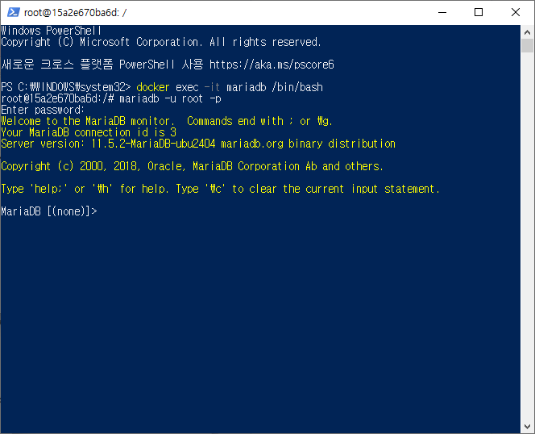

# 프로그래머스 풀스택 20
백엔드 심화: 인증과 비동기처리(1)

## 🌊 DBMS란?

💫 **데이터베이스란?**<br>

- 데이터 통합, 효율적으로 관리하기 위한 데이터 집합체 -> 데이터베이스(Database; DB)라고 함.<br>
- 데이터를 구조화하여 관리함으로써 데이터 중복을 막고, 효율적이고 빠른 데이터 연산 가능O<br>

<span style="color:lightseagreen">💫 **DBMS**</span><br>

- 데이터베이스를 운영, 관리하기 위한 DBMS(DataBase Management System)를 통해 데이터베이스를 사용함.<br>

<span style="color:lightseagreen">💫 **DBMS의 종류**</span><br>

- 운영 회사는 다름 / 데이터베이스에 연산을 요청하기 위한 주요 명령어는 동일함.<br>
- ex) RDBMS : Oracle Database(1위), MySQL(2위), MariaDB(12~13위)<br>
기본적으로 같은 SQL로 동작한다는 걸 잊지말 것!<br>
(MariaDB는 MySQL 기반)<br>
- ex) 키-밸류 저장소 : Redis<br>
- ex) 검색엔진 : Elasticsearch<br>
<br>

💫 SQL (Structured Query Language)<br>

- SQL은 데이터베이스에 연산을 요청하기 위해 사용되는 언어임<br>
- 데이터를 생성, 조회, 수정, 삭제 등과 같은 기능 수행<br>

대표적인 SQL<br>

- 데이터 삽입 : INSERT<br>
- 데이터 조회 : SELECT<br>
- 데이터 수정 : UPDATE<br>
- 데이터 삭제 : DELETE<br><br/>

## 🌊 RDBMS(Relational Database Management System)

**💫 DBMS와 RDBMS 공통점**<br>

1. **데이터 저장 및 관리** : DBMS와 RDBMS 모두 데이터를 저장하고 관리하는 역할을 수행.<br>
데이터를 체계적으로 관리하고, 삽입, 수정, 삭제, 검색 등 다양한 작업을 지원.<br>

2. **데이터 무결성** : 데이터의 일관성을 유지, 데이터 손실을 방지하는 무결성 제약 조건 설정 가능<br>

3. **동시성 제어** : 여러 사용자가 동시에 데이터를 접근하거나 수정할 때 충돌이나 불일치가 발생하지 않도록 동시성 제어를 제공.<br>

4. **데이터 백업 및 복구** : 시스템 장애나 문제 발생 시 데이터를 복구할 수 있도록 백업과 복구 기능을 제공.<br>
<br>

<span style="color:lightseagreen">**💫 DBMS와 RDBMS 차이점**</span><br>

| 항목        | DBMS                                                | RDBMS                                                         |
| ----------- | --------------------------------------------------- | ------------------------------------------------------------- |
| 데이터 모델 | 계층형, 네트워크형, 객체 지향형 등 다양한 모델 사용 | 테이블 형식의 관계형 데이터 모델을 사용                       |
| 데이터 관계 | 데이터 간 명확한 관계를 정의하지 않음               | 테이블 간의 명확한 관계(기본키와 외래키)를 통해 데이터를 연결 |
| ACID 속성   | 모든 DBMS가 ACID 속성을 보장하지 않음               | ACID(원자성, 일관성, 고립성, 지속성) 속성을 보장              |
| SQL 사용    | SQL을 사용하지 않을 수 있음                         | SQL(구조화된 쿼리 언어)을 사용하여 데이터 관리                |
| 확장성      | 소규모 데이터에 적합                                | 대규모 데이터 처리에 적합, 수평적 확장성 우수                 |
| 예시        | 파일 시스템, XML 데이터베이스 등                    | MySQL, PostgreSQL, MariaDB, Oracle 등                         |

<br>

<span style="color:lightseagreen">**💫 RDBMS 쓰는 이유**</span><br>

- 관계 지향적!(데이터 간에 "**관계**"가 있음!)<br>

- <span style="color:lightseagreen">**DBMS**</span>는 데이터베이스를 관리하는 일반적인 시스템으로, 모든 데이터베이스 시스템을 포함.<br>

- <span style="color:lightseagreen">**RDBMS**</span>는 관계형 데이터베이스 시스템으로, 테이블 간의 관계를 정의하고 SQL을 사용하여 데이터를 관리하는 방식.<br>

- 따라서 RDBMS는 DBMS의 하위 개념으로, 보다 구조화된 데이터 관리와 관계형 모델을 사용하는 것이 가장 큰 차이점!<br>

- 데이터의 무결성과 일관성을 유지하면서도, **관계형 모델**을 통해 데이터 간의 복잡한 관계를 쉽게 처리하고, 대규모 데이터를 효율적으로 관리할 수 있기 때문<br>

- 또한, SQL을 통해 복잡한 데이터 조회와 조작이 가능하며, ACID 속성을 지원하여 안전한 데이터 처리를 보장<br><br/>

## 🌊 PK, 데이터 중복, 정규화

<span style="color:lightseagreen">💫 **Primary Key**</span><br>
- Primary Key : PK(기본키)<br>
- 👉 해당 테이블의 각 row(행)을 유니크(=유일)하게 구별할 수 있는 key 값<br>

<br>
- 테이블의 값이 중복되어 불편함!<br>
- 따라서 테이블을 쪼개서 중복을 없앰(**정규화**!!!)<br>
- <span style="color:lightseagreen">**정규화 = 테이블을 쪼갠다!!(장점/단점)**</span><br><br/>

## 🌊 테이블 분리, 장-단점

<span style="color:lightseagreen">💫 **Foreign Key**</span><br>
- A 테이블에서 B 테이블의 데이터를 찾아가고 싶을 때, 사용하는 key 값<br>
- **👉 최대한 B 테이블의 PK 값을 A 테이블의 FK로 사용하는 게 이상적!!!**<br>
<br>

<br>
<br>
- 장점 : 사용자를 분리해서 중복이 최소화!<br>
- 단점 : 데이터를 한 번에 찾기가 어려움!<br><br/>

## 🌊 연관 관계, 관계의 주인

<span style="color:lightseagreen">💫 **연관 관계**</span><br>

✔ 데이터베이스 "테이블 간 어떤 관계를 가지고 있는지" 연관관계는 1:1, 1:N, M:N<br>

**게시글 VS 사용자**<br>
1) <mark>사용자 1명 : 게시글 여러 개 / <span style="color:lightseagreen">1:N</span></mark><br>
2) 게시글 1개 : 사용자 1명 / 1:1 ✨이유가 있다면 2번도 정답가능✨<br>

<br>

**게시글 - 사용자 테이블 분리**<br>
- 게시글 테이블을 보고 사용자 데이터를 확인 : 연관 관계 확인 가능<br>
👉 게시글 테이블을 보고 사용자랑 어떤 관계인지 확인하기!<br>
- ~~사용자 테이블을 보고 게시글 데이터를 확인 X~~<br>

<br>

🌟 현업에 계신 분들은 "**DBA**"분들을 통해 연관관계를 파악!<br>

- **설계를 하고 구현했을 때 SQL이 꼬일 때, 너무 많은 SQL이 필요할 때, SQL이 긴데..?!**<br>
👉 **설계를 뜯어 고칠 것!!!**<br>

<br>

<span style="color:lightseagreen">💫 **연관 관계의 주인**</span><br>

**Foreign Key**<br>
- A 테이블에서 B 테이블의 데이터를 찾아가고 싶을 때, 사용하는 key 값<br>
- **👉 최대한 B 테이블의 PK 값을 A 테이블의 FK로 사용하는 게 이상적!!!**<br>
- <span style="color:lightseagreen">**연관 관계의 주인이 될 수 있음!**</span><br><br/>

## 🌊 유튜브 실습

<span style="color:lightseagreen">💫 **유튜브 실습**</span><br>
<br>

**채널 VS 사용자**<br>
1) 사용자 1명 : 채널 n개 / <span style="color:lightseagreen">**1:N**</span><br>
2) 채널 1개 : 사용자 1명 / 1:1<br>

<br>

**채널 - 사용자 테이블 분리**<br>

- 채널 테이블에서는 사용자 데이터를 찾아갈 수 있음!<br>
- 사용자 테이블에서는 채널 데이터를 찾아갈 수 없음!<br><br/>

## 🌊 mariaDB 접속 방법 / MySQL workbench

<span style="color:lightseagreen">💫 **mariaDB 접속 방법**</span><br>

<br>

1. docker를 켜줌<br>

2. powershell 관리자 권한으로 실행 후 명령어 입력!<br>
    ```bash
    docker exec -it mariadb /bin/bash
    ```
3. mariadb 실행 :<br>
    ```bash
    mariadb -u root -p
    ```
4. 비밀번호 root 입력하면 mariadb 성공적으로 접속완료!<br>

<br>

<span style="color:lightseagreen">💫 **MySQL workbench**</span><br>

- MySQL Workbench는 MySQL 데이터베이스를 관리하고 설계하기 위한 **통합 개발 환경(IDE)**<br>
- GUI를 통해 MySQL 데이터베이스 서버와 상호작용<br><br/>

## 🌊 느낀 점(YWT)

**Y 일을 통해 명확히 알게 되었거나 이해한 부분(한 일)에 대해 정리 :**<br>
DBMS 복습, RDBMS 공통점과 차이점, RDBMS 쓰는 이유, 데이터베이스 연관 관계<br>

**W 배운 점과 시사점 :**<br>

<span style="color:lightseagreen">**💫 DBMS와 RDBMS 차이점**</span><br>

| 항목        | DBMS                                                | RDBMS                                                         |
| ----------- | --------------------------------------------------- | ------------------------------------------------------------- |
| 데이터 모델 | 계층형, 네트워크형, 객체 지향형 등 다양한 모델 사용 | 테이블 형식의 관계형 데이터 모델을 사용                       |
| 데이터 관계 | 데이터 간 명확한 관계를 정의하지 않음               | 테이블 간의 명확한 관계(기본키와 외래키)를 통해 데이터를 연결 |
| ACID 속성   | 모든 DBMS가 ACID 속성을 보장하지 않음               | ACID(원자성, 일관성, 고립성, 지속성) 속성을 보장              |
| SQL 사용    | SQL을 사용하지 않을 수 있음                         | SQL(구조화된 쿼리 언어)을 사용하여 데이터 관리                |
| 확장성      | 소규모 데이터에 적합                                | 대규모 데이터 처리에 적합, 수평적 확장성 우수                 |
| 예시        | 파일 시스템, XML 데이터베이스 등                    | MySQL, PostgreSQL, MariaDB, Oracle 등                         |

<br>

<span style="color:lightseagreen">**💫 RDBMS 쓰는 이유**</span><br>

- 데이터의 무결성과 일관성을 유지하면서도, **관계형 모델**을 통해 데이터 간의 복잡한 관계를 쉽게 처리하고, 대규모 데이터를 효율적으로 관리할 수 있기 때문<br>

- 또한, SQL을 통해 복잡한 데이터 조회와 조작이 가능하며, ACID 속성을 지원하여 안전한 데이터 처리를 보장<br>

<br>

💫 연관관계는 1:1, 1:N, M:N<br>

**Foreign Key**<br>
- A 테이블에서 B 테이블의 데이터를 찾아가고 싶을 때, 사용하는 key 값<br>
- **👉 최대한 B 테이블의 PK 값을 A 테이블의 FK로 사용하는 게 이상적!!!**<br>
- **연관 관계의 주인이 될 수 있음!**<br>
  
**T 응용하여 배운 것을 어디에 어떻게 적용할지:**<br>
데이터베이스와 백엔드를 연결하여 프로젝트 구현할 것!<br>


