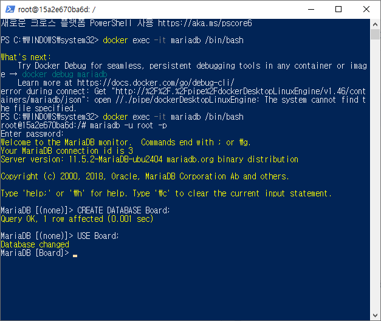
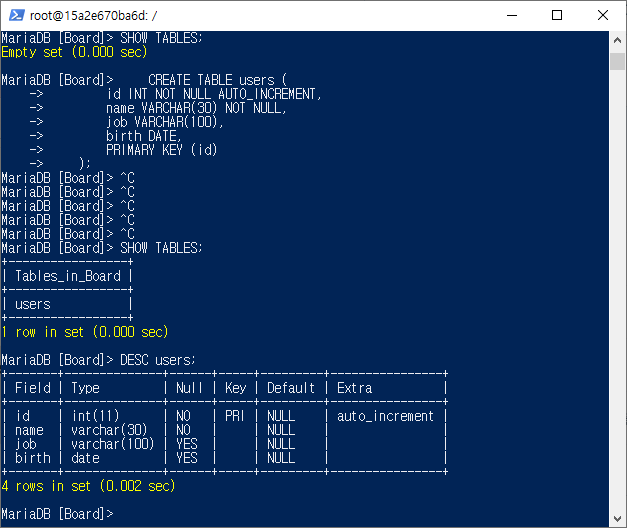
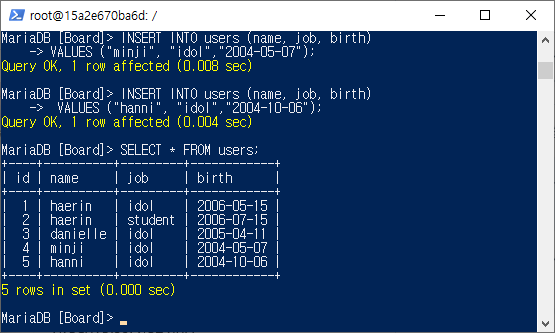
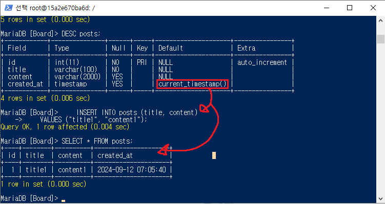
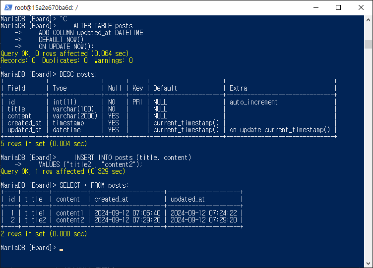
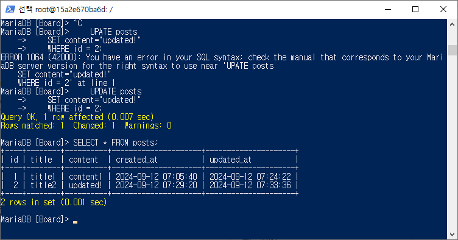
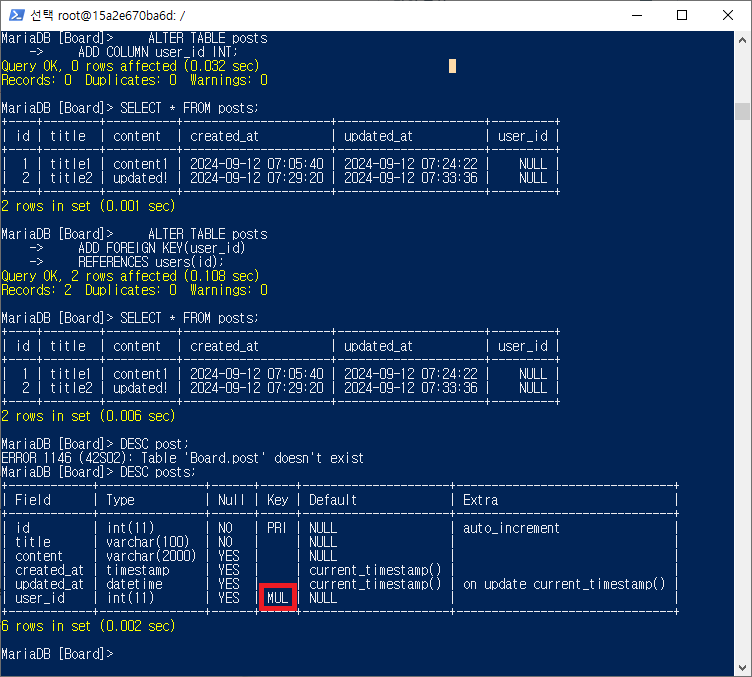
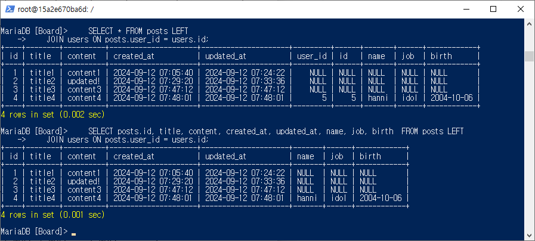
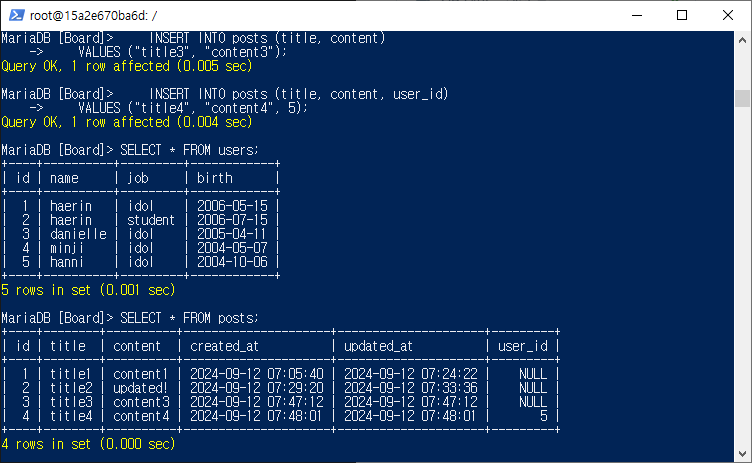

## 프로그래머스 풀스택 21
백엔드 심화: 인증과 비동기처리(2)

### 🌊DB 테이블 생성 실습

<span style="color:lightseagreen">💫 **SQL은 외우는 게 아님!**</span><br>

1. **"Board"스키마 생성**<br>
```SQL
CREATE DATABASE Board;
USE Board;
```
<br>

<br>

2. **사용자 테이블 생성**<br>
- 테이블 이름은 기본적으로 복수형 추천(테이블 안에 여러 개가 들어가므로)!<br>
- AUTO_INCREMENT : 자동 숫자 증가(기입 기능)<br>
```SQL
CREATE TABLE users (
    id INT NOT NULL AUTO_INCREMENT,
    name VARCHAR(30) NOT NULL,
    job VARCHAR(100),
    birth DATE,
    PRIMARY KEY (id)
);
```
<br>

<br>

3. **사용자 데이터 삽입**<br>
- VALUES ("haerin", "idol","100101");을 해도 위의 2번에서 birth DATE덕분에 자동으로 적혀짐! 그래도 입력할 때 맞춰서 입력해주는 게 좋음!<br>
- NOT NULL -> 무조건 값을 넣기!(이름이 null이여도 X)<br>
```SQL
INSERT INTO users (name, job, birth)
VALUES ("haerin", "idol","20060515");

INSERT INTO users (name, job, birth)
VALUES ("haerin", "student","2006-07-15");

INSERT INTO users (name, job, birth)
VALUES ("danielle", "idol","2005-04-11");

INSERT INTO users (name, job, birth)
VALUES ("minji", "idol","2004-05-07");

INSERT INTO users (name, job, birth)
VALUES ("hanni", "idol","2004-10-06");
```
<br>

<br>

4. **게시글 테이블 생성**<br>
- 작성 일자 : created_at(보편적으로 사용)<br>
- 수정 일자 : updated_at(보편적으로 사용)<br>
```SQL
CREATE TABLE posts (
    id INT NOT NULL AUTO_INCREMENT,
    title VARCHAR(100) NOT NULL,
    content VARCHAR(2000),
    created_at TIMESTAMP DEFAULT NOW(),
    PRIMARY KEY (id)
    );
```
<br>

<br>

5. **게시글 데이터 삽입**<br>
- TIMESTAMP DEFAULT NOW()을 통해 created_at 값을 적지 않아도 자동입력됨!<br>
```SQL
INSERT INTO posts (title, content)
VALUES ("title1", "content1");
```
<br>

<br>

6. **게시글 테이블에 수정일자 추가**<br>
- ALTER을 통해 수정일자를 추가하기<br>
```SQL
ALTER TABLE posts
ADD COLUMN updated_at DATETIME
DEFAULT NOW()
ON UPDATE NOW();
```
<br>

<br>

7. **게시글 테이블 id 2 수정**<br>
- UPDATE를 이용하여 update된 시간 갱신해보기<br>
```SQL
UPDATE posts
SET content="updated!"
WHERE id = 2;
```
<br>

<br>

8. **게시글 테이블에 작성자 컬럼 FK 추가**<br>
- MUL(MULTIPLE) : 기본키 값을 가져다 쓰고 있는 외래키지만 중복이 가능하므로 MUL!<br>
```SQL
ALTER TABLE posts
ADD COLUMN user_id INT;

ALTER TABLE posts
ADD FOREIGN KEY(user_id)
REFERENCES users(id);
```
<br>

<br>

9. <span style="color:lightseagreen">**✨조인(정규화)✨**</span><br>
- **SELECT 할 때만 보기 편하라고 해주는 것임!!(실제로 테이블을 생성하진 않음!!)**<br>
(가상의 테이블을 임시로 돌려주는 것)<br>
- 게시글의 사용자 번호와 사용자의 사용자 번호가 같으면 붙이는 조건<br>
```SQL
SELECT * FROM posts LEFT
JOIN users ON posts.user_id = users.id;

SELECT posts.id, title, content, created_at, updated_at, name, job, birth  FROM posts LEFT
JOIN users ON posts.user_id = users.id;
```
<br>

<br><br/>

### 사용자 테이블 insert하면서 제약조건 알아보기

[mariaDB insert 예시](https://mariadb.com/kb/en/insert/) <br>
들어가면 예시를 볼 수 있음!<br>
- VALUES ("haerin", "idol","100101");을 해도 테이블 생성 조건의 birth DATE덕분에 자동으로 적혀짐!<br>
그래도 입력할 때 맞춰서 입력해주는 게 좋음!<br>
- NOT NULL -> 무조건 값을 넣기!(이름이 null이여도 X)<br><br/>

### timestamp, 날짜-시간 타입, Not Null VS Default

<span style="color:lightseagreen">💫 **timestamp**</span><br>

- TIMESTAMP DEFAULT NOW()을 통해 created_at 값을 적지 않아도 자동입력됨!<br>

<span style="color:lightseagreen">💫 **날짜-시간 타입**</span><br>

1. DATE<br>
    - 날짜만<br>
    - YYYY-MM-DD<bR>
2. DATETIME<br>
    - 날짜 + 시간<br>
    - YYYY-MM-DD HH:MM:SS (24시간제)<bR>
3. TIME<br>
    - 시간<br>
    - HH:MM:SS<br>
4. <span style="color:tomato">**TIMESTAMP : 자동 입력**</span>
    - **날짜 + 시간**<br>
    - **YYYY-MM-DD HH:MM:SS (24시간제)**<br>
    - 시스템 시간대 정보에 맞게 일시를 저장함!<br>

<br>

cf. UTC : 한국 시간 -9

<span style="color:lightseagreen">💫 **Not Null VS Default**</span><br>

Not Null<br>
- 직접 null이라고 작성해서 넣는 것도 안됨!!!<br>

**Default**<br>
- **공란**으로 insert => Default 설정 해둔 기본 값이 insert됨.<br>
- 직접 null이라고 작성해서 넣으면, null setting<br><br/>

### alter updated_at, user_id, FK 실습

<span style="color:lightseagreen">💫 **alter updated_at**</span><br>

[🌊DB 테이블 생성 실습 6~8번 실습 참고](###-db-테이블-생성-실습)<br>
<br>

<span style="color:lightseagreen">💫 **user_id**</span><br>
- 나같은 경우 users에 이미 5개가 들어가 있어서 오류가 안났지만<br>
5개가 들어가 있는데 6이상을 적으면 오류가 남!<br>
```SQL
INSERT INTO posts (title, content, user_id)
VALUES ("title4", "content4", 5);
```

<br>

<span style="color:lightseagreen">💫 **FK 실습**</span><br>

<br><br/>

### 🌊 JOIN(정규화)

- 테이블을 분리했기에, 직접 확인할 때 불편한 점이 있음! 👉 이걸 JOIN으로 해결할 수 있음!<br>
- **SELECT 할 때만 보기 편하라고 해주는 것임!!(실제로 테이블을 생성하진 않음!!)**<br>
(가상의 테이블을 임시로 돌려주는 것)<br>
- **여러 테이블에 분산된 데이터를 결합하여 필요한 정보를 추출!!**<br>
- 주로 LEFT JOIN이 많이 쓰임.<br>

[🌊DB 테이블 생성 실습 9번 실습 참고](###-db-테이블-생성-실습)<br>

<br>

<span style="color:lightseagreen">**JOIN의 종류**</span><br>

1. **INNER JOIN** :<br>
- 두 테이블에서 공통된 값이 있는 행만 결합하여 반환<br>

```SQL
SELECT users.name, orders.order_date
FROM users
INNER JOIN orders ON users.id = orders.user_id;
 ```

<br>

2. **LEFT (OUTER) JOIN** :<br>
- 왼쪽 테이블의 모든 행과, 오른쪽 테이블에서 일치하는 행을 결합하여 반환.<br>
- 오른쪽 테이블에 일치하는 데이터가 없으면 NULL 값이 반환.<br>
```SQL
SELECT users.name, orders.order_date
FROM users
LEFT JOIN orders ON users.id = orders.user_id;
```

<br>

3. **RIGHT (OUTER) JOIN** :<br>
- 오른쪽 테이블의 모든 행과, 왼쪽 테이블에서 일치하는 행을 결합하여 반환.<br>
- 왼쪽 테이블에 일치하는 데이터가 없으면 NULL 값이 반환.<br>
```SQL
SELECT users.name, orders.order_date
FROM users
RIGHT JOIN orders ON users.id = orders.user_id;
 ```

<br>

4. **FULL (OUTER) JOIN** :<br>
- 두 테이블에서 **모든 행을 결합**함. 두 테이블에서 일치하지 않는 데이터도 포함되며, 일치하지 않는 경우에는 NULL 값이 반환.<br>
```SQL
SELECT users.name, orders.order_date
FROM users
FULL OUTER JOIN orders ON users.id = orders.user_id;
 ```

<br>

5. **CROSS JOIN** :<br>
- 두 테이블의 모든 가능한 조합을 반환. 조건이 없는 경우 사용.<br>
```SQL
SELECT users.name, orders.order_date
FROM users
CROSS JOIN orders;
```

<br><br/>

### 🌊 auto_increment_lock_mode

- insert할 때 오류가 나도 auto_increment_lock_mode이 되어있지 않다면 숫자는 자동으로 증가가 됨!!<br>
- 그러므로 오류가 나도 자동 증가를 막고싶다면 innodb_autoinc_lock_mode 값을 정해줘야함<br>
- 기본값이 1이나 2일 경우에는 오류가 발생하여도 id 값이 증가<br>
- 0으로 설정하여야 오류가 발생해도 id 값이 증가하지 않음<br>

<span style="color:lightseagreen">💫 **auto_increment_lock_mode 값**</span><br>

1. **0 (Traditional Locking)** : 전통적인 잠금 방식<br>
- insert의 결과를 예측하여 인덱스의 순서를 보장하기 위해 모든 구문마다 락을 걸어 검사.<br>
- 그렇기 때문에 검사에서 insert문이 실패하면 값을 증가시키지 않고, 검사에 이상이 없으면 값을 증가.<br>

2. **1 (Auto-Increment Interleaving - Consecutive Locking)** : 중간 수준의 잠금 방식<br>
- auto_increment의 기본값이며 구문마다 락이 걸리지만 할당 프로세스 단위로 락이 걸림<br>

3. **2 (No Table Locking - Non-Consecutive Auto-Increment)** : 테이블 잠금을 사용하지 않는 방식<br>

> 결론은 0은 인덱스의 순서를 보장해주지만 각 구문마다 검사를 진행하기 때문에 성능이 떨어지고 2는 성능이 보장되지만 인덱스의 순서를 보장함<br>

<span style="color:lightseagreen">💫 **수정 방법**</span><br>
    ```SQL
    SET global innodb_autoinc_lock_mode = 0;
    ```
- innodb_autoinc_lock_mode를 원하는 버전으로 수정 가능<br>
- **Variable 'innodb_autoinc_lock_mode' is a read only variable** 이라는 에러가 발생하면 /etc/mysql/mysql.conf.d/mysql.cnf 파일을 열어서 innodb_autoinc_lock_mode = 0 으로 직접 수정<br><br/>

### 🌊 느낀 점(YWT)

**Y 일을 통해 명확히 알게 되었거나 이해한 부분(한 일)에 대해 정리 :**<br>
timestamp / Not Null VS Default / JOIN(정규화) / auto_increment_lock_mode

**W 배운 점과 시사점 :**<br>
DB 테이블 생성, 삽입, 수정 실습을 진행했고 auto_increment을 쓸 때 잠그지 않으면, 오류가 나도 값이 증가한다는 걸 배웠음!<br>
JOIN(정규화)을 통해 여러 테이블에 분산된 데이터를 결합하여 필요한 정보를 추출할 수 있음!<br>

**T 응용하여 배운 것을 어디에 어떻게 적용할지:**<br>
CLI를 통해 DB 테이블 생성, 삽입, 수정을 잘할 수 있을 것이고 JOIN(정규화)을 통해 필요한 값을 잘 분류할 수 있을 것이다!<br>


