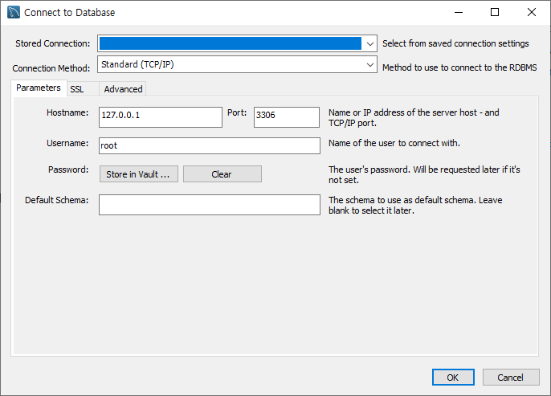
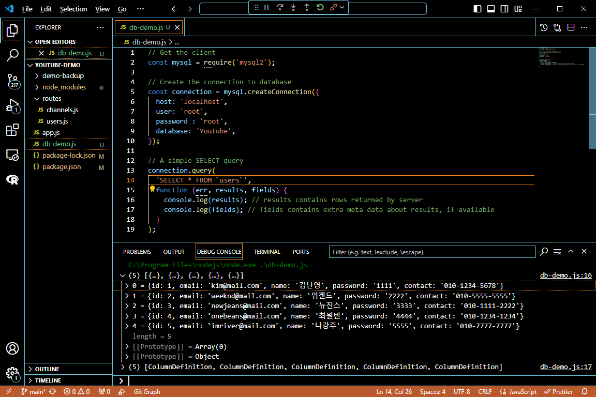
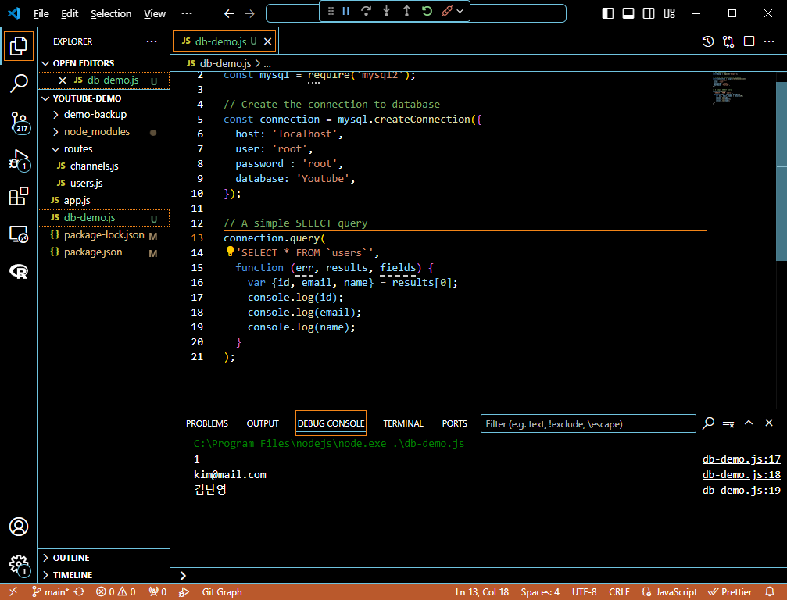
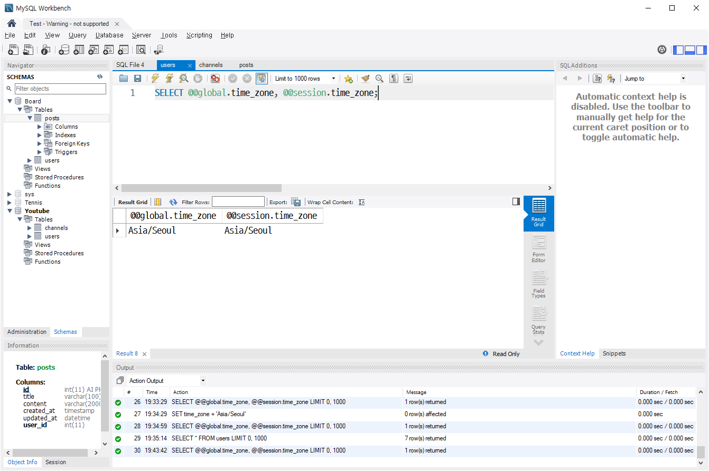

# 프로그래머스 풀스택 22
백엔드 심화: 인증과 비동기처리(3)

## 🌊 workbench 시작, select

<span style="color:lightseagreen">💫 **workbench 시작**</span><br>

<br>
- Hostname은 localhost나 127.0.0.1을 입력하면 됨!<br>

<br>

<br>
- 데이터베이스 연결 이름을 설정해주지않으면 튕길 수 있음!<br>
- 튕겼을 경우 workbench 재시작해서 이름 설정해주면 접속이 잘 됨!<br>
- 스키마 탭을 눌러서 확인하면 만들었던 테이블들을 확인할 수 있고, 정보확인 가능.<br>

<span style="color:lightseagreen">💫 **select**</span><br>

<br>
- 처음에 SELECT * FROM posts;을 하면 오류가 남! 이유: 데이터베이스가 선택되지않았기에!!<br>
- 따라서 왼쪽 스키마에서 필요한 데이터베이스를 더블클릭해주면 글씨가 굵어지며 그 데이터베이스가 활성화가 됨.<br>
- GUI라서 더블클릭으로 UPDATE 기능을 대신할 수 있음!<br><br/>

## 🌊 유튜브 users 테이블 생성

<span style="color:lightseagreen">💫 **MySQL Workbench 폰트 크기 변경방법**</span><br>

<br>
- Windows 기준 Edit-Prefrences로 들어간다.<br>

<br>
- 다음으로 Fonts & Colors 들어가서 폰트 이름 + 띄어쓰기 + 폰트 크기를 작성하고 OK를 눌러주면 끝!<br>

<br>

<span style="color:lightseagreen">💫 **유튜브 users 테이블 생성**</span><br>

<br>
- 스키마부터 작성하기!<br>

<br>
- 테이블 작성하기<br><br/>

## 🌊 MySQL Workbench 제약조건과 속성

1. **PK (Primary Key)** :<br>
    - **정의** : 테이블에서 각 행을 고유하게 식별하는 데 사용되는 열.<br>
    - **특징** : PK는 유일하며 NULL 값을 허용 X. 테이블당 하나만 정의 가능.<br>
2. **NN (Not Null)** :<br>
    - **정의** : 해당 열에 NULL 값을 저장할 수 없도록 설정.<br>
    - **특징** : 데이터 입력 시 반드시 값이 제공되어야 하며, NULL 값 저장 X.<br>
3. **UQ (Unique)** :<br>
    - **정의** : 열의 값이 테이블 내에서 유일해야 함을 보장.<br>
    - **특징** : 중복된 값이 허용되지 않으며, NULL 값은 여러 개 허용 가능(단, NULL 처리 방식에 따라 다를 수 있음).<br>
4. **B (Binary)** :<br>
    - **정의** : 데이터가 이진 형식으로 저장됨을 의미.<br>
    - **특징** : 문자열 데이터의 경우, 대소문자를 구분하지 않고 이진 비교.<br>
5. **UN (Unsigned)** :<br>
    - **정의** : 열이 음수 값을 가질 수 없도록 설정.<br>
    - **특징** : 일반적으로 정수형 열에 적용되며, 음수를 허용하지 않고 양수만 허용.<br>
6. **ZF (Zero Fill)** :<br>
    - **정의** : 열의 값이 지정된 길이보다 짧을 경우, 앞에 0을 추가하여 길이를 맞춤.<br>
    - **특징** : 숫자 값에만 적용되며, 숫자가 특정 길이에 맞추어 출력(예: 00123).<br>
7. **AI (Auto Increment)** :<br>
    - **정의** : 열의 값이 자동으로 증가하도록 설정.<br>
    - **특징** : 주로 기본 키 열에 사용되며, 각 새로운 행이 추가될 때 자동으로 증가하는 값을 제공.<br>
8. **G (Generated)** :<br>
    - **정의** : 자동으로 생성되는 열.<br>
    - **특징** : 값을 직접 입력할 수 없으며, 다른 열의 값에 기반하여 계산.<br>
    일반적으로 VIRTUAL 또는 STORED로 지정.<br><br/>

## 🌊 channels 테이블 생성, FK 오류

<span style="color:lightseagreen">💫 **channels 테이블 생성**</span><br>

\<테이블 생성 부분><br>
<br>


\<외래키 부분><br>
<br>
- 외래키 이름에 적는 부분은 외래키의 별칭같은 것!<br>
- 진짜 column은 오른쪽에서 연결하면 됨!<br>

\<적용시 나타나는 sql문><br>
```sql
CREATE TABLE `Youtube`.`channels` ( -- 테이블 생성
  `id` INT NOT NULL AUTO_INCREMENT, -- 열 정의 시작
  `name` VARCHAR(100) NOT NULL,
  `sub_num` INT NOT NULL DEFAULT 0,
  `video_count` INT NULL DEFAULT 0,
  `user_id` INT NULL, -- 열 정의 끝
  PRIMARY KEY (`id`), -- 기본 키 설정 / id 열을 기본 키로 설정하여 각 행을 고유하게 식별
  INDEX `user_id_idx` (`user_id` ASC) VISIBLE, -- 인덱스 생성
  CONSTRAINT `user_id` -- 외래키 제약조건 시작
    FOREIGN KEY (`user_id`)
    REFERENCES `Youtube`.`users` (`id`)
    ON DELETE NO ACTION
    ON UPDATE NO ACTION); - -- 외래키 제약조건 끝
```
- **인덱스 생성** : user_id 열에 대해 오름차순으로 인덱스를 생성. VISIBLE은 인덱스가 사용 가능한 상태임을 뜻함.<br>

- **외래키 제약조건** : <br>
    - user_id 열이 Youtube.users 테이블의 id 열을 참조하는 외래키임.<br>
    - **ON DELETE NO ACTION** : 참조된 행이 삭제될 때 아무 동작도 안함(무결성 위반 시 오류 발생).<br>
    - **ON UPDATE NO ACTION**: 참조된 행이 업데이트될 때 아무 동작도 안함(무결성 위반 시 오류 발생).<br>

<br>
- AUTO_INCREMENT을 사용시 값을 직접 적지 않을 것!<br>
- 값을 직접 적을 거면 직접 적는 걸로..<br>
- 잘못 입력시 영원히 한 칸이 비게 됨 ㅠㅠ<br>


<span style="color:lightseagreen">💫 **FK 오류**</span><br>

- 외래키는 연결된 테이블의 값을 불러오기때문에 틀린 값을 적으면 오류발생!!<br><br/>

## 🌊 DB 연동

```bash
npm install --save mysql2
```
- [mysql2 사용](https://www.npmjs.com/package/mysql2)<br>
터미널에 그대로 붙여넣기해주기!<br>

<br>

<br>

```javascript
// Get the client
const mysql = require('mysql2');
// Create the connection to database
const connection = mysql.createConnection({
  host: 'localhost',
  user: 'root',
  database: 'test',
});
// A simple SELECT query
connection.query(
  'SELECT * FROM `table` WHERE `name` = "Page" AND `age` > 45',
  function (err, results, fields) {
    console.log(results); // results contains rows returned by server
    console.log(fields); // fields contains extra meta data about results, if available
  }
);
```
- [First Query](https://sidorares.github.io/node-mysql2/docs#first-query)의 Callback을 복사해서 수정하기<br>
- 캡처된 부분을 보면 const connection 부분과 connection.query 부분 수정됨.<br><br/>

## 🌊 DB 결과 jason array 비구조화, users created_at 추가

<span style="color:lightseagreen">💫 **DB 결과 jason array 비구조화**</span><br>

<br>


<span style="color:lightseagreen">💫 **users created_at 추가**</span><br>

<br>
- TIMESTAMP()에서 ()를 지워야함!<br>
- 이유 : TIMESTAMP() 안에 들어가는 숫자는 밀리초를 나타내므로 TIMESTAMP라고만 적고, Default값에 NOW() 또는 CURRENT_TIMESTAMP() 입력해주면 현재 시간으로 작성됨.<br>

<br>

\<적용><br>
<br>
- 잘 출력 되는 모습!<br>

<br>
- DB와 연동된 모습<br><br/>

## 🌊 timezone 설정

<br>
- timezone : 'Asia/Seoul'을 설정했지만 오류발생.<br>

<br>

<br>
```sql
SET GLOBAL time_zone = 'Asia/Seoul'
```
- workbench로 돌아와 sql문을 입력.<br>
- 전역으로 시간대를 사용할 것이므로 GLOBAL을 넣어줌.<br>
<br>

<br>

<br>
```sql
SELECT @@global.time_zone, @@session.time_zone;
```
- 이 sql문으로 전체 시간대와 현재 세션의 시간대를 확인할 수 있음.<br>
```sql
SET time_zone = 'Asia/Seoul';
```
- 이 sql문을 사용해 현재 세션의 시간대도 맞춰줌<br>

<br>

<br>
- 다시 @@global.time_zone, @@session.time_zone;을 하면 둘 다 시간대가 맞춰진걸 확인가능함<br>

<br>
- 데이터베이스 내 시간 출력 결과 확인<br>

<br>

<br>
```sql
const connection = mysql.createConnection({
  host: 'localhost',
  user: 'root',
  password : 'root',
  database: 'Youtube',
  dateStrings : true
});
```
- 데이터베이스에는 저장되어 있는 TIME값은 날것의 값이고<br>
- dateStrings : true값을 추가해주면 출력이 형식에 맞춰져 깔끔해짐!<br><br/>

## 🌊 느낀 점(YWT)

**Y 일을 통해 명확히 알게 되었거나 이해한 부분(한 일)에 대해 정리 :**<br>
MySQL Workbench 제약조건과 속성 / DB연동 / timezone 설정<br>

**W 배운 점과 시사점 :**<br>
MySQL Workbench 제약조건과 속성을 통해 테이블을 만들 때 구분할 수 있게 됨<br>
timezone 설정을 자세하게 배워서 DB연동을 했을 때 시간대와 출력형식을 원하는대로 조절 가능함<br>

**T 응용하여 배운 것을 어디에 어떻게 적용할지:**<br>
DB연동을 했을 때 시간대와 출력형식을 원하는대로 조절 가능한 걸 배웠으므로<br>
게시글 작성 시간대가 필요할 때 잘 사용할 수 있을 것임<br>


