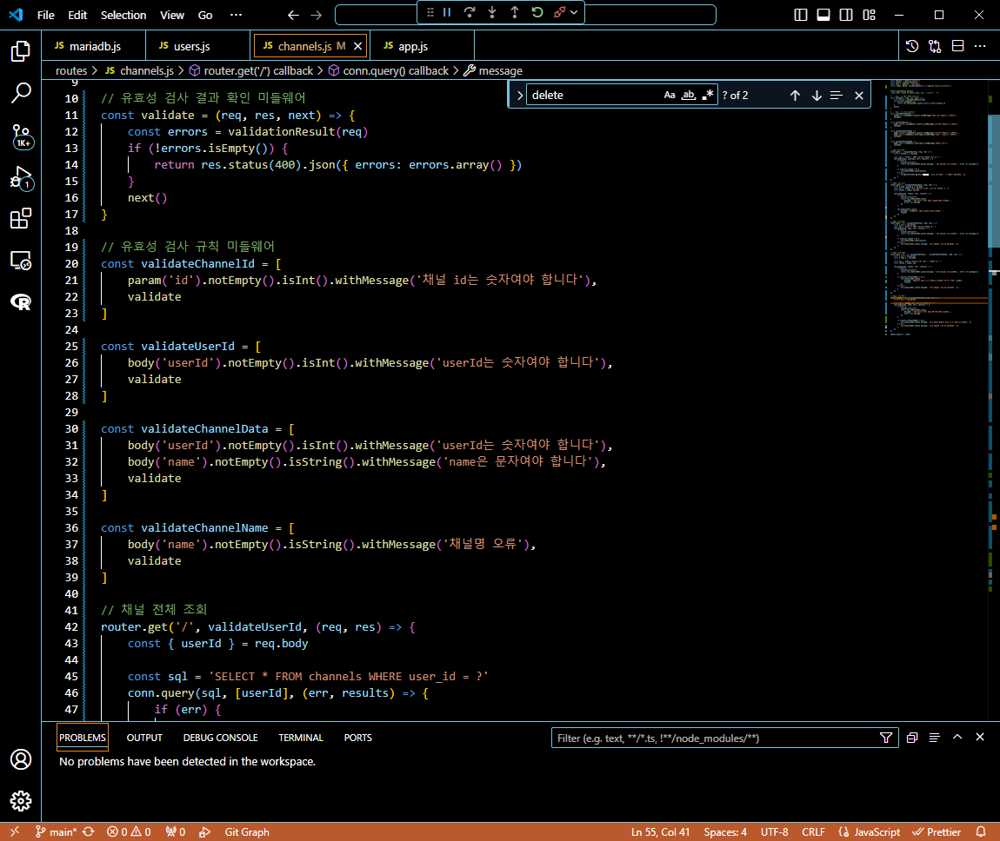

## 프로그래머스 풀스택 24
백엔드 심화: 인증과 비동기처리(5)

### 🌊 유효성 검사

**vaild ation**<br>
"사용자가 입력한 값" 유효성(=타당성)을 확인하는 것<br>

**userId** : 값이 있어야, 숫자<br>

**채널 name** : 값이 있어야, 문자<br>

**//사람 name** : 숫자 X, 문자열, 2자 이상..<br>

**외부 모듈** : ["express-validator"](https://www.npmjs.com/package/express-validator)<br>
```bash
npm install express-validator
```
이 명령어를 통해 설치!<br><br/>

### 🌊 userId

<span style="color:lightseagreen">💫 **userId는 숫자로 받아오기!**</span><br>

\<수정한 부분><br>
<br><br/>


### 🌊 name 추가 그리고, return 등장

\<채널 개별 등록 수정한 부분><br>
<br>

\<실행결과><br>
<br>
- 유효성 검사가 잘 된 걸 알 수 있음!!<br>

<br><br/>

### 🌊 sql 에러 (err)

<span style="color:lightseagreen">💫 **오류 해결**</span><br>

```javascript
conn.query(sql, values, (err, results) => {
   if (err) {
    console.error(err)
    return res.status(500).json({
    message: '서버 오류로 인해 채널 생성에 실패했습니다.',
    error: err.message
    })
}
```
- if (err)를 통해 유효성을 더 추가해줌<br>

<br><br/>

### 🌊 channels 리팩토링 + API 우선순위

<span style="color:lightseagreen">💫 **channels 리팩토링 + API 우선순위**</span><br>


\<채널 전체 조회 혼자 수정한 것><br>
<br>

\<실행결과><br>
<br><br/>

<span style="color:lightseagreen">💫 **API 우선순위**</span><br>
채널 전체 조회 > 채널 개별 조회<br>

\<채널 개별 조회 혼자 수정한 것><br>
<br>

\<실행결과><br>
<br><br/>

### 🌊 update

<span style="color:lightseagreen">💫 **update**</span><br>

\<채널 개별 조회 혼자 수정한 것><br>
<br>
- if (results.affectedRows > 0)을 통해 수정 여부 확인<br>

\<실행결과><br>
<br><br/>

### 🌊 delete

\<채널 개별 삭제 혼자 수정한 것><br>
<br>

\<실행결과><br>
<br><br/>

### 🌊 검사 미들웨어 분리

<span style="color:lightseagreen">💫 **검사 미들웨어 분리**</span><br>

미들웨어 = 모듈 / 변수에 담으면 됨!<br>

<br>

이용하여 코드가 더 간결해짐!<br><br/>

### 🌊 느낀 점(YWT)

**Y 일을 통해 명확히 알게 되었거나 이해한 부분(한 일)에 대해 정리 :**<br>
유효성 검사, 미들웨어 분리<br>

**W 배운 점과 시사점 :**<br>
유효성 검사, 미들웨어 분리를 통해 코드가 매우 깔끔해짐!<br>

**T 응용하여 배운 것을 어디에 어떻게 적용할지:**<br>
유효성 검사, 미들웨어 분리를 통해 코드를 더 가독성을 높이고 성능을 높일 수 있음!<br>


