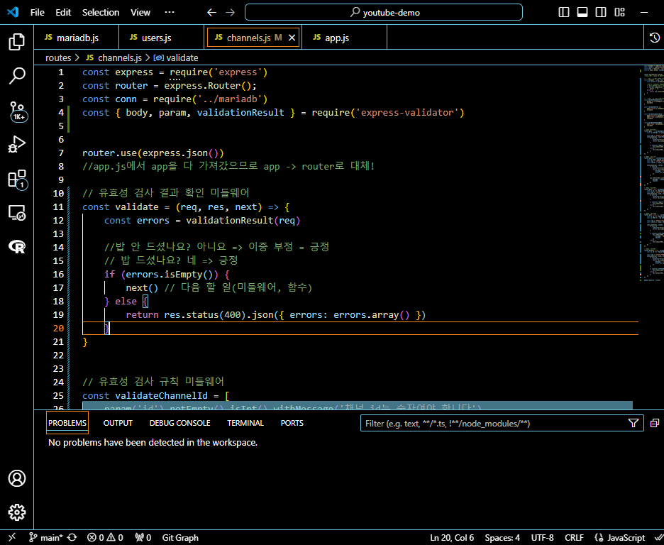

# 프로그래머스 풀스택 25
백엔드 심화: 인증과 비동기처리(6)

## 🌊 next(), channels.js validate 정리

<span style="color:lightseagreen">💫 **next()**</span><br>
<br>

**validate 미들웨어 분리:**<br>
validate 함수는 유효성 검사 결과를 확인하고, 오류가 있으면 400 Bad Request를 반환. 오류가 없으면 next()를 호출하여 다음 미들웨어 또는 라우터 로직으로 넘어감.<br>

<span style="color:lightseagreen">💫 **channels.js validate 정리**</span><br>

<br>
- validate 부분을 긍정으로 시작하도록 바꿈<br>

<코드 변경사항><br>
유효성 검사 규칙 분리:<br>
validateChannelId, validateUserId, validateChannelData, validateChannelName 등의 미들웨어로 유효성 검사 규칙을 분리. 이를 통해 재사용성을 높이고 코드를 더 간결하게 함.<br>

validate 미들웨어:<br>
유효성 검사를 통과했는지 확인하는 validate 미들웨어는 각 유효성 검사 규칙 뒤에 추가하여, 유효성 검사 실패 시 오류를 반환하고, 통과하면 다음 로직을 실행하도록 함.<br>

라우터에서 미들웨어 적용:<br>
각 라우트에서 필요한 유효성 검사를 미리 정의한 미들웨어 배열을 통해 적용.<br><br/>

## 🌊 users.js validate 추가 + 전체 테스트

\<users.js 수정한 부분><br>
<br>

\<실행결과><br>
<br>
- 전체 테스트 결과 잘 됨!<br><br/>

## 🌊 로그인(인증) 세션- 인증과 인가

**로그인(인증) 세션** : 사용자의 보안을 위해 세션의 만료 기간을 설정할 수 있음!<br>

<span style="color:lightseagreen">💫 **인증(Authentication) = 로그인**</span><br>

"**나... 여기 가입된 유저임!!!!**"<br>

ex)<br>
쇼핑물 상품 볼 때? X(공개적인 데이터를 볼 때는 로그인 X)<br>
쇼핑몰 장바구니 담을 때 O<br>
쇼핑몰 상품 구매 O<br>
마이 페이지 O.. 등등<br>


<span style="color:lightseagreen">💫 **인가(Authorization)**</span><br>

허락을 해주는 것.<br>
"**님 가입된 유저인 건 알겠는데 이 페이지에 들어올 수 있음?**"<br>

ex)<br>
같은 사이트 내에 관리자 / 고객에 따라 접근할 수 있는 페이지가 다름.<br>
관리자든 고객이든 인증을 통해서 사이트에 가입된 사용자라는 걸 "증명"하는 것.<br>
인증 후에, 이 친구 혹시 이 페이지 접근 권한이 있나?<br><br/>

## 🌊 쿠키와 세션 차이


<span style="color:lightseagreen">**✨쿠키🍪**</span><br>
1) 로그인 -> 서버가 쿠키를 구워줌🍪<br>
2) 사용자 <-> 서버가 쿠키를 핑퐁<br>

장점 : 서버가 저장 X => 서버 저장 공간 차지 X, Stateless =>RESTful<br>
단점 : <U>보안 취약</U>

<br>

<span style="color:lightseagreen">****✨세션**: (로그인이 되어있는) 상태**</span><br>
1) 로그인 -> 서버가 금고를 만들어서 정보 저장, 그 금고 번호를 줌<br>
2) 사용자 <-> 서버가 번호만 가지고 대화<br>

장점 : 보안이 비교적 좋음.<br>
단점 : 서버가 저장 O => 서버 저장 공간 차지 O, Stateless X<br>

로그인(인증)을 매번 페이지 이동할 때마다 시키면? 화남.<br>
그래서 사용하는 동안 유지가 됐으면 좋겠다 => 세션<br>
쿠키의 단점을 해결하기 위해 나왔지만 사실상 쿠키와 장단점이 바뀜<br>

<span style="color:lightseagreen">**✨JWT**</span><br>
- 보안이 취약하다는 쿠키의 단점을 보완<br>
- 세션이 서버의 값, 상태를 저장한다는 Stateless X을 보완할 수 있음<br>
- 쿠키와 세션의 장단점을 보완해서 나옴<br><br/>

## 🌊 JWT 개념, 특징

<span style="color:lightseagreen">💫 **✨JWT(JSON Web Token)**</span><br>

- **✔개념** : JSON 형태의 데이터를 안전하게 전송하기 위한 (웹에서 사용하는) 토큰<br>
= 토큰을 가진 사용자가 "**증명**"을 하기 위한 수단<br>
<br>
cf. 토큰 : (인증용) 입장 가능한 유저임! / (인가용) 관리자 권한&일반 유저 권한<br>

- **✔장점**<br>
  - 보안에 강하다! <= 암호화가 되어 있음!<br>
  - HTTP 특징을 잘 따랐음 = Stateless하다 <= "서버가 상태를 저장하지 않음"<br>
  - 서버 부담을 줄임<br>
<br>
cf. 토큰을 발행하는 서버를 따로 만들 수 있음<br><br/>

## 🌊 JWT 구조 (feat. jwt.io)

<span style="color:lightseagreen">💫 **JWT 구조**</span><br>

[jwt 공식사이트(jwt.io)](jwt.io)<br>
암호화된 토큰을 해석하기 위한 Debugger를 볼 수 있음!<br>

헤더 : 토큰을 암호화 하는 데 사용한 알고리즘, 토큰의 형태(jwt)<br>
페이로드 : 사용자 정보 (이름, 주소, 핸드폰, ... 비밀번호 X)<br>
서명 : 페이로드 값이 바뀌면, 서명값이 통째로 바뀌므로 JWT 믿고 사용가능<br>

<br>

<span style="color:lightseagreen">💫 **복호화된 토큰의 뜻**</span><br>

**HEADER:ALGORITHM & TOKEN TYPE(알고리즘과 토큰 형태를 알려줌)**<br>
JWT의 타입(typ)과 사용된 해싱 알고리즘(alg)에 대한 정보를 포함<br>

```json
{
  "alg": "HS256",
  "typ": "JWT"
}
```
<br>

**PAYLOAD:DATA(정보를 담고 다님)**<br>
토큰에 포함될 실제 정보(클레임, Claim)를 담고 있습니다. 클레임은 보통 사용자 정보, 권한, 유효기간 등을 포함<br>

```json
{
  "sub": "1234567890",
  "name": "John Doe",
  "iat": 1516239022
}
```
<br>

**VERIFY SIGNATURE(서명 : 토큰을 보증함)**<br>
앞서 인코딩된 헤더와 페이로드를 결합한 후, 지정된 알고리즘(예: HMAC SHA256)으로 비밀 키를 이용해 서명한 값<br>
서명은 토큰이 위변조되지 않았음을 보장하는 역할<br>

```scss
HMACSHA256(
  base64UrlEncode(header) + "." +
  base64UrlEncode(payload),
  your-256-bit-secret
)
```

<br>

><span style="color:red">eyJhbGciOiJIUzI1NiIsInR5cCI6IkpXVCJ9</span>.<br>
<span style="color:purple">eyJzdWIiOiIxMjM0NTY3ODkwIiwibmFtZSI6IkpvaG4gRG9lIiwiaWF0IjoxNTE2MjM5MDIyfQ</span>.<br>
<span style="color:skyblue">SflKxwRJSMeKKF2QT4fwpMeJf36POk6yJV_adQssw5c</span><br>

`암호화된 JWT 토큰의 모습!`<br>
색깔의 순서대로 헤더, 페이로드, 서명!<br><br/>

## 🌊 JWT 인증/인가 절차

<span style="color:lightseagreen">💫 **JWT 인증/인가 절차**</span><br>

<br>

1. **로그인 요청** :<br>
클라이언트는 사용자 이름과 비밀번호 같은 자격 증명을 서버에 전송.<br>

2. **서버의 자격 증명 검증** :<br>
서버는 클라이언트가 보낸 자격 증명이 올바른지 확인. 이 과정에서 데이터베이스를 참조하여 사용자가 입력한 정보가 맞는지 검증.<br>

3. **JWT 토큰 발급** :<br>
자격 증명이 유효한 경우, 서버는 JWT 토큰을 생성하여 클라이언트에게 반환. 이 토큰에는 사용자 정보와 인증 관련 데이터가 포함.<br>

4. **클라이언트의 JWT 저장** :<br>
클라이언트는 받은 JWT 토큰을 브라우저의 로컬 스토리지나 쿠키에 저장.<br>

5. **추후 요청 시 토큰 전송** :<br>
이후 클라이언트가 서버에 요청을 보낼 때, HTTP 요청 헤더의 Authorization 필드에 JWT 토큰을 포함시켜 전송.<br>

6. **서버의 JWT 검증** :<br>
서버는 클라이언트로부터 받은 JWT 토큰을 검증. 여기서는 서명이 유효한지, 토큰이 만료되지 않았는지 등을 확인<br>

7. **요청 처리 및 응답** :<br>
JWT 토큰이 유효하면, 서버는 요청을 정상 처리하고 클라이언트에게 응답을 보냄. 반면, 토큰이 유효하지 않거나 만료된 경우에는 인증 실패 응답을 보냄.<br><br/>

## 🌊 JWT 구현

<span style="color:lightseagreen">💫 **JWT 구현**</span><br>

[jsonwebtoken](https://www.npmjs.com/package/jsonwebtoken)

```bash
npm install jsonwebtoken
```

\<토큰 발급><br>
```javascript
var jwt = require('jsonwebtoken'); // jwt 모듈 소환
// 서명 = 토큰 발행
var token = jwt.sign({ foo: 'bar' }, 'shhhhh');
// token 생성 = jwt 서명을 했다!! (페이로드, 나만의 암호키) + SHA256
console.log(token)
```

\<복호화><br>
```javascript
// 검증
// 만약 검증에 성공하면, 페이로드 값을 확인할 수 있음!
var decoded = jwt.verify(token, 'shhhhh');
console.log(decoded) // bar
```

<br>
- iat : issued at(언제 발급되었는지!)<br><br/>

## 🌊 .env

<span style="color:lightseagreen">💫 **.env(environment : 환경 변수 '설정값')**</span><br>

- 개념 :<br>
  - 개발을 하다가 포트넘버, 데이터베이스 계정, 암호키, ... 등등 외부에 유출되면 안되는 중요한 환경 변수들을 따로 관리하기 위한 파일<br>
  cf. 깃허브에 올라가면 안되는 값<br>

파일 확장자 : .env<br>
  - cf. txt, jpg, ...<br>

<br>

[.env 파일 생성](https://www.npmjs.com/package/dotenv)

```bash
npm install dotenv --save
```
.env 파일은 환경 변수 파일 => 프로젝트 폴더의 최상위에 위치<br>

\<.env파일에 JWT암호키 담기><br>
<br>

\<jwt-demo.js 수정><br>
<br>

\<express-demo.js 수정><br>
<br>
- 포트넘버도 포함 가능<br><br/>

## 🌊 youtube에 jwt 적용

<span style="color:lightseagreen">💫 **youtube에 jwt 적용**</span><br>

<br>
- POSTMAN에서 실행하면 잘 됨!<br><br/>

## 🌊 cookie, 403

<span style="color:lightseagreen">💫 **cookie**</span><br>

[cookie 파일 사용](https://www.npmjs.com/package/cookie-parser)

```bash
npm install cookie-parser
```

\<쿠키 적용><br>
```javascript
res.cookie("token", token)
```
<br>
- 쿠키에 암호값이 잘 넘어오는 걸 확인<br>

<span style="color:lightseagreen">💫 **403**</span><br>
- 클라이언트가 URL에 접근을 하는 데에 거절당했다는 뜻.<br>
- "나 너 인증 못해줘!!" 라는 것.<br><br/>

## 🌊 cookie 설정 변경

<span style="color:lightseagreen">💫 **cookie 설정 변경**</span><br>

<br>

**Secure**<br>

- HTTP<br>
http://localhost:1234/login<br>

- HTTPS(secure)<br>
인증서(암호화)로 감싸진 페이지라고 생각하면 됨!<br>
https://www.naver.com<br>

<br>

**httpOnly**<br>
= 프론트엔드가 아니라 API호출"만" 허락할 거임? : XSS 공격<br>
(프론트엔드 공격 : 웹 브라우저 js 접근 => 공격)<br>
- true : 난 HTTP API로만 요청받을거임(그때만 쿠키접근o)<br>
- false : 프론트엔드에서 공격이 들어오면 쿠키도 공격받음<br>

```javascript
res.cookie("token", token, {
  httpOnly : true
})
```
<br>
- 잘 적용된 걸 확인!<br><br/>

## 🌊 jwt 유효기간 설정

<span style="color:lightseagreen">💫 **jwt 유효기간 설정**</span><br>

보안을 위해 반드시 유효기간을 설정해줄 것!<br>
영원히 유지되는 토큰을 맛보고싶은 게 아니라면...<br>

```javascript
const token = jwt.sign({
  email : user.email,
  name : user.name
}, process.env.PRIVATE_KEY, {
  expiresIn : '30m',
  issuer : "nanyoung"
});
```          
- 이렇게 하면 복호화했을 때 만료 시간과 작성자가 나옴<br>

<br><br/>


## 🌊 느낀 점(YWT)

**Y 일을 통해 명확히 알게 되었거나 이해한 부분(한 일)에 대해 정리 :**<br>
인증과 인가, 쿠키&세션&JWT, JWT 구조와 인증/인가 절차<br>

**W 배운 점과 시사점 :**<br>
JWT 구조와 인증/인가 절차를 통해 로그인을 할 때 안전하게 전달할 수 있는 걸 배움!<br>

**T 응용하여 배운 것을 어디에 어떻게 적용할지:**<br>
혼자 로그인 홈페이지를 만들 때 활용할 수 있음!<br>