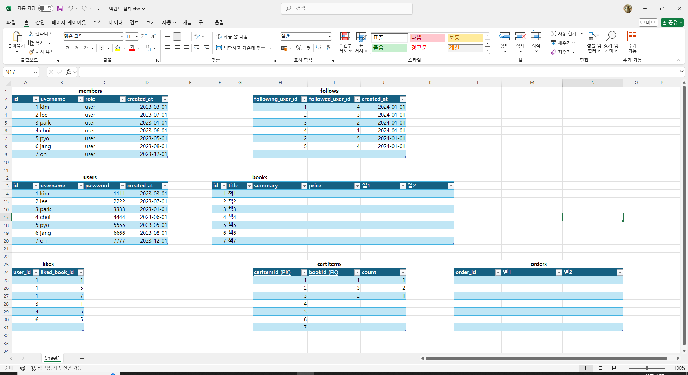

# 프로그래머스 풀스택 26
프로젝트: Node.js 기반의 REST API 구현(1, 2, 3)

## 🌊 dbdiagram.io & users, books 설계
💫 **dbdiagram.io & users** 

[dbdiagram.io](dbdiagram.io)에 접속하면 명령어를 통해 DB구조 설계 가능! 

💫 **users, books** 

  

## 🌊 좋아요 ERD, API 설계

💫 **좋아요 ERD, API 설계** 

 

 
- 좋아요 추가와 취소를 각각 POST, DELETE로 수정해줌 

 

  

## 🌊 장바구니 API ERD 설계

💫 **장바구니 API ERD 설계** 

  

## 🌊 주문 "예상" 상품 목록 조회 API 수정

💫 **주문 "예상" 상품 목록 조회 API 수정** 

 
- Request Body로 배열을 통해 cartItemId을 넘겨받으면 그에 맞는 정보를 응답해주는 걸로 바꾸기!! 

 

  

## 🌊 주문 테이블 설계, API 설계

💫 **주문 테이블 설계** 

 

  

## 🌊 주문 내역 조회, 주문 상세 조회

💫 **주문 내역 조회, 주문 상세 조회** 

 

 

  

## 🌊 느낀 점(YWT)

**Y 일을 통해 명확히 알게 되었거나 이해한 부분(한 일)에 대해 정리 :** 
dbdiagram.io을 통해 ERD 설계 가능함을 배우고 API 설계를 하며 구조는 언제나 바뀔 수 있다는 걸 알게 됨! 

**W 배운 점과 시사점 :** 
API 설계는 진행과정에서 언제나 바뀔 수 있다...!!!! 

**T 응용하여 배운 것을 어디에 어떻게 적용할지:** 
토이 프로젝트로 주문 사이트를 만들 때 다시 해볼 것! 