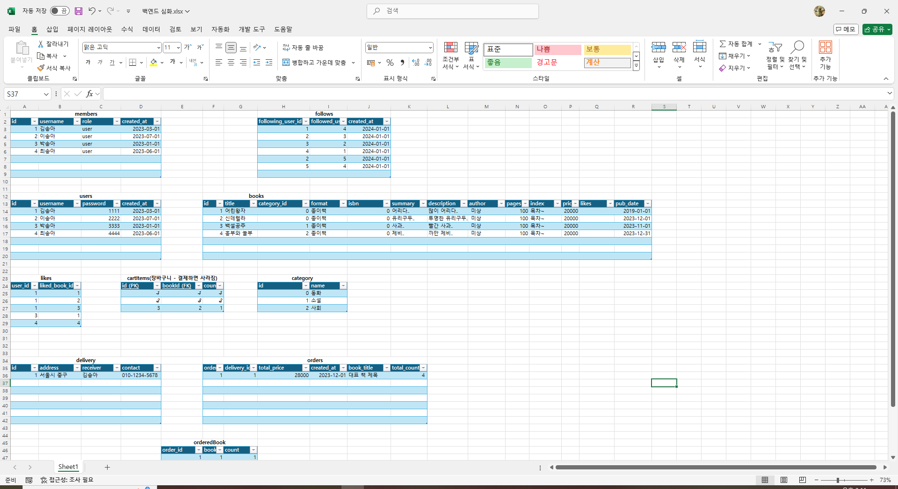
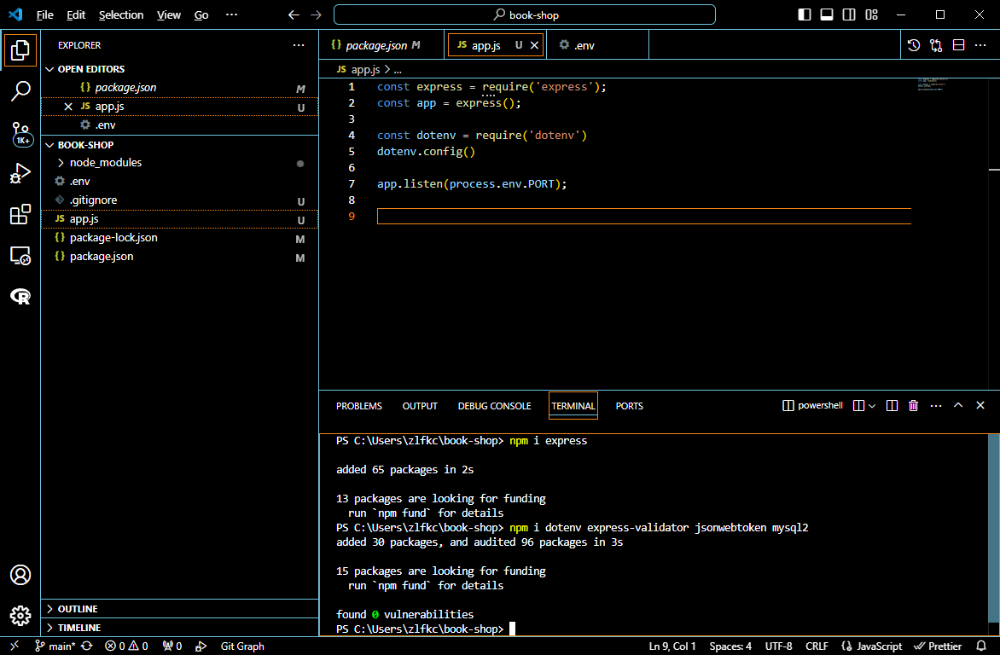
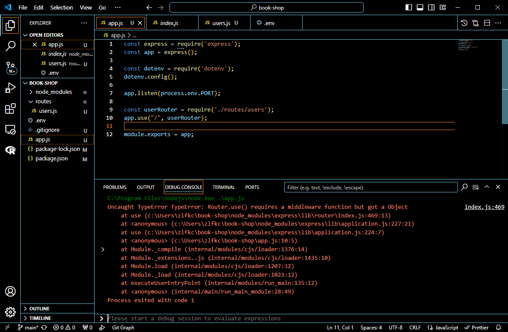
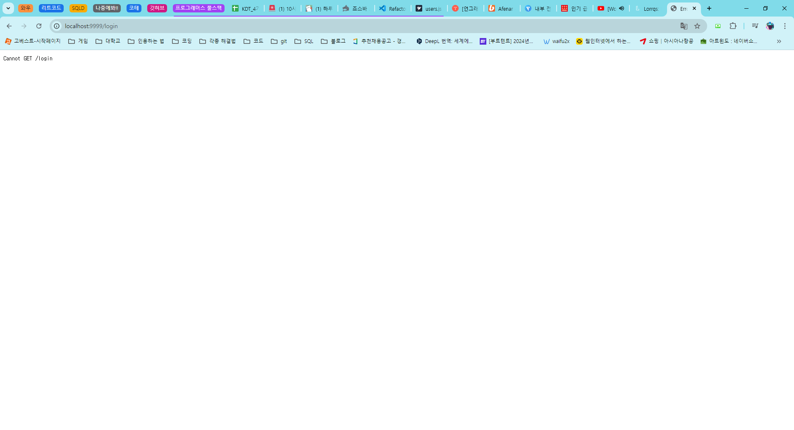
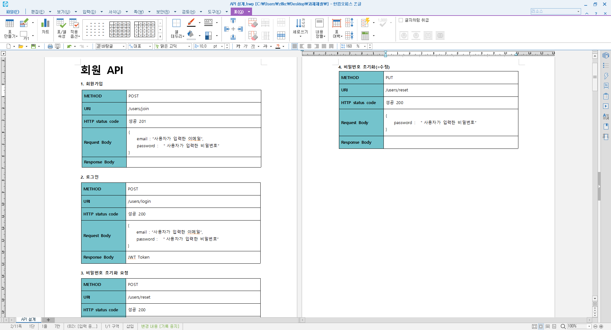
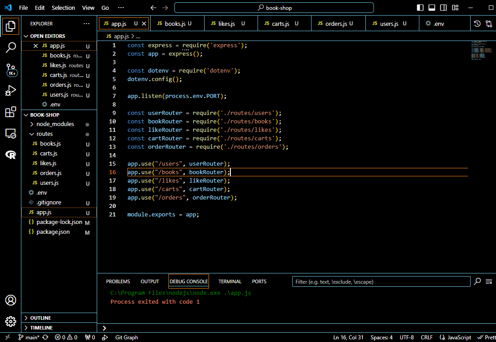
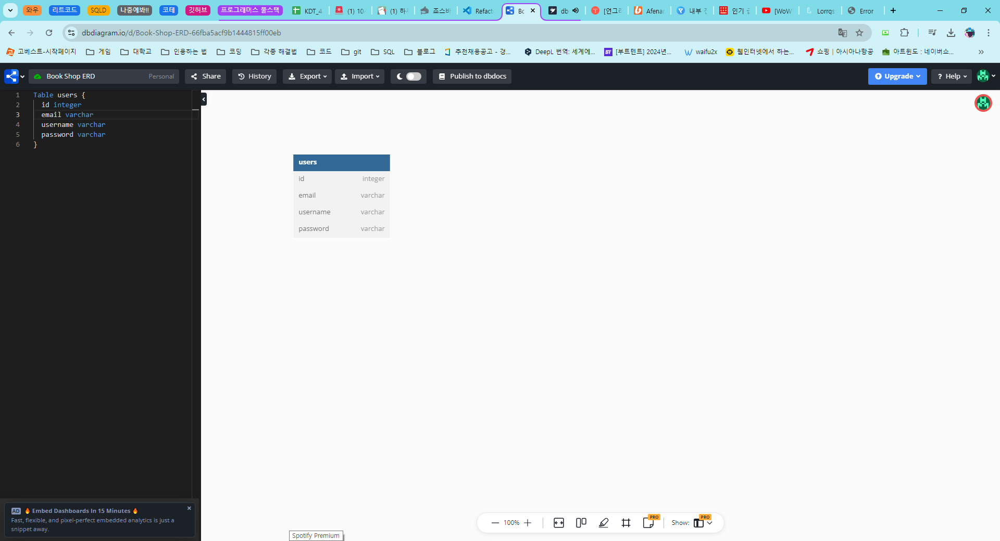
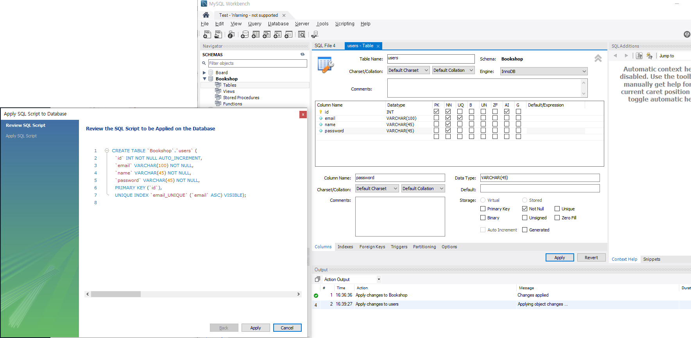

# 프로그래머스 풀스택 27
프로젝트: Node.js 기반의 REST API 구현(4)

## 🌊 API, 테이블 점검

<span style="color:lightseagreen">💫 **API, 테이블 점검**</span><br>
<br>
- API 설계 목록과 비교하며 항목을 추가함<br><br/>

## 🌊 express-generator와 현재 프로젝트 구조 비교

<span style="color:lightseagreen">💫 **express-generator 프로젝트 구조**</span><br>

- **bin/www** : 포트번호, 오류나면 어쩔건지..등과 같은 웹 서버를 구축하는데에 필요한 설정 데이터가 정의되어 있는 파일<br>
=> .env 파일과 같이 설정 값을 가지고 에러 처리, 기타 추가 설정을 해주는 파일<br>

- **node_modules** : Node.js, Express에 필요한 모듈들이 설치되는 폴더<br>

- **<em>public</em>** : images, javascripts, stylesheets -> 정적(ex. 로고, 회사 소개 페이지 ...) 파일<br>
cf. 동적 : 사람마다 다른 데이터

- **routes** : 각 경로를 담당하는 모듈들이 들어있는 폴더<br>
= 라우팅 로직을 구현하는 모듈들<br>
: 클라이언트에서 어떤 요청을 주냐에 따라서 어떤 로직을 수행할 지 파일별로 분할해서 관리하는 정도임.<br>
(cf. 자바의 controller 역할)<br>

- **<em>views</em>** : 클라이언트에게 html코드로 "화면을 보내는 파일"<br>


- **app.js** : Express 서버의 시작점 => URL에 따라서 라우팅을 함.<br>

- **package.json** : 이 프로젝트에 설치된 모듈 이름, 버전 등등 정보들이 작성되어 있는 파일<br>

<br>

public과 view를 빼면 express-generator와 현재 프로젝트가 다른 게 없음~~<br><br/>

## 🌊 프로젝트 셋팅 + app.js 구현


<span style="color:lightseagreen">💫 **프로젝트 셋팅 + app.js 구현**</span><br>

<br>
- 필요한 npm 설치와 app.js 구현한 모습!<br><br/>

## 🌊 users.js 기본 모듈화

<span style="color:lightseagreen">💫 **users.js 기본 모듈화**</span><br>

<br>
- **Router.use() requires a middleware function but got a Object** 오류!<br>
module.exports = router;을 꼭 해주기!<br>
module.exports를 통해서 router를 등록해줘야 다른 모듈에서 사용 가능함!<br>

<br>

<br>
- 실행이 잘 되는 걸 확인!<br><br/>

## 🌊 books, likes, carts, orders 기본 모듈화

<span style="color:lightseagreen">💫 **books, likes, carts, orders 기본 모듈화**</span><br>

<br>
- URI 설정할 때 /join, /login, /rest 앞에 /users를 붙여줌<br>
- /users/join, /users/login, /users/reset<br>

\<app.js에서 route 부분 수정>
```javascript
app.use("/users", userRouter);
```
<br>

<br>
```javascript
const userRouter = require('./routes/users');
const bookRouter = require('./routes/books');
const likeRouter = require('./routes/likes');
const cartRouter = require('./routes/carts');
const orderRouter = require('./routes/orders');
app.use("/users", userRouter);
app.use("/books", bookRouter);
app.use("/likes", likeRouter);
app.use("/carts", cartRouter);
app.use("/orders", orderRouter);
```
- app.js에서 이렇게 Router를 분리해줬다면 각각의 불러오는 파일에서는 /books, /likes, 등등을 생략하여 작성하면 됨.<br>

\<books.js 수정 전>
```javascript
// 전체 도서 조회
router.get('/books', (req, res) => {
    res.json('전체 도서 조회');
});
// 개별 도서 조회
router.get('/books/:id', (req, res) => {
    res.json('개별 도서 조회');
});
```

\<books.js 수정 후>
```javascript
// 전체 도서 조회
router.get('/', (req, res) => {
    res.json('전체 도서 조회');
});
// 개별 도서 조회
router.get('/:id', (req, res) => {
    res.json('개별 도서 조회');
});
```
이런 식으로 빼주기!!<br><br/>

## 🌊 dbdiagram users, workbench create

<span style="color:lightseagreen">💫 **dbdiagram users**</span><br>

<br>
- [dbdiagram.io](dbdiagram.io)를 통해 users 테이블의 ERD를 작성!<br>

<span style="color:lightseagreen">💫 **workbench create**</span><br>

<br>
- workbench을 통해 Bookshop 스키마를 생성 후(더블클릭해서 볼드체가 되면 그 스키마를 사용한다는 뜻) users 테이블 생성!<br>

<br><br/>

## 🌊 느낀 점(YWT)

**Y 일을 통해 명확히 알게 되었거나 이해한 부분(한 일)에 대해 정리 :**<br>
express-generator와 현재 프로젝트 구조의 차이 / app.js 파일에서 Router 분리하면 각각 파일에서 생략하기<br>

**W 배운 점과 시사점 :**<br>
app.js에서 Router를 분리해줬다면 각각의 불러오는 파일에서는 /books, /likes, 등등을 생략하여 작성하기!!!<br>

**T 응용하여 배운 것을 어디에 어떻게 적용할지:**<br>
express-generator와 현재 프로젝트 구조의 차이는 public과 view를 빼면 express-generator와 현재 프로젝트가 다른 게 없으므로 반드시 express-generator를 사용하지 않아도 됨!<br>
앞으로 app.js에서 Router를 분리해줬다면 각각의 불러오는 파일에서는 생략하여 작성할 것임!<br>