# 프로그래머스 풀스택 28
프로젝트: Node.js 기반의 REST API 구현(5)

## 🌊 회원가입 API 구현
<span style="color:lightseagreen">💫 **회원가입 API 구현**</span><br>

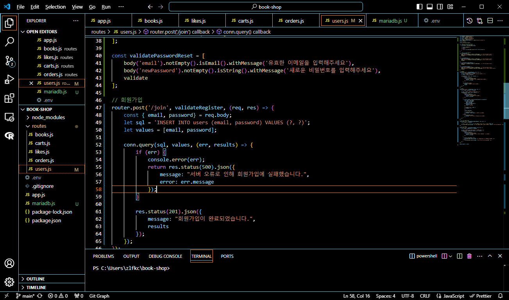<br>
- mariadb.js 생성 후 user.js에서 연결하고 회원가입 API 구현(유효성 검사와 미들웨어가 윗단에 추가됨)<br>
<br><br/>

## 🌊 http-status-codes 모듈 활용

<span style="color:lightseagreen">💫 **http-status-codes 모듈 활용**</span><br>

[http-status-codes](https://www.npmjs.com/package/http-status-codes)에 접속
```javascript
npm install http-status-codes --save
```
이걸 현재 프로젝트 폴더의 터미널에 입력해주면 설치완료!<br>

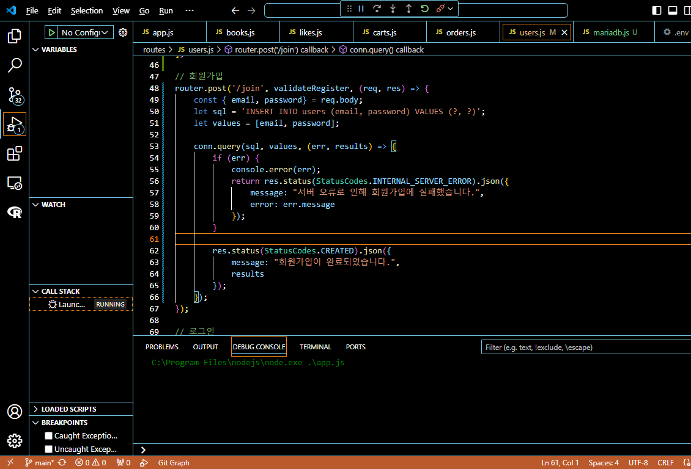<br>

```javascript
res.status(StatusCodes.CREATED).json({
    message: "회원가입이 완료되었습니다.",
    results
});
```

<br>

[http-status-codes](https://www.npmjs.com/package/http-status-codes)을 보면 숫자에 맞는 단어가 적혀져 있으므로 그대로 사용하면됨!<br>

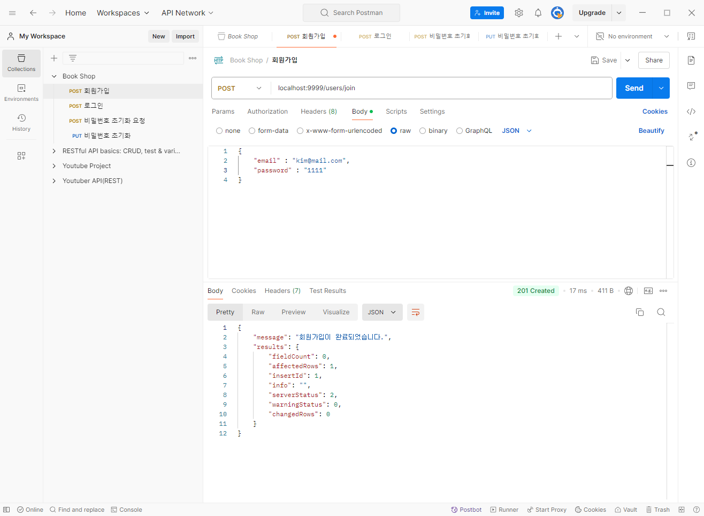<br>
- 잘 작동하는 모습!<br><br/>

## 🌊 node.js 패키지 구조 (feat. 컨트롤러)


<span style="color:lightseagreen">💫 **node.js 패키지 구조**</span><br>

**app.js** : 프로젝트의 메인 라우터 역할<br>

/routes<br>
　　users.js : 하위 라우터 역할 = 경로를 찾아주자<br>
　　books.js : 하위 라우터 역할<br>
　　...<br>

경로를 찾은 다음 역할 = '콜백함수' 를 빼내자!<br>

<br>

<span style="color:lightseagreen">💫 **컨트롤러**</span><br>

- 프로젝트에서 매니저 역할을 하는 파일 : 관장!!<br>
- 누군가에게 일을 어떻게 시켜야할 지 알고 있음!<br>
= 직접 일을 하진 않을 것.<br>

=> router를 통해서<br>
　"사용자의 요청이" 길을 찾아오면<br>
　**매니저(콜백함수 = controller)가 환영해줌!**<br>
　👉 알바생(서비스)한테 일을 시키고, 결과물을 다시 매니저에게 전달함.<br>
　**매니저가 사용자에게 res를 돌려줌.**<br>

<br>

<span style="color:lightseagreen">✔ **라우터가 로직까지 다~ 수행할 때 단점!!**</span><br>
1) 프로젝트 규모가 커질수록, 코드가 엄~청 복잡해짐.<br>
✨해결방법 : 코드를 간결하고 가독성이 높게 만들자!!!!✨<br>
2) 가독성 X<br>
3) 트러블 슈팅 X<br>
=> "**유지보수 하기 어렵다!!!**"<br>

cf. 유지보수란? 10년~운영! 요구사항 반영, 에러 해결, ...<br>

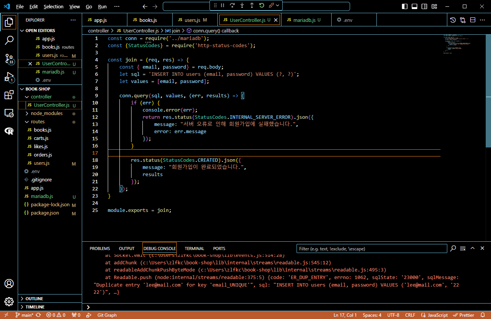<br>
- 컨트롤러를 통해 req, res를 빼줌<br><br/>

## 🌊 로그인 api 구현 + unauthorized

<span style="color:lightseagreen">💫 **로그인 api 구현 + unauthorized**</span><br>

jwt 모듈 사용하기!<br>

**로그인 실패시**<br>
401 : Unauthorized(비인증 상태) -> 그 사람이 누군지 모름<br>
403 : Forbidden (접근 권리 없음) -> 서버가 그 사람이 누군지 알고 있음<br>

아이디가 틀리면 401이고 비밀번호가 틀리면 403이라고 생각하기~<br>
현재 코드는 이메일,비밀번호 둘 중에 틀렸을 때 알려주는 거라 Unauthorized사용하기<br>

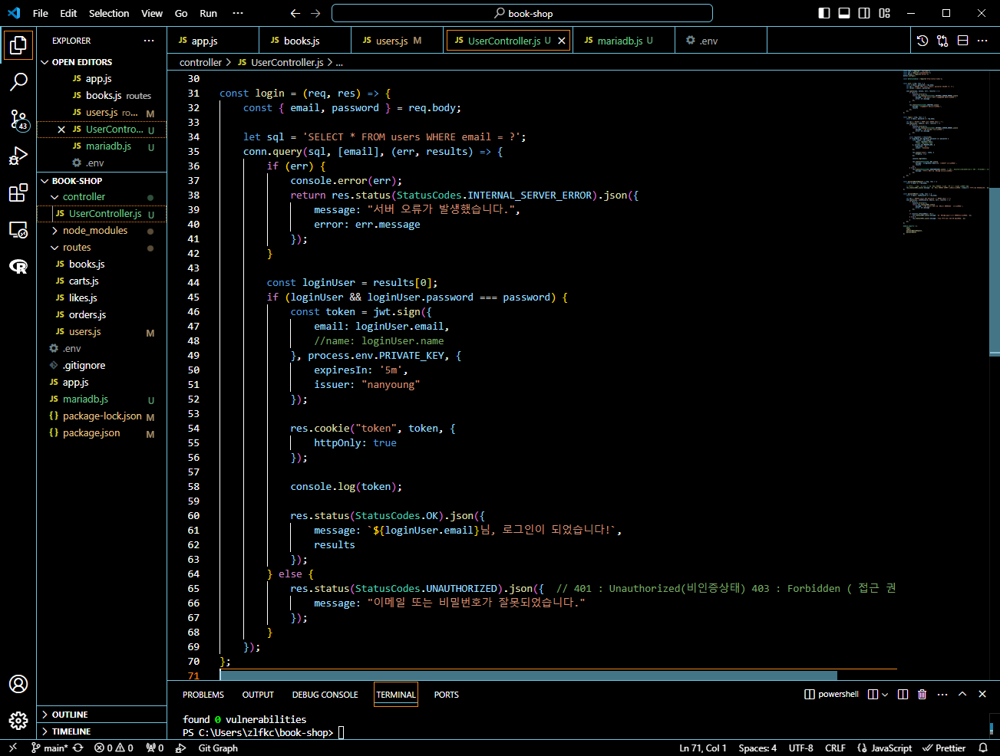<br>
- 로그인 API 구현한 모습!<br>

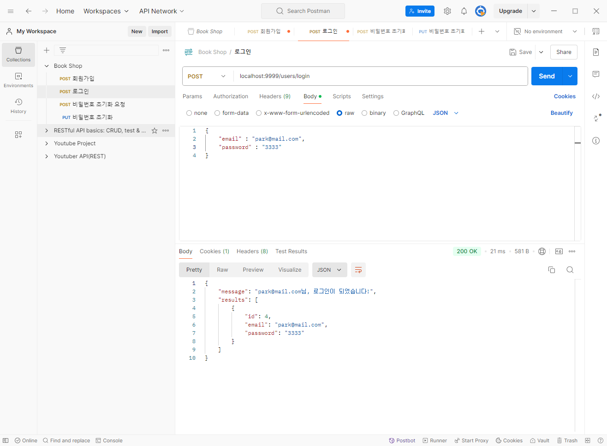<br>
- 실행 확인!<br><br/>

## 🌊 비밀번호 초기화 요청 & 초기화

<span style="color:lightseagreen">💫 **비밀번호 초기화 요청 & 초기화**</span><br>

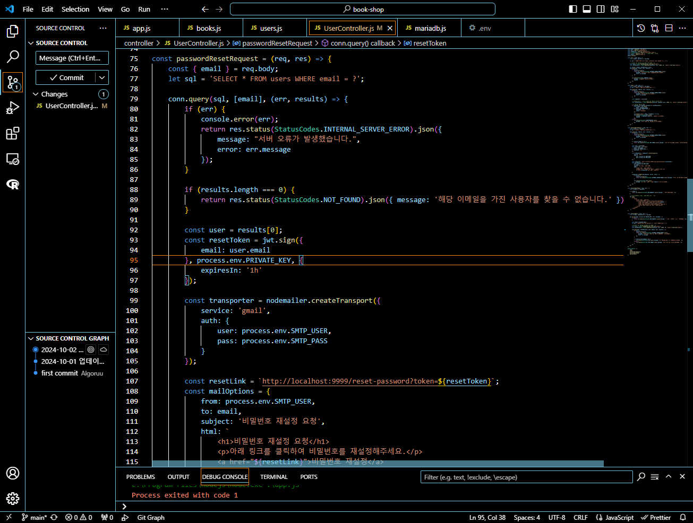<br>
- 직접 이메일로 발송하면 고칠 수 있게 고도화하다가 오류나서 수정해야함<br>

<수정완료><br>
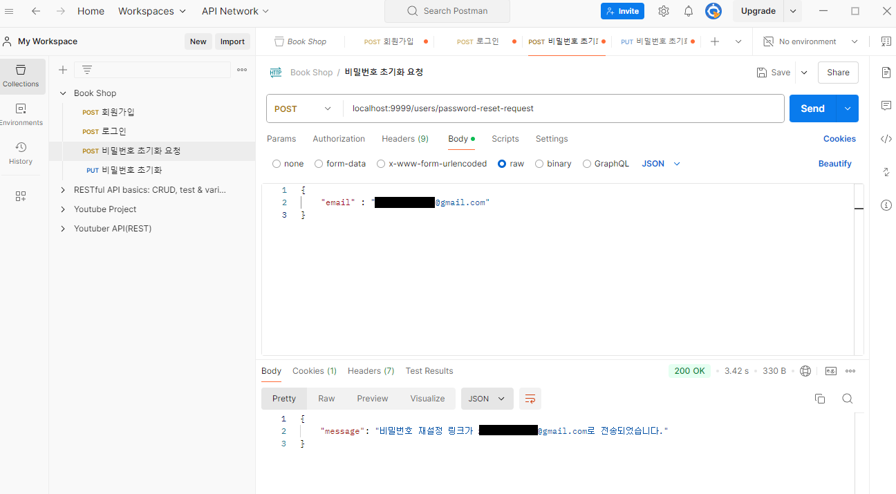<br>
- POST 비밀번호 초기화 요청 보내기<br>

<br>

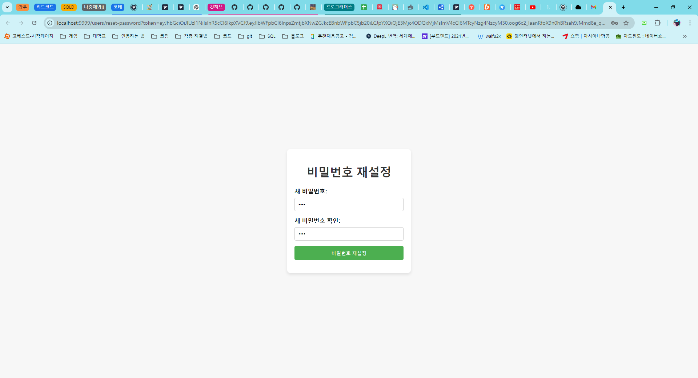<br>

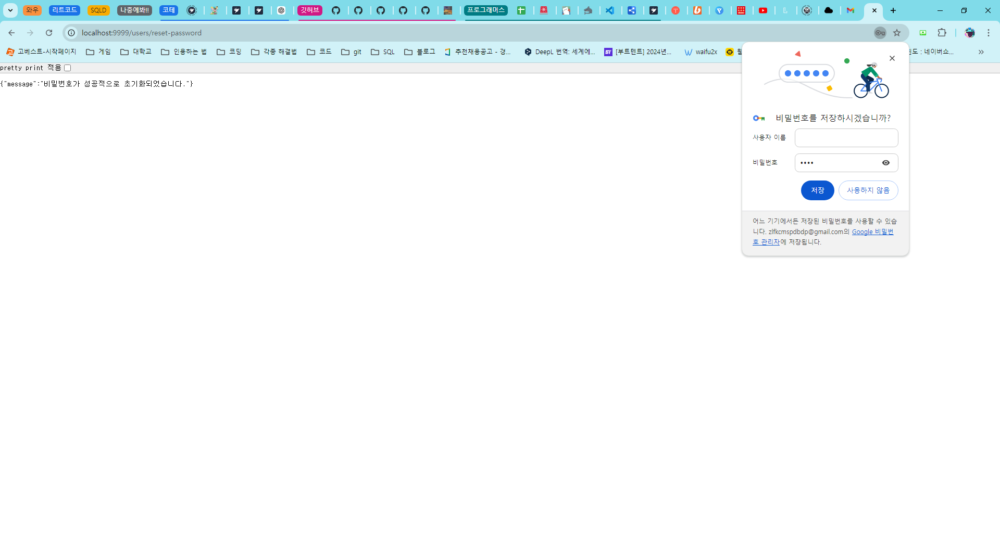<br>

- 수정 끝에 잘 작동하는 걸 확인!<br>

<br/>

## 🌊 회원가입 시 비밀번호 암호화

<span style="color:lightseagreen">💫 **회원가입 시 비밀번호 암호화**</span><br>

**crypto 모듈 사용하기**<br>
```javascript
const crypto = require('crypto');
```

```javascript
// 비밀번호 암호화
const salt = crypto.randomBytes(64).toString('base64');
const hashPassword = crypto.pbkdf2Sync(password, salt, 10000, 64,'sha512').toString('base64');
```
**randomBytes** : 매개변수로 들어오는 숫자를 가지고 랜덤바이트를 생성<br>

**pbkdf2Sync** : `digest`라는 자리에 `sha512`알고리즘 넣어줌, 키 길이 넣어줌(현재는 64길이의 salt), 10000 -> 해쉬 함수반복 횟수, salt(랜덤하게 생성된 값), password // 설명은 역순임!<br>

단방향이라서 암호화만 되고 복호화가 안됨!<br>
=> salt 값을 고정 하고 반쪽짜리 암호화 OR salt가 매번 바뀌는거 OK, 어차피 암호화할 때 salt말고도 해쉬함수를 몇번을 돌릴 건지 알고리즘을 뭘 쓸건지 결정하니까 salt를 데이터베이스에 저장하자~!<br>

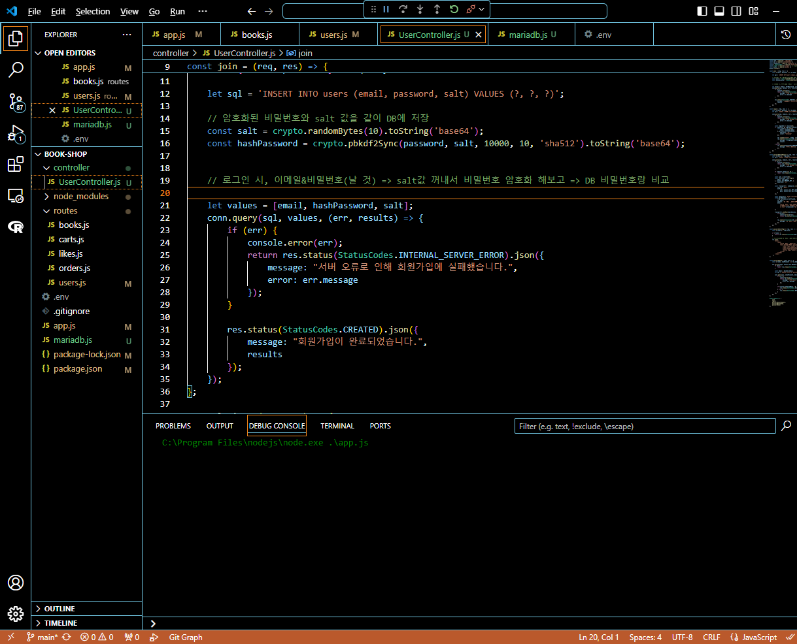<br>
<br>
- 잘 실행이 됨!<br><br/>

## 🌊 로그인은 어떻게? 비밀번호 초기화?

<span style="color:lightseagreen">💫 **로그인은 어떻게? 비밀번호 초기화?**</span><br>

\<로그인 부분><br>
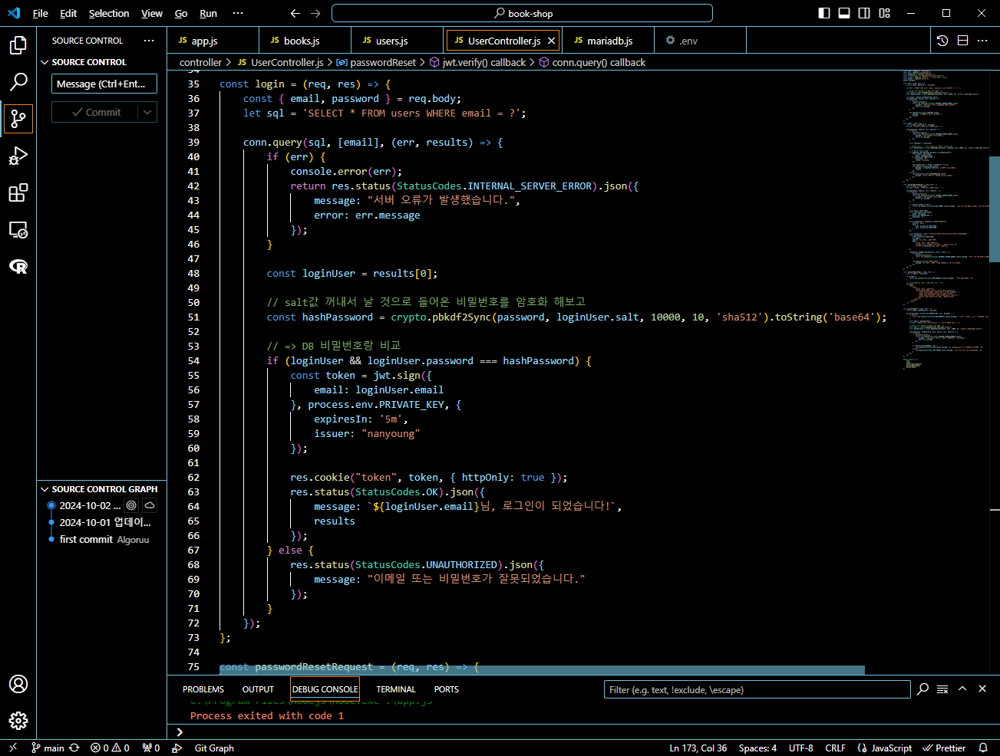<br>

\<비밀번호 초기화 부분><br>
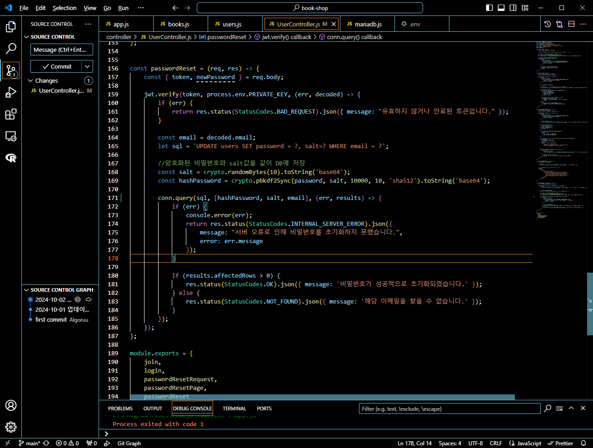<br>
- 코드를 고도화하면서 오류가나서 다시 짜야함<br><br/>

## 🌊 느낀 점(YWT)

**Y 일을 통해 명확히 알게 되었거나 이해한 부분(한 일)에 대해 정리 :**<br>
http-status-codes, 컨트롤러 분리, API 구현<br>

**W 배운 점과 시사점 :**<br>
http-status-codes 모듈을 통해 숫자 날것이 아닌 표현을 가능한 걸 배움<br>
컨트롤러 분리를 통해 코드의 유지보수를 용이하게 함<br>

**T 응용하여 배운 것을 어디에 어떻게 적용할지:**<br>
앞으로 컨트롤러 분리를 통해 코드의 유지보수를 용이하게 할 수 있게 됨!<br>