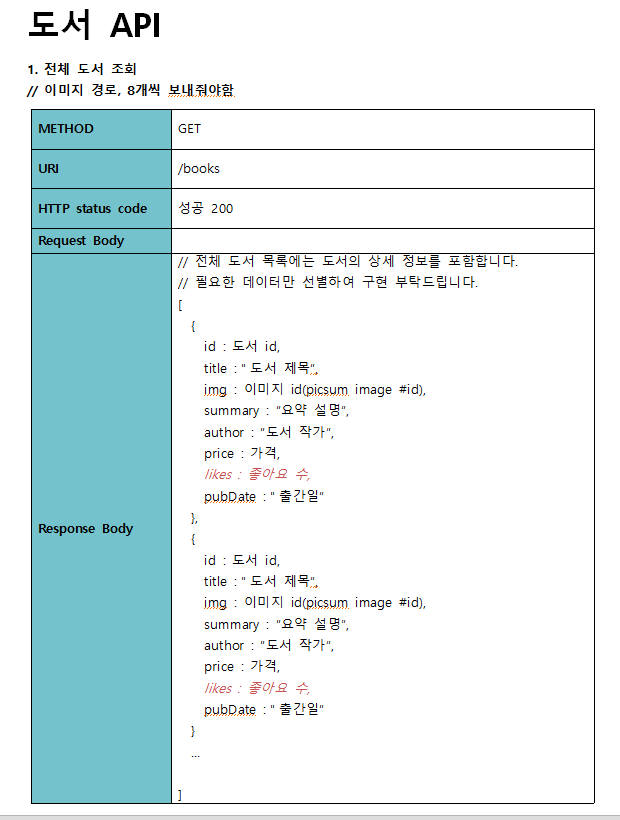
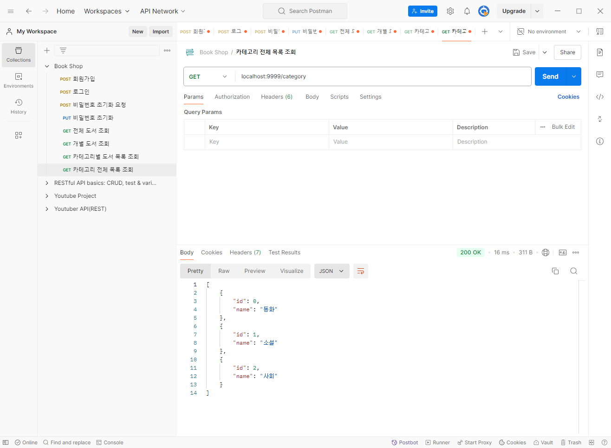

# 프로그래머스 풀스택 29
프로젝트: Node.js 기반의 REST API 구현(6)

## 🌊 도서 테이블 생성
<span style="color:lightseagreen">💫 **도서 테이블 생성**</span><br>


<br>
- 도서 테이블 생성완료<br><br/>

## 🌊 컬럼 이름 변경 필요!

<span style="color:lightseagreen">💫 **컬럼 이름 변경 필요!**</span><br>

mariadb 예약어와 겹치므로 수정해야함!<br>
<br>

**기본적으로 모든 프로그램에서 예약어와 겹치지 않게 사용하기!!**<br><br/>

## 🌊 BookController 떼어내기

<span style="color:lightseagreen">💫 **BookController 떼어내기**</span><br>

\<bookController.js>
<br>

\<book.js>
<br><br/>

## 🌊 도서 전체 조회, 상세 도서 조회

<span style="color:lightseagreen">💫 **도서 전체 조회**</span><br>

<br>

<br>

<span style="color:lightseagreen">💫 **상세 도서 조회**</span><br>

<br>

<br><br/>

## 🌊 picsum 소개, 이미지 경로 추가

<span style="color:lightseagreen">💫 **picsum 소개, 이미지 경로 추가**</span><br>


[Lorem Picsum](https://picsum.photos/)에 들어가면 더미 이미지 생성/사용을 할 수 있음!!<br>

<br>
- API, 엑셀, workbench에 이미지경로 추가<br><br/>

## 🌊 카테고리별 도서 목록 조회

<span style="color:lightseagreen">💫 **카테고리별 도서 목록 조회**</span><br>

<br>

<br>
- POSTMAN에서 카테고리 id가 0이 아닌 다른 것도 출력되는 모습. 수정이 필요함.<br><br/>

## 🌊 카테고리 테이블 생성

<br>
```javascript
router.get('/', allBooks); // 전체 도서 조회
router.get('/', booksByCategory); // 카테고리별 도서 조회
router.get('/:id', bookDetail); // 개별 도서 조회
```
- 이런 식으로 되어있으면 먼저 할당된 쪽으로만 실행됨.<br>
- 따라서 위에서 수정이 필요하다고 했으므로, 쿼리스트링이 날라오면 날라오는대로 카테고리별 도서 목록 조회로 보내주고 쿼리스트링 없이 날라오면 전체 도서 조회로 보내주는 걸로 API를 합치기로 함.<br>

<br>

<br>
- 하나의 API에서 여러 개의 작업을 할 수 있음!<br>

<br>

<span style="color:lightseagreen">💫 **카테고리 테이블 생성**</span><br>

이제 카테고리 테이블을 생성해서 관리해야 함! API 생성하기!<br>
관리한 값을 프론트엔드에 전달해준다고 생각하기.<br>

<br>
- 이제 API를 통해 프론트엔드에서도 값을 가져갈 수 있게 해야함!<br>

<br><br/>

## 🌊 카테고리 전체 목록 조회 API 구현

<span style="color:lightseagreen">💫 **카테고리 전체 목록 조회 API 구현**</span><br>

<br>
<br>
<br>
- 너무 유연하거나 너무 확장되어있으면 그때가서 수정해도 OK<br>

<br><br/>

## 🌊 느낀 점(YWT)

**Y 일을 통해 명확히 알게 되었거나 이해한 부분(한 일)에 대해 정리 :**<br>
API 고도화!<br>

**W 배운 점과 시사점 :**<br>
라우터가 겹치면 먼저 할당된 쪽으로만 실행됨.<br>
따라서 쿼리스트링이 날라오면 날라오는대로 카테고리별 도서 목록 조회로 보내주고 쿼리스트링 없이 날라오면 전체 도서 조회로 보내주는 걸로 API를 합치는 걸 배움!<br>

**T 응용하여 배운 것을 어디에 어떻게 적용할지:**<br>
API를 구현할 때 합쳐서 하는 것도 고려할 수 있게 됨!<br>