# 프로그래머스 풀스택 30
프로젝트: Node.js 기반의 REST API 구현(7)

## 🌊 books-category 연관관계 설정
<span style="color:lightseagreen">💫 **books-category 연관관계 설정**</span><br>

외래키 설정 : 카테고리의 PK값을 가지고 있는 books의 테이블에서 걸어줘야함<br>
books의 category_id는 카테고리 테이블의 pk값을 fk값으로 가지는 컬럼임<br>

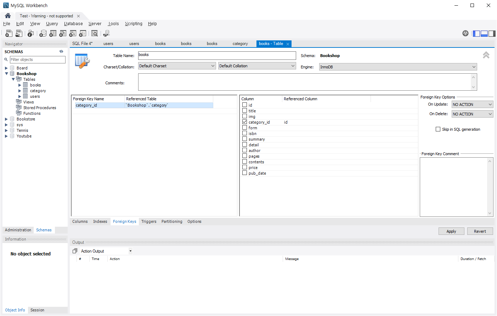<br>

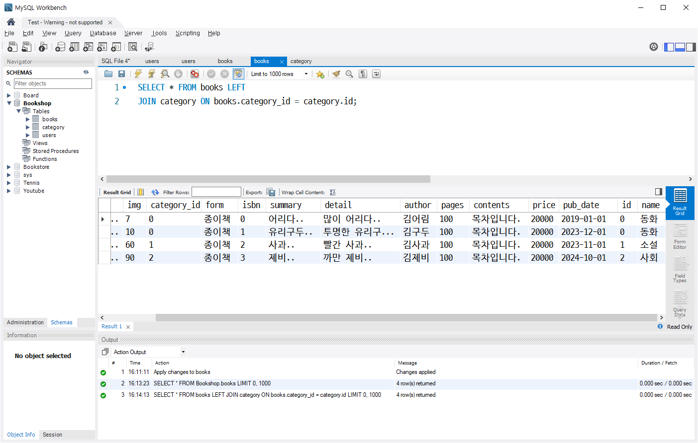<br>

\<출력할 때 별칭을 줄 수 있음!><br>
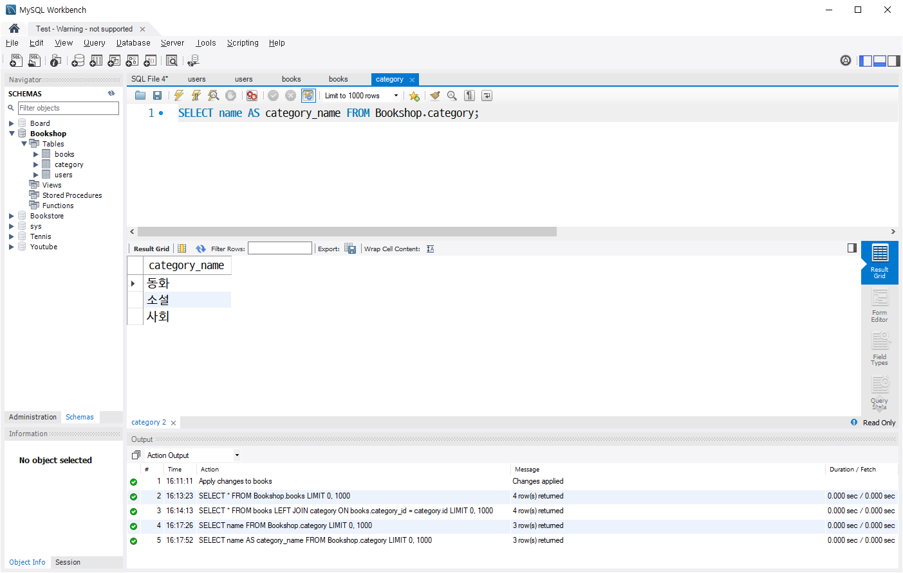<br>
- DB는 그대로 유지되고, 출력할 때만 별칭 설정가능.<br>
```sql
SELECT name AS category_name FROM Bookshop.category;
```

하지만 여기서 그냥 name을 category_name으로 db에서 수정하기로 함<br>
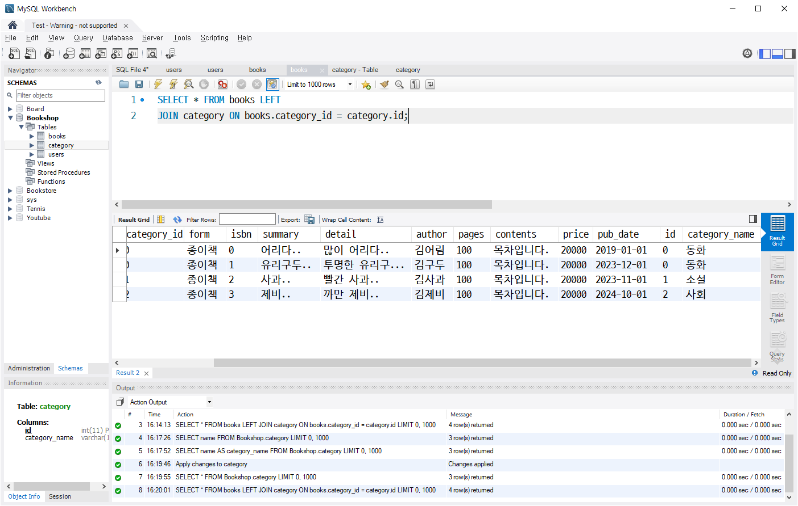<br>

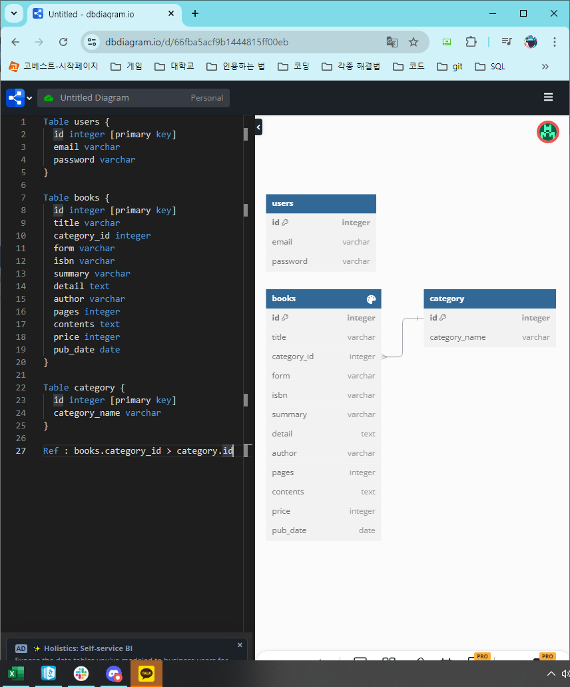<br><br/>

## 🌊 도서 목록 조회 API 조인 구현

<span style="color:lightseagreen">💫 **도서 목록 조회 API 조인 구현**</span><br>

```sql
SELECT * FROM books LEFT JOIN category ON books.category_id = category.id WHERE books.id=1;
```
WHERE books.id=1는 SELECT * FROM books가 아니라 맨 끝에 있어야 함!<br>

\<bookController.js의 bookDetail 수정><br>
```javascript
const bookDetail = (req, res) => {
    let {id} = req.params;
    let sql = `SELECT * FROM books LEFT JOIN category 
                ON books.category_id = category.id WHERE books.id=?`;
    conn.query(sql, id,
        (err, results) => {
            if (err) {
                console.error(err);
                return res.status(StatusCodes.INTERNAL_SERVER_ERROR).end();
            }
        if(results[0])    
            return res.status(StatusCodes.OK).json(results[0]);
        else
            return res.status(StatusCodes.NOT_FOUND).end();
    })
};
```
- SELECT * FROM books LEFT JOIN category ON books.category_id = category.id WHERE books.id=1;을 수정하여 마지막 부분 WHERE books.id=1을 WHERE books.id=?로 설정해주면 됨!<br> 

\<POSTMAN 실행결과><br>
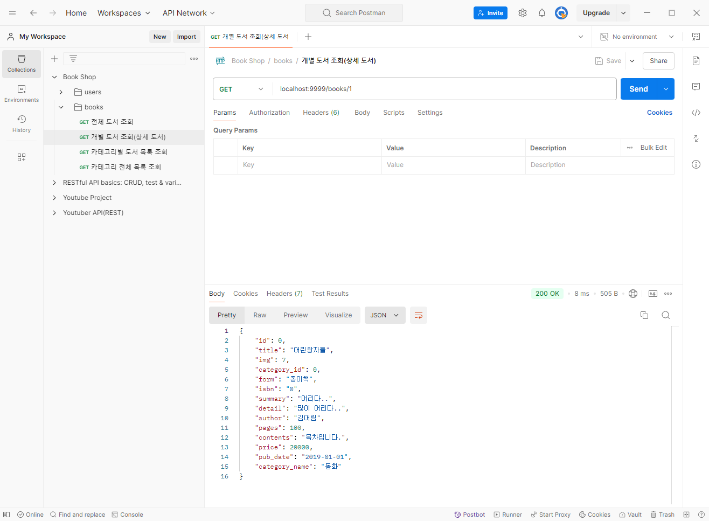<br><br/>

## 🌊 SQL 시간 범위 구하기 (DATE_ADD, SUB)

<span style="color:lightseagreen">💫 **SQL 시간 범위 구하기 (DATE_ADD, SUB)**</span><br>

- **시간 더하기**<br>
**DATE_ADD(기준 날짜, INTERVAL ____)**<br>
SQL기준으로 MONTH는 한 달(30일)기준!!<br>
```sql
SELECT DATE_ADD(NOW(), INTERVAL 1 MONTH);
```
결과 : 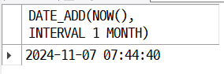<br><br>

- **시간 빼기**<br>
**DATE_SUB(기준 날짜, INTERVAL ____)**<br>
```sql
SELECT DATE_SUB(NOW(), INTERVAL 1 MONTH);
```
결과 : 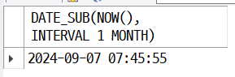<br><br>

- **시간 범위를 설정해서 SELECT**<br>
// 최근 한달 이내 : 신간<br>
```sql
SELECT * FROM books WHERE pub_date BETWEEN DATE_SUB(NOW(), INTERVAL 1 MONTH) AND NOW();
```
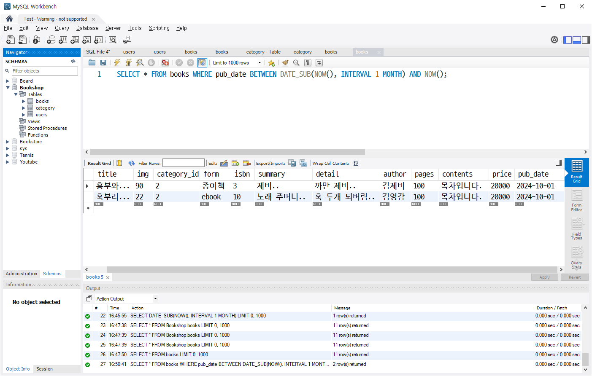<br><br/>

## 🌊 카테고리별, 신간, 도서 목록 조회

<span style="color:lightseagreen">💫 **카테고리별, 신간, 도서 목록 조회**</span><br>

```sql
SELECT * FROM books WHERE category_id=2 AND pub_date BETWEEN DATE_SUB(NOW(), INTERVAL 1 MONTH) AND NOW();
```

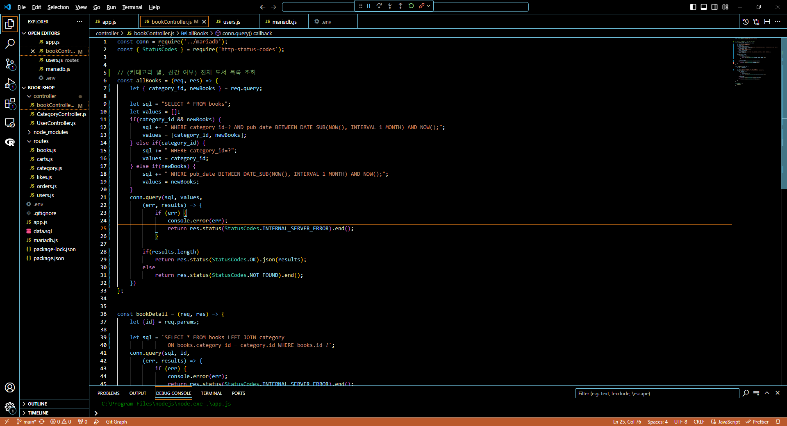<br>

\<POSTMAN 실행결과><br>
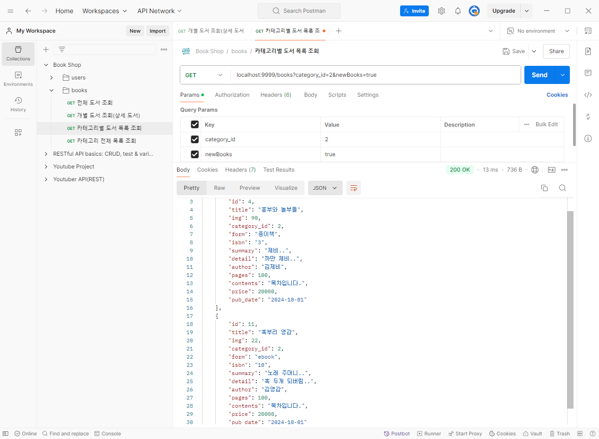<br>
- 카테고리 별, 신간 여부를 통해 출력가능<br><br/>

## 🌊 도서 목록 조회 페이징 구현하기 1

<span style="color:lightseagreen">💫 **데이터베이스 페이징(paging)**</span><br>

페이징 : 몇 개씩 보내줄까?<br>
　　ex. SELECT * FROM books; => 전체 도서 리스트 100개<br>
　　　　...8개씩 필요한데..<br>
　　　　...4개씩 필요한데..<br>

**SELECT * FROM books LIMIT 4 OFFSET 8;**<br>
SELECT * FROM books LIMIT 8, 4;도 같은 의미<br>

- LIMIT : 출력할 행의 수<br>
-  OFFSET => 시작 지점( = 내가 .. 지금 몇 페이지더라?)<br>

<br>

```sql
SELECT * FROM books LIMIT 3 OFFSET 0;
```
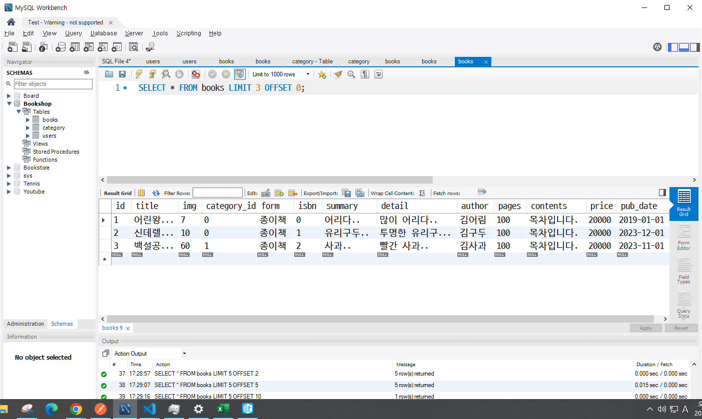<br>
- 3개씩 1번째의 페이지(첫 번째 줄부터(OFFSET은 0부터)) 출력.<br>

<br>

```sql
SELECT * FROM books LIMIT 4 OFFSET 8;
```
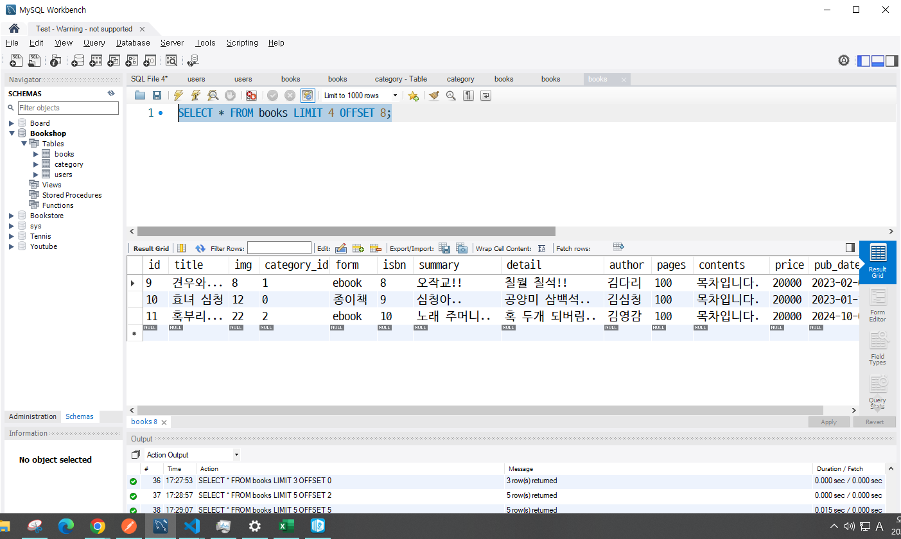<br>
- 4개씩 3번째의 페이지 출력.<br><br/>

## 🌊 도서 목록 조회 페이징 구현하기 2

<span style="color:lightseagreen">💫 **도서 목록 조회 페이징 구현하기 2**</span><br>

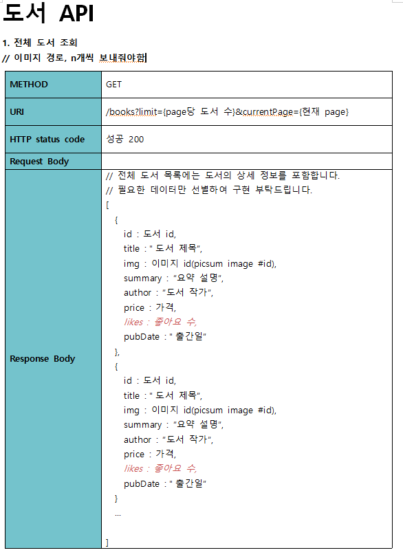<br>
- URI 수정(limit과 currentPage 쿼리 추가)<br><br>

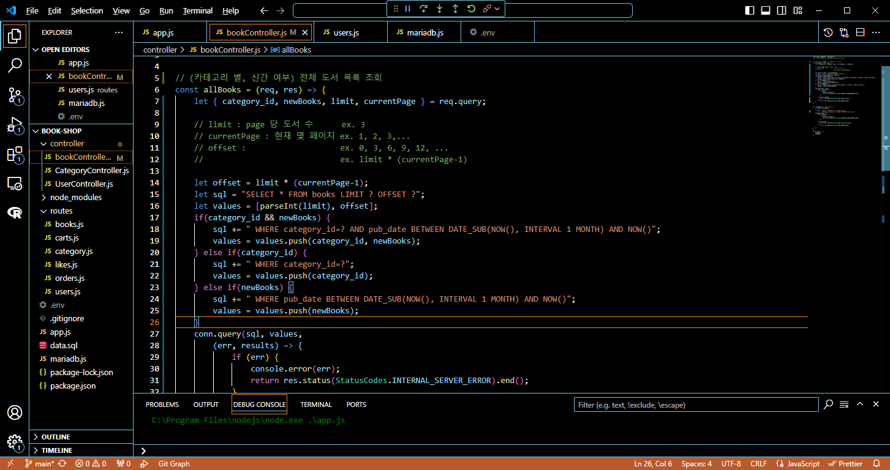<br>
- limit : page 당 도서 수　　　　　 ex. 3<br>
- currentPage : 현재 몇 페이지　　  ex. 1, 2, 3,...<br>
- offset :　　　　　　　　　　　　ex. 0, 3, 6, 9, 12, ...<br>
- 최종 offset :　　　　　　　　　   ex. limit * (currentPage-1)<br><br>

\<POSTMAN 실행결과><br>
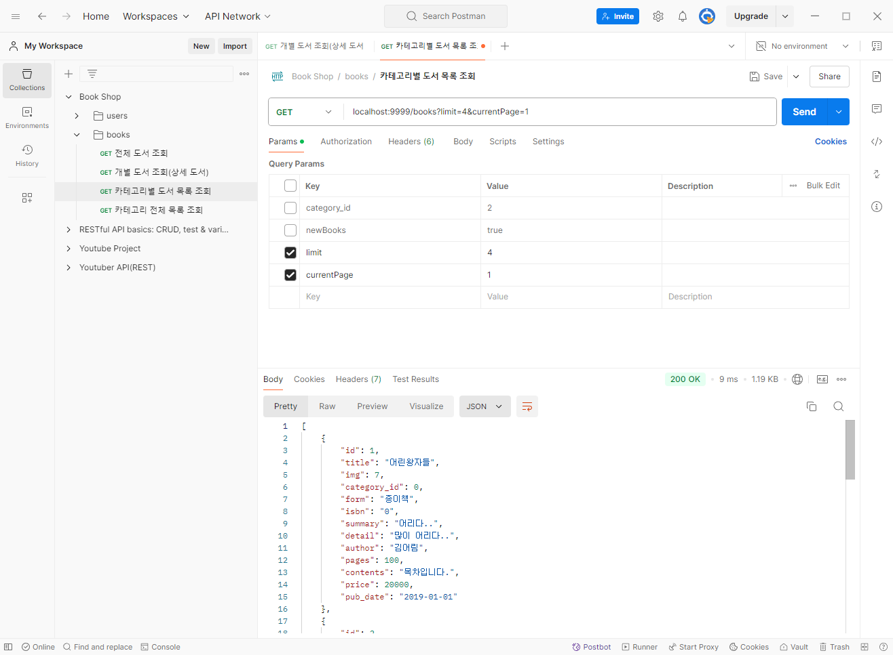<br>
- limit과 currentPage는 잘 작동하는데 category_id와 newBooks가 잘 작동하지 않음. 수정 필요.<br><br/>

## 🌊 신간 안내 구현

<span style="color:lightseagreen">💫 **신간 안내 구현**</span><br>

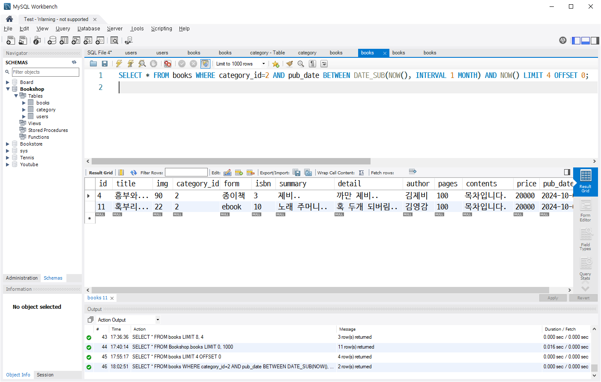<br>
- LIMIT ? OFFSET ?은 중간이 아니라 맨 뒤에 붙어야 잘 작동한다는 걸 확인 가능!<br>

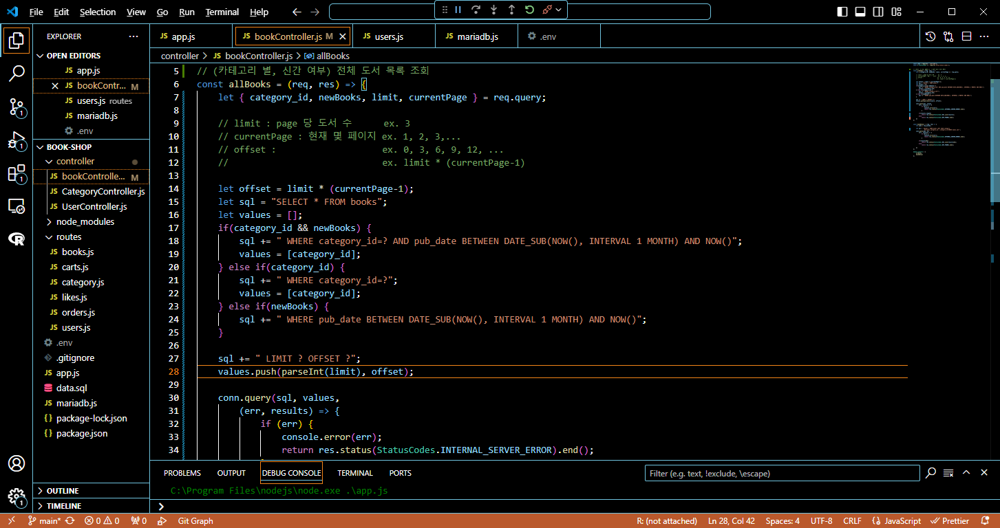<br>
```javascript
    let offset = limit * (currentPage-1);
    let sql = "SELECT * FROM books";
    let values = [];
    if(category_id && newBooks) {
        sql += " WHERE category_id=? AND pub_date BETWEEN DATE_SUB(NOW(), INTERVAL 1 MONTH) AND NOW()";
        values = [category_id];
    } else if(category_id) {
        sql += " WHERE category_id=?";
        values = [category_id];
    } else if(newBooks) {
        sql += " WHERE pub_date BETWEEN DATE_SUB(NOW(), INTERVAL 1 MONTH) AND NOW()";
    }
    sql += " LIMIT ? OFFSET ?";
    values.push(parseInt(limit), offset);
```
- 수정된 부분!<br><br>

\<POSTMAN 실행결과><br>
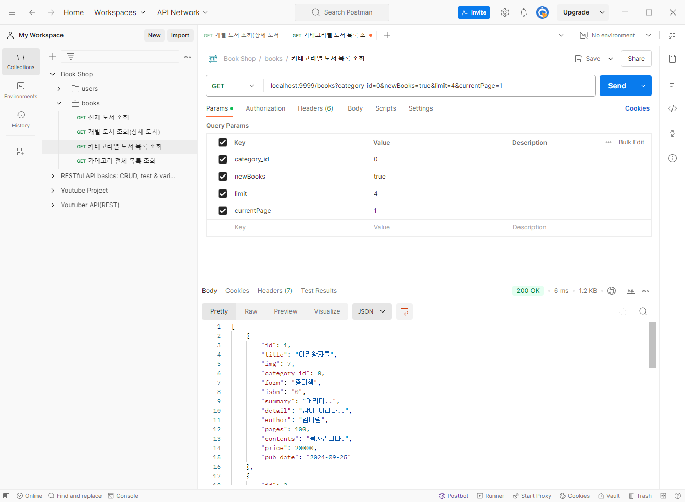<br>
- 이제 category_id와 newBooks가 제대로 작동함!<br><br/>

## 🌊 느낀 점(YWT)

**Y 일을 통해 명확히 알게 되었거나 이해한 부분(한 일)에 대해 정리 :**<br>
API 조인 구현, 페이징 구현<br>

**W 배운 점과 시사점 :**<br>
페이징 : **SELECT * FROM books LIMIT 4 OFFSET 8;**<br>
SELECT * FROM books LIMIT 8, 4;도 같은 의미<br>

- LIMIT : 출력할 행의 수<br>
-  OFFSET => 시작 지점( = 내가 .. 지금 몇 페이지더라?)<br>

**T 응용하여 배운 것을 어디에 어떻게 적용할지:**<br>
API를 구현할 때 조인을 통해 필요한 데이터만 반환할 수 있게 됨! + 페이징을 통해 페이지 구현<br>