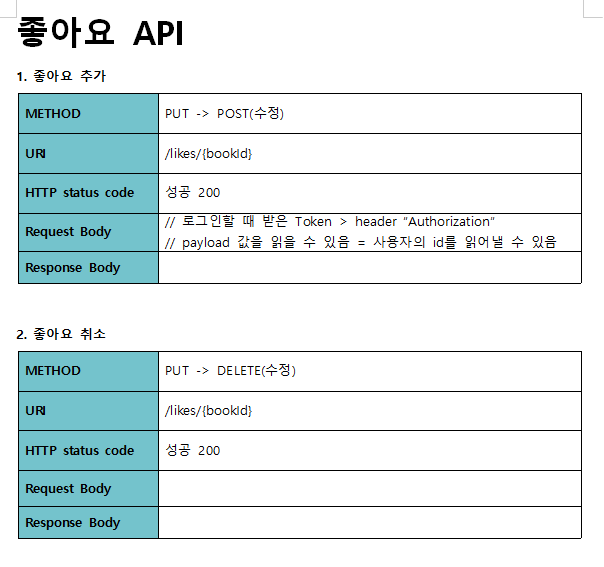
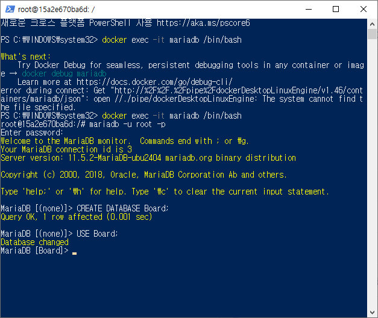
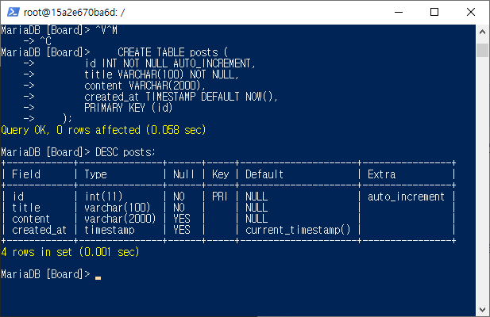
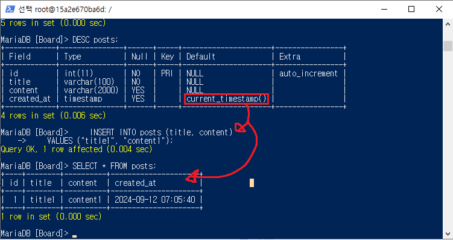
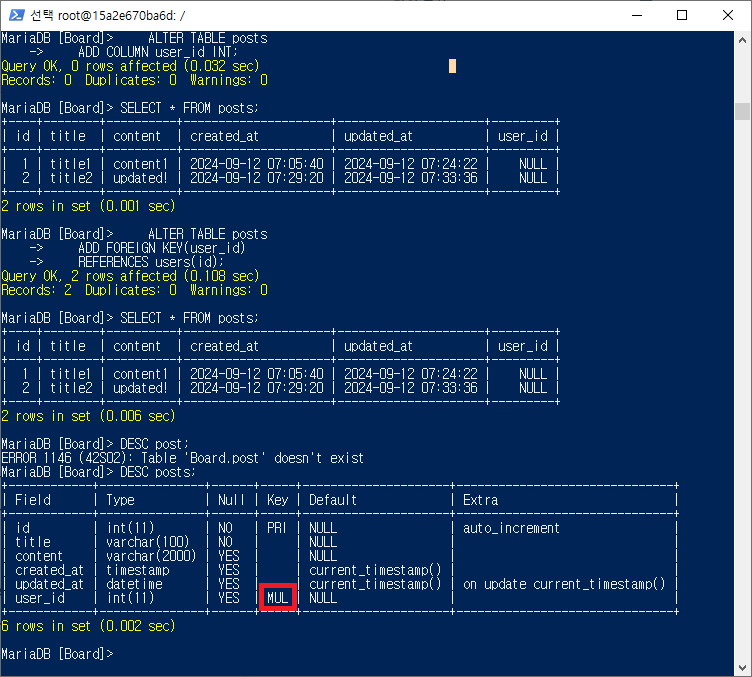

# 프로그래머스 풀스택 31
프로젝트: Node.js 기반의 REST API 구현(8)

## 🌊 좋아요 DB 설계
<span style="color:lightseagreen">💫 **좋아요 DB 설계**</span><br>

\<dbdiagram 설계><br>
<br>

<br>
- likes 테이블 생성 및 외래키 설정<br>

<br>

\<좋아요 추가 API 설계 수정><br>
<br>
- 누가 좋아요 눌렀는지 알 수 있는 방법? : 로그인한 상태여야 좋아요가 가능, 로그인 토큰으로 유저가 누군지 파악하기<br>
- 따라서 Request Body를 수정해줌<br><br/>

## 🌊 좋아요 추가 구현

<span style="color:lightseagreen">💫 **좋아요 추가 구현**</span><br>

<br>
- 처음에 const {id} = req.params;가 아닌 const {liked_book_id} = req.params;
했더니 오류가 났음<br>
- 이유 : **URL 파라미터의 이름과 일치하지 않기 때문**<br>
- 라우트 정의가 /likes/:id로 되어 있다면, **URL 파라미터 이름이 :id**로 정의되어 있기 때문에 req.params에서 값을 가져올 때에도 **id**라는 이름을 사용해야 함.<br><br>

\<POSTMAN 실행결과><br>
<br><br>

\<Workbench 결과><br>
<br>
- 잘 작동하는 걸 확인!<br><br/>

## 🌊 좋아요 삭제 구현

<span style="color:lightseagreen">💫 **좋아요 삭제 구현**</span><br>

<br>

\<POSTMAN 실행결과><br>
<br>
- 잘 작동함!<br><br>

## 🌊 count(), AS, 서브쿼리의 등장

<span style="color:lightseagreen">💫 **count()**</span><br>
**Workbench에서는 PK가 없으면 무조건 Read Only 테이블이 됨!!**<br>

<br>
<br>
```sql
SELECT count(*) FROM likes WHERE liked_book_id = 1;
```
- count()를 사용하면 조건을 만족하는 행 개수 출력!!<br><br>

<span style="color:lightseagreen">💫 **AS**</span><br>

<br>
```sql
SELECT *, (SELECT count(*) FROM likes WHERE liked_book_id=books.id) AS likes FROM books;
```
- 조인이 되지 않은 두 개의 테이블을 엮어서 출력하기<br><br>

<span style="color:lightseagreen">💫 **서브쿼리의 등장**</span><br>

**좋아요 개수 세서 books 테이블에 컬럼 추가해서 출력해주기**<br>
도서 테이블 전체 조회
- SELECT * FROM books;<br>
- SELECT 컬럼명1, 컬럼명2, ... FROM 테이블명;<br>

도서 테이블 전체 조회 + 컬럼 1개 추가하기<br>
SELECT *,<br>
　　값 AS 새로 추가할 컬럼명<br>
　　FROM books;<br>

SELECT *,<br>
　　(각 행마다 likes 테이블에 liked_book_id로 가지고 있는 행 수) AS likes<br>
　　FROM books;

SELECT *,<br>
　　**(SELECT count(\*) FROM likes WHERE liked_book_id=books.id) AS likes**<br>
　　**FROM books;** 👉 서브 쿼리!!<br> 

<br> 

🙌 **서브(sub) 쿼리** : 쿼리 안에 쿼리<br>
- 데이터의 양이 많다면, JOIN과 GROUP BY를 사용하는 것이 더 효율적!!<br>

🙌 **count()** : 행 개수<br>

🙌 **AS** : 컬럼 별칭<br><br>

<details>
<summary>✨백엔드 심화 SQL 접기/펼치기✨</summary>
<div markdown="1">

1. **"Board"스키마 생성**<br>
    ```sql
    CREATE DATABASE Board;
    USE Board;
    ```
    <br>

2. **사용자 테이블 생성**<br>
- 테이블 이름은 기본적으로 복수형 추천(테이블 안에 여러 개가 들어가므로)!<br>
- AUTO_INCREMENT : 자동 숫자 증가(기입 기능)<br>
    ```sql
    CREATE TABLE users (
        id INT NOT NULL AUTO_INCREMENT,
        name VARCHAR(30) NOT NULL,
        job VARCHAR(100),
        birth DATE,
        PRIMARY KEY (id)
    );
    ```
    <br>

3. **사용자 데이터 삽입**<br>
- VALUES ("haerin", "idol","100101");을 해도 위의 2번에서 birth DATE덕분에 자동으로 적혀짐! 그래도 입력할 때 맞춰서 입력해주는 게 좋음!<br>
- NOT NULL -> 무조건 값을 넣기!(이름이 null이여도 X)<br>
    ```sql
    INSERT INTO users (name, job, birth)
    VALUES ("haerin", "idol","20060515");
    ```
    ```sql
    INSERT INTO users (name, job, birth)
    VALUES ("haerin", "student","2006-07-15");
    ```
    ```sql
    INSERT INTO users (name, job, birth)
    VALUES ("danielle", "idol","2005-04-11");
    ```    
    ```sql
    INSERT INTO users (name, job, birth)
    VALUES ("minji", "idol","2004-05-07");
    ```  
    ```sql
    INSERT INTO users (name, job, birth)
    VALUES ("hanni", "idol","2004-10-06");
    ```  
    <br>

4. **게시글 테이블 생성**<br>
- 작성 일자 : created_at(보편적으로 사용)<br>
- 수정 일자 : updated_at(보편적으로 사용)<br>
    ```sql
    CREATE TABLE posts (
        id INT NOT NULL AUTO_INCREMENT,
        title VARCHAR(100) NOT NULL,
        content VARCHAR(2000),
        created_at TIMESTAMP DEFAULT NOW(),
        PRIMARY KEY (id)
    );
    ```
    <br>

5. **게시글 데이터 삽입**<br>
- TIMESTAMP DEFAULT NOW()을 통해 created_at 값을 적지 않아도 자동입력됨!<br>
    ```sql
    INSERT INTO posts (title, content)
    VALUES ("title1", "content1");
    ```
    <br>

6. **게시글 테이블에 수정일자 추가**<br>
- ALTER을 통해 수정일자를 추가하기<br>
    ```sql
    ALTER TABLE posts
    ADD COLUMN updated_at DATETIME
    DEFAULT NOW()
    ON UPDATE NOW();
    ```
    <br>

7. **게시글 테이블 id 2 수정**<br>
- UPDATE를 이용하여 update된 시간 갱신해보기<br>
    ```sql
    UPDATE posts
    SET content="updated!"
    WHERE id = 2;
    ```
    <br>

8. **게시글 테이블에 작성자 컬럼 FK 추가**<br>
- MUL(MULTIPLE) : 기본키 값을 가져다 쓰고 있는 외래키지만 중복이 가능하므로 MUL!<br>
    ```sql
    ALTER TABLE posts
    ADD COLUMN user_id INT;
    ```
    ```sql
    ALTER TABLE posts
    ADD FOREIGN KEY(user_id)
    REFERENCES users(id);
    ```
    <br>

9. <span style="color:lightseagreen">**✨조인(정규화)✨**</span><br>
- **SELECT 할 때만 보기 편하라고 해주는 것임!!(실제로 테이블을 생성하진 않음!!)**<br>
(가상의 테이블을 임시로 돌려주는 것)<br>
- 게시글의 사용자 번호와 사용자의 사용자 번호가 같으면 붙이는 조건<br>
    ```sql
    SELECT * FROM posts LEFT
    JOIN users ON posts.user_id = users.id;
    ```
    ```sql
    SELECT posts.id, title, content, created_at, updated_at, name, job, birth  FROM posts LEFT
    JOIN users ON posts.user_id = users.id;
    ```
    <br>

10. **조건을 만족하는 행 개수**<br>
- count()를 쓰면 조건을 만족하는 행 개수 출력 가능<br>
    ```sql
    SELECT count(*) FROM likes WHERE liked_book_id = 1;
    ```
    <br>

11. **좋아요 개수가 포함된 books 테이블 조회**<br>
- 서브 쿼리를 사용해 출력하기<br>
    ```sql
    SELECT *, (SELECT count(*) FROM likes WHERE liked_book_id=books.id) AS likes FROM books;
    ```
    <br>

12. **개별 도서 조회 시, 사용자가 좋아요를 했는지 여부를 포함**<br>
- 특정 책의 상세 정보를 가져오는 동시에<br>
- **좋아요 수\(likes)를 계산**하고<br>
- **특정 유저가 좋아요를 눌렀는지 여부\(liked)를 확인**<br>
- 또한 **해당 책의 카테고리 정보**도 함께 가져옴<br>
- 결론 : 사용자 인터페이스에서 책의 상세 페이지를 보여줄 때 유저가 좋아요를 눌렀는지 여부와 좋아요 수를 함께 표시<br>
    ```sql
    SELECT *, 
	    (SELECT count(*) FROM likes WHERE liked_book_id=books.id) AS likes,
	    (SELECT EXISTS (SELECT * FROM likes WHERE user_id=1 AND liked_book_id=1)) AS liked 
        FROM books 
        LEFT JOIN category 
        ON books.category_id = category.category_id
        WHERE books.id=1;
    ```
    <br>
<br><br/>

</div>
</details>

<br><br/>

## 🌊 나는 개발한다 고로 나는 EXISTS 한다.

<span style="color:lightseagreen">💫 **나는 개발한다 고로 나는 EXISTS 한다.**</span><br>


<br>

\<POSTMAN 실행결과><br>
<br>
- 서브 쿼리를 이용해 잘 작동하는 걸 확인<br>

<br>

<br>
```sql
SELECT EXISTS (SELECT * FROM likes WHERE user_id=1 AND liked_book_id=1);
```
<br>
```sql
SELECT count(*) FROM likes WHERE user_id=1 AND liked_book_id=1;
```
- 두 sql문이 같은 의미임을 알 수 있음!<br><br/>

## 🌊 좋아요 했는지 여부도 알려주기


<span style="color:lightseagreen">💫 **좋아요 했는지 여부도 알려주기**</span><br>

<br>
- likes와 liked로 좋아요 여부 표시 가능하게 함<br><br>

<br>

<br>

\<POSTMAN 실행결과><br>
<br>
- 그런데 출력에서 id값이 왜 0이지!?<br><br/>

## 🌊 category_id? id?!

<span style="color:lightseagreen">💫 **category_id? id?!**</span><br>

category_id : 0 값이 POSTMAN에서 출력할 때 덮어쓰기되어 id : 0으로 나오는 것<br>

<br>
<br>

\<POSTMAN 실행결과><br>
<br>
```sql
SELECT *, 
	(SELECT count(*) FROM likes WHERE liked_book_id=books.id) AS likes,
	(SELECT EXISTS (SELECT * FROM likes WHERE user_id=1 AND liked_book_id=1)) AS liked 
    FROM books 
    LEFT JOIN category 
    ON books.category_id = category.category_id
    WHERE books.id=1;
```
- category 테이블에서 id를 category_id로 이름을 변경해줌. 잘 작동됨!<br><br/>

## 🌊 느낀 점(YWT)

**Y 일을 통해 명확히 알게 되었거나 이해한 부분(한 일)에 대해 정리 :**<br>
count(), AS, 서브쿼리<br>

**W 배운 점과 시사점 :**<br>
🙌 **서브(sub) 쿼리** : 쿼리 안에 쿼리<br>
- 데이터의 양이 많다면, JOIN과 GROUP BY를 사용하는 것이 더 효율적!!<br>

🙌 **count()** : 행 개수<br>

🙌 **AS** : 컬럼 별칭<br>

**T 응용하여 배운 것을 어디에 어떻게 적용할지:**<br>
항상 출력을 할 때 테이블을 수정하지 않고도 원하는 데이터를 출력할 수 있는 방법이 있다는 걸 잊지 말기!<br>