# 프로그래머스 풀스택 32
프로젝트: Node.js 기반의 REST API 구현(9)

## 🌊 장바구니 테이블 생성
<span style="color:lightseagreen">💫 **장바구니 테이블 생성**</span><br>

장바구니에 담겨있는 item에 대한 API임!<br>
회원 1명당 무조건 장바구니 1개씩!<br>

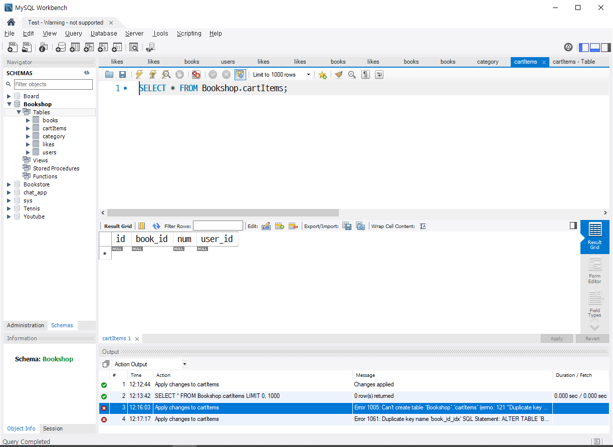<br>
- cartItems 테이블 생성!<br><br>

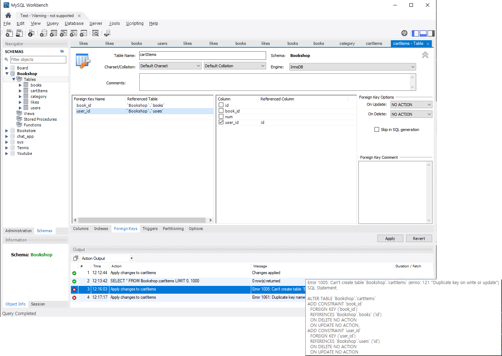<br>
- 하지만 에러 121이 발생!<br><br/>

## 🌊 제약조건 이름 정해주기

<span style="color:lightseagreen">💫 **제약조건 이름 정해주기**</span><br>

외래키 제약조건의 이름때문에 errno: 121 "Duplicate key on write or update”이 발생한 것!<br>

[**FK 제약조건 이름 짓기**]<br>
fk_기준 테이블명_참조테이블명_참조키<br>
**cartItems.user_id > users.id** : fk_cartItems_users_id<br>
**likes_user_id > users.id** : fk_likes_users_id<br>

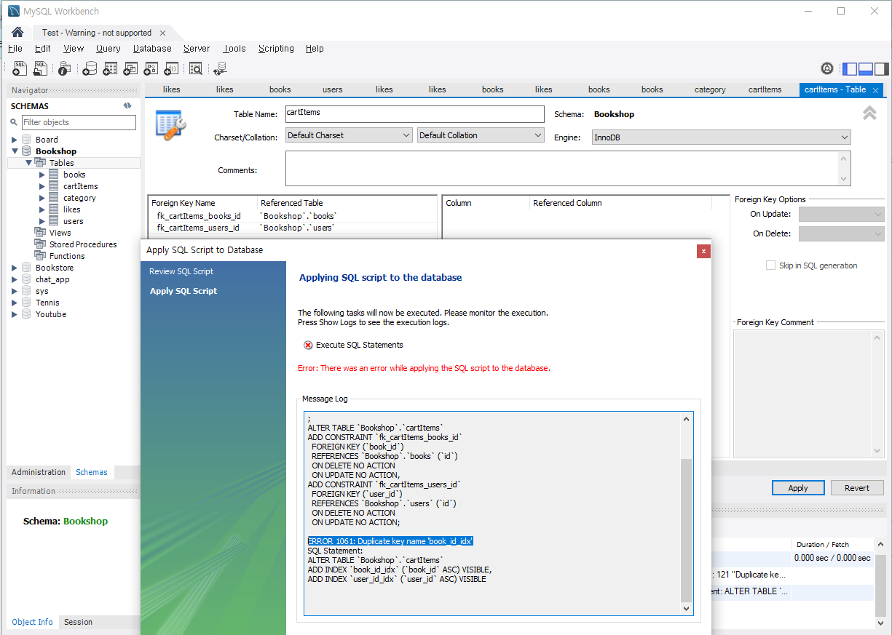<br>
- 하지만 또 오류가 발생함!<br>
ERROR 1061: Duplicate key name 'book_id_idx'<br><br/>

## 🌊 인덱스 이름 고치고, 장바구니 insert 해보기

<span style="color:lightseagreen">💫 **인덱스 이름 고치고, 장바구니 insert 해보기**</span><br>

ERROR 1061: Duplicate key name 'book_id_idx'가 에러가 발생한 이유는 자동으로
sql에서 관리하기 쉽게 인덱스를 추가해주는데, 인덱스 이름이 변경되지 않은 것!<br>

**index** : 데이터베이스 내에서 일종의 목차를 생성한다고 생각하면 됨.<br>

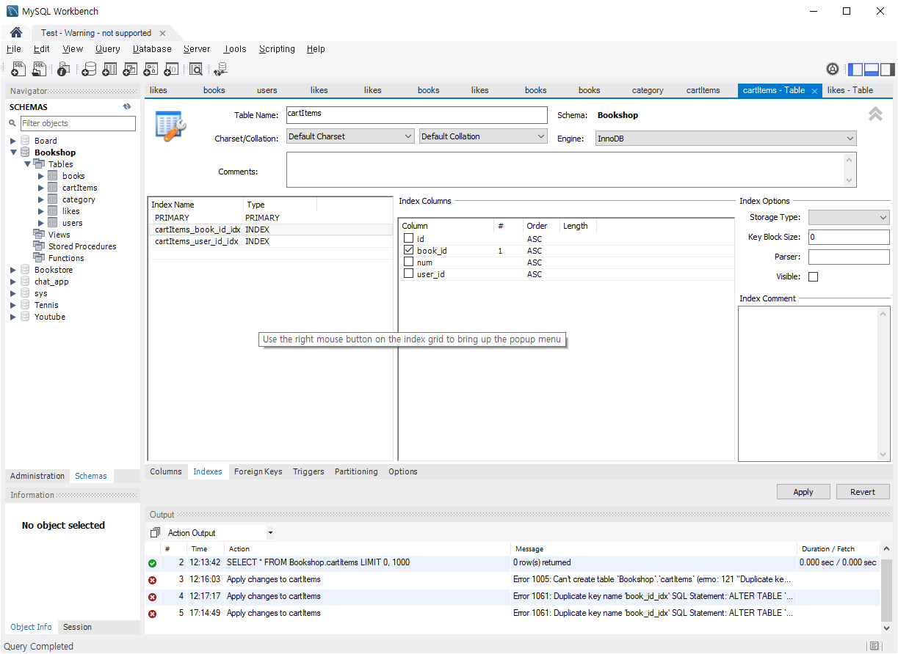<br>
- 이렇게 index도 수정하면 잘 작동함<br><br>

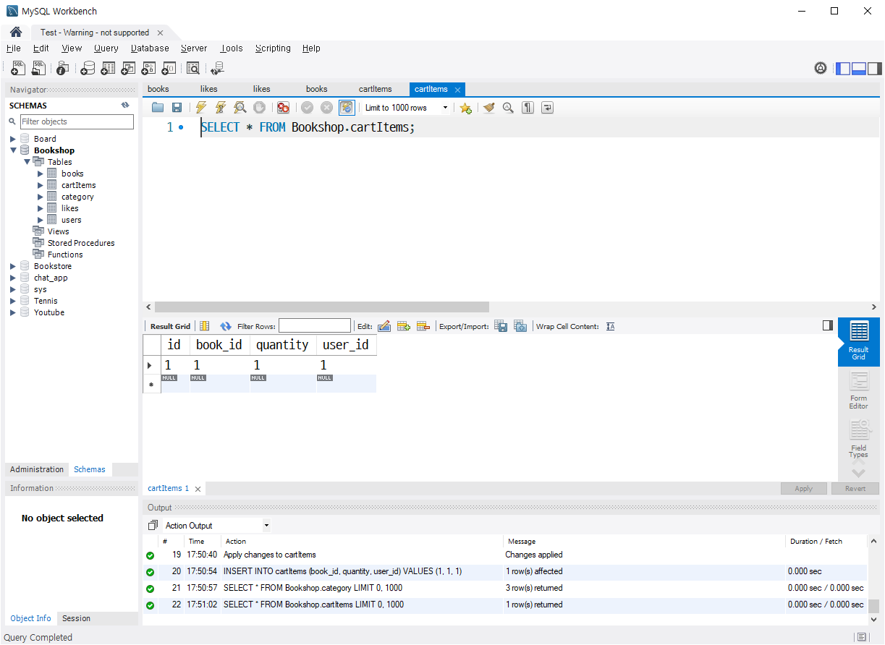<br>
- 장바구니에 값 insert 완료<br><br/>

## 🌊 장바구니 담기 API 구현

<span style="color:lightseagreen">💫 **장바구니 담기 API 구현**</span><br>


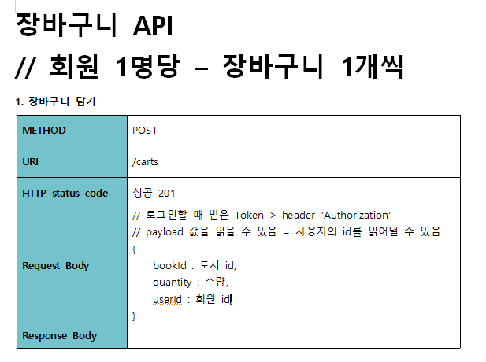<br>

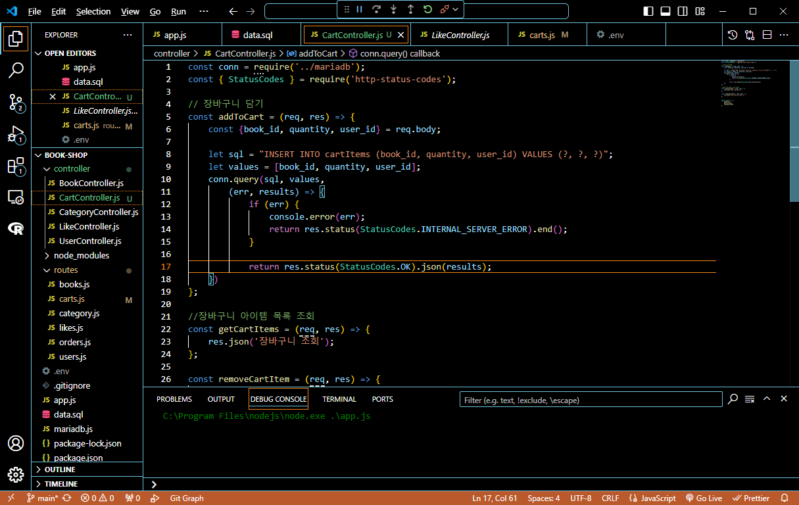<br>

\<POSTMAN 실행결과><br>
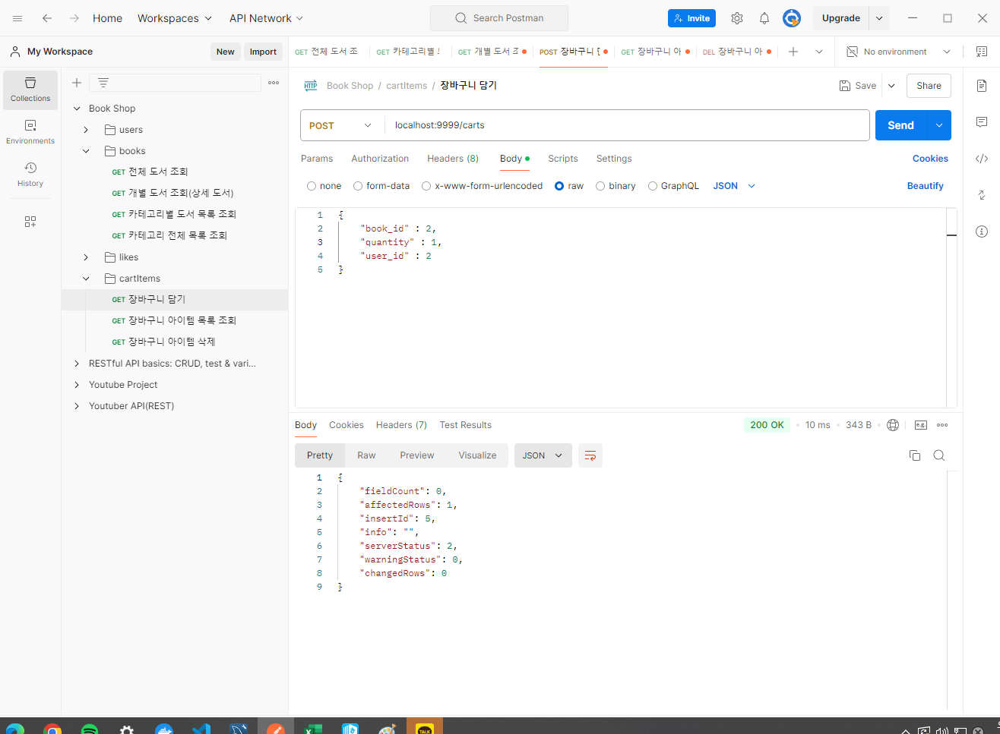<br>

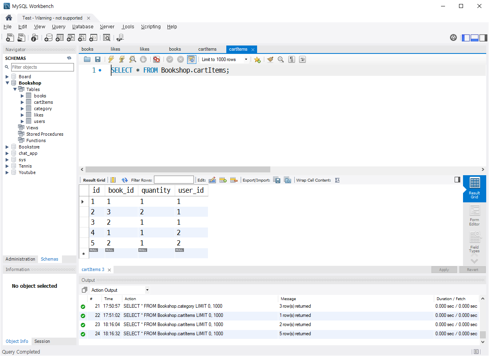<br>
- workbench에 잘 들어간 걸 확인!<br><br/>

## 🌊 장바구니 목록 조회 API 구현

<span style="color:lightseagreen">💫 **장바구니 목록 조회 API 구현**</span><br>

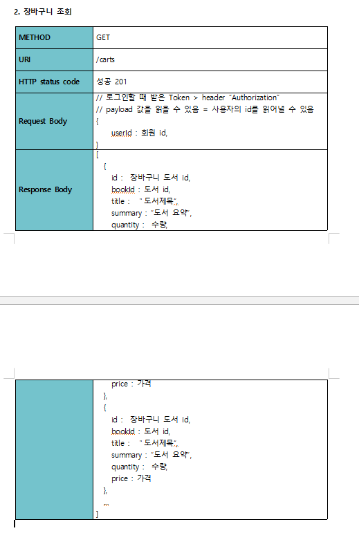<br><br>

```sql
// 장바구니 아이템 목록 조회
SELECT cartItems.id, book_id, title, summary, quantity, price 
FROM cartItems LEFT JOIN books 
ON cartItems.book_id = books.id;
```

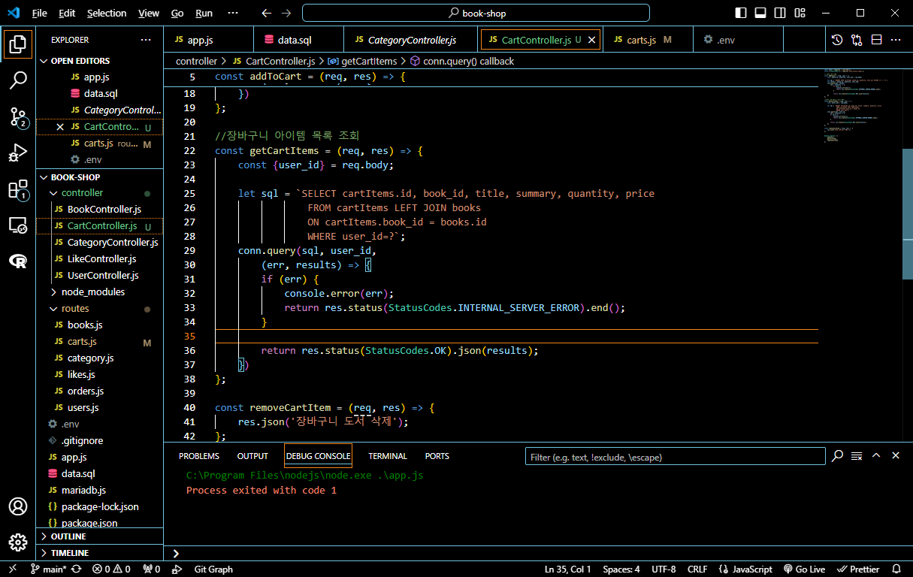<br>
```javascript
let sql = `SELECT cartItems.id, book_id, title, summary, quantity, price 
            FROM cartItems LEFT JOIN books 
            ON cartItems.book_id = books.id
            WHERE user_id=?`;
```
- 위의 sql문을 이용해서 쿼리문 완성<br><br>

\<POSTMAN 실행결과><br>
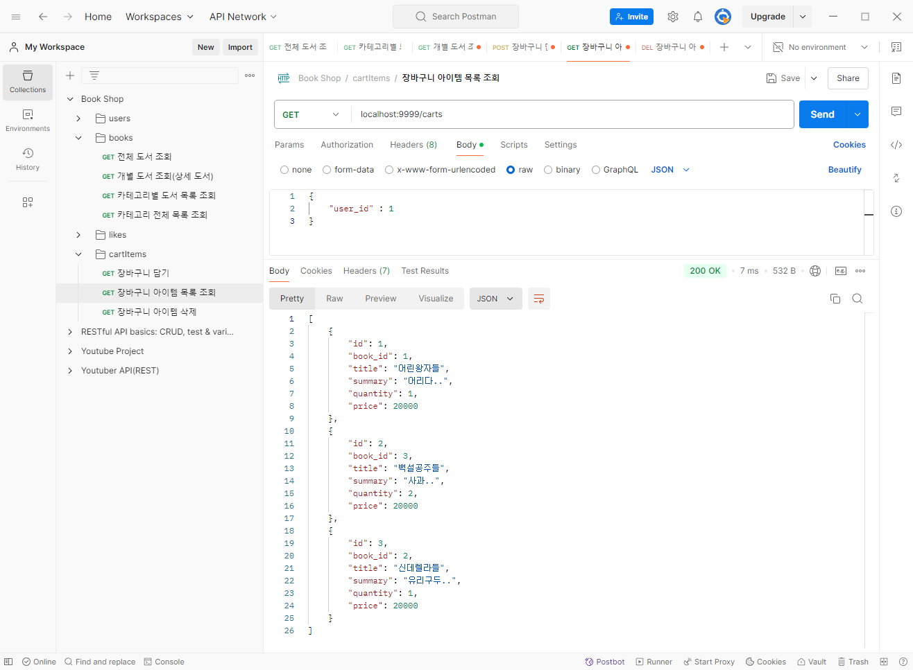<br><br/>

## 🌊 장바구니에서 선택한 상품 목록 조회 1탄

<span style="color:lightseagreen">💫 **장바구니에서 선택한 상품 목록 조회 1탄**</span><br>

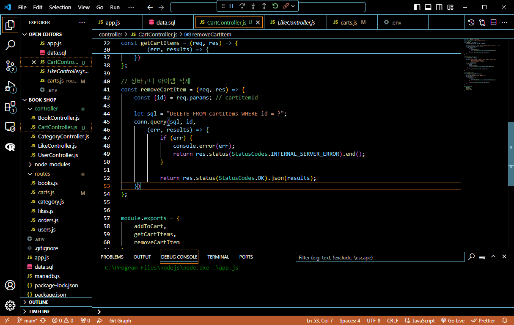<br>
- 장바구니 아이템 삭제 API 완성<br><br>

주요기능<br>
- 장바구니목록<br>
    - 대표이미지<br>
    - 제목<br>
    - 금액<br>
    - **수량 : 변경이 되면, => table cartItems update**<br>
    **이 페이지 나갔다가**<br>
    **다시 장바구니 페이지에 들어와도 반영되어 있음**<br>
- 장바구니에서 제거<br>
- 주문하기<br>
    - 체크한 상품을 주문 요청<br>

장바구니 item id를 알고 있으니까 백엔드로 다시 돌려주면 응답하도록 만들기<br><br/>

## 🌊 장바구니에서 선택한 상품 목록 조회 2탄

<span style="color:lightseagreen">💫 **장바구니에서 선택한 상품 목록 조회 2탄**</span><br>

여러 개의 데이터가 주어질 때 SQL SELECT를 어떻게 할까?<br>
```sql
// 장바구니에서 선택한(장바구니 도서 id) 아이템 목록 조회 (=선택한 장바구니 상품 목록 조회)
SELECT * FROM Bookshop.cartItems WHERE user_id=1 AND id IN (1,3)
```

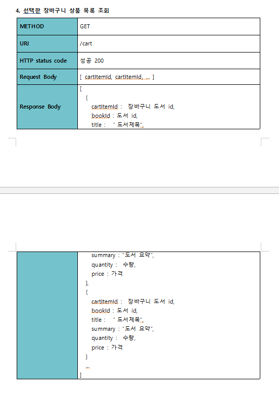<br>
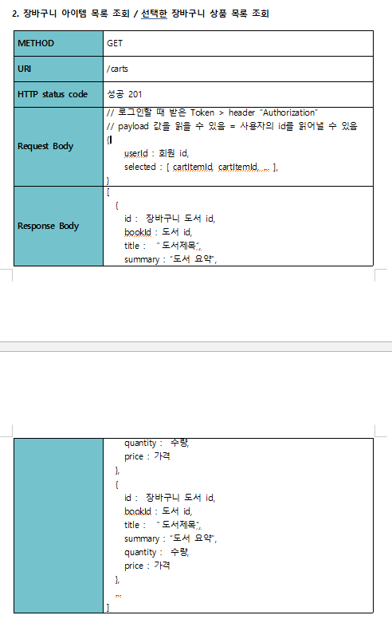<br>
- 장바구니 아이템 목록 조회와 사실상 API가 똑같고 Request Body 값에 selected를 같이 넣어 보내주면 그게 선택한 장바구니 상품 목록 조회 기능을 함<br>

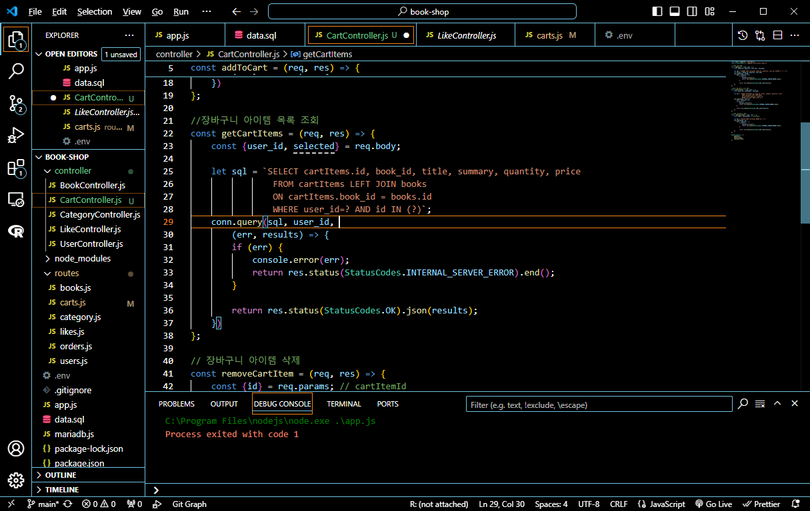<br>
```javascript
let sql = `SELECT cartItems.id, book_id, title, summary, quantity, price 
            FROM cartItems LEFT JOIN books 
            ON cartItems.book_id = books.id
            WHERE user_id=? AND id IN (?)`;
```
- 위의 SQL을 이용해 WHERE 문 뒤에 AND id IN (?)을 추가해주기<br><br/>

## 🌊 장바구니에서 선택한 상품 목록 조회 3탄

<span style="color:lightseagreen">💫 **장바구니에서 선택한 상품 목록 조회 3탄**</span><br>

그런데 cartItemId를 배열로 받기로 했음!(ex. selected = [1, 3])<br>
👉 그래서 **자바스크립트는 배열안의 요소를 뽑아서 쓸 수 있음!!**<br>

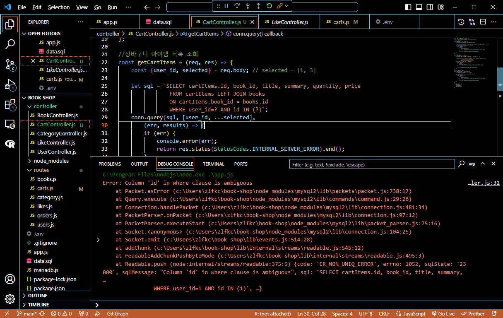<br>
- 이렇게 수정을하고 postman으로 selected = [1, 3]도 추가해서 보내면 오류가 남<br>
- 이름이 모호하다는 오류! 조인을 걸어놨기 때문에 workbench와 달리 두 개의 테이블을 얘기하고 있음.<br>
id 값이 cartItems의 값인지, books의 값인지 모호하다는 것!<br><br>

```javascript
let sql = `SELECT cartItems.id, book_id, title, summary, quantity, price 
            FROM cartItems LEFT JOIN books 
            ON cartItems.book_id = books.id
            WHERE user_id=? AND cartItems.id IN (?)`;
```
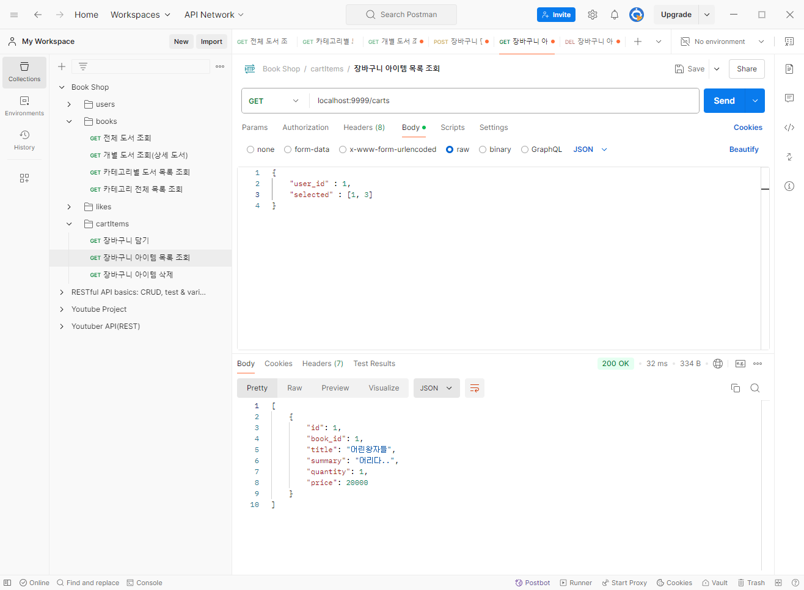<br>
- 이렇게 수정을 하고 POSTMAN에서 보면 3이 출력이 안되는 걸 볼 수 있음<br>
- 배열의 값이 2개이므로 2개만큼 물음표를 찍어주면 됨!<br><br>

```javascript
let sql = `SELECT cartItems.id, book_id, title, summary, quantity, price 
            FROM cartItems LEFT JOIN books 
            ON cartItems.book_id = books.id
            WHERE user_id=? AND cartItems.id IN (?, ?)`;
```
- 그런데 배열로 받는 값이 100개, 10000개 이러면 물음표를 하나 하나 찍을 순 없음을 알 수 있음!<br>
- 배열의 길이 만큼 for문을 써서 반복시켜 해결할 수 있지만...(가능하지만 쉽지않음)<br>
- 
    ```javascript
    //...생략
    let sql = `SELECT cartItems.id, book_id, title, summary, quantity, price 
            FROM cartItems LEFT JOIN books 
            ON cartItems.book_id = books.id
            WHERE user_id=? AND cartItems.id IN (?, ?)`;
    conn.query(sql, [user_id, ..selected], 
    //...생략
    ```
2021년 이후는 이 부분을 물음표를 1개만 남겨두고 아래처럼 바로 배열을 반환해주면 됨!!<br><br>

✨**진짜 최종 마지막 수정**✨
```javascript
//...생략
let sql = `SELECT cartItems.id, book_id, title, summary, quantity, price 
            FROM cartItems LEFT JOIN books 
            ON cartItems.book_id = books.id
            WHERE user_id=? AND cartItems.id IN (?)`;
let values = [user_id, selected];
conn.query(sql, values,
//...생략
```
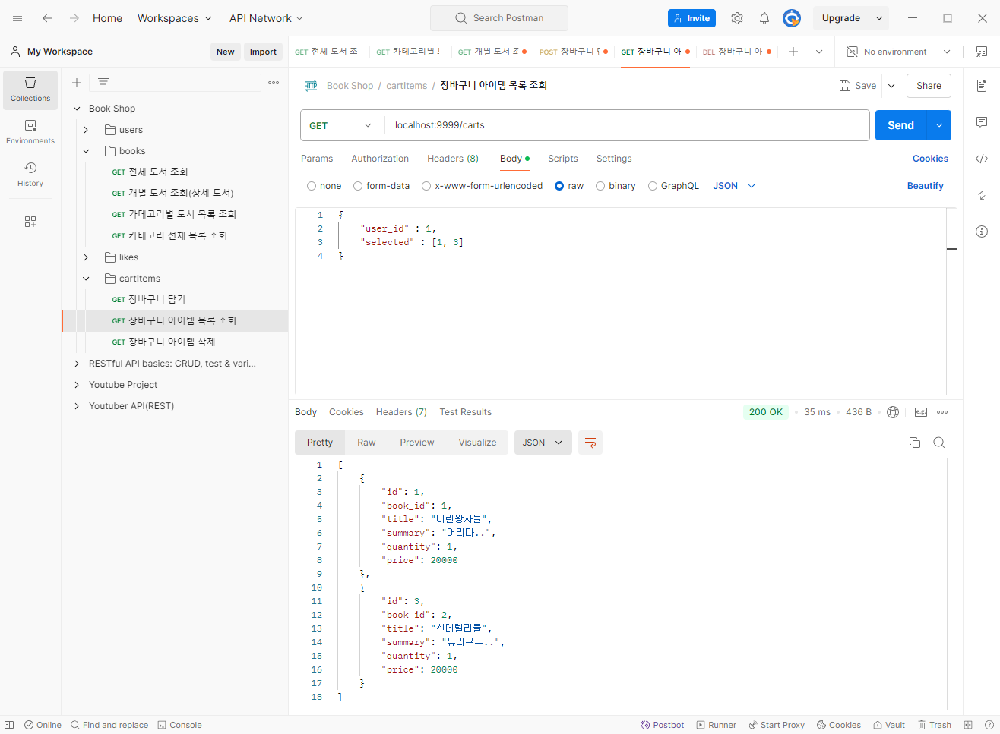<br>
- 잘 작동되는 걸 확인!!<br>

\<dbdiagram 수정><br>
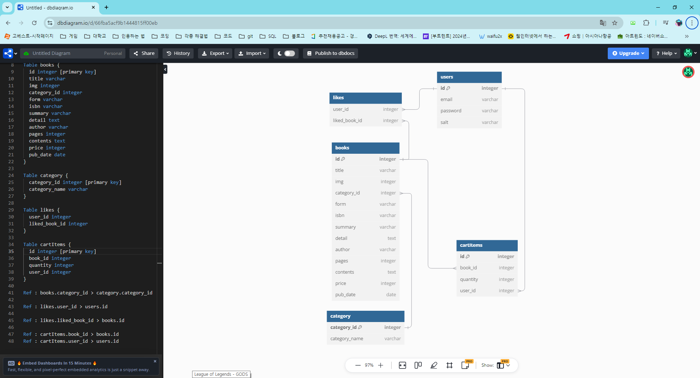<br><br/>

## 🌊 느낀 점(YWT)

**Y 일을 통해 명확히 알게 되었거나 이해한 부분(한 일)에 대해 정리 :**<br>
배열의 값을 req body로 받을 때 쿼리문작성!<br>

**W 배운 점과 시사점 :**<br>
2021년 이후는 배열의 값을 req body로 받을 때 물음표를 1개만 남겨두고 바로 배열을 반환해주면 됨!!<br>

**T 응용하여 배운 것을 어디에 어떻게 적용할지:**<br>
배열의 값을 req body 보내는 법도 배웠으므로 장바구니 API 설계도 혼자 할 수 있음!!<br>