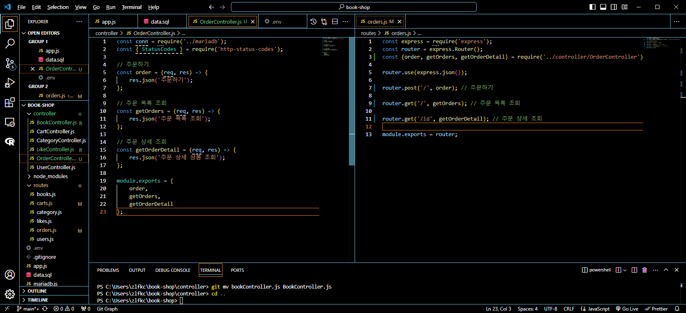
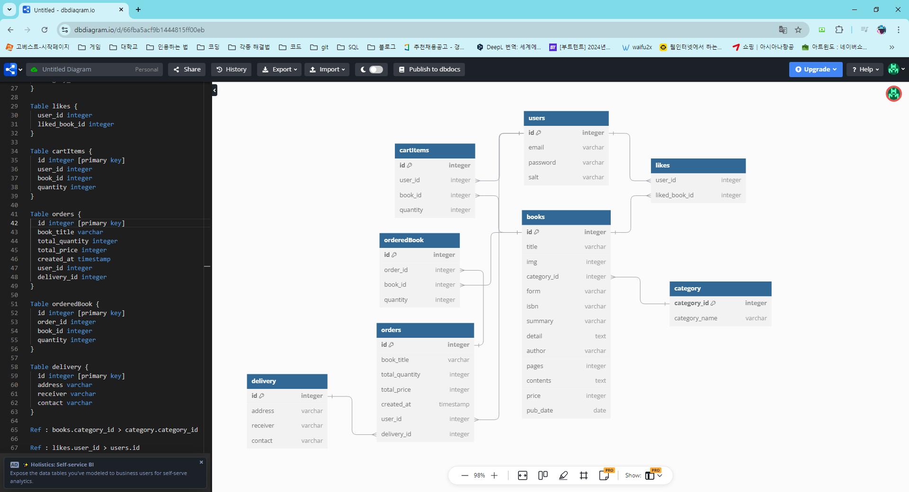
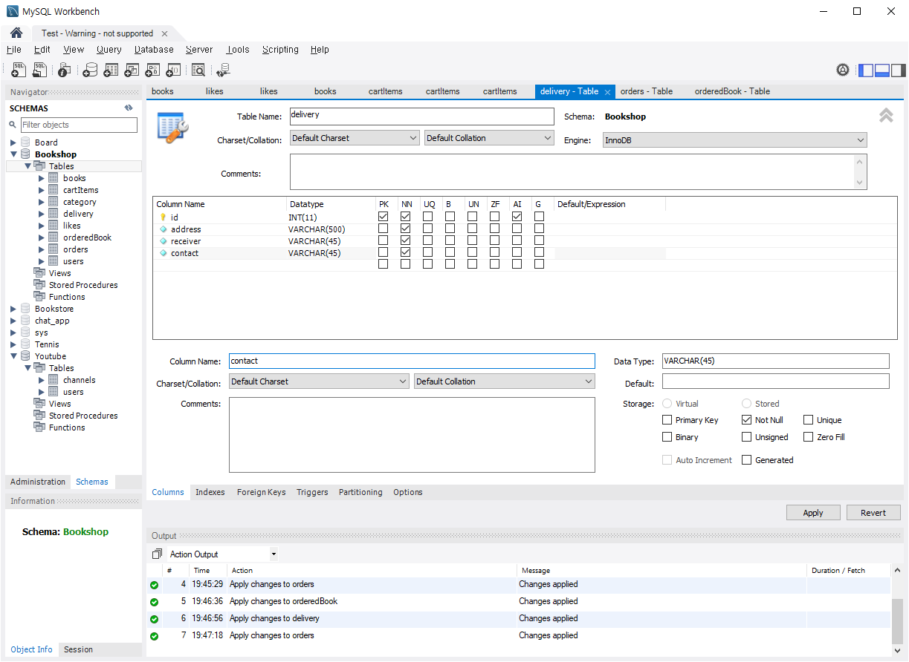
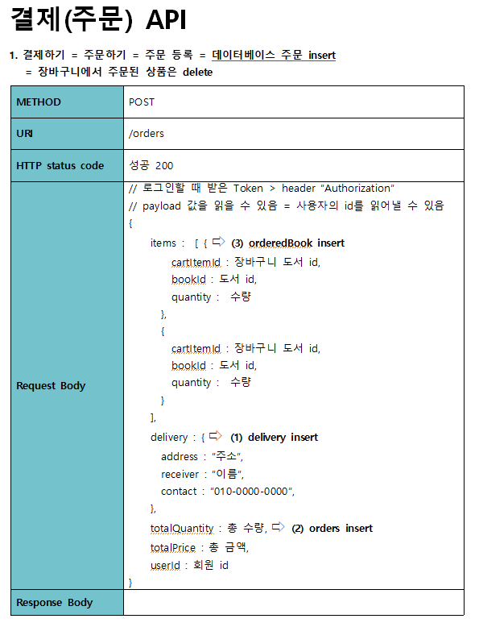
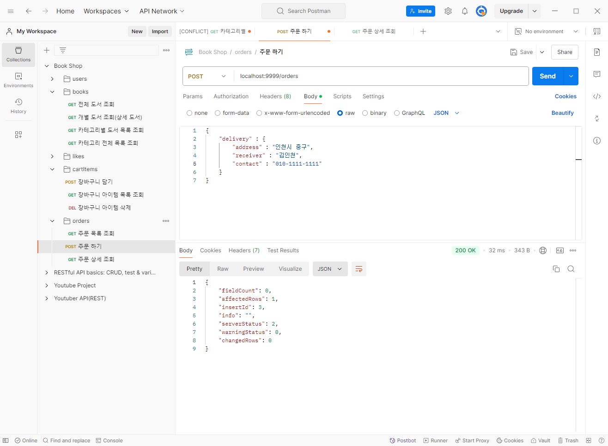
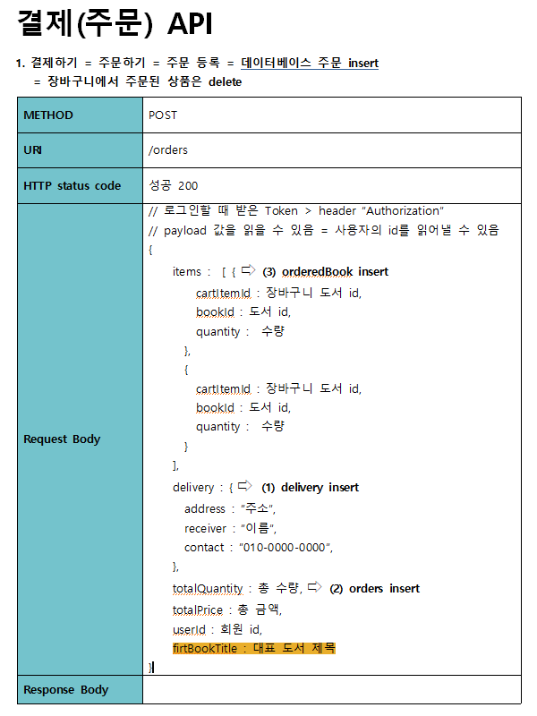
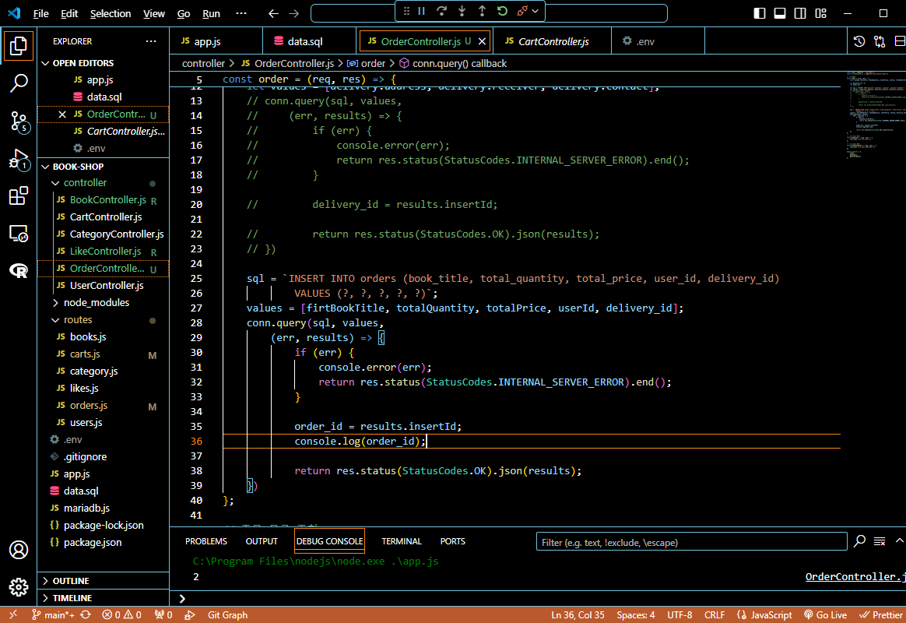
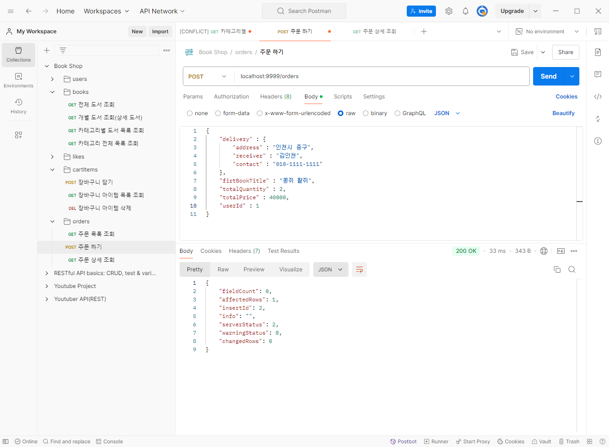
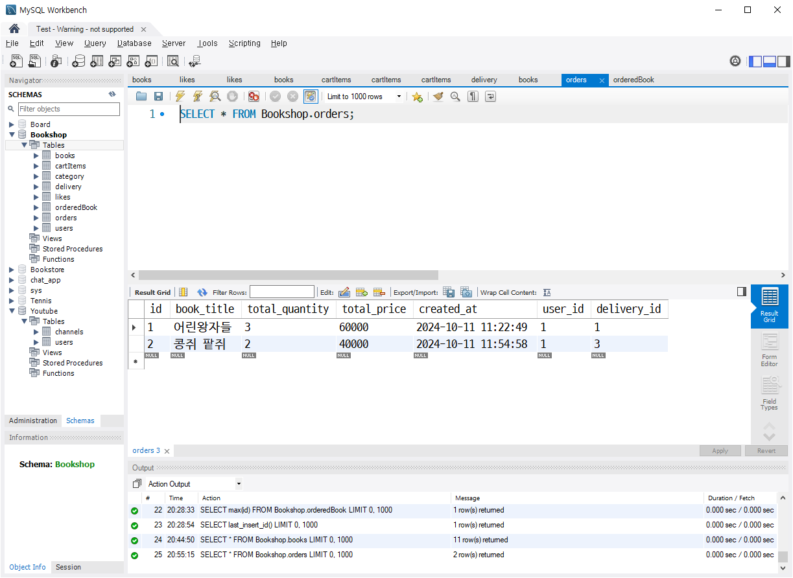

# 프로그래머스 풀스택 33
프로젝트: Node.js 기반의 REST API 구현(10)

## 🌊 주문 API 시작
<span style="color:lightseagreen">💫 **주문 API 시작**</span><br>

<br>
- POSTMAN에서 실행 잘 됨<br><br/>

## 🌊 주문 DB ERD 설계

<span style="color:lightseagreen">💫 **주문 DB ERD 설계**</span><br>

<br><br/>

## 🌊 주문 DB 생성

<span style="color:lightseagreen">💫 **주문 DB 생성**</span><br>

<br>
- Workbench에서 orders, orderedBook, delivery 테이블 생성 완료<br><br/>

## 🌊 FK 제약조건 생성, 전체 제약조건 컨벤션

<span style="color:lightseagreen">💫 **FK 제약조건 생성, 전체 제약조건 컨벤션**</span><br>

**[FK 제약조건 이름 짓기] : "컨벤션"**<br>
fk_기준 테이블명_참조테이블명_참조키<br>
**cartItems.user_id > users.id** : fk_cartItems_users_id<br>
**likes_user_id > users.id** : fk_likes_users_id<br>

각각의 테이블에 저 형식으로 FK 제약조건 이름 생성하기!<br><br/>

## 🌊 주문하기 SQL 생각해보기

<span style="color:lightseagreen">💫 **주문하기 SQL 생각해보기**</span><br>

<br>

```sql
// 배송 정보 입력
INSERT INTO delivery (address, receiver, contact) VALUES ("서울시 중구", "김난영", "010-1234-5678");
```

```sql
// 주문 정보 입력
INSERT INTO orders (book_title, total_quantity, total_price, user_id, delivery_id) 
VALUES ("어린왕자들", 3, 60000, 1, 1);
```

```sql
// 주문 상세 목록 입력
INSERT INTO orderedBook (order_id, book_id, quantity)
VALUES (1, 1, 1);
INSERT INTO orderedBook (order_id, book_id, quantity)
VALUES (1, 3, 2);
```
API 설계대로 delivery, orders, orderedBook순서대로 insert 쳐주기!<br><br/>

## 🌊 delivery 테이블 insert, insertId 가져다쓰기

<span style="color:lightseagreen">💫 **delivery 테이블 insert, insertId 가져다쓰기**</span><br>

**방금 insert한 데이터 PK 가져오는 법**<br>

```sql
SELECT last_insert_id();
```
- **LAST_INSERT_ID()** : 시간차 공격 👉 하나의 세션에만 유지가 되므로 이전 값을 들고오는 오류가 종종 발생!<br><br>

```sql
SELECT max(id) FROM Bookshop.orderedBook;
```
- **max()** : 우리가 필요한 건 언제나 최신 값이므로 max()값을 가져오면 됨!<br>


```sql
const delivery_id = SELECT max(id) FROM delivery;
```
따라서 이런 형태로 변수를 만들어서 사용도 가능함<br>


<br><br/>

## 🌊 delivery 테이블 insert, insertId 가져다쓰기

<span style="color:lightseagreen">💫 **delivery 테이블 insert, insertId 가져다쓰기**</span><br>

\<POSTMAN 결과><br>
<br>
- 여기서 insertId는 PK값이므로 가져다가 쓰면 됨!<br><br>

<br>
- delivery_id = results.insertId;로 가져다 쓰는 모습<br><br/>

## 🌊 orders insert

<span style="color:lightseagreen">💫 **orders insert**</span><br>

<br>
- 결제 API 수정. firtBookTitle 추가<br><br>

<br>

\<POSTMAN 결과><br>
<br>

\<Workbench 결과><br>
<br><br/>

## 🌊 orderedBook insert

<span style="color:lightseagreen">💫 **orderedBook insert**</span><br>

```javascript
    sql = `INSERT INTO orderedBook (order_id, book_id, quantity) VALUES ?`;
    // items.. 배열 : 요소들을 하나씩 꺼내서(foreach문 돌려서) >
    values = [];
    items.forEach((item) => {
        values.push([order_id, item.book_id, item.quantity]);
        console.log(values);
    })
    conn.query(sql, [values],
        (err, results) => {
            if (err) {
                console.error(err);
                return res.status(StatusCodes.INTERNAL_SERVER_ERROR).end();
            }

            return res.status(StatusCodes.OK).json(results);
    })        
};
```
- 이중 배열을 이용해서 값을 넣을 때 `conn.query(sql, [values]`로 values를 감싸주는 것 잊지 말기!!!<br>
- forEach문을 통해 2차원 배열(이중 배열)로 생성할 수 있음!<br>
- 이런 걸 보고 벌크(묶음)로 insert를 한다고 함!(insert를 두 번, 세 번 한꺼번에 넣기)<br>
- 결론 : 이중배열을 통해 한번에 대규모의 데이터를 넣을 수 있다!<br><br/>

## 🌊 느낀 점(YWT)

**Y 일을 통해 명확히 알게 되었거나 이해한 부분(한 일)에 대해 정리 :**<br>
방금 insert한 데이터 PK 가져오는 법, forEach문을 통해 2차원 배열(이중 배열)로 값을 벌크로 보내는 걸 배움!<br>

**W 배운 점과 시사점 :**<br>
forEach문을 통해 2차원 배열(이중 배열)로 값을 벌크로 보내는 걸 배움!<br>
방금 insert한 데이터 PK 가져오는 법 : max() 사용!<br>

**T 응용하여 배운 것을 어디에 어떻게 적용할지:**<br>
주문 API 작성할 때 응용가능!<br>