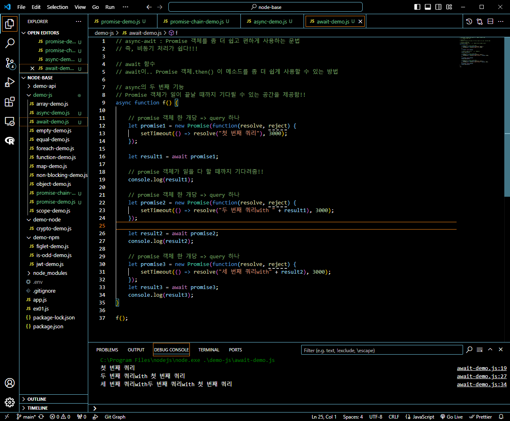

# 프로그래머스 풀스택 34
프로젝트: Node.js 기반의 REST API 구현(11)

## 🌊 주문하기 전체 flow 테스트
<span style="color:lightseagreen">💫 **주문하기 전체 flow 테스트**</span><br>

<br>
- 계속 delivery_id가 null이라는 오류가 발생!<br>
- 현재 로그의 순서는 바깥부분의 console.log("out-delivery_id", delivery_id);가 먼저 실행됨을 알 수 있음<br><br/>

## 🌊 Node.js 비동기 / 비동기 처리 방법

<span style="color:lightseagreen">💫 **Node.js 비동기**</span><br>

- 논 블로킹 I/O(비동기식)때문에 순서가 저렇게 출력된 것!<br>
- Node.js에서는 실행의 순서가 의미가 없음(논 블로킹 I/O(비동기식))<br>
- 그래서 기다려달라고 Node.js에 요청을 해야함<br>

<span style="color:lightseagreen">논블로킹 I/O</span> -> **한명이 일을 하는데, 요리를 순차적으로 X, 중간중간 비는 시간이 있다면 다른 요리O**<br>
ex) 라면 1개(10분 중 물 끓는 시간 5분: 요리사는 물만 쳐다봄.), 볶음밥(완성 5분)
<br>
라면 물 끓여놓고 => 볶음밥 요리 => 라면 요리<br>
**즉 다른 작업이 완료되는 걸 기다리지않고, 다른 작업을 수행!**<br>

| [라면을 끓이는 순서(현실)]                          | [라면을 끓이는 순서(Node.js)]                                |
| --------------------------------------------------- | ------------------------------------------------------------ |
| 1. 물을 끓인다 : 5분                                | 1. 물을 끓인다 : 5분                                         |
| 2. 스프를 넣는다 : 10초                             | 2. 스프를 넣는다 : 10초                                      |
| 3. 면을 넣는다 : 10초                               | 3. 면을 넣는다 : 10초                                        |
| 4. 라면을 더 끓인다 : 3분                           | 4. 라면을 더 끓인다 : 3분                                    |
| 5. 파를 넣는다 : 10초                               | 5. 파를 넣는다 : 10초                                        |
| 6.먹는다 : 완성                                     | 6.먹는다 : 완성                                              |
| 현실(위 순서를 순차적으로 해야만 하므로) : 8분 30초 | Node.js : 5분(물을 끓이는 5분 동안 나머지 2~6번을 바로 실행) |

따라서 Node.js는 싱글 스레드로 동작 but 비동기 I/O 작업을 통해 요청들을 서로 블로킹X<br>
즉, 동시에 많은 요청들을 비동기로 수행하여 싱글스레드일지라도 논블로킹O<br>
클러스터링을 통해 프로세스를 포크(fork)하여 멀티스레드인것 처럼 사용O<br>
트래픽에 따라, 프로세스를 포크할 수 있으므로 확장성이 용이함.<br>

<span style="color:lightseagreen">💫 **Node.js 비동기 처리 방법**</span><br>

- **비동기 발생**<br>
실행되는 코드가 기다려야 하는 시간이 생긴다는 의미<br>
일단 이전 시간이 오래 걸리면, 안 기다려주고(알아서 하라하고) 다음 코드를 무작정 실행<br>
ex) setTimeOut(), setInterval(), **query()**, ..<br>
아까 delivery_id가 null이라는 오류가 발생한 것도 query()를 사용하면 기다려야하므로 Node.js에서 바로 넘어가서 값이 제대로 적용이 안된 것<br><br>

- ✨**비동기 처리**✨　　Node.js의 꽃이라 할 수 있음!<br>
비동기가 필요 없을 때가 있음.<br>
이전 코드들의 시간을 다 기다려줌. 순서를 맞춰서 코드를 실행해줄게!!!<br>

1. **콜백 함수 : 할 일 다 하고, 이거 실행해줘(= 순서 맞춰서 이걸 뒤에 실행해줘)**<br>
2. promise(resolve, reject)<br>
3. then & catch<br>
4. **ES2017 promise 👉 async & await**<br>
(사실 2, 3, 4는 한통속임..)<br><br/>

## 🌊 Promise 객체

<span style="color:lightseagreen">💫 **Promise 객체**</span><br>

```javascript
let promise = new Promise(function(resolve, reject){
    setTimeout(() =>resolve("완료!!!"), 3000); //3000(3초)
    // 일을 다~하면 무조건 콜백함수 resolve() 또는 rejcet() 둘 중 하나는 호출
    // 할 일을 성공적으로 하면 resolve(결과)
    //         실패하면 reject(에러)
}); // 친구 소환
                             // 매개변수로 함수를 받음.
```
- **Promise "객체"** : "무조건" 약속을 지키는 친구<br>
- executor : 이 친구가 할 일<br>

---
<span style="color:lightseagreen">💫 **resolve, reject는 .then()의 매개변수와 연관**</span><br>

```javascript
let promise = new Promise(function(resolve, reject){
    setTimeout(() =>resolve("완료!!!"), 3000); //3000(3초)
    // 일을 다~하면 무조건 콜백함수 resolve() 또는 rejcet() 둘 중 하나는 호출
    // 할 일을 성공적으로 하면 resolve(결과)
    //         실패하면 reject(에러)
}); // 친구 소환
                             // 매개변수로 함수를 받음.
// promise의 기본 메소드 : promise가 일 다 하고(= 약속 다 지키고) 호출 해야하는 함수
promise.then(
    function(result){
        console.log(result);
    },
    function(error){}
);                                 
```
- **promise.then()** : promise의 기본 메소드 : promise가 일 다 하고(= 약속 다 지키고) 호출 해야하는 함수<br>
- promise.then()의 매개변수 1번 result, 2번 error에 성공할 시에 resolve, 실패할 시에 reject가 각각 들어간다는 걸 알 수 있음!<br>
- 위의 코드를 실행하면 3초뒤에 콘솔로그로 완료!!!가 찍힘<br>

---
<span style="color:lightseagreen">💫 **promise chaining**</span><br>

```javascript
let promise = new Promise(function(resolve, reject){
    setTimeout(() =>resolve("완료!!!"), 3000);
}); 
promise.then(
    function(result){
        console.log(result);
    },
    function(error){}
);                                 
```
- 위 코드에서 무조건 setTimeout(() =>resolve("완료!!!"), 3000); 이후 promise.then()을 실행하겠다는 것!!<br><br>

여기서 우리는 **비동기 처리 "Promise (Chaining)"**를 해줄 수 있음!!<br>
```javascript
// 비동기 처리 "Promise (Chaining)"
let promise = new Promise(function(resolve, reject){
    setTimeout(() =>resolve("완료!!!"), 3000); 
}).then(
    function(result){
        console.log(result);
        return result + "!!!";
    },
    function(error){}
).then(
    function(result){
        console.log(result);
        return result + "!!!!!";
    },
    function(error){}
).then(
    function(result){
        console.log(result);
    },
    function(error){}
);                                                                  
```
<br>
- then을 엮어서 비동기 처리가 가능한 걸 알 수 있음!<br><br/>

## 🌊 async 넌 누구냐

<span style="color:lightseagreen">💫 **async 첫 번째 기능**</span><br>

<br>

- **async : function 앞에 async를 붙여주면 무조건 Promise 객체를 반환**<br>
 async 함수는 무조건 Promise 객체를 반환<br>
return 7; == return Promise.resolve(7); 같은 의미!!<br>
만약 반환값이 Promise가 아니면, Promise.resolve()로 감싸주게 됨.<br>

---
<span style="color:lightseagreen">💫 **async의 두번째 기능, 그리고 await과의 만남**</span><br>

<br>

- **await : async 안에서만 Promise 객체를 기다려주는 키워드!**<br>
Promise 객체가 일이 끝날 때까지 기다릴 수 있는 **공간**을 제공!<br>
(then 메소드를 await으로 바꿔서 사용하는 것!)<br>
(사진에서 resolve("완료!")여야 하는데 괄호 위치 잘못됨 ㅠㅠ)<br><br/>

## 🌊 3개의 promise 순서대로 실행 시키기

<span style="color:lightseagreen">💫 **3개의 promise 순서대로 실행 시키기**</span><br>

<br>
- 아까 잘못된 resolve 괄호 위치 수정완료!!<br>
- 3초마다 3개의 promise가 순서대로 결과 값이 잘 나오는 걸 확인가능함!<br><br/>

## 🌊 query 순서대로 실행하기

<span style="color:lightseagreen">💫 **query 순서대로 실행하기**</span><br>

**mysql -> 쿼리를 promise 객체로 제공함!**<br>
db파일에서
```javascript
const mysql = require('mysql2/promise');
```
이렇게 해주면 바로 가능!!<br>
..할 줄 알았는데 오류발생 query를 any로밖에 인식못함!!<br><br>

\<db 파일 수정>
```javascript
const mysql = require('mysql2/promise');
const connection = async () => {
    const conn = await mysql.createConnection({
        /// 생략
  });
  return conn;
}
module.exports = connection;
```
<br>
- conn.query() 부분을 let \[results] = await conn.query()로 바꿨는데도 query를 query로 인식못하고 any로 인식함! 👉 수정 필요!!<br><br/>

## 🌊 delivery_id 받아오기

<span style="color:lightseagreen">💫 **delivery_id 받아오기**</span><br>

<br>

```javascript
 let [results] = await conn.query(sql, values);
```
- conn.query(sql, values, )는 이제 불가능!<br>
- query에서 매개변수를 2개만 받기로 했음!!<br>
- 따라서 마지막의 콜백함수는 받지 않음<br>
- 대신에 결과값을 배열 result을 통해 return해준다는 것!<br><br>

```javascript
        (err, results) => {
            if (err) {
                console.error(err);
                return res.status(StatusCodes.INTERNAL_SERVER_ERROR).end();
            }

            delivery_id = results.insertId; 
            console.log("result.insertId", results.insertId);
            console.log("connquery - delivery_id", delivery_id);
    }
```
- 콜백함수야 잘가...<br><br>

\<진짜 최종><br>
```javascript
const mysql = require('mysql2/promise');
// 주문하기
const order = async (req, res) => {
    const conn = await mysql.createConnection({
        host: '127.0.0.1',
        user: 'root',
        password : 'root',
        database: 'Bookshop',
        dateStrings : true
      });
    const {items, delivery, totalQuantity, totalPrice, userId, firtBookTitle}  = req.body;
    let delivery_id;
    let order_id;
    let sql = "INSERT INTO delivery (address, receiver, contact) VALUES (?, ?, ?)";
    let values = [delivery.address, delivery.receiver, delivery.contact];
    let [results] = await conn.query(sql, values);
    console.log(results);
```
- const conn = require('../mariadb'); 대신 const mysql = require('mysql2/promise');를 맨 위에 삽입해주는 거 잊지말기!<br>
- sql을 다 입력할 때까지 기다렸다가 결과값을 result에 담아 console에 반환한 것!<br><br/>

## 🌊 느낀 점(YWT)

**Y 일을 통해 명확히 알게 되었거나 이해한 부분(한 일)에 대해 정리 :**<br>
Node.js의 비동기 처리방법, Promise 객체와 async-await!<br>

**W 배운 점과 시사점 :**<br>
- ✨**비동기 처리**✨　　Node.js의 꽃이라 할 수 있음!<br>
비동기가 필요 없을 때가 있음.<br>
이전 코드들의 시간을 다 기다려줌. 순서를 맞춰서 코드를 실행해줄게!!!<br>

- **async : function 앞에 async를 붙여주면 무조건 Promise 객체를 반환**<br>
 async 함수는 무조건 Promise 객체를 반환<br>
return 7; == return Promise.resolve(7); 같은 의미!!<br>
만약 반환값이 Promise가 아니면, Promise.resolve()로 감싸주게 됨.<br>

- **await : async 안에서만 Promise 객체를 기다려주는 키워드!**<br>
Promise 객체가 일이 끝날 때까지 기다릴 수 있는 **공간**을 제공!<br>
(then 메소드를 await으로 바꿔서 사용하는 것!)<br>

**T 응용하여 배운 것을 어디에 어떻게 적용할지:**<br>
비동기 처리를 통해 쿼리를 잘 받아오도록 함!!<br>