# 프로그래머스 풀스택 35
프로젝트: Node.js 기반의 REST API 구현(12)

## 🌊 지옥에서 온 conn.query
<span style="color:lightseagreen">💫 **지옥에서 온 conn.query**</span><br>

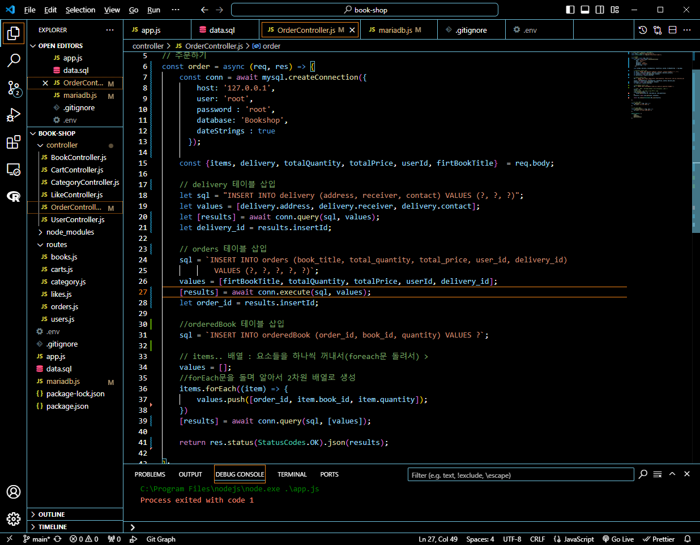<br>
```sql
// 삭제된 orders 테이블 콜백함수
        (err, results) => {
            if (err) {
                console.error(err);
                return res.status(StatusCodes.INTERNAL_SERVER_ERROR).end();
            }

            order_id = results.insertId;
    }
```
```sql
// 삭제된 orderedBook 테이블 콜백함수
       (err, results) => {
            if (err) {
                console.error(err);
                return res.status(StatusCodes.INTERNAL_SERVER_ERROR).end();
            }
```        
- 앞서 delivery 테이블 콜백함수를 삭제했던 것처럼 남은 콜백함수 삭제!<br>
- conn.query()에서 conn.execute()로 바꿔주기!<br>
- orderedBook은 이중배열로 한 번에 insert를 여러 행을 받는 건 execute가 실행이 안될 것임!<br>
그래서 conn.query() 유지.<br><br/>

## 🌊 테이블 delete, truncate 차이

<span style="color:lightseagreen">💫 **테이블 delete, truncate 차이**</span><br>

**MySQL 테이블 삭제하는 방법**<br>
1) **DELETE**<br>
DELETE FROM 테이블명 (WHERE 조건);<br>
: 조건이 있으면 조건에 맞는 행만 삭제됨!<br>
: 조건이 없으면 모든 행이 삭제됨<br>
(테이블은 당연히 남아있음!!)<br>
✨ **TRUNCATE와의 차이 : AI(AUTO INCREMENT)까지는 지워지지 않음!**<br>

2) **DROP**<br>
DROP TABLE 테이블명;<br>
: 테이블을 통째로 삭제함<br>

3) **TRUNCATE**<br>
TRUNCATE 테이블명;<br>
: 모든 행이 삭제됨<br>
(테이블은 당연히 남아있음!!)<br>
✨**DELETE와의 차이 : AI(AUTO INCREMENT)값도 초기화 시켜줌!**<br><br/>

## 🌊 SET FOREIGN_KEY_CHECKS = 0;

<span style="color:lightseagreen">💫 **SET FOREIGN_KEY_CHECKS = 0;**</span><br>

`Error Code: 1701. Cannot truncate a table referenced in a foreign key constraint`<br>
- **외래키가 존재하는 테이블에서 TRUNCATE를 사용 시 발생하는 오류**<br><br>

그래서 해결책!
```sql
SET FOREIGN_KEY_CHECKS = 0;
```
- foreign key를 무시하도록 설정 가능!<br>
외래키가 존재하는 테이블이 있을 때 실행해주고, TRUNCATE 작업이 끝나면<br>
  ```sql
  SET FOREIGN_KEY_CHECKS = 1;
  ```
  이걸로 다시 외래키를 살려주면 됨!<br><br/>

## 🌊 insert 오류 찾기

<span style="color:lightseagreen">💫 **insert 오류 찾기**</span><br>

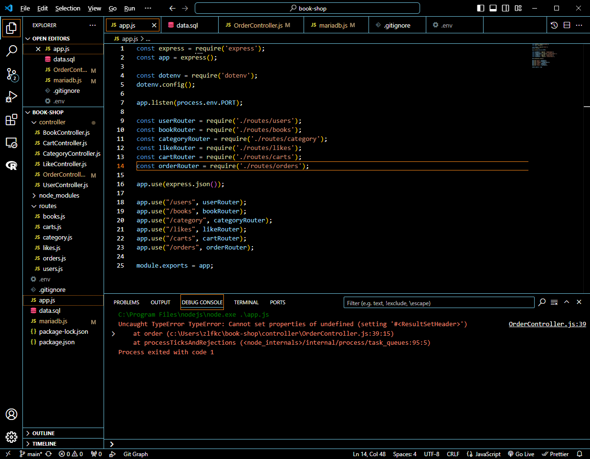<br>
- delivery, orders, orderedBook 테이블을 초기화 후 postman에서 새로 입력했는데 오류 발생<br>
- 그런데 Workbench에는 값이 다 들어가있음!<br>
- 아마 orderedBook에서 이중배열때문에 conn.execute 대신 conn.query() 유지한 게 문제인듯 함!<br>

---
<span style="color:lightseagreen">💫 **주문하기 insert**</span><br>

- 이중배열 때문에 \[results]가 아니라 \[results,　　] 형태로 들어와서 문제가 발생함!<br><br>

```javascript
results = await conn.query(sql, [values]);
return res.status(StatusCodes.OK).json(results[0]);   
```    
- 그래서 배열을 통으로 받아내, results에서 필요한 0번째의 값(처음값)을 res로 보내주기로 함.<br><br>

```sql
SET FOREIGN_KEY_CHECKS = 0;
TRUNCATE orderedBook;
TRUNCATE orders;
TRUNCATE delivery;
SET FOREIGN_KEY_CHECKS = 1;
```
- 외래키 체크 X 후, 외래키 있는 테이블부터 순서대로 명령어 실행, 외래키 체크 O<br><br/>

## 🌊 cartItemId Delete SQL 생각하기

<span style="color:lightseagreen">💫 **cartItemId Delete SQL 생각하기**</span><br>

- cartItemId를 프론트엔드에서 넣어줄 수 있는 이유 : 주문서 작성 페이지에 진입할 때 주문 상품에 대한 리스트를 출력을 하므로 이미 값을 알고 있음<br>

```sql
DELETE FROM cartItems WHERE id IN (1, 2, 3);
```
- cartItemId Delete가 가능한 SQL문!<br><br/>

## 🌊 cartItem 삭제

<span style="color:lightseagreen">💫 **cartItem 삭제**</span><br>

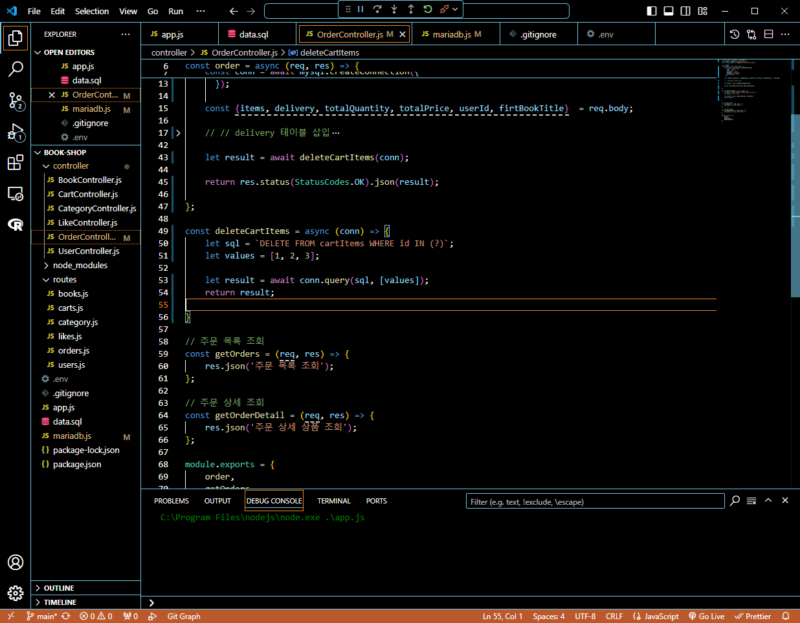<br>

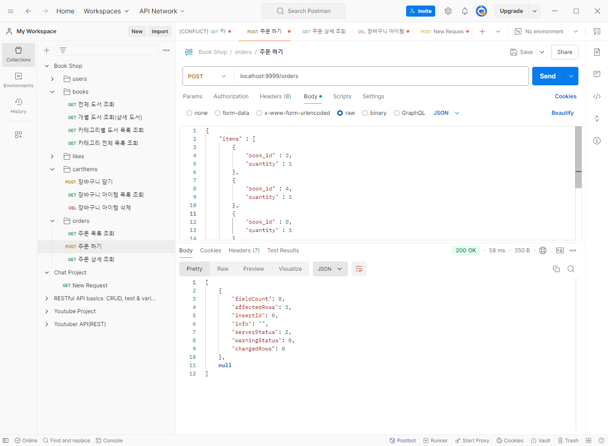<br>

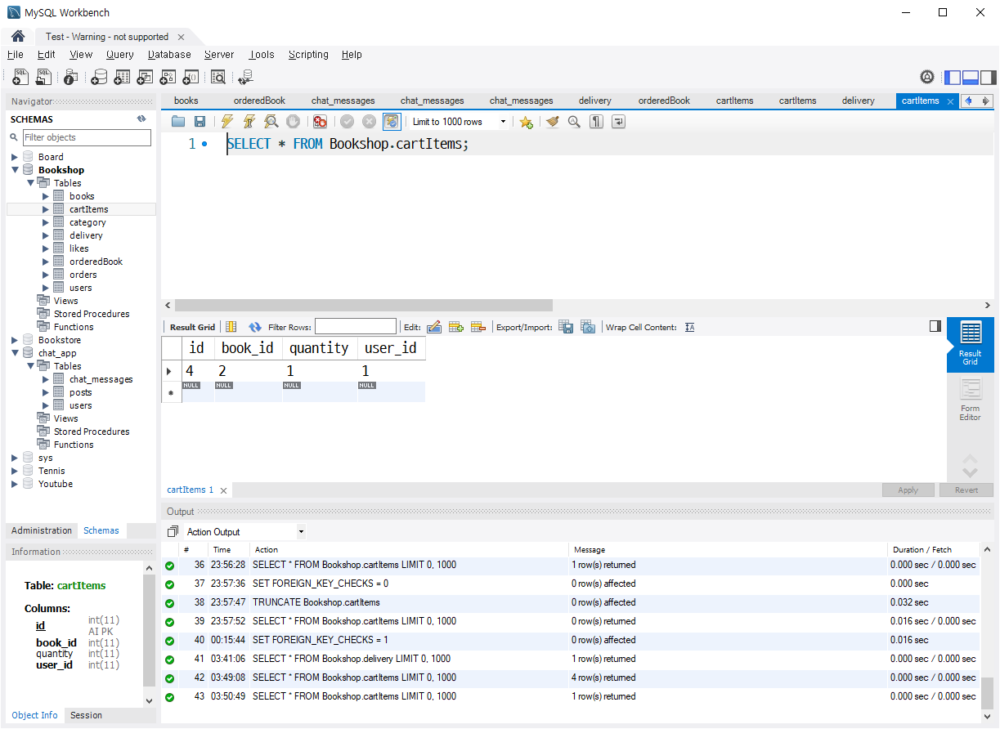<br>
- WHERE in이 들어가면 execute()대신 query()를 써야함!<br>
- 바꾸고나서 POSTMAN과 Workbench에서 잘 삭제된 모습!<br><br/>

## 🌊 주문 하기 끝!

<span style="color:lightseagreen">💫 **주문 하기 끝!**</span><br>

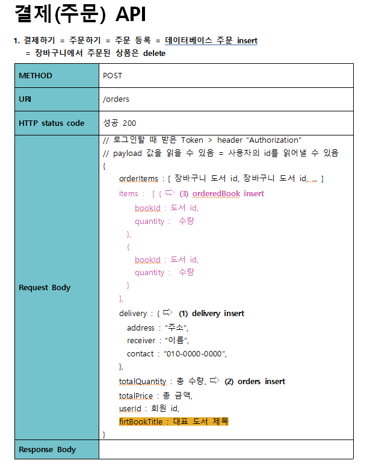<br>
- 결제 API를 orderItems을 받아서 select하는 걸로 변경! bookId와 quantity만 뽑아냄!<br><br/>

## 🌊 orderedBook insert

<span style="color:lightseagreen">💫 **orderedBook insert**</span><br>

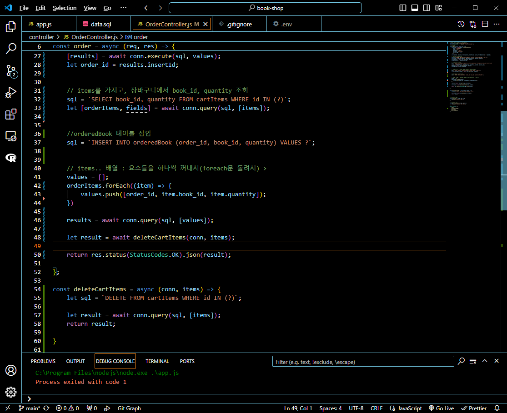<br>

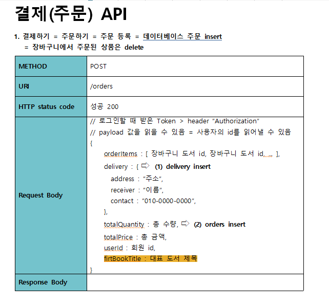<br>

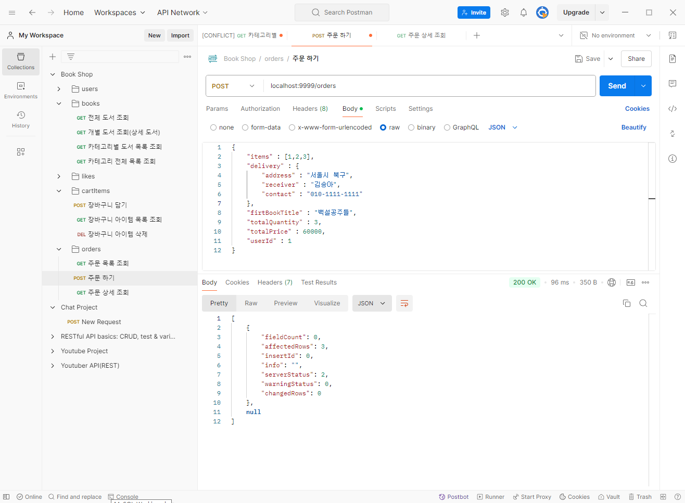<br>

```sql
let [orderItems, fields] = await conn.query(sql, [items]);
```
- Promise를 사용하는 DB는 execute든 query든 let \[rows, fields] = ~~ 형식으로 사용해야 함!!<br>
- 수정 후 잘 작동됨!<br><br/>

## 🌊 주문 내역 조회

<span style="color:lightseagreen">💫 **주문 내역 조회**</span><br>

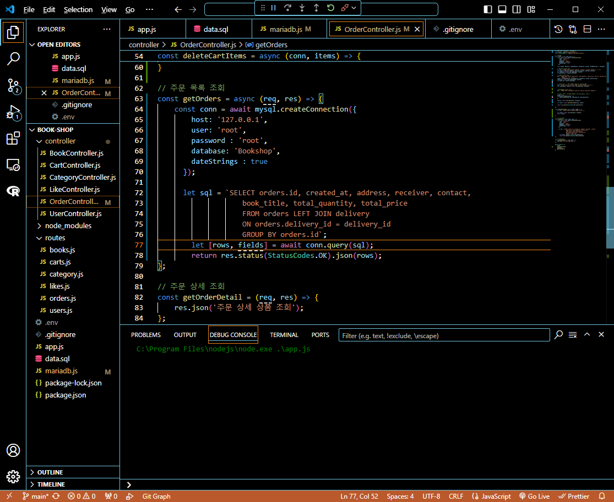<br>
```sql
SELECT orders.id, created_at, address, receiver, contact,
book_title, total_quantity, total_price
FROM orders LEFT JOIN delivery
ON orders.delivery_id = delivery_id
GROUP BY orders.id;
```
- 중복 데이터가 발생해서 GROUP BY를 더해줬음!<br>
- GROUP BY orders.id;가 없으면 1~7개가 7번 반복되어 49개가 찍혀버림ㅠ<br><br>

\<POSTMAN 결과><br>
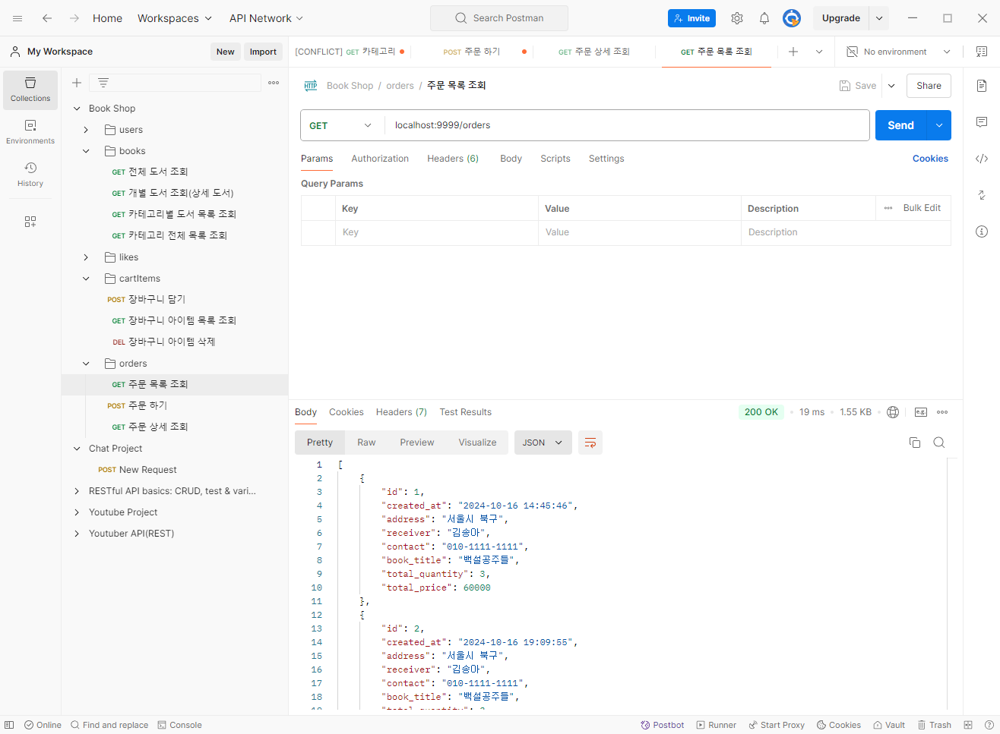<br>
- 잘 실행됨!<br><br>

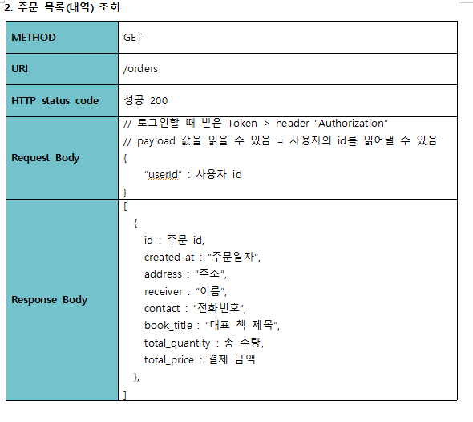<br>
- API도 수정완료<br><br/>

## 🌊 주문 상세 조회

<span style="color:lightseagreen">💫 **주문 상세 조회**</span><br>

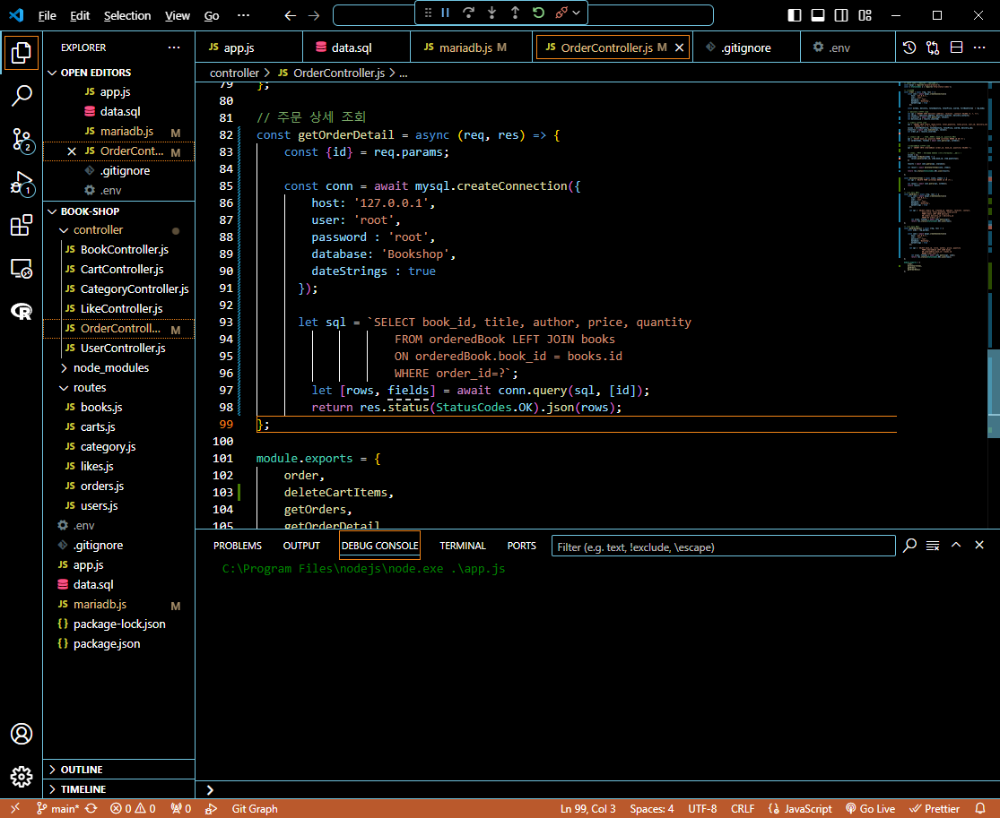<br>
```sql
SELECT book_id, title, author, price, quantity
FROM orderedBook LEFT JOIN books
ON orderedBook.book_id = books.id
WHERE order_id=?;
```                

<br>

\<POSTMAN 결과><br>
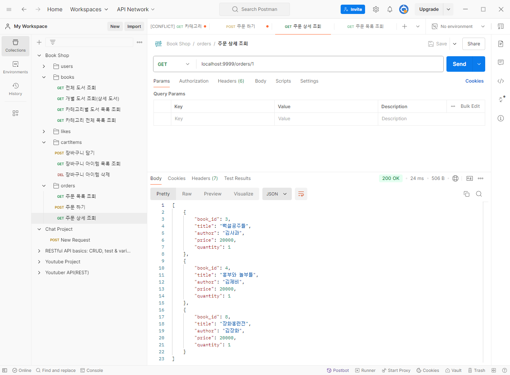<br>
- 잘 실행됨!<br><br>

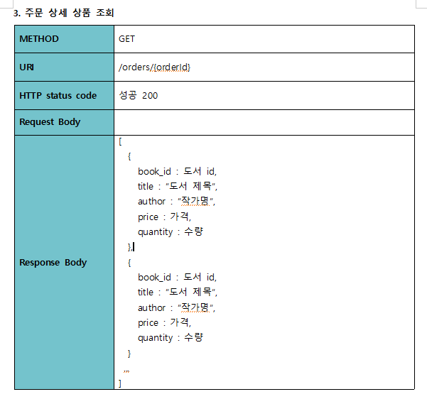<br>
- API도 수정 완료!<br><br/>

## 🌊 느낀 점(YWT)

**Y 일을 통해 명확히 알게 되었거나 이해한 부분(한 일)에 대해 정리 :**<br>
DELETE와 TRUNCATE의 차이, SET FOREIGN_KEY_CHECKS = 0;, 주문 컨트롤러 전체적인 수정<br>

**W 배운 점과 시사점 :**<br>
**MySQL 테이블 삭제하는 방법**<br>
1) **DELETE**<br>
DELETE FROM 테이블명 (WHERE 조건);<br>
: 조건이 있으면 조건에 맞는 행만 삭제됨!<br>
: 조건이 없으면 모든 행이 삭제됨<br>
(테이블은 당연히 남아있음!!)<br>
✨ **TRUNCATE와의 차이 : AI(AUTO INCREMENT)까지는 지워지지 않음!**<br>

2) **DROP**<br>
DROP TABLE 테이블명;<br>
: 테이블을 통째로 삭제함<br>

3) **TRUNCATE**<br>
TRUNCATE 테이블명;<br>
: 모든 행이 삭제됨<br>
(테이블은 당연히 남아있음!!)<br>
✨**DELETE와의 차이 : AI(AUTO INCREMENT)값도 초기화 시켜줌!**<br>

SET FOREIGN_KEY_CHECKS = 0; 👉 외래키 체크 X<br>

**T 응용하여 배운 것을 어디에 어떻게 적용할지:**<br>
주문 API가 이렇게 어려운 걸 배웠다... 나중에 혼자 구현할 때 잘 쓸 수 있을듯!<br>