# 프로그래머스 풀스택 36
프로젝트: Node.js 기반의 REST API 구현(13)

## 🌊 회원 api 검토 하면서 jwt 얘기
<span style="color:lightseagreen">💫 **회원 api 검토 하면서 jwt 얘기**</span><br>

로그인할 때! jwt는 쿠키에 담아주기!<br>
- 로그인할 때 받은 Token > req.header "Authorization"<br>
- payload 값을 읽을 수 있음 = 사용자의 id를 읽어낼 수 있음<br><br/>

## 🌊 jwt api 테스트

<span style="color:lightseagreen">💫 **jwt api 테스트 1탄**</span><br>

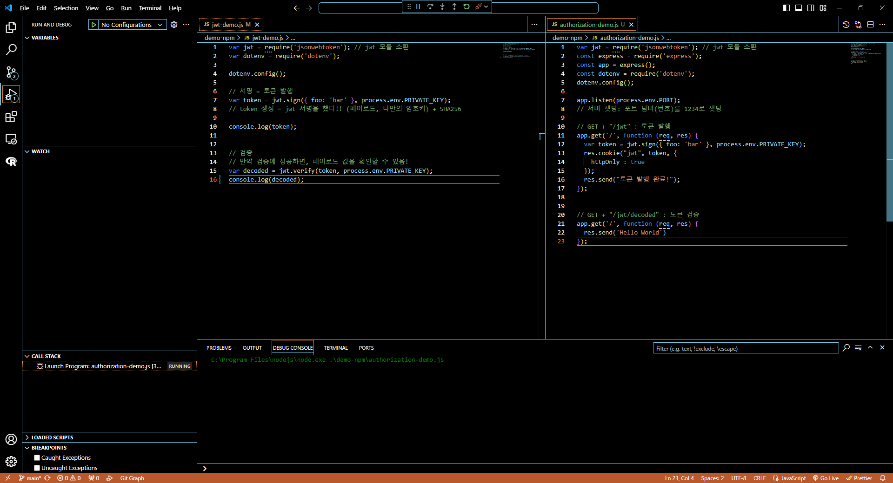<br>

\<POSTMAN 결과><br>
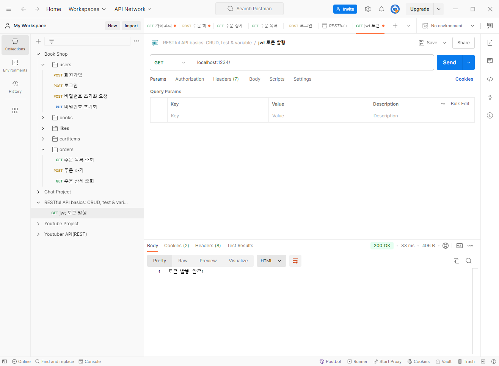<br>
- authorization 토큰 발행이 잘 된 모습!<br>
- 그런데 토큰값이 이전에 로그인할 때 보냈던 값과 똑같음..!?<br><br>

---
<span style="color:lightseagreen">💫 **jwt api 테스트 2탄**</span><br>

- 1탄에 이어서 쿠키값이 삭제되지 않으면 이전의 값을 계속 기억하고 진행됨!<br>
- 그래서 쿠키삭제가 필요함!<br>
- decoded Token은 👉 req.header "Authorization" 여기에 담아서 보내기!

<br><br/>

## 🌊 authorization 받아보기

<span style="color:lightseagreen">💫 **authorization 받아보기**</span><br>

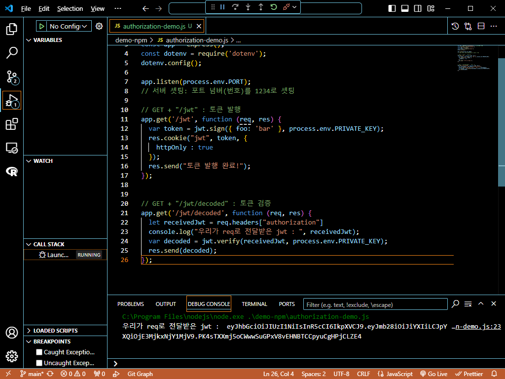<br>
```javascript
// GET + "/jwt/decoded" : 토큰 검증
app.get('/jwt/decoded', function (req, res) {
  let receivedJwt = req.headers["authorization"]
  console.log("우리가 req로 전달받은 jwt : ", receivedJwt);
  var decoded = jwt.verify(receivedJwt, process.env.PRIVATE_KEY);
  res.send(decoded);
});
```
- req.header에 내가 받은 jwt를 보내준다는 뜻!<br><br>

\<POSTMAN 결과><br>
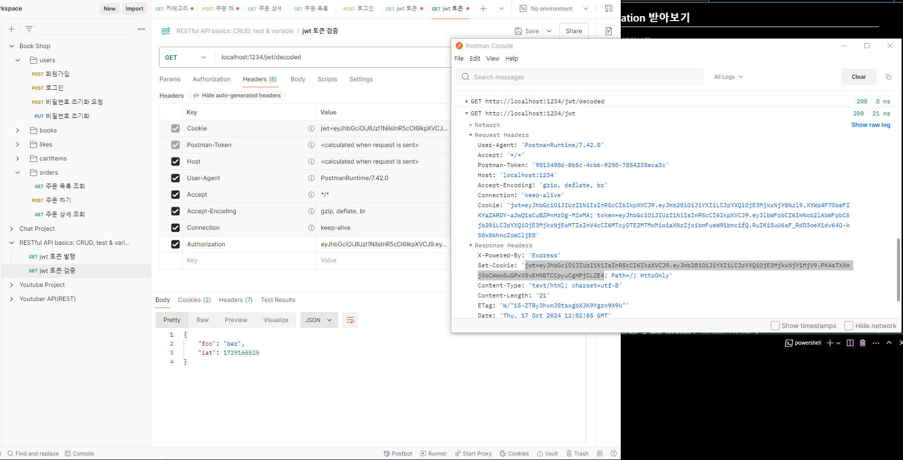<br>
- POSTMAN에서 콘솔창 경로 : `View > Show Postman Console(ALT + CTRL + C)`<br>
- 콘솔창에서 Response Headers의 Set-Cookie의 jwt 값을<br>
req.header의 Authorization로 보내주면 잘 작동하는 걸 볼 수 있음!<br><br/>

## 🌊 좋아요 추가 API에 jwt 구현 / 좋아요 취소 API에 jwt 구현(user_id 꺼내기 모듈화)

<span style="color:lightseagreen">💫 **좋아요 추가 API에 jwt 구현**</span><br>

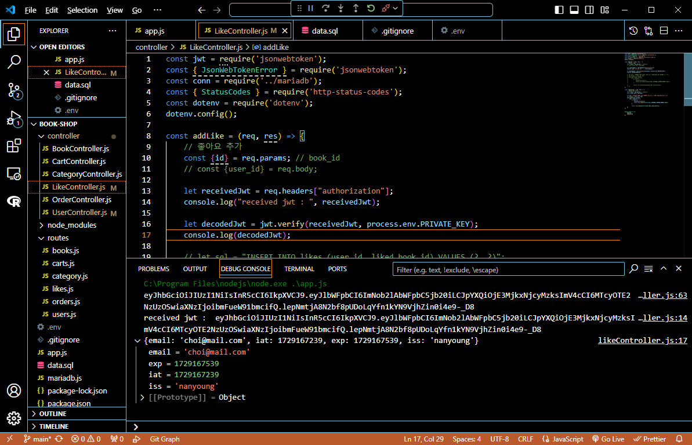<br>
- User컨트롤러의 토큰발급에 id : loginUser.id, 를 추가해줌<br>
- let values = [user_id, id];에서 let values = [decodedJwt.id, id];로 변경<br><br>

\<POSTMAN 결과><br>
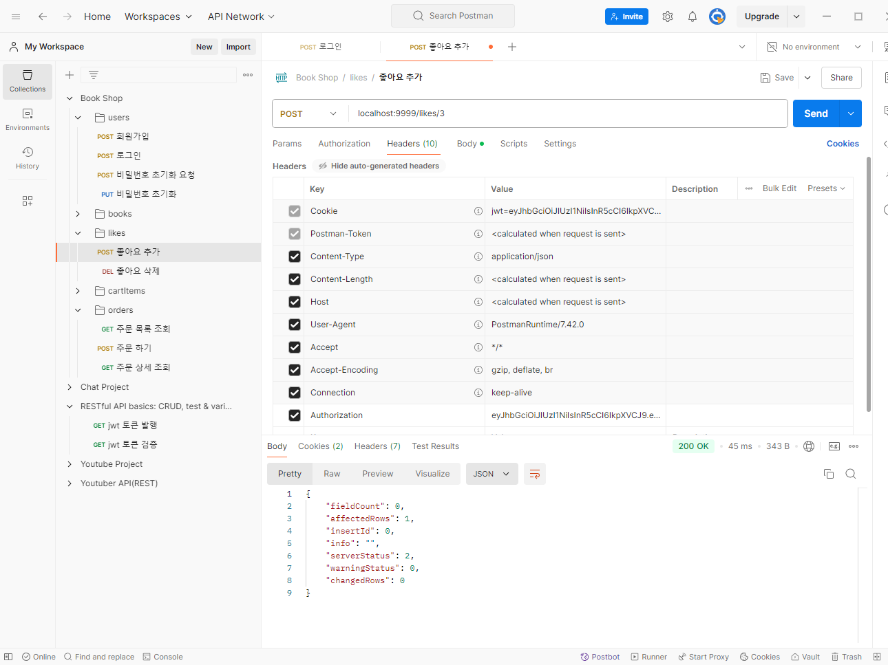<br>
- 잘 실행되고 Workbench도 잘 들어감!<br><br>

---
<span style="color:lightseagreen">💫 **좋아요 취소 API에 jwt 구현(user_id 꺼내기 모듈화)**</span><br>


```javascript
function ensureAuthorization(req) {
    let receivedJwt = req.headers["authorization"];
    console.log("received jwt : ", receivedJwt);

    let decodedJwt = jwt.verify(receivedJwt, process.env.PRIVATE_KEY);
    console.log(decodedJwt);

    return decodedJwt;
};
```

- 함수를 메소드로 추출<br>

```javascript
const removeLike = (req, res) => {
    const book_id = req.params.id;

    let authorization = ensureAuthorization(req);
    // ...생략
};
```
- 함수를 메소드로 추출한 걸 이렇게 간편하게 호출하여 사용할 수 있음!<br>
- 삭제도 잘 작동하는 걸 확인 가능함!<br><br>

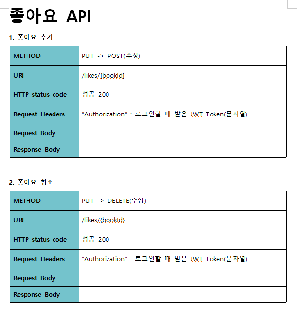<br>
- 좋아요 API 수정 완료<br><br/>

## 🌊 장바구니 담기, 조회 API jwt 구현

<span style="color:lightseagreen">💫 **장바구니 담기**</span><br>

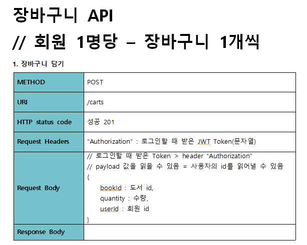<br>
- 장바구니 담기 API 수정 완료<br>


---
<span style="color:lightseagreen">💫 **조회 API jwt 구현**</span><br>

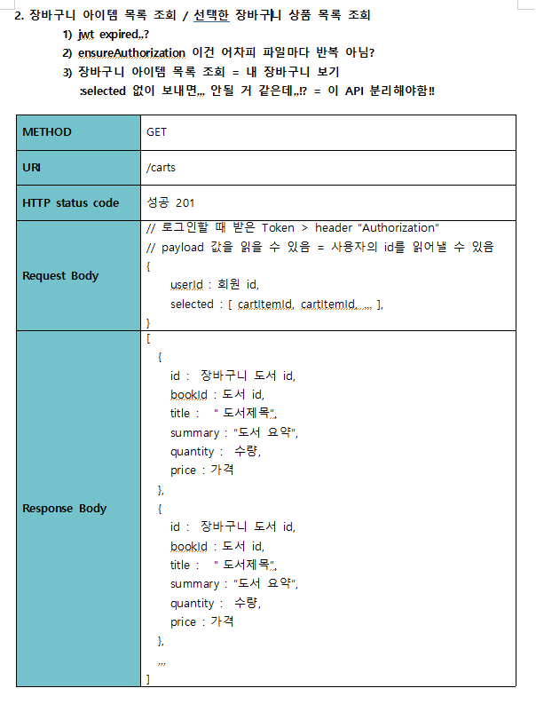<br>
- authorization을 똑같이 적용하고보니 수정할 부분이 많아짐!!<br><br>


## 🌊 옥의 티 잡아내기 1 : jwt expired?

<span style="color:lightseagreen">💫 **옥의 티 잡아내기 1 : jwt expired?**</span><br>

- 토큰의 유효기간이 지났다고 500에러가 발생함!!<br>
- 에러는 최대한 500은 띄우지 않도록 하기!(백엔드에서 진짜 잘못됐을 때랑 분간 잘하기!)<br>
- 유효기간이 지나서 500 에러(가 난다고 해서 서버가 꺼지지 않았지만)를 낼 게 아니고<br>
예외(개발자가 생각하지 못한 에러) 처리 필요!!<br>
- 유효기간이 지난 토큰 👉 res.'로그인(인증) 세션(유지되는 상태)이 만료되었습니다. 다시 로그인 하세요.'<br><br>

## 🌊 예외 처리

<span style="color:lightseagreen">💫 **if/else 👉 try/catch**</span><br>

**try...catch**<br>
- 수많은(개발자가 예상하지 못한) 에러(실수, 사용자가 입력을 잘못 한 것, DB가 응답을 잘못한 것, ...)를 처리하는 문법<br>

\<if/else문과 try/catch의 구성>
```
A 코드 실행                  
if (A에서 발생한 실수1) {                     try  {
                                               //A 코드 실행
} else if (A에서 발생한 실수2) {              } catch (err) {  
                                              //에러 처리
} ...                                        } ...
```                               
- try 구문의 코드를 실행하다가 에러가 발생하면, try 코드를 "멈추고" 👉 catch로 err와 함께 바로 빠져나감<br>
- try 구문에서 어떤 에러가 발생해도, if문 분기 처리하던 내용들이 👉 알아서 catch에 잡힘.(ex. SyntaxError, TypeError)<br>
- 실수1, 실수2, ... 비슷한 분류끼리 묶어서 따로 관리 가능!<br>

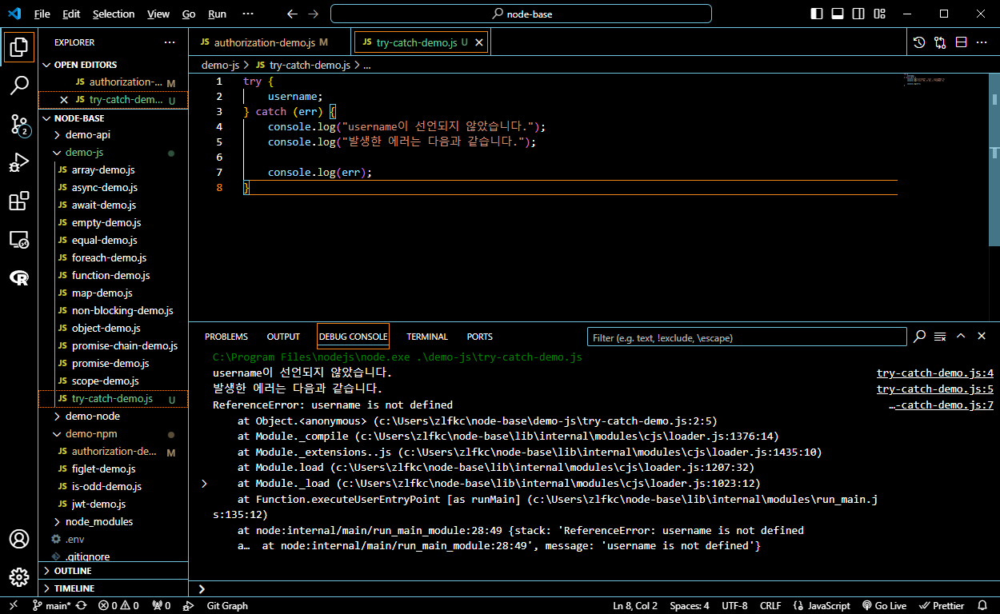<br>
- 이런 식으로 try/catch구문을 통해 에러를 처리해줄 수 있음!<br><br>

<span style="color:lightseagreen">💫 **JWT**</span><br>

1) **TokenExpiredError**<br>
: 유효기간이 지난 토큰 = 만료된 토큰<br>

1) **JsonWebTokenError**<br>
: 문제 있는 토큰<br><br>

---
<span style="color:lightseagreen">💫 **에러 객체**</span><br>

- 자바스크립트가 고대 개발자들의 노고를 보고, "내장" 에러 객체를 만들어둠.<br>
JWT라는 모듈에서도 제공하는 에러 객체도 있고,<br>
직접 만들어서도 사용 가능<br>

```javascript
console.log(err.name);
console.log(err.message);
```
- err.name와 err.message은 내장 에러 객체임!<br>
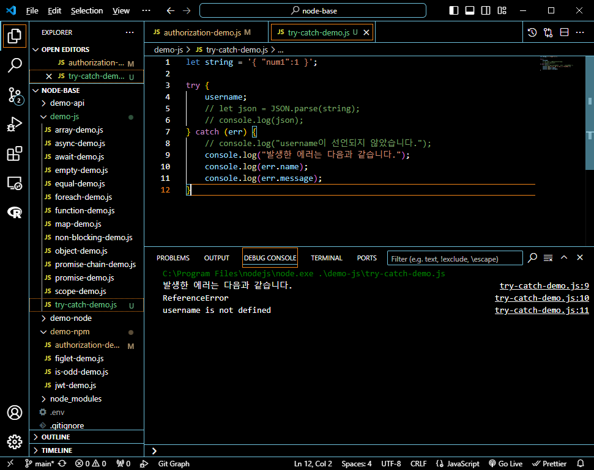<br>
사용시 이렇게 됨!<br>

try/catch를 사용하면 코드가 종료될 때 `exited with code=0`으로 되고<br>
사용하지 않으면 `exited with code=1` 종료됨.<br>
그래서 되도록 try/catch로 에러를 처리해줄 것!<br><br>

---
<span style="color:lightseagreen">💫 **throw 연산자**</span><br>

- 에러를 발생시키는 연산자!<br>

**throw 에러 객체**<br>
ex) throw new SyntaxError(메세지);<br>
```javascript
throw new SyntaxError("입력 값에 이름이 없습니다.");
```
- 이런 식으로 사용하면 됨!<br><br/>

## 🌊 TokenExpiredError

<span style="color:lightseagreen">💫 **TokenExpiredError**</span><br>

```javascript
function ensureAuthorization(req, res) {
    try {
        let receivedJwt = req.headers["authorization"];
        console.log("received jwt : ", receivedJwt);
    
        let decodedJwt = jwt.verify(receivedJwt, process.env.PRIVATE_KEY);
        console.log(decodedJwt);
    
        return decodedJwt;
    } catch (err) {
        console.log(err.name);
        console.log(err.message);

        return res.status(StatusCodes.UNAUTHORIZED).json({
            "message" : "로그인 세션이 만료되었습니다. 다시 로그인 해주세요."
        });
    }
};
```
- ensureAuthorization에 try/catch를 적용함<br>
- ensureAuthorization도 res를 받게 해주고 나머지 기능들도 res를 받게 수정해줌<br><br/>

## 🌊 res를 두번 보내면 생기는 일 - instanceOf 등장

<span style="color:lightseagreen">💫 **res를 두번 보내면 생기는 일 - instanceOf 등장**</span><br>

try/catch에서 catch에 걸리면 res값이 authorization에 잘못들어가면서 values에도 영향을 미침!<br>

```javascript
res.status(StatusCodes.UNAUTHORIZED).json({
            "message" : "로그인 세션이 만료되었습니다. 다시 로그인 해주세요."
        });
```
그래서 일단 return에서 이 부분을 떼고 return err;만 함<br>

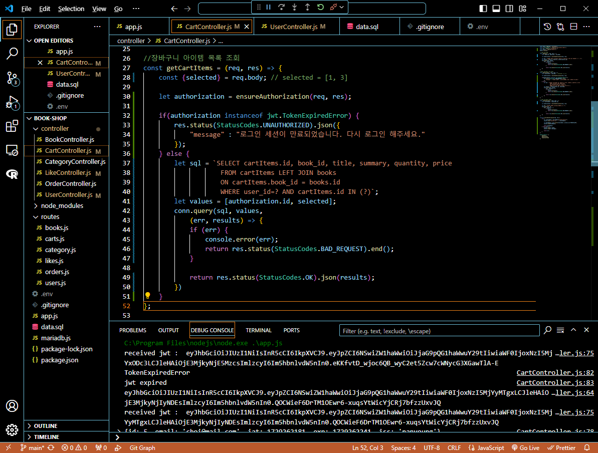<br>
- 떼어낸 부분은 위 부분에서 처리해주기<br><br/>

## 🌊 JsonWebTokenError도 컨트롤해보자!

<span style="color:lightseagreen">💫 **JsonWebTokenError도 컨트롤해보자!**</span><br>

- 그런데 POSTMAN에서 토큰을 보낼 때 중간에 숫자를 넣으면<br>
```bash
JsonWebTokenError
invalid token
```
라는 오류가 발생하게 됨.

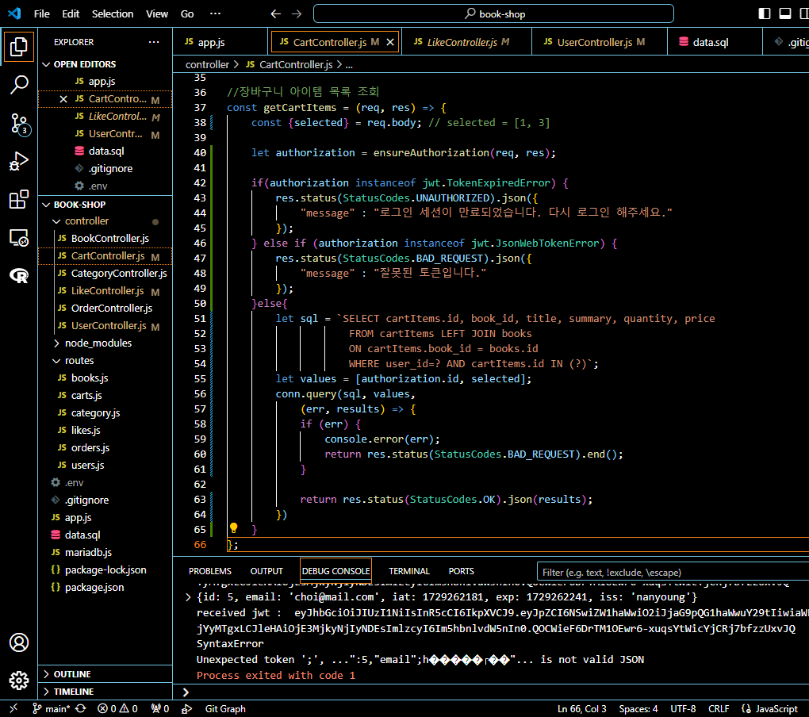<br>
- 그래서 else if를 통해 JsonWebTokenError도 잡아줌<br>
- 그런데 다른 컨트롤러에도 이 부분들을 적용해줘야함! 👉 모듈로 소환하자!<br><br/>

## 🌊 느낀 점(YWT)

**Y 일을 통해 명확히 알게 되었거나 이해한 부분(한 일)에 대해 정리 :**<br>
authorization, try/catch & 에러 객체 & throw를 통한 예외처리<br>

**W 배운 점과 시사점 :**<br>
**try...catch**<br>
- 수많은(개발자가 예상하지 못한) 에러(실수, 사용자가 입력을 잘못 한 것, DB가 응답을 잘못한 것, ...)를 처리하는 문법<br>

**에러 객체**<br>

- 자바스크립트가 고대 개발자들의 노고를 보고, "내장" 에러 객체를 만들어둠.<br>
JWT라는 모듈에서도 제공하는 에러 객체도 있고,<br>
직접 만들어서도 사용 가능<br>

```javascript
console.log(err.name);
console.log(err.message);
```
- err.name와 err.message은 내장 에러 객체임!<br>
- try/catch를 사용하면 코드가 종료될 때 `exited with code=0`으로 되고<br>
사용하지 않으면 `exited with code=1` 종료됨.<br>
그래서 되도록 try/catch로 에러를 처리해줄 것!<br><br>

**throw 에러 객체**<br>
ex) throw new SyntaxError(메세지);<br>
```javascript
throw new SyntaxError("입력 값에 이름이 없습니다.");
```
<br>

**T 응용하여 배운 것을 어디에 어떻게 적용할지:**<br>
다양한 예외 처리를 통해 코드를 깔끔하게 만들 수 있음!<br>