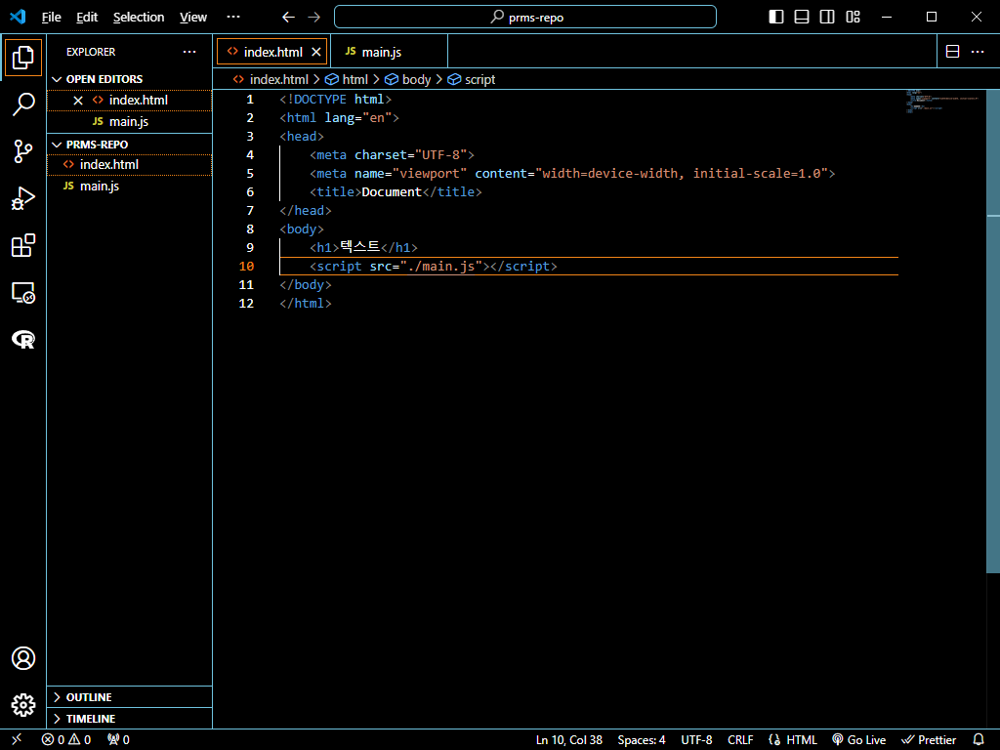
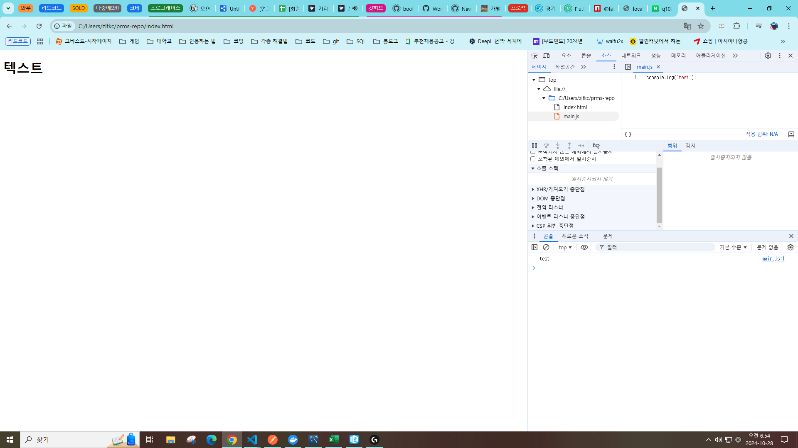
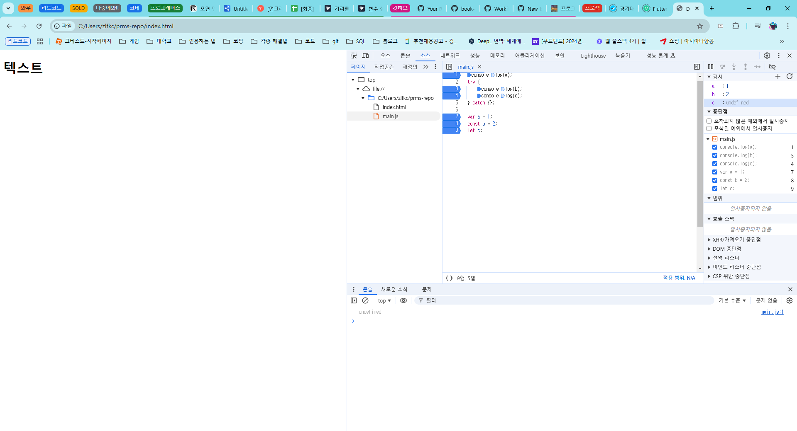

# 프로그래머스 풀스택 38
프론트엔드 기초: React + TypeScript(1)

## 🌊 브라우저와 개발자도구
💫 **브라우저와 개발자도구** 

 
- html 파일은 `!+Tab`을 해주면 자동적으로 기본 형태를 입력해줌 

 
- Windows 기준 `F12`를 통해 개발자 도구를 확인하고, 콘솔도 확인할 수 있음!  

---
💫 **브라우저와 디버깅** 

- **이슈** : 개발 중에 발생하는 예기치 못한 상황 
이슈 👉 분석 👉 해결👏 
여기서 분석 과정을 **디버깅**이라고 함!  

- **디버깅** : 개발 중에 발생하는 시스템의 논리적 오류나 비정상적인 연산을 찾아내 원인을 밝히고 수정하는 작업  
- **디버깅 방법** 
    - 의심가는 코드 내에 log 함수 심기 
      - `console.log` 
      - `console.dir` 
      - ...
    - 개발자도구 > Source 탭 활용하기 
    브레이킹 포인트를 지정해서 확인하는 방법임!  

## 🌊 JavaScript언어의 특징

💫 **JavaScript언어의 특징 - 인터프리터 언어** 

✨ **목표** : 기계가 이해해야 함! 
✨ **방법** : 개발 언어마다, 처리되는 방식 다름! 

🙎🏻**사람이 이해한 언어**로 작성되면 
🤖**기계어로 번역**되어야 함!! 

1. 컴파일러 언어 

    **사람**이 코드를 작성 👉 기계어로 **변환** 👉 기계에서 **실행** 

2. 인터프리터(Interpreter) 언어 

    **사람**이 코드를 작성 👉 기계에서 **실행** 👉 **변환**하며 진행 
    - 컴파일 단계 X 
    - 컴파일러 언어에 비해, 실행 속도가 느림 
      - 모던 브라우저 내의 V8엔진에서 속도 개선됨  

   

---
💫 **JavaScript언어의 특징 - 그 외** 

**변수의 타입** : 동적 타입 언어 
- 변수에 들어가는 값에 따라서, 런타임에 타입이 추론됨 

**함수의 특징** : 일급객체 
- 함수는 일급객체의 특징을 가짐 
- 함수는 객체와 동일하게 사용가능 
- 함수는 값과 동일하게 취급 
  - 변수 할당문 
  - 객체 프로퍼티 값 
  - 배열의 요소 
  - 함수 호출의 인수 
  - 함수 반환문 

**상속의 형태** : 프로토타입 기반의 상속 
- 언어가 갖고 있는 프로토타입 체이닝 구조를 통해 **상속**구현 

**패러다임 지원** : 함수형 프로그래밍 
　　　　　　　명령형 프로그래밍 
　　　　　　　객체지향 프로그래밍 
　　　　　　　... 

   

## 🌊 JavaScript 표준화 - JavaScript의 탄생배경과 ECMAScript

💫 **JavaScript 표준화 - JavaScript의 탄생배경과 ECMAScript** 

**자바스크립트의 탄생과 표준화 이유!** 
- 자사 소프트웨어의 <U>사용의 점유율을 높이기 위해</U> 
브라우저마다 동작하는 기능을 경쟁적으로 추가함 
    - 즉, 같은 자바스크립트 파일인데 IE에서만 작동하고, Netscape에서는 작동 안하는 현상 발생 
    - **크로스 브라우징 이슈**  
- **모든 브라우저에서 자바스크립트는 동일하게 작동해야 함!!!** 
    - 1996년 표준화 개발 진행 (넷스케이프 👉 ECMA 요청) 
    - 1997년 ECMA 총회 때 채택 
    - 표준화 목록 중 하나 : **ECMA-262** 
    - ECMAScript로 명명(ECMAScript 1, ES 1) 
- ECMA의 여러 Committee 중 **TC39** Committee가 관리 

**따라서 표준화 정책을 고려한 개발이 필요함** 
- **언어 버전** 고려하기 
- 이를 도와주는 솔루션 
  - (트랜스 파일러) Babel 
  - (lint) eslint 
  - (Bundler) Webpack  

**ECMAScript와 브라우저** 
- 브라우저 버전마다 지원하는 **자바스크립트 스펙이 상이** 
  - <U>ECMAScript의 기준을 따라가지 않음</U> 
  - 개별 기능의 지원 : **Caniuse** 확인가능  

**브라우저 지원이 안될 경우?** 
- polyfill과 babel 사용 
- **polyfill** 
  - 지원하지 않는 브라우저에서 최신 기능을 제공하기 위해 필요한 **코드** 
  - 폴리필은 브라우저가 다른 방식으로 동일한 기능을 구현하는 문제를 해결하는 데 사용 
- **Babel** 
  - 이전 버전의 브라우저에서 ES6 이전 버전의 자바스크립트로 변환하는 데 사용되는 **도구** 
  - 문법을 번역 및 변환 
  - 폴리필 가능  

## 🌊 변수란?
💫 **변수란?** 

**데이터를 처리하기 위해 기억해야 함!** 
- 데이터 처리 과정에서 처리 흐름마다 값들을 기억할 필요가 있음 
- 컴퓨터는 데이터를 기억하기 위해 메모리를 활용 
  - 메모리란? **컴퓨터의 기억장치** 
- 메모리 
  - 메모리에 데이터를 담아 기억 
  - 각각의 위치 주소값이 존재 
  - 위치를 찾기 위해서는 메모리의 주소값 사용  

**메모리의 주소값의 별칭, 변수** 
- 메모리 주소값을 대신할 식별자를 지정, 식별자를 통해 데이터 접근 
- 식별자 == 변수  

**변수란,** 
`데이터를 담아둔 메모리의 주소를 쉽게 식별하기 위해 붙인 이름`  

**자바스크립트의 변수 syntax** 
- **키워드** let / const/ var  
- **변수명** 
- **할당 연산자** 
- **값**  

## 🌊 변수 생성 방법과 호이스팅

💫 **변수 생성 방법과 호이스팅** 

**3단계를 거쳐 생성되는 변수** 

**평가 단계 + 실행 단계** 

1. **선언 단계** 
변수를 변수 객체에 등록 
2. **초기화 단계** 
변수를 메모리에 할당, undefined로 초기화(안하면 접근불가) 
3. **할당 단계** 
undefined로 초기화된 변수에 실제로 값을 할당  

---
💫 **변수 생성 3단계는 키워드별로 다르게 동작함 (var / const, let )** 

**var 키워드** 
- **코드 평가**단계 : 선언과 동시에 초기화 진행 
- **코드 실행**단계 : 값 할당 진행 
- 코드 평가시점에서 초기화가 되어있으므로, 
**변수의 할당문이 실행되기 전에도 참조 가능 👉 (호이스팅)**  

**var 키워드 - 호이스팅? Hoisting** 
- 모든 선언문이 해당 Scope의 선두로 옮겨진 것처럼 동작하는 특성 
- 함수 호이스팅, 변수 호이스팅, ...  

**var 키워드 - 단점** 
- 키워드 생략 가능 
- 중복 선언 가능 
- 변수 호이스팅(실행 순서와 무관하게 변수가 호이스팅됨)  

**var 키워드 - 단점 - 전역변수화** 
- 전역 변수화 되어, 무분별한 변수 접근 
- 스코프 : 코드 실행 중에, 변수와 같은 식별자를 찾아야하는 코드가 있을 때 자바스크립트가 갖고 있는 규칙 
    - 전역 스코프(global), 지역 스코프(local) 
- 의도치 않은 변수값 변경, 코드 예측이 어려워짐👎  

그러므로 var의 사용을 지양하고 const/let을 사용하자!  

---
**const, let 키워드** 

- **코드 평가**단계 : 선언 진행 
- **코드 실행**단계 : 초기화 진행, 값 할당 진행 
- 코드 평가시점에서 선언만 진행되므로, **변수의 할당문이 실행되기 전에 참조 불가능** 
  - ReferenceError 발생 

- **블록 레벨 스코프** 
  - 코드 블록 내에서 접근 가능한 스코프 
- 변수에 한정적으로 접근이 가능하므로, 
**예측 가능한 범위 내**에서 변수 변경이 일어남  

- **const키워드** 
  - 수정이 불가능한 
  "상수 변수"를 선언할 때 사용 
  - 무조건 값을 할당  

- **let키워드** 
  - 재할당이 가능한 변수 타입 
  - 값을 할당하지 않아도 생성 

  

## 🌊 변수 실습

💫 **변수 실습** 

 
- 위의 키워드 별로 동작한다는 걸 확인할 수 있음  

---
💫 **변수 네이밍 컨벤션(규칙)** 

- Camel Case : getNumber 

- Snake Case : get_number 
단어 사이에 _(언더바) 추가 

- Pascal Case : GetNumber 

- Constant Case : GET_NUMBER 
단어 사이에 _(언더바) 추가. **상수 변수** 사용할때만.  

## 🌊 자료형이란?

💫 **자료형이란?** 

**데이터의 종류 - 자료형** 
- 컴퓨터에게 데이터의 종류를 지정, 알려주어서, 
데이터 종류에 맞게 적합한 로직처리를 할 수 있게 해주어야 함 

- 여기서 말하는 데이터의 종류를 **데이터 타입, 자료형**이라고 함 

- 언어별로 지원하는 데이터 타입은 모두 다름 
    - C언어 : 문자, 정수, 실수, ... 
    - Java : 문자, 정수, 실수, 논리, ... 
    - Python : 문자, 정수, 실수, ...  

---

**자바스크립트의 데이터 타입 - 원시 타입** 
- 자바스크립트는 7가지의 원시 타입을 제공 
String, Number, BigInt, Undefined, Null, Boolean, Symbol 
- 원시 타입의 특징 
  - 값은 변경 불가능한 값. immutable value 
  - "**값**"으로써 전달됨. (참조 형태로 전달 X) 
- 자바스크립트에서는 **원시 래퍼 객체**가 따로 존재 
원시 데이터를 사용할 경우, 해당 래퍼 객체들을 **상속받아 사용가능** 
👉 원시 래퍼 객체와 원시 타입 헷갈리지 말기!!!  

**자바스크립트의 데이터 타입 - 객체 타입** 
- <U>원시 타입의 값을 제외</U>한 자바스크립에서의 모든 것은 **객체**!! 
    - 객체는 여러 형태로 분류 가능 
    - 일반 객체와 함수, 날짜, 인덱스 컬렉션, 키 컬렉션, ... 
- 객체 타입의 특징 
  - 객체는 **참조**방식으로 전달됨. Pass by reference 
    - Fyi; deep copy, shallow copy 
  - 객체는 속성들을 변경할 수 있는 mutable한 값  

---
💫 **Number Type, BigInt Type (infinity, NaN)** 

**Number Type - 배정밀도 64비트 부동소수점(IEEE 754)형식** 

- 숫자에는 정수, 실수가 존재 

  - 다른 언어 : int, long, float, double 등.. 
  - 자바스크립트에는 **하나의 숫자 타입만 존재 = Number** 
- <U>자바스크립트는 모든 숫자를 실수로 처리</U>(정수 타입 X) 
- **Infinity** : 무한대를 나타내는 숫자(**-Infinity**) 
- **NaN** : Not A Number의 줄임말. 숫자가 아님  

**BigInt Type** 
- 임의 정밀도로 정수를 나타낼 수 있는 JavaScript 숫자 원시 값 

- BigInt를 Number의 최대값을 넘는 정수도 안전하게 저장, 연산 가능 
- 다른 타입과 혼합 연산 X  

---
💫 **String Type, Boolean Type** 

**String Type** 
- 텍스트 데이터 표현 

- **UTF-16** 코드 단위의 시퀀스로 표현 (UTF-16 : 유니코드 문자 인코딩 방식) 
  - 16bit 정수값의 요소로 구성된 집합 
  - 각 요소가 string의 한 자리 
  - 0번째 index부터 시작 
- 원시값은 불변 == 문자값은 불변 

**String Type - 표기법** 
- 따옴표나 쌍따옴표, 백팃(backtick)으로 감싸서 문자열임을 표현 

- 템플릿 리터럴 표기법(``) 
  - 백팃의 표현은 ES6 이후부터 사용 가능 
  - 문자열 처리 기능 제공(줄바꿈 허용, 표현식 삽입 가능) 
  - String interpolation 
    - \`My name is ${ 표현식 }\`  

**Boolean Type** 
- 논리적 데이터 유형 

- 참 혹은 거짓의 값만 가질 수 있음 
- e.g.
  - 상태값) input tag의 checkbox타입의 checked 상태 
  - flag값) 특정 UI의 노출여부를 보여주는 변수의 상태 isShow  

---
💫 **undefined와 null Type, Symbol Type** 

**Undefined Type** 
- 변수를 선언한 후 <U>값을 할당하지 않은 변수에 할당이 되는 값</U> 
  - 변수 초기화단계에서의 Undefined는 개발자가 의도해서 넣은 값이 아님! 

- 물론 개발자가 의도해서 넣을 수도 있음 

1. 선언 단계 
변수 객체 `foo` 

2. 초기화 단계 
변수 객체 `foo = undefined` 

3. 할당 단계 
변수 객체 `foo = 1`  

**Null Type** 
- 값이 없다는 것을 의도적으로 표현할 때 null 사용 

- 이전에 참조되어 있던 값을 <U>의도적으로 더이상 참조하지 않겠다는 뜻</U>
- null 타입체크 **일치연산자(===)* 사용하기! 
  - null의 type은 'object'라고 나오는데, 이는 자바스크립트 스펙 내의 버그!! 
  - null 타입체크는 일치 연산자 활용할 것!!!!  

**Symbol Type** 
- ES6에 추가된 타입 
- 중복되지 않는 유니크한 값! 
  - 객체의 key로 사용 가능 
  - 클래스나 객체 형식의 **내부에서만 접근**할 수 있도록 
  <U>전용 객체 속성의 키</U>로 사용 
- Symbol 함수를 호출하여 생성  

---
💫 **Reference type** 

**객체 타입** 
- 객체 타입, Object type, Reference type 

- **객체 타입** : 다양한 타입의 값을 <U>하나의 단위로 구성</U>한 복합적인 자료구조 
  - 객체 : 데이터(속성), 데이터에 관련한 동작을(method) 포함하는 개념적 존재 
- 원시 타입의 값을 제외한 자바스크립트에서의 모든 것은 객체  

**객체 타입 - mutable** 
- 변경 가능한 값(mutable) : 객체의 속성을 변경, 추가, 삭제 가능 

  - 원시값 : immutable한 값 
- **힙 메모리**에 저장 
  - 동적으로 변화 가능하므로, 메모리 공간 확보 및 저장 
- Pass-by-reference 
  - 참조 타입이므로, 참조값으로 처리  

**여러 형태의 객체 타입** 
- 일반 객체와 함수 
- 날짜 
- 인덱스 컬렉션 
- 키 컬렉션 
- ...  

## 🌊 동작 타입 언어

💫 **동작 타입 언어** 

- 자바스크립트는 동적 타입 언어 

- 의도적으로 타입을 변환할 수도 있지만, **의도와 상관없이** 변경되기도 함 
  - 명시적 타입 변환 

  - 암묵적 타입 변환  

**명시적 타입 변환** 
- 원시 래퍼 객체를 활용해 개발자가 **의도적**으로 타입 변경 가능 

  - `값.toString()` 문자열 타입으로 변환 

  - `Number(값)` 숫자 타입으로 변환 

  - `Boolean(값)` 불리언 타입으로 변환  

**암묵적 타입 변환** 
- 개발자가 의도 X, 타입이 변경될 때가 있음 

  - `값 + ""` 문자열 타입으로 변환 

  - `값 * 1` 숫자 타입으로 변환 

  - `!!값` 불리언 타입으로 변환  

- 값이 전달 될 때 참조되어있는 변수 값 타입이 
개발자의 의도와 다르게 **암묵적 타입변환으로 변경될 가능성이 있음** 
  -  타입 추론이 어려워져, 불필요한 디버깅 발생 
- 이를 해결하기 위해 
  - 전달되는 시점마다 <U>typeof나 일치연산자를 사용</U>하여 **타입 guard 구현** 
  - 자바스크립트 superSet **타입스크립트** 사용  

## 🌊 연산자 - 단항 연산자, 산술연산자

💫 **연산자 - 단항 연산자, 산술연산자** 

**연산자란?** 
- 하나 이상의 표현식을 대상으로 연산을 수행하여 하나의 값을 생성  

**연산자의 종류** 
- 단항 연산자 
  - 하나의 피연산자만 사용 

  - void : 표현식을 평가할 때 값을 반환하지 않도록 지정 
  - typeof : 평가 전의 피연산자 타입을 나타내는 문자열을 반환 
  - delete : 객체의 속성을 삭제  
- 산술 연산자 
  - 두 개의 숫자 값(리터럴 또는 변수)을 피연산자로 받아서 하나의 숫자 값을 반환 

  - **✨ 단항 산술 연산자** 
    - 1개의 피연산자를 산술 연산하여 숫자값 반환. 

    - ++ : 숫자 1 **증가**, 증가시킨 값을 **암묵적으로 할당** 
    - -- : 숫자 1 **감소**, 감소시킨 값을 **암묵적으로 할당** 
    - \+ : 양수의 표현. 아무런 효과 X. 
    (**피연산자가 숫자인 케이스만 해당. 문자열인 경우 암묵적 타입변환 처리) 
    - \- : **양수를 음수**, **음수를 양수**로 반전시킨 값을 반환  
    - 증가/감소 연산자 : 위치에 따라 처리 단계 상이 
      - 전위 증가감소 연산자: 
        - **피연산자 앞**에 위치 `(++피연산자)` 
      - 후위 증가감소 연산자: 
        - **피연산자 뒤**에 위치 `(피연산자++)` 
  - **✨ 이항 산술 연산자** 
    - 2개의 피연산자를 산술 연산하여 숫자값 반환. 
    - \+, \-, \*, \/, \%  
  
- 관계 연산자 
  - 피연산자 비교, 결과에 따라 boolean 값 반환 
  - in : 객체 내에 속성의 존재할 경우 true 반환 
  - instanceof : 특정 객체 타입에 속하면 true 반환 
- 비교 연산자 
  - 피연산자 비교, 결과가 참인지에 따라 **boolean 값 반환** 
  - 피연산자에는 숫자, 문자열, 논리형, 객체타입 
  - == : 동등 연산자. 서로 같으면 true 
  - === : 일치 연산자. 서로 같고, 타입도 같으면 true 
  - === : 일치 연산자. 서로 같고, 타입도 같으면 true 
- 이진 논리 연산자 
- 삼항 연산자 
- 할당 연산자 
- 옵셔널 연산자 
- 쉼표 연산자 

  

## 🌊 response 포맷 확인하기 (카멜?! 스네이크?!)

💫 **response 포맷 확인하기 (카멜?! 스네이크?!)** 

  

## 🌊 끝날때 까지 끝난 게 아님!!! (feat. 코드 퀄리티)

💫 **끝날때 까지 끝난 게 아님!!! (feat. 코드 퀄리티)** 

  

## 🌊 느낀 점(YWT)

**Y 일을 통해 명확히 알게 되었거나 이해한 부분(한 일)에 대해 정리 :** 
코드의 고도화! 

**W 배운 점과 시사점 :** 
- **response 포맷 통일(snake 👉 camel), status code ...** 
- 예외처리와 유효성 검사, jwt 심화를 통해 코드 고도화를 해주는 걸 잊지 말기! 

 

**T 응용하여 배운 것을 어디에 어떻게 적용할지:** 
API와 코드를 일치하는 작업과 고도화를 통해 백엔드와 프론트엔드 사이의 작업이 원할하게 가능함! 