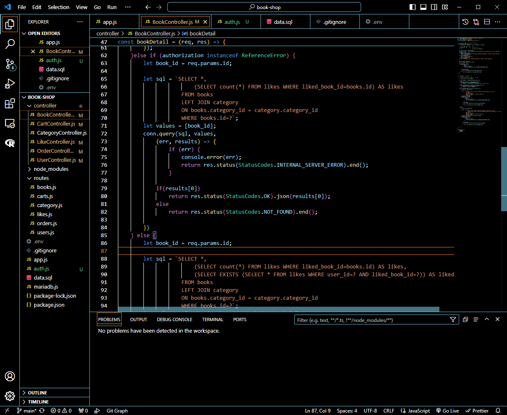

# 프로그래머스 풀스택 38
프론트엔드 기초: React + TypeScript(1)

## 🌊 옥의 티 잡아내기 2 : 회원 인증 모듈화
<span style="color:lightseagreen">💫 **옥의 티 잡아내기 2 : 회원 인증 모듈화**</span><br>

<br>
- 인증 해주는 부분을 따로 모듈화시킴!<br><br>

```javascript
    let authorization = ensureAuthorization(req, res);

    if(authorization instanceof jwt.TokenExpiredError) {
        res.status(StatusCodes.UNAUTHORIZED).json({
            "message" : "로그인 세션이 만료되었습니다. 다시 로그인 해주세요."
        });
    } else if (authorization instanceof jwt.JsonWebTokenError) {
        res.status(StatusCodes.BAD_REQUEST).json({
            "message" : "잘못된 토큰입니다."
        });
    }
```
- 좋아요와 장바구니 컨트롤러에서 인증 모듈화를 불러오고<br><br>

<br>
-  POSTMAN에서 실행해보면 잘 작동함!<br><br/>

## 🌊 옥의 티 잡아내기 3 : 내 장바구니 조회

<span style="color:lightseagreen">💫 **옥의 티 잡아내기 3 : 내 장바구니 조회**</span><br>

<br>
- 장바구니 아이템 목록 조회할 때 selected없이 보내면 오류가 발생함!<br>
(선택하지 않으면 내 장바구니 전체 목록이 보내져야함!!)<br><br>

<br>
```javascript
    }else{
        let sql = `SELECT cartItems.id, book_id, title, summary, quantity, price 
                    FROM cartItems LEFT JOIN books 
                    ON cartItems.book_id = books.id
                    WHERE user_id=?`;
        let values = [authorization.id];

        if (selected) { // 주문서 작성 시 '선택한 장바구니 목록 조회'
            sql += ` AND cartItems.id IN (?)`;
            values.push(selected);
        }
```
- 이 부분으로 내 장바구니 전체 목록과 선택 목록을 구분해서 조회가능<br><br/>

## 🌊 장바구니 API 설계 정리, 코드 정리

<span style="color:lightseagreen">💫 **장바구니 API 설계 정리, 코드 정리**</span><br>

<br>

<br>
- 장바구니 API 정리와 컨트롤러내에서 필요없는 데드코드, 모듈은 제거해줌<br><br/>

## 🌊 결제(주문) API 회원 인증 추가
<span style="color:lightseagreen">💫 **결제(주문) API 회원 인증 추가**</span><br>

<br>

```javascript
      let authorization = ensureAuthorization(req, res);

      if(authorization instanceof jwt.TokenExpiredError) {
          res.status(StatusCodes.UNAUTHORIZED).json({
              "message" : "로그인 세션이 만료되었습니다. 다시 로그인 해주세요."
          });
      } else if (authorization instanceof jwt.JsonWebTokenError) {
          res.status(StatusCodes.BAD_REQUEST).json({
              "message" : "잘못된 토큰입니다."
          });
      }else{
```
- 결제 API 수정 후, 위에서 모듈화했던 코드를 불러와주고 필요한 코드<br>
이걸 붙여넣어주고 수정했을 때 잘 작동하는 걸 알 수 있음!<br><br>

\<POSTMAN 결과><br>
<br>

\<Workbench 결과><br>
<br><br/>

## 🌊 개별 도서 조회 좋아요 여부에 jwt 확인

<span style="color:lightseagreen">💫 **개별 도서 조회 좋아요 여부에 jwt 확인**</span><br>

<br>
- 아까와 같이 인증 모듈을 추가하면 됨! 그런데 POSTMAN에서<br><br>
<br>
- Authorization없이 보내면 잘못된 토큰이라고 메세지가 잘못보내짐!<br>
👉 수정이 필요함!!!<br><br/>

## 🌊 로그인 상태가 아니라면 liked 제외

<span style="color:lightseagreen">💫 **로그인 상태가 아니라면 liked 제외**</span><br>

<br>
- 그래서 인증 부분의 분기처리를 수정해줌!<br>

<br>
- 그리고 else if문 하나를 더추가해서 liked부분 sql과 values부분을 book_id하나만 남기면<br>
- POSTMAN에서 Authorization없이 보내면 liked가 제외돼서 나오고<br>
- 로그인 후, Authorization을 포함해서 보내면 liked가 잘 출력됨!<br><br>

\<코드 고도화><br>
<br>
- bookDetail에서 두 번째 else if와, else 중복되는 sql문을 모듈화를 통해<br>
으로 콜백(callback)을 통해 처리하도록 함<br><br/>

## 🌊 좋아요 추가, 삭제 로직 response 좋아요 수

<span style="color:lightseagreen">💫 **좋아요 추가, 삭제 로직 response 좋아요 수**</span><br>

<br>
- 좋아요 API 수정(res body 값 예상 추가)<br>
- 도서 상세 페이지에서 보이는 좋아요 수는 프론트에서 그냥 임시로 +1, -1 하는 건 어떨까?<br><br/>

## 🌊 로그인 상태여야 하는 기능들 : 장바구니 도서 삭제, 주문 (상세) 내역 조회

<span style="color:lightseagreen">💫 **로그인 상태여야 하는 기능들 : 장바구니 도서 삭제, 주문 (상세) 내역 조회**</span><br>

각각 컨트롤러에 똑같이 인증 모듈 넣어주고 주문 상세 상품 조회 API도 req header를 통해 Authorization 값을 받기로 수정해줌<br><br/>

## 🌊 전체 도서 조회 수정

<span style="color:lightseagreen">💫 **전체 도서 조회 pagination 추가**</span><br>

- 현재 몇 개씩, 몇 페이지인지 알려주기가 필요함<br>
- 백엔드와 프론트엔드 둘 다 화면 단에서 몇 페이지인지 저장이 되어 있지 않음!<br>

<br><br>

---
<span style="color:lightseagreen">💫 **전체 도서 조회 pagination 구현**</span><br>

```sql
SELECT * FROM Bookshop.books LIMIT 4 OFFSET 0;
SELECT count(*) FROM Bookshop.books;
```
<br>
```sql
SELECT sql_calc_found_rows * FROM Bookshop.books LIMIT 4 OFFSET 0;
SELECT found_rows();
```
<br>

- 둘 다 같은 값을 출력하지만 아래의 found_rows()를 사용한 sql문이 더 빠름!<br><br>

<br>
- let sql = "SELECT * 을 let sql = "SELECT SQL_CALC_FOUND_ROWS * 로 수정해줌<br><br>

\<POSTMAN 결과><br>
<br>
- 잘 실행됨!<br><br>

---
<span style="color:lightseagreen">💫 **전체 도서 조회 response body 구성 맞추기**</span><br>

```javascript
    let allBooksRes = {};
    // ... 생략
    sql = "SELECT found_rows()";
    values.push(parseInt(limit), offset);
    conn.query(sql,
        (err, results) => {
            if (err) {
                console.error(err);
                return res.status(StatusCodes.BAD_REQUEST).end();
            }
            let pagination = {};
            pagination.currentPage = parseInt(currentPage);
            pagination.totalCount =results[0]["found_rows()"];
            allBooksRes.pagination = pagination;
            return res.status(StatusCodes.OK).json(allBooksRes);
    })
    // ... 생략
```
<br>
- 코드 수정 후 POSTMAN에서 잘 작동하는 모습!<br>
- currentPage를 parseInt(currentPage)해줘서 정수 값으로 나오게 하기<br><br/>

## 🌊 response 포맷 확인하기 (카멜?! 스네이크?!)

<span style="color:lightseagreen">💫 **response 포맷 확인하기 (카멜?! 스네이크?!)**</span><br>


<br>
<br>
- snake 형식에서 camel로 바꿔주기로 함!<br>
- 자잘한 것들도 수정이 필요한데 대표적으로 두 개만 삽입해둠!<br><br>

---
<span style="color:lightseagreen">💫 **response format 바꿔보기 : snake > camel**</span><br>

컬럼 수정 X 👉 JSON 키값 수정<br>
```javascript
        if(results.length){   
            results.map(function(result) {
                result.pubDate = result.pub_date;
                delete result.pub_date;
            });
```
- 이걸 추가하면 POSTMAN에서  snake 👉 camel로 출력이 가능하게 됨!<br>

<br><br/>

## 🌊 끝날때 까지 끝난 게 아님!!! (feat. 코드 퀄리티)

<span style="color:lightseagreen">💫 **끝날때 까지 끝난 게 아님!!! (feat. 코드 퀄리티)**</span><br>

- **response 포맷 통일(snake 👉 camel), status code ...**<br>

- **데이터베이스 중복 코드 👉 모듈화**<br>
ex. User.Controller 👉 User(데이터 모듈=Model) - CRUD<br>
　　cf. DB 모듈 : mysql 👉 몽구스, 시퀄라이즈<br><br>

- **패키지 구조**<br>
1) **Router : 경로(URI, URL)와 HTTP method로 요청에 따른 경로를 찾아주는 역할**<br>
2) **Controller : 길 매니저- 요청을 환영!! 직접 일을 하진 않음.**<br>
3) Service : 직접 일을 하고 ex. 어떤 쿼리를 부를지,<br>
"비즈니스 로직"<br>
4) **Model : 데이터베이스와 소통 👉 query 집합**<br><br>

- **✨예외처리 (try/catch) 더 해줄 곳 찾기**<br>
- **유효성 검사 추가**<br>
- **jwt(심화) : access token이 만료되면, '로그인 연장?'**<br>
**로그인 시 access token(30m) refresh token(24h)**<br>
　　1) access token : 로그인한 사람이야 인증(만들어본 것)<br>
　　2) refresh token: 로그인 연장하는 용도<br>

- 랜덤 데이터 (외부) API를 활용해서 ISBN 샘플 데이터 채워보기<br>
- nodemon 모듈 : 업데이트가 있을 때마다 자동 실행해주는 모듈<br><br/>

## 🌊 느낀 점(YWT)

**Y 일을 통해 명확히 알게 되었거나 이해한 부분(한 일)에 대해 정리 :**<br>
코드의 고도화!<br>

**W 배운 점과 시사점 :**<br>
- **response 포맷 통일(snake 👉 camel), status code ...**<br>
- 예외처리와 유효성 검사, jwt 심화를 통해 코드 고도화를 해주는 걸 잊지 말기!<br>

<br>

**T 응용하여 배운 것을 어디에 어떻게 적용할지:**<br>
API와 코드를 일치하는 작업과 고도화를 통해 백엔드와 프론트엔드 사이의 작업이 원할하게 가능함!<br>