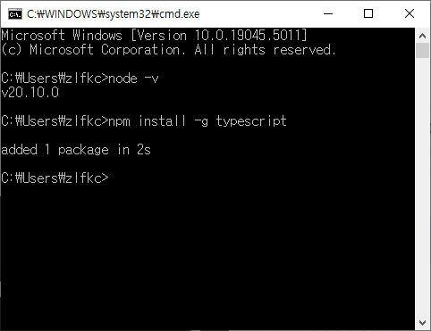
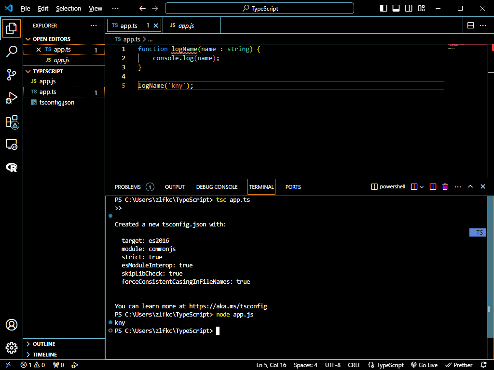
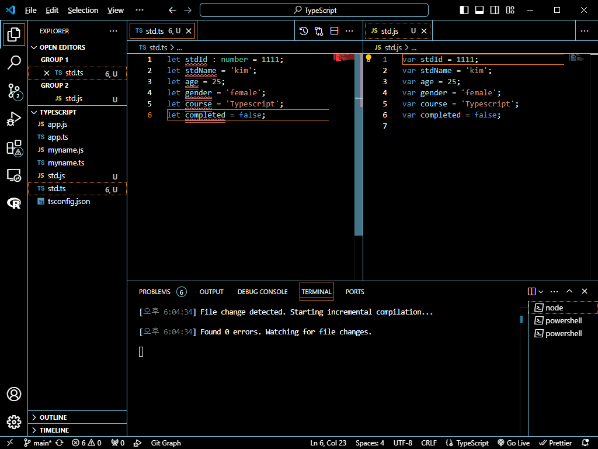
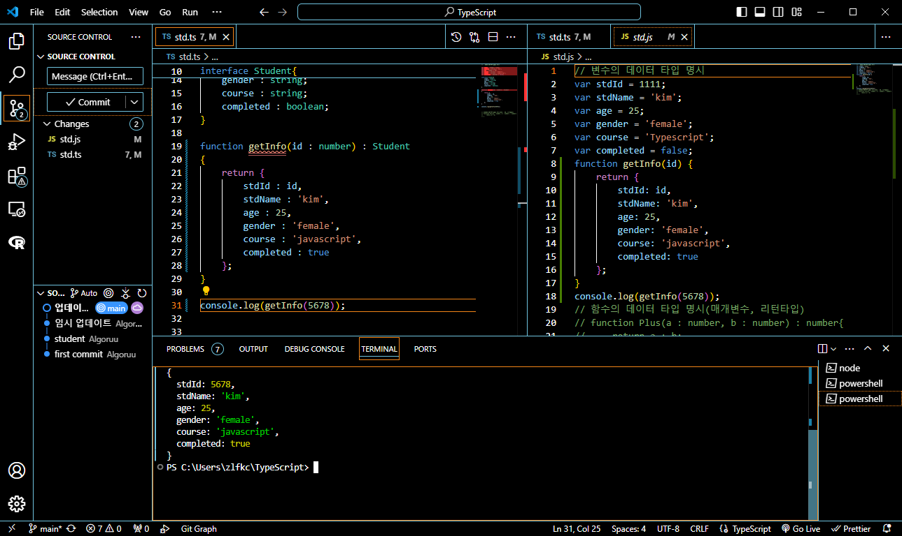

# 프로그래머스 풀스택 43
프론트엔드 기초: React + TypeScript(6)

## 🌊 타입스크립트 란?
<span style="color:lightseagreen">💫 **타입스크립트 란?**</span><br>

- 타입스크립트는 왜 필요한가?<br>
    - 자바스크립트 코드가 너무 지저분함.<br>
    - 코드의 스케일이 커지면서 코드 관리가 안됨.<br>
- 타입스크립트 사용시 장점<br>
    - 자바스크립트 기반 버그 줄임<br>
    - 유지보수 쉬움<br>
    - 강력한 높은 퀄리티의 코드 생산 가능<br><br>

**타입스크립트 = 자바스크립트 + 타입체크**<br>
- 타입스크립트 환경에 자바스크립트를 코딩하면 동작O<br>
- 자바스크립트 환경에 타입스크립트를 코딩하면 동작X<br><br>

타입스크립트는 또한 **컴파일 타임 시 오류 체크**함<br>
TS 👉 웹브라우저 X (해석 불가능)<br>
**TS 👉 JS 👉 웹브라우저 (컴파일을 통해 해석ok)**<br>
TS에서 JS로 변환하는 컴파일 과정이 필요<br><br/>

## 🌊 환경설정

<span style="color:lightseagreen">💫 **타입스크립트 실행 환경**</span><br>

설치해야 할 VSCode 확장프로그램들(Extensions)<br>
- Prettier : 코드를 읽기 편하게!<br>
- ESLint : 버그를 잡아줄 수 있음!<br>
- Bracket : 코드 괄호를 확인할 수 있음<br>

그리고 타입스크립트는 node.js가 깔려있어야 실행가능<br>
```bash
npm install -g typescript
```
<br>


<br><br/>

## 🌊 첫번째 프로젝트

<span style="color:lightseagreen">💫 **첫번째 프로젝트**</span><br>

타입스크립트는 컴파일 단계를 거쳐야하므로 실행할 때 터미널에서<br>
```bash
tsc app.ts
```
- 이렇게 하면 컴파일이 됨. 그 뒤 터미널에서<br><br>
```bash
node app.js
```
- 생성된 app.js를 실행하면 출력 값이 바로 나옴<br>

```bash
tsc --init
```
- 이 명령어는 타입스크립트 기본 세팅 파일을 만들어줌<br>

<br>

- 그런데 타입스크립트 파일은 수정할 때마다 컴파일을 매 번 해줘야함..<br>
```bash
tsc -w app.ts
```
- -w(watch) 즉, 코드가 변경되면 알아서 컴파일 해주는 명령어임!<br>
- 그래서 이걸 이용해서 코드를 짜면됨<br><br/>

## 🌊 데이터 타입과 추론

<span style="color:lightseagreen">💫 **데이터 타입과 추론**</span><br>

데이터 타입이 중요한 이유!<br>
- 자바스크립트의 변수에는 **어떤** 데이터 타입의 값도 할당 가능함<br>
  - let myname='kim';<br>
  - 그런데 누군가가 myname을 실수로 이렇게 변경할 수도 있음<br>
  - let myname=1;<br>

- 자바스크립트는 이러한 문제를 사전에 방지X(정적 타입)<br><br>

**타입 추론(Type Inference) 기능**<br>
- 타입스크립트는 타입 추론 기능을 통해 변수의 타입을 자동으로 판단<br>
- 타입스크립트는 컴파일러가 초기에 할당된 값을 바탕으로 변수의 타입을 추론<br>
    `let age = 30;`<br>
- 타입스크립트는 age 변수의 타입을 자동으로 number로 추론함<br>
- 타입 추론은 코드를 간결하게 작성할 수 있도록 도와주지만, **타입을 명시적으로 지정하는 것이 더 명확함**<br>
- 타입 추론이 **모호한 경우**나 **복잡한 로직**에서는 타입을 명시하는 것이 좋음<br><br>

**데이터 타입의 종류**<br>

- 기본 데이터 타입<br>
  - number : 숫자 타입, 정수와 실수 포함<br>
  - string : 문자열 타입<br>
  - boolean : 참, 거짓을 나타내는 불리언 타입<br>
  - null : 값이 없음을 나타내는 타입(능동, 널포인터. 주소값이 X)<br>
  - undefined : 값이 할당되지 않는 변수의 기본값인 타입(수동)<br>
- 객체 타입<br>
    - object : 객체를 나타내는 타입<br>
    - array : 동일한 타입의 요소를 가진 배열을 나타내는 타입<br>
    - tuple : 각 요소가 다른 타입을 가질 수 있는 배열을 나타내는 타입<br>
- 특수 타입<br>
    - any : 어떠한 타입이든 할당될 수 있는 타입<br>
    - unknown : 타입을 미리 알 수 없는 경우 사용되는 타입<br><br/>

## 🌊 타입 명시

<span style="color:lightseagreen">💫 **타임스크립트 타입 명시**</span><br>

- 변수를 선언할 때 변수 값의 타입을 명시함으로써 변수의 데이터 타입을 지정<br>
**Syntax**<br>
`let x : string = "나는 문자열이야";`<br>
x는 문자열만 대입해줘!라고 명시하는 것.<br><br>

ts파일에서 타입을 명시해도 js파일에서는 변경이 안됨<br>
- 문법적인 오류 = 컴파일 에러(syntax 에러)<br>
<br>


```typescript
// 변수의 데이터 타입 명시
let stdId : number = 1111;
let stdName : string = 'kim';
let age : number = 25;
let gender : string = 'female';
let course : string = 'Typescript';
let completed : boolean = false;
```

```typescript
// 함수의 데이터 타입 명시(매개변수, 리턴타입)
function Plus(a : number, b : number){
    return a + b;
}
```

```typescript
function Plus(a : number, b : number) : void{
    // return a + b;
} 
```
- void는 리턴값X(반환 타입이 없을 때 사용)<br><br>

```typescript
function getInfo(id : number) : {
    stdId : number;
    stdName : string;
    age : number;
    gender : string;
    course : string;
    completed : boolean;
}
```
- 반환되는 객체의 구조를 타입으로 지정함으로써 많은 정보들이 하나의 타입으로 만들기! 하지만 복잡한데... 👉 인터페이스!<br><br/>

## 🌊 인터페이스

<span style="color:lightseagreen">💫 **타입스크립트 인터페이스**</span><br>

- 인터페이스 : 새로운 기능에 대한 명세<br>

**✨사용자가 정의한 타입!!!✨**<br>

- 인터페이스는 'string'이나 'number' 타입처럼 데이터 타입으로 사용 가능<br>
- 선택적 프로퍼티로 지정하려면 속성값 뒤에 **?**를 붙여줌<br>
- 메소드도 인터페이스 내에서 선언 가능 👉 메소드 오버라이딩 필수<br>
- 인터페이스를 클래스에 상속(구현=implements)할 수 있음(extends가 아님)<br>
- 타입에 대한 정보가 많이 제공될수록 더 많은 버그를 방지할 수 있음<br><br>

```typescript
interface Student{
    stdId : number;
    stdName : string;
    age : number;
    gender : string;
    course : string;
    completed : boolean;    
}
```
- 객체 구조를 인터페이스로 정의하면 새로운 인터페이스가 만들어짐<br>

<br>
- interface의 property에 있어도 되고 없어도 되는 옵션으로 나타내려면<br>
`age? : number;` -> 이런식으로 ?을 사용해 선택적 property로 만들어줌<br>
**?** : optional 기호<br>
이러면 return 값이 있어도 없어도 오류 없이 컴파일O<br><br>


```typescript
function Plus(a : number, b? : number) : number{
    return a + b;
}
```
**함수의 매개변수도 선택적 매개변수**로 만들 수 있음<br>
- 매개 변수를 두 개로 잡았을 경우, 호출하는 입장에서 매개 변수를 1개를 넣으면 오류가 나야하는데 그렇게 하지 않기 위해<br>
두 번째 매개변수는 default 매개변수로 적용이 되도록하면 1개만 받아도 가능하게 됨<br><br>

---
**interface를 통해 type으로 정해서 재사용하는 게 코드의 능률성을 높임!**<br>

`setName(name : string) : void;` == `setName : (name : string) => void;`<br>
- 같은 의미!!<br>
- 함수를 변수처럼 사용할거임.(함수포인터)<br>
- setName이라는 함수의 이름을 변수의 하나의 property처럼 사용할 거임.<br><br>

---
**interface는 class에 구현을 해서 사용함**<br>
- `A implements B` : B라는 인터페이스를 A라는 클래스에서 **구현**<br>
class 끼리의 extends(확장)와 다른 개념으로 **implements(구현)을 통해 상속**함<br>
그 뒤에 오버라이딩(overriding)을 해줌<br>

- `A extends B` : B라는 클래스를 A라는 클래스가 **상속**<br>
필요한 경우 오버라이딩을 통해 메소드 재정의 가능<br><br>

---
**extends** : **기존 클래스의 확장**. 즉, 상위 클래스의 모든 속성과 메서드를 물려받아서 재사용<br>
**implements** : **인터페이스의 구현**. 인터페이스는 메서드의 형식만 정의하고<br>
이를 구현하는 클래스는 인터페이스에 정의된 메서드들을 **반드시 구현**해야 함<br><br>

**오버라이딩(Overriding)**<br>
- 인터페이스의 메서드는 반드시 구현 클래스에서 오버라이딩이 필요<br>
- extends를 사용할 때도 부모 클래스의 메서드를 하위 클래스에서 **재정의(오버라이딩)** 가능<br>

```typescript
class MyStudent implements Student{
    stdId = 91011;
    stdName = 'choi';
    age = 30;
    gender = 'male';
    course = 'node.js';
    completed = true;

    setName(name : string) : void{
        this.stdName = name;
        console.log('이름 설정 : ' + this.stdName);
    } // 재정의한 메소드(오버라이딩)
};
```
- 인터페이스의 오버라이딩!<br><br/>

## 🌊 열거형

<span style="color:lightseagreen">💫 **열거형**</span><br>

값에 대해 안정적인 입력을 보장하기 위해 사용함<br>

1. 열거형<br>
`enum` : 사용자 정의 타입<br>

    ```typescript
    enum GenderType{
        Male,
        Female
    };
    ```

   - 이렇게 ts에서 정의할 시 js에서는<br>

   ```javascript
   var GenderType;
   (function (GenderType) {
       GenderType[GenderType["Male"] = 0] = "Male";
       GenderType[GenderType["Female"] = 1] = "Female";
   })(GenderType || (GenderType = {}));
   ;
   ```
   - 이런 식으로 0, 1, 2, ... 순으로 인덱스가 자동으로 늘어남<br><br>

2. 문자열 열거형<br>

    ```typescript
    enum GenderType{
        Male = 'male',
        Female = 'female',
        GenderNeutral = 'neutral'
    };
    ```
    - ts 코드<br>
    
   ```javascript
    var GenderType;
    (function (GenderType) {
        GenderType["Male"] = "male";
        GenderType["Female"] = "female";
        GenderType["GenderNeutral"] = "neutral";
    })(GenderType || (GenderType = {}));
    ;
   ```
   - js 코드 : 읽기 쉽게 문자열로 정의 가능<br>


<br><br/>

## 🌊 느낀 점(YWT)

**Y 일을 통해 명확히 알게 되었거나 이해한 부분(한 일)에 대해 정리 :**<br>
타입스크립트, 타입스크립트 인터페이스, 열거 등<br>

**W 배운 점과 시사점 :**<br>
**interface는 class에 구현을 해서 사용함**<br>
- `A implements B` : B라는 인터페이스를 A라는 클래스에서 **구현**<br>
class 끼리의 extends(확장)와 다른 개념으로 **implements(구현)을 통해 상속**함<br>
그 뒤에 오버라이딩(overriding)을 해줌<br>

- `A extends B` : B라는 클래스를 A라는 클래스가 **상속**<br>
필요한 경우 오버라이딩을 통해 메소드 재정의 가능<br><br>

---
**extends** : **기존 클래스의 확장**. 즉, 상위 클래스의 모든 속성과 메서드를 물려받아서 재사용<br>
**implements** : **인터페이스의 구현**. 인터페이스는 메서드의 형식만 정의하고<br>
이를 구현하는 클래스는 인터페이스에 정의된 메서드들을 **반드시 구현**해야 함<br><br>

**오버라이딩(Overriding)**<br>
- 인터페이스의 메서드는 반드시 구현 클래스에서 오버라이딩이 필요<br>
- extends를 사용할 때도 부모 클래스의 메서드를 하위 클래스에서 **재정의(오버라이딩)** 가능<br>

**T 응용하여 배운 것을 어디에 어떻게 적용할지:**<br>
타입스크립트 기초를 통해 프로그램의 안전성을 높이는 코드를 짤 수 있게 됨!<br>