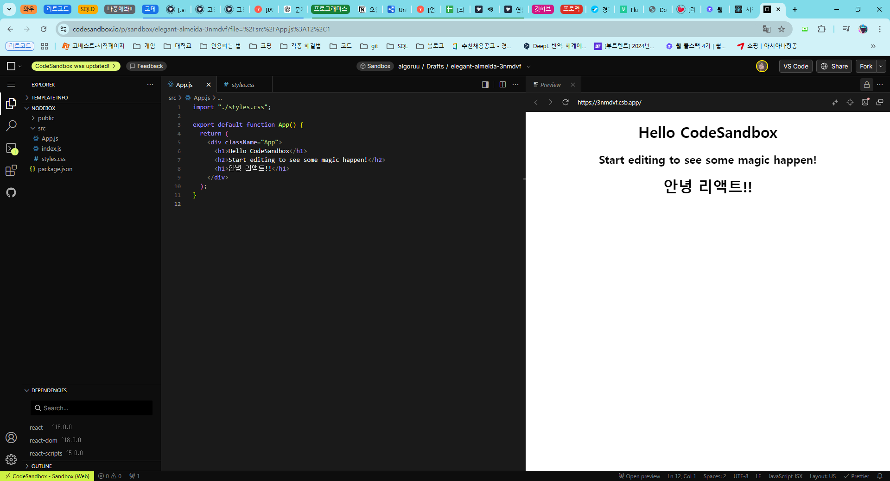
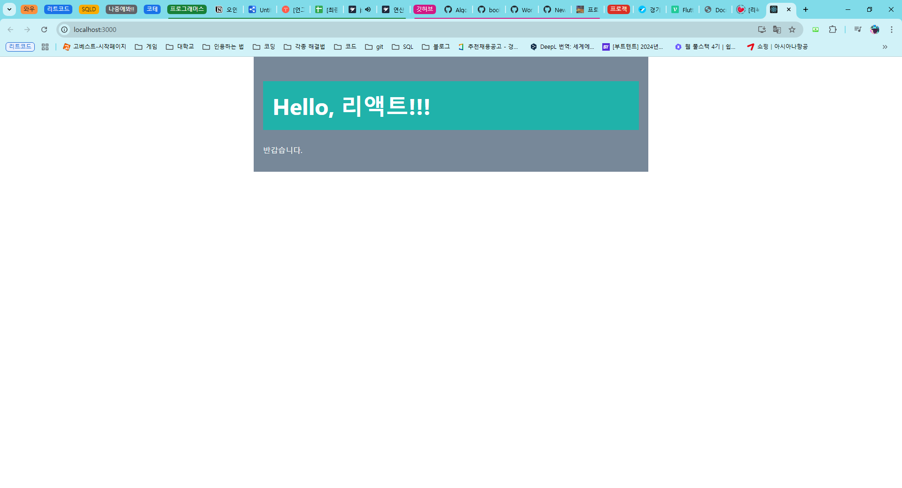

# 프로그래머스 풀스택 45
프론트엔드 기초: React + TypeScript(8)

## 🌊 리액트란 무엇인가 1
<span style="color:lightseagreen">💫 **리액트란 무엇인가 1**</span><br>

**React (웹 프레임워크)**<br>
- React.js는 자바스크립트 라이브러리의 하나.<br>

- UI 개발을 위해 페이스북(조던 워크)에서 개발.<br>
- 싱글 페이지 애플리케이션 및 모바일 애플리케이션 개발 가능.<br>
- 2011년 페이스북 뉴스피드에 처음 적용. 2012년 인스타그램에 적용.<br>
- 2013년 발표. 오픈소스화됨<br><br>

**React의 동작원리**<br>
- 초기 렌더링<br>

- 가상 DOM 변경<br>
- 재조정<br>
- 실제 DOM 업데이트<br>

상속보다는 합성을 사용하며, 렌더링 흐름은 주로 상위에서 하위로(top-down) 진행.<br>

**React의 렌더링** : 컴포넌트의 상태/속성 변화 → 가상 DOM 변경 → 실제 DOM 업데이트 → 브라우저 화면 갱신<br>
= 화면에 보여주는 작업!<br>

**DOM(Document Object Model)** : HTML, XML 문서의 프로그래밍 인터페이스<br>
**가상 DOM (Virtual DOM)** : React와 같은 라이브러리에서 사용, DOM을 조작하는 과정을 최적화하기 위한 메모리 상의 가벼운 사본.<br><br/>

## 🌊 리액트란 무엇인가 2

<span style="color:lightseagreen">💫 **리액트란 무엇인가 2**</span><br>


[리액트 공식 홈페이지 시작하기](https://ko.legacy.reactjs.org/docs/getting-started.html)<br>

<br>
[CodeSandbox(온라인 코드 편집기)](https://codesandbox.io/p/sandbox/new)<br>

- React 프로젝트 생성하는 방법<br>
[Create React App](https://ko.legacy.reactjs.org/docs/create-a-new-react-app.html#create-react-app)<br><br>

```bash
npx create-react-app my-app // 리액트 프로젝트 생성
cd my-app // my-app으로 이동
npm start //react앱 실행
```

- 실행된 react 페이지에서 `Ctrl + U` (페이지 소스 보기)를 하면 소스가 굉장히 짧은 걸 알 수 있음<br>
`index.html`을 보여주는 것이고 `index.html`은 `index.tsx`와 연결되어 있음<br>

- 개발자 도구 - 요소 항목을 보면 자바스크립트 소스를 해석해서 html로 DOM트리를 보여주는 걸 알 수 있음<br><br>
 
- 처음에 `index.html`의 `<div id="root"></div>`를 로딩을 하고 보여주는데 이 root는 

    ```tsx
    const root = ReactDOM.createRoot(
    document.getElementById('root') as HTMLElement
    );
    root.render(
    <React.StrictMode>
        <App />
    </React.StrictMode>
    );
    ```

- `index.tsx`의 root 구조를 불러오는 것<br>

    ```tsx
        <div className="App">
        <header className="App-header">
            
            <p>
            Edit <code>src/App.tsx</code> and save to reload.
            </p>
            <a
            className="App-link"
            href="https://reactjs.org"
            target="_blank"
            rel="noopener noreferrer"
            >
            Learn React
            </a>
        </header>
        </div>
    ```
- 우리는 그래서 `App.tsx` 컴포넌트 안에 있는 부분만 잘 신경쓰고 수정하면 됨!<br>
- App.css에서 css 수정/추가..등 가능함<br><br/>

## 🌊 jsx문법 1

<span style="color:lightseagreen">💫 **jsx문법 1**</span><br>

**JSX (JavaScript XML)** :  JavaScript 내에서 HTML과 유사한 구문을 사용해 UI를 정의할 수 있도록 해주는 문법<br>
- 보통 **JavaScript 파일(.jsx)로** 사용<br>
- JSX는 개발자가 UI 구조를 작성할 때 더 직관적이고 간결하게 표현할 수 있도록 도와줌<br><br>

**TSX (TypeScript XML)** :  TypeScript와 JSX를 결합한 문법<br>
- **TSX는 TypeScript에서 JSX 문법을 지원**하기 위한 파일 확장자<br>
- 보통 **TypeScript 파일(.tsx)로** 사용되며, JavaScript의 타입 안전성(Type Safety)을 확보 가능<br>
- TypeScript는 JavaScript의 상위 집합, 타입 지정 기능 추가됨<br>
따라서, TSX는 TypeScript의 장점과 JSX의 편리함을 결합한 방식<br><br>

**TSX와 JSX의 차이점**<br>
- 타입 시스템이 있는가가 차이<br>
- `TSX`는 TypeScript의 타입 기능을 사용하기 때문에 **컴파일 타임에서 타입 오류**를 잡을 수 있음<br>
- JSX는 타입 검사가 없기 때문에, 타입 관련 오류는 런타임에서 발견 가능<br><br>

---

```javascript
function App(){
  return React.createElement("div", null, "Hello", "리액트!!!",
    React.createElement("p", null, "반갑습니다.") 
  );
} 
```
- 기존의 자바스크립트 코드로 작성된 App()<br>
- 이러한 기존의 자바스크립트 문법을 명확하게 표현하기 위해 만들어진게 리액트의 jsx<br><br>

```javascript
function App() {
  return (
    <div className="App-header">
      <h1>Hello, 리액트!!!</h1>
      <p>반갑습니다.</p>
    </div>
  );
}
```
- 리액트의 jsx문법으로 작성된 App()<br>

- JSX는 보다 직관적이고 간결하게 UI를 작성할 수 있도록 도와줌<br>

- 반드시 부모요소로 감싸는 걸 잊지말기!(최상위 부모 태그 필요)<br>
일반적으로 주로 \<div>를 사용함. 물론 `<> ... </>`도 사용가능<br>

- 주로 하나의 컴포넌트 내부는 하나의 DOM 트리 구조로 이루어져야 한다는 내부적인 규칙이 존재<br><br/>

<br>
- React 페이지 실행중인 모습<br>

## 🌊 jsx 문법 2

<span style="color:lightseagreen">💫 **jsx 문법 2**</span><br>

```jsx
function App() {
  let name = "리액트";

  return (
    <div className="container">
      <h1 className='test'>Hello, {name}!!!</h1>
      <p>반갑습니다.</p>
    </div>
  );
}
```
- `let name = "리액트";`이라고 정의했을 때 원래 `<h1 className='test'>Hello, 리액트!!!</h1>`에서<br>
- `<h1 className='test'>Hello, name!!!</h1>` 이런 식으로 리액트 부분을 name이라고만 적으면 변수 취급 X<br>
- 반드시 `{name}`으로 중괄호를 감싸 사용할 것<br><br>

---

```jsx
function App() {
  let name = "리액트";

  return (
    <div className="container">
      <h1 className='test'>Hello, 
      {
        name === '리액트' ? (<h1>YES</h1>): (<h1>NO</h1>) 
      }!!!</h1>
      <p>반갑습니다.</p>
    </div>
  );
}
```
- 삼항 연산자를 통해 조건부 연산자를 사용할 수 있음!<br>
- `name === '리액트' ? (<h1>YES</h1>): null` 이런 식으로 값을 반환하지 않는 경우도 가능함<br><br>

---

```jsx
  const port = undefined;
  return(
    <div>
      {
        port || '포트를 설정하지 않았습니다.'
      }
    </div>
  )
 ```
- 포트 자체가 undefined일 때, 값을 렌더링하지 않도록 하는 방법임<br>
- 포트의 값이 undefined이면 `포트를 설정하지 않았습니다.` 출력함<br>
- 포트 번호가 들어간다면 포트 번호를 출력함<br>
- 보통은 default 포트를 적어줌 `port || '3000'`<br><br/>

## 🌊 jsx 문법 3

<span style="color:lightseagreen">💫 **jsx 문법 3**</span><br>

**인라인 스타일링**<br>
- 리액트에서 DOM 요소에 스타일을 적용할 때 문자의 형태 X 객체 형태로 넣어야 함<br>
- 컴포넌트 내에서 스타일을 지정 후, 내부에서만 사용할 수 있게 하겠다는 뜻<br>

```jsx
  const style = {
    backgroundColor : 'black',
    color : 'white',
    fontSize : '48px',
    fontWeight : 'bold',
    padding : '20px'
  }
```
- 이렇게 스타일을 지정하면 `<div style = {style}>`이런 식으로 사용 가능함<br><br>
```jsx
    <div style = {
      {
        backgroundColor : 'black',
        color : 'white',
        fontSize : '48px',
        fontWeight : 'bold',
        padding : '20px'
      }
    }>
```
- 이런 식으로도 적용 가능함<br><br>

---

```jsx
<br></br>
<input></input>
```
- jsx에서는 닫는 태그가 필수!!!<br><br>
- 근데 `<br/>` `<input/>` 이런 식으로 self closing을 하면 단독 사용 가능!<br><br>

---

**jsx 주석 닫는 법**<br>

```jsx
{/* 
  작성자 : kny
  작성일 : 2024.10.30.
  내용 : 기능에 대한 내용
*/}
```
- `{/* */}`로 주석을 닫으면 됨<br>
- 일반적으로 컴포넌트 작성할 때 형식을 지켜 작성하면 좋음!!<br>

임시로 코드를 막고 싶을 때 : (VSCode 기준) `Ctrl + /` 사용하면 주석 가능~~<br><br/>

## 🌊 느낀 점(YWT)

**Y 일을 통해 명확히 알게 되었거나 이해한 부분(한 일)에 대해 정리 :**<br>
리액트, jsx/tsx 차이, jsx 문법<br>

**W 배운 점과 시사점 :**<br>

**JSX (JavaScript XML)** :  JavaScript 내에서 HTML과 유사한 구문을 사용해 UI를 정의할 수 있도록 해주는 문법<br>
- 보통 **JavaScript 파일(.jsx)로** 사용<br>
- JSX는 개발자가 UI 구조를 작성할 때 더 직관적이고 간결하게 표현할 수 있도록 도와줌<br><br>

**TSX (TypeScript XML)** :  TypeScript와 JSX를 결합한 문법<br>
- **TSX는 TypeScript에서 JSX 문법을 지원**하기 위한 파일 확장자<br>
- 보통 **TypeScript 파일(.tsx)로** 사용되며, JavaScript의 타입 안전성(Type Safety)을 확보 가능<br>
- TypeScript는 JavaScript의 상위 집합, 타입 지정 기능 추가됨<br>
따라서, TSX는 TypeScript의 장점과 JSX의 편리함을 결합한 방식<br><br>

**T 응용하여 배운 것을 어디에 어떻게 적용할지:**<br>
리액트를 이용해 웹을 만들 때 더 고도화시킬 수 있음!<br>