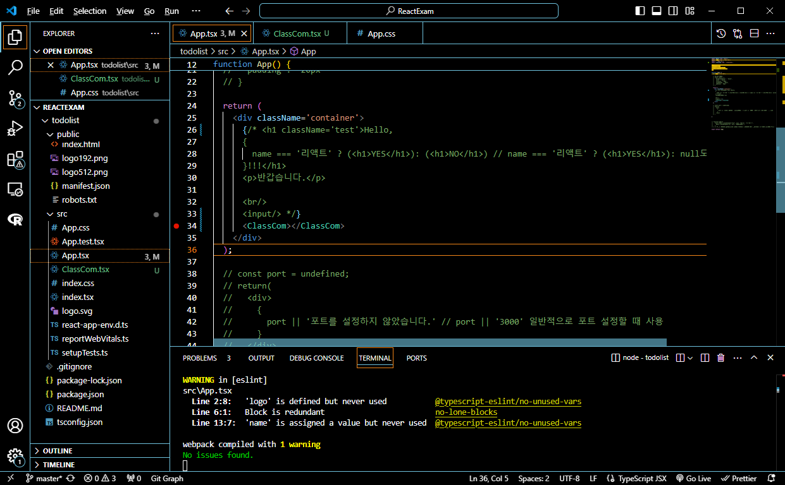
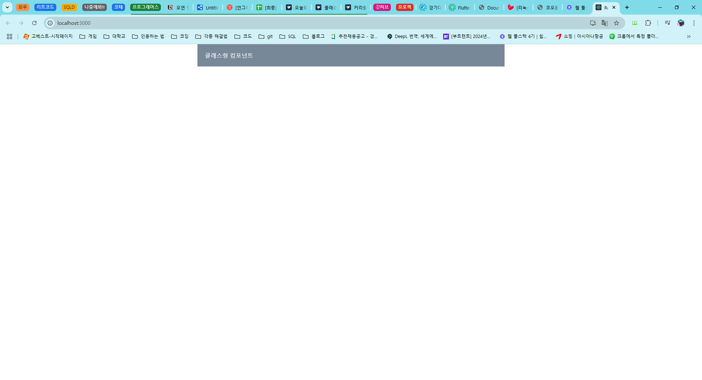
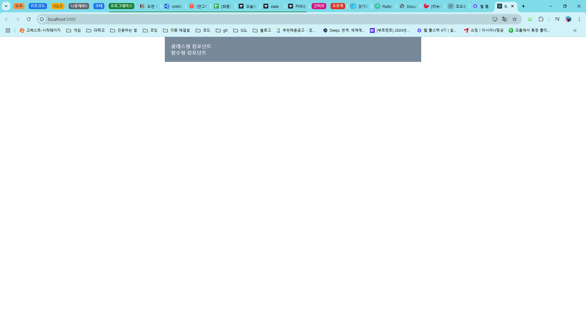
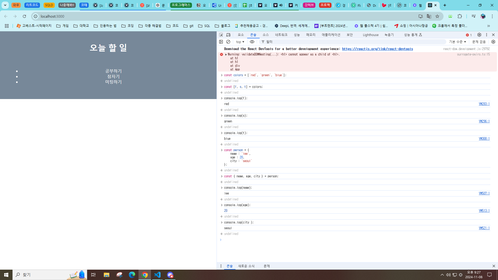
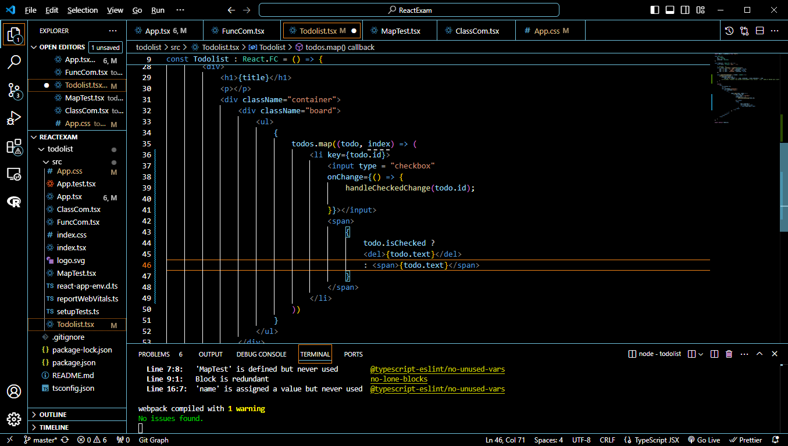
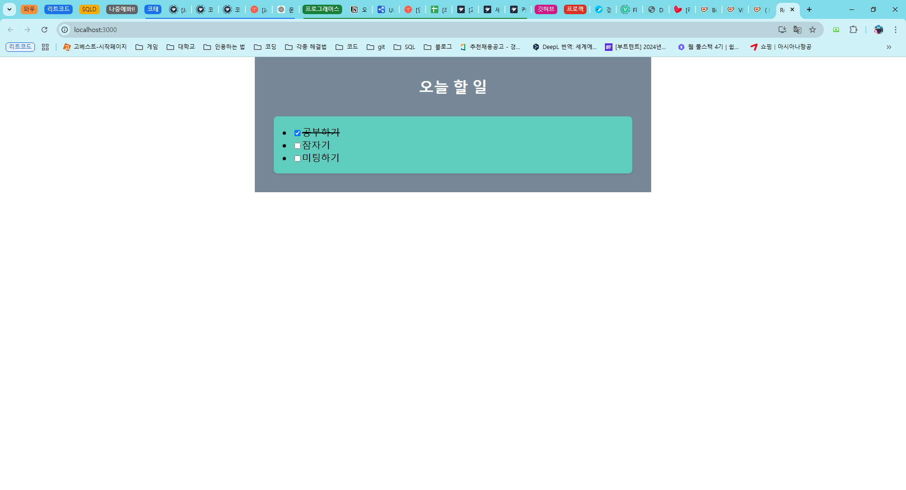
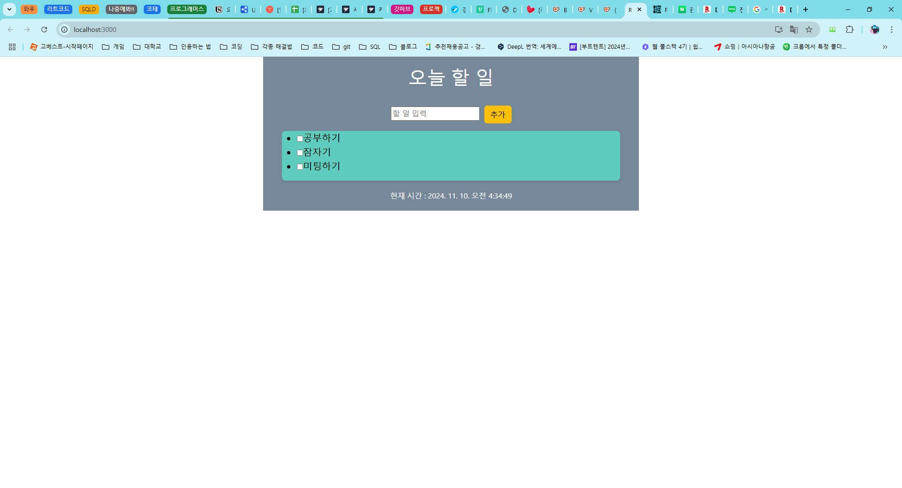

# 프로그래머스 풀스택 46
프론트엔드 기초: React + TypeScript(9)

## 🌊 클래스형 컴포넌트와 함수형 컴포넌트
<span style="color:lightseagreen">💫 **클래스형 컴포넌트와 함수형 컴포넌트**</span><br>

컴포넌트를 별도로 만들어서 호출하는 형태!<br>

**클래스형 컴포넌트**<br>
```tsx
import { Component } from "react";
//컴포넌트라는 클래스를 반드시 상속!!!
class ClassCom extends Component {
    render() {
        return (
            <div>
                클래스형 컴포넌트
            </div>
        )
    }
}
export default ClassCom;
```
- 기본 형태<br>
- export 해주는 거 까먹지 말기!!!<br><br>

<br>
- App.tsx에서 호출하는 모습<br><br>

<br>
- 잘 실행되는 모습<br>
- 리액트 파일은 터미널에서 `cd 리액트 폴더이름`, `npm start`으로 실행하면 됨<br><br>

---
**함수형 컴포넌트**<br>
- 최근에 선호하는 형태. 가독성면에서 좋음<br>
```tsx
import React from "react";
function FuncCom()
{
    return(
        <div>
            함수형 컴포넌트
        </div>
    )
}
export default FuncCom;
```
- 기본 형태<br>
- 클래스 컴포넌트의 렌더부분을 간소화시켜서 생략. return으로 가능<br><br>

```tsx
import React from "react";
const FuncCom = () =>
{
    return(
        <div>
            함수형 컴포넌트
        </div>
    )
}
export default FuncCom;
```
- 화살표 함수 형태를 사용한 것<br><br/>

<br>
- 호출하면 잘 실행되는 모습<br>


## 🌊 state 사용하기

<span style="color:lightseagreen">💫 **state 사용하기**</span><br>

```tsx
import React, { useState } from "react";
const Todolist : React.FC = () => {
    const title : string = "오늘 할 일";
    const [todos] = useState(['공부하기', '잠자기', '미팅하기']);
    return(
        <div>
            <h1>{title}</h1>
            <p></p>
            <div className="container">
                <ul>
                    <li>{todos[0]}</li>
                    <li>{todos[1]}</li>
                    <li>{todos[2]}</li>
                </ul>
            </div>
        </div>
    )
}
export default Todolist;
```
- **FC** : Functional Component. 코드를 좀 더 명확하게 해줌<br>

- **state** : 일반 함수와 달리, react 내부에서 데이터를 **동적으로 상태를 관리**하겠다는 것임.<br>

- **useState** : 동적인 상태를 관리하기 위해 사용하는 훅(hooks).<br>
자동으로 데이터를 관리해줌!<br><br/>

## 🌊 구조 분해 할당 이해

<span style="color:lightseagreen">💫 **구조 분해 할당 이해**</span><br>

`useState`에는 한 쌍으로, 첫 번째는 **state의 현재 데이터**, 두 번째는 **상태 변경 함수**가 들어감<br>

✨ex) `const [state, setState] = useState(initialValue);`<br>
- state를 변경하려면 setState 함수를 이용해 변경!<br>

✨ex) `const [todos, setTodos] = useState<string[]>(['공부하기', '잠자기', '미팅하기']);`<br>
- todos를 변경하려면 setTodos 함수를 이용해 변경!<br><br>

<br>
특정 개체를 거꾸로 분열을 해서 대입한다는 것.<br>
배열, 객체 등등 가능<br><br>

```javascript
const colors = ['red', 'green', 'blue'];
const [f, s, t] = colors;
console.log(f); // 출력: red
console.log(s); // 출력: green
console.log(t); // 출력: blue
```
- **배열 구조 분해 할당** :  배열의 요소를 순서대로 **분해**하여 개별 변수에 할당<br><br>


```javascript
const person = {
    name: 'lee',
    age: 20,
    city: 'seoul'
};
const { name, age, city } = person;
console.log(name); // 출력: lee
console.log(age);  // 출력: 20
console.log(city); // 출력: seoul
```
- **객체 구조 분해 할당** : 객체의 **속성 이름을 기준**으로 값을 **매칭**하여 변수에 할당<br><br>

---
클래스(도시) = 멤버변수(백성들) + 멤버함수(성의 문)<br>
클래스는 기본적으로 캡슐화!!<br>

캡슐화의 핵심은 **정보 은닉(Information Hiding)**!<br>
- 멤버 변수를 **private**로 설정하면, 외부에서는 직접 접근X<br>
- 대신, **public**이나 **protected**로 제공되는 멤버 함수를 통해 데이터를 간접 접근O<br><br/>

## 🌊 데이터 반복 처리하기

<span style="color:lightseagreen">💫 **데이터 반복 처리하기**</span><br>

구조체, 공용체, 클래스 👉 사용자가 정의한 것<br>
- 내부의 여러 개의 타입들이 그룹되어 있음<br>

- 의미적으로 연관된 데이터들의 집합<br><br>

interface말고 type을 사용하는 이유 : 기존의 재료로 새로운 타입을 만들 때 사용<br>
interface를 사용할 때 : 객체의 구조를 정의할 때 사용<br>

```tsx
type Todo = {
    id : number;
    text : string;
    isChecked : boolean;
};
```
<br><br>

---
```tsx
import React, {  } from "react";
const MapTest = () => {
    const fruits = ['apple', 'banana', 'orange'];
    return(
        <div>
            <h2>과일</h2>
            <ul>
                {
                    fruits.map((fruit, index) => (
                        <li key={index}>{fruit}</li>
                    ))
                }
            </ul>
        </div>
    )
}
export default MapTest;
```
- 멤버 함수 map()을 사용하기<br>                    
- 콜백함수를 사용해 차례대로 할 수 있게 함<br>
- fruit은 반복하면서 각각의 요소를 차례대로 전달받는 요소<br>
- index는 루프를 돌며 index의 0부터 차례대로 1씩 증가하면서 들어옴<br>
- `<li key={index}>` : 렌더링 구분을 위한 키 속성을 반드시 적어줄 것!<br><br/>

## 🌊 체크박스 기능 추가

<span style="color:lightseagreen">💫 **체크박스 기능 추가**</span><br>

```tsx
    const handleCheckedChange = (itemId : number) => {
        setTodos((prevItems) => 
            prevItems.map((item) =>
                item.id === itemId ? {...item, isChecked : !item.isChecked } : item
            )
        )
    }
```
- 체크박스를 클릭하면 해당 항목의 isChecked값이<br>
true, false로 변경되고 아니라면 기존의 항목 item이 반환<br><br>

<br>

<br>
- 취소선을 설정해주는 코드를 추가하여 화면에 잘 나타남<br>
<br><br/>

## 🌊 새로운 게시물 추가하기

<span style="color:lightseagreen">💫 **새로운 게시물 추가하기**</span><br>

[리액트 부트스트랩 이용하기](https://react-bootstrap.netlify.app/docs/getting-started/introduction)<br>

```bash
npm install react-bootstrap bootstrap
```
- 터미널에 입력해서 설치하기<br>

```tsx
import { Button } from 'react-bootstrap';
```
- import는 이렇게!<br>

```html
<link
  rel="stylesheet"
  href="https://cdn.jsdelivr.net/npm/bootstrap@5.3.2/dist/css/bootstrap.min.css"
  integrity="sha384-T3c6CoIi6uLrA9TneNEoa7RxnatzjcDSCmG1MXxSR1GAsXEV/Dwwykc2MPK8M2HN"
  crossorigin="anonymous"
/>
```
- 사용하기 위해 `index.html`에 들어가서 \<title>태그 위에 적어줌<br>
- `<button>추가</button>`에서 `<Button>추가</Button>`으로 사용할 수 있게 됨<br><br>

`...todos` : 스프레드(spread) 연산자. 기존의 배열을 변경X, 새로운 배열을 생성해서 값을 추가함<br>
배열의 새로운 복사본을 만들고 무장해제. 독립적인 메모리 공간 생성<br>

---
```tsx
import { Button, Form } from 'react-bootstrap';
//...생략
<Form.Control size="lg" type="text" placeholder="Large text" />
```
- 만약 폼을 사용하려면 import에 form을 추가한 뒤 리액트 부트스트랩 문서를 보고 작성해주면 됨<br><br/>

## 🌊 시계 추가하기

<span style="color:lightseagreen">💫 **시계 추가하기**</span><br>

`setInterval(콜백함수, 시간 주기)`<br>

```tsx
const Clock : React.FC = () => {
    const [time, setTime] = useState(new Date());

    setInterval(() => {
        setTime(new Date());
    }, 1000)

    return (
        <div>
            현재 시간 : {time.toLocaleDateString()} {time.toLocaleTimeString()}
        </div>
    )
}
```
<br>
- 잘 작동!<br><br/>

## 🌊 게시물 삭제하기

<span style="color:lightseagreen">💫 **게시물 삭제하기**</span><br>

`setTodos(todos.filter((todo) => todo.id !== id)) `<br>
**filter()** : 전체 배열에서 특정 조건을 만족하는 요소만 필터링해서 새로운 배열을 만들어 리턴해줌<br><br/>

## 🌊 느낀 점(YWT)

**Y 일을 통해 명확히 알게 되었거나 이해한 부분(한 일)에 대해 정리 :**<br>
클래스형/함수형 컴포넌트, 구조 분해 할당, 기능 추가<br>

**W 배운 점과 시사점 :**<br>

**함수형 컴포넌트**<br>
- 최근에 선호하는 형태. 가독성면에서 좋음<br>
- 클래스 컴포넌트의 렌더부분을 간소화시켜서 생략. return으로 가능<br><br>

**배열 구조 분해 할당** :  배열의 요소를 순서대로 **분해**하여 개별 변수에 할당<br><br>

**객체 구조 분해 할당** : 객체의 **속성 이름을 기준**으로 값을 **매칭**하여 변수에 할당<br><br>


**T 응용하여 배운 것을 어디에 어떻게 적용할지:**<br>
프론트엔드 작업할 때 사용!<br>