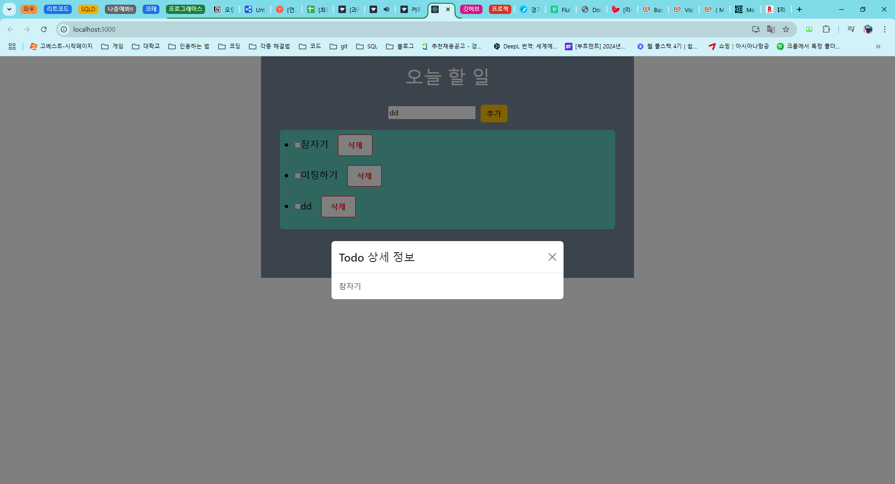

# 프로그래머스 풀스택 47
프론트엔드 기초: React + TypeScript(10)

## 🌊 props의 사용
<span style="color:lightseagreen">💫 **props의 사용**</span><br>

**props** : 매개변수와 같은 의미. 컴포넌트끼리 데이터 공유가 필요할 때 사용<br>
데이터가 고정되지 않고 입력값에 따라 동적으로 결과가 변함<br>

**함수형 컴포넌트**<br>
```tsx
const MyWeather : React.FC<MyProps> = (props) => {
    const {children, weather} = props;
    return(
        <div>
            {children}<p></p>
            오늘의 날씨는 {weather} 입니다.
        </div>
    )
}
```
- 구조 분해 할당 적용<br>
- 그런데 props 부분이 겹치는 것 같아서 수정<br><br>

```tsx
const MyWeather : React.FC<MyProps> = ({children, weather}) => {
    return(
        <div>
            {children}<p></p>
            오늘의 날씨는 {weather} 입니다.
        </div>
    )
}
```
- 좀 더 간결한 객체의 구조 분해 할당 적용하여 수정 완료<br><br>

---
**클래스형 컴포넌트**<br>
```tsx
class MyWeather extends Component<MyProps> {
    render() {
        const {children, weather} = this.props;
        return(
            <div>
                {children}<p></p>
                오늘의 날씨는 {weather} 입니다.
            </div>
        )
    }
}
```
- 구조 분해 할당 적용 / 함수형과 같이 잘 작동함.<br>
- this는 컴포넌트를 호출한 대상 객체!!<br><br/>

## 🌊 모달 대화상자를 이용한 상세정보 구현하기

<span style="color:lightseagreen">💫 **모달 대화상자를 이용한 상세정보 구현하기**</span><br>

[리액트 부트스트랩 모달](https://react-bootstrap.netlify.app/docs/components/modal)<br>
- 들어가서 모달 예제 확인<br><br>

```tsx
const TodoModal : React.FC<TodoModalProps> = ({show, todo, handleClose}) => {
    return (
        <div>
            <Modal show={show} onHide={handleClose} centered>
                <Modal.Header closeButton>
                    <Modal.Title>Todo 상세 정보</Modal.Title>
                </Modal.Header>
                <Modal.Body>{todo?.text}</Modal.Body>
            </Modal>
        </div>
    )
}
```
- todo?를 통해 todo에 값이 있을 때만 렌더링하게 해줌<br>

<br>
- 잘 작동!<br><br/>

## 🌊 프론트엔드 기초과정을 마치며

<span style="color:lightseagreen">💫 **프론트엔드 기초과정을 마치며**</span><br>

- 클론 코딩 지양, 프로그래밍 기초 개념 및 원리 이해 중심 학습<br>
- 개발은 기술 습득 < 패턴 이해 중요<br>
- 로직과 기능 구현에 집중<br>
- 객체지향 철학을 늘 염두할 것<br>
- 특정 개발자가 아니라 "개발자"가 될 것<br><br/>

## 🌊 느낀 점(YWT)

**Y 일을 통해 명확히 알게 되었거나 이해한 부분(한 일)에 대해 정리 :**<br>
프론트엔드의 원리를 배울 수 있었음!<br>

**W 배운 점과 시사점 :**<br>

**props** : 매개변수와 같은 의미. 컴포넌트끼리 데이터 공유가 필요할 때 사용<br>
데이터가 고정되지 않고 입력값에 따라 동적으로 결과가 변함<br>

**T 응용하여 배운 것을 어디에 어떻게 적용할지:**<br>
프론트엔드 작업을 할 때 유용하게 사용할 수 있음!<br>