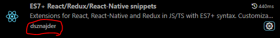
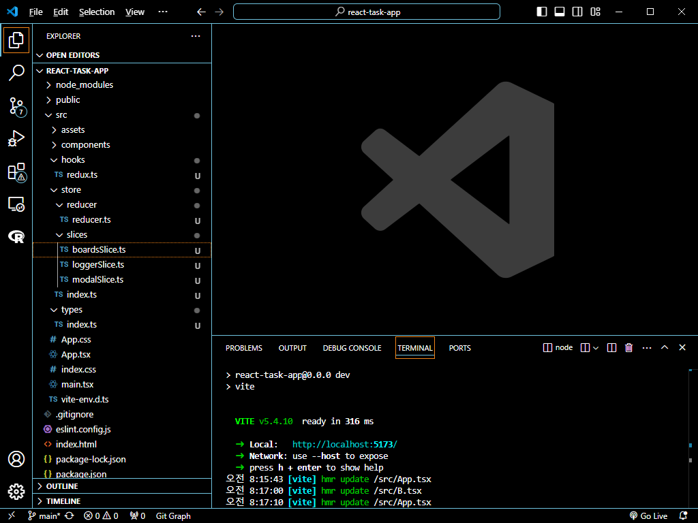
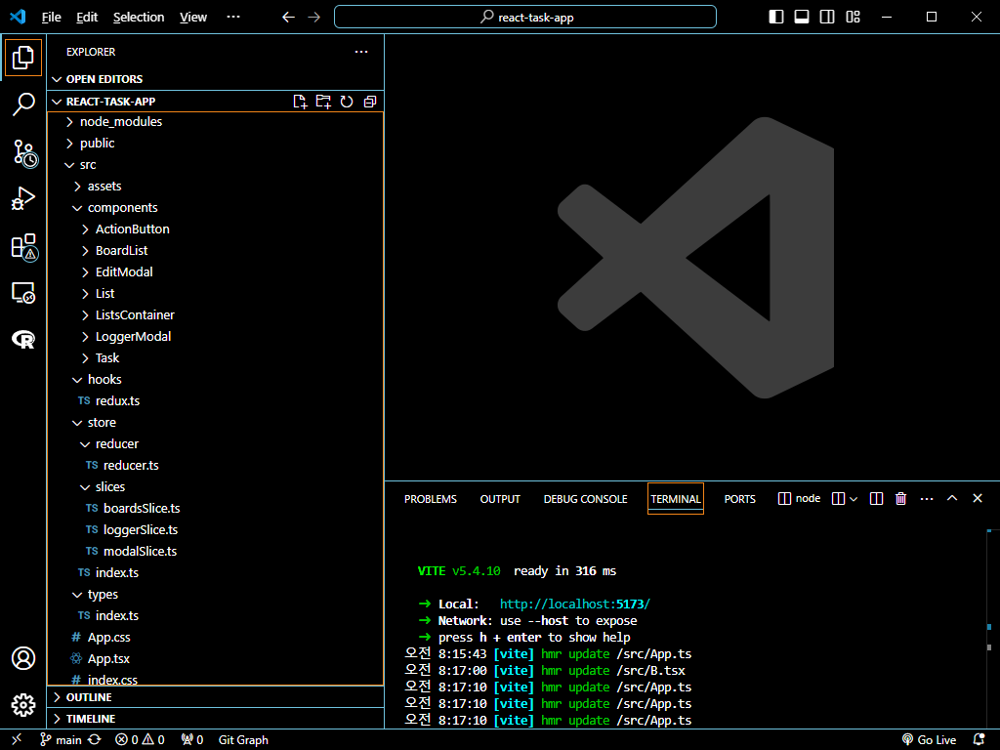
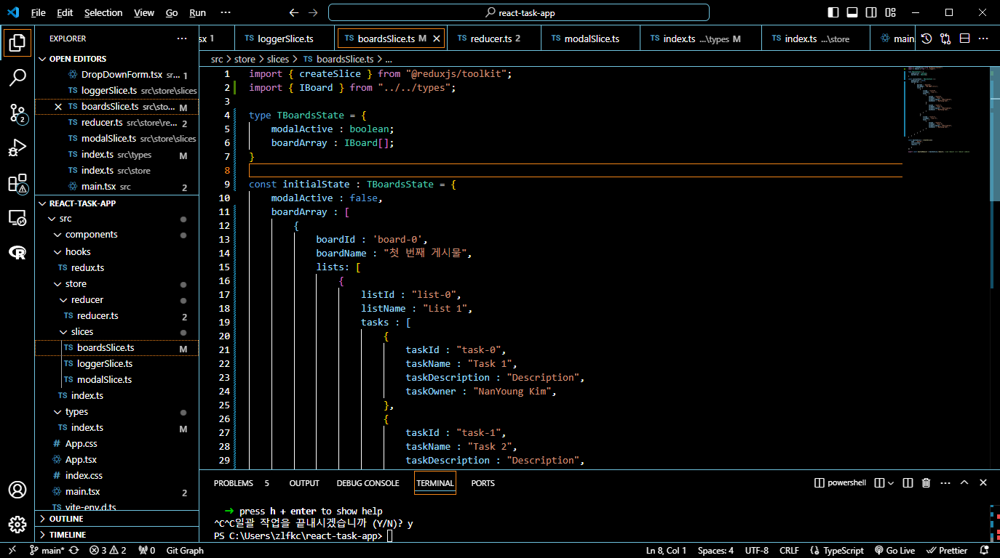
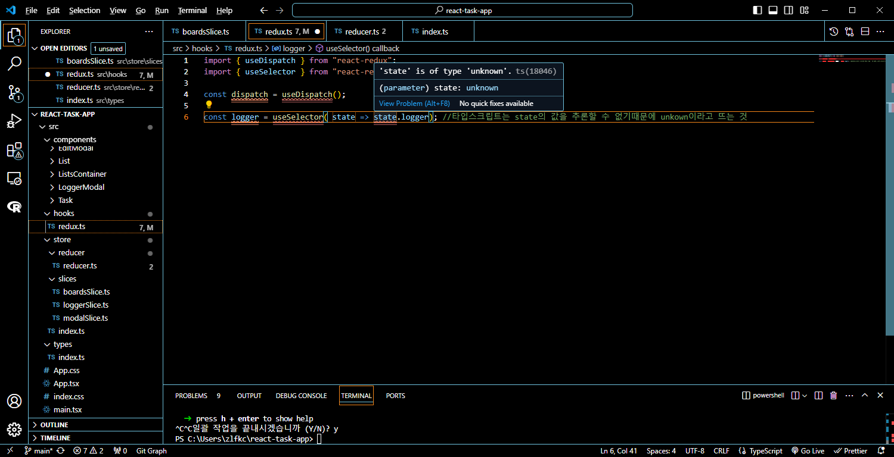
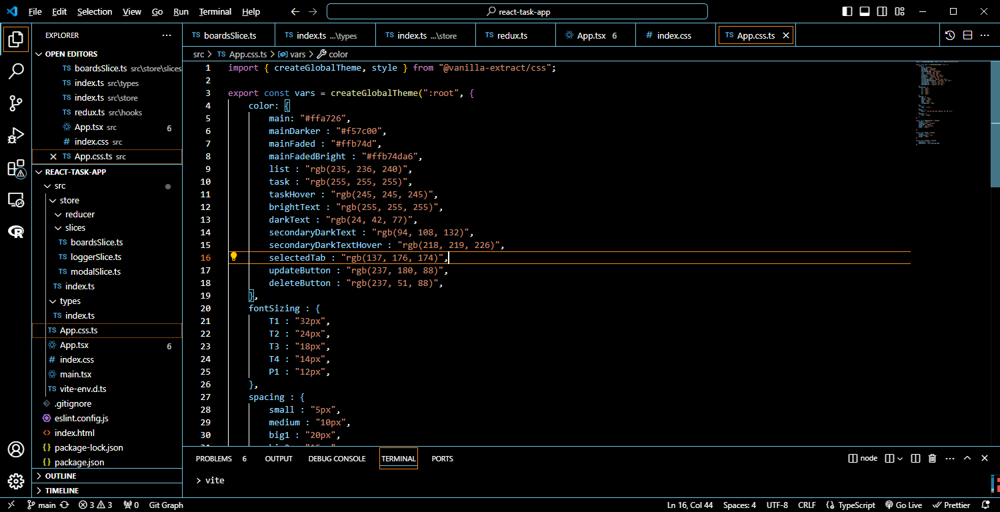

# 프로그래머스 풀스택 48
프론트엔드 심화: 상태 관리와 비동기 처리(1)

## 🌊 1-1. 만들고자 하는 앱 살펴보기
<span style="color:lightseagreen">💫 **리액트를 이용한 Task 생성 앱 만들기**</span><br>

`npx` : 일회용 설치<br>
`npm` : 다회용 설치<br>

- `npm init vite`을 통해 리액트를 빠르게 설치함<br>
- 프로젝트 이름은 `./`을 입력하여 현재 폴더명을 사용하기<br>
- 리액트와 타입스크립트를 선택하여 설치 진행<br>

그 뒤 터미널에 `npm i`를 통해 남은 dependencies 설치<br>
`npm run dev`를 통해 실행<br><br/>

## 🌊 1-2. 구조 생성하기

<span style="color:lightseagreen">💫 **구조 생성하기**</span><br>

<br>
- 이 Extension을 설치하면 스니펫을 사용할 수 있음<br>
스니펫을 사용하면 `rafce`라는 명령어를 통해 리액트 기본 코드가 제공됨<br>
```tsx
import React from 'react'

const ActionButton = () => {
  return (
    <div>ActionButton</div>
  )
}

export default ActionButton
```
상태관리 라이브러리 : Redux, Mobx, Zustand, Recoil, Context API<br>

<br>
- 기본 구조 생성중<br><br/>

## 🌊 1-3. 모든 컴포넌트들 생성하기

<span style="color:lightseagreen">💫 **모든 컴포넌트들 생성하기**</span><br>

<br>
- 생성 완료<br>

<br><br/>

## 🌊 1-4. 필요한 패키지들 설치하기

<span style="color:lightseagreen">💫 **필요한 패키지들 설치하기**</span><br>

```bash
npm install @reduxjs/toolkit redux clsx @vanilla-extract/css @vanilla-extract/css-utils @vanilla-extract/vite-plugin react-icons uuid react-beautiful-dnd
```
<br><br/>

## 🌊 1-5. 리덕스 사용을 위한 준비하기

<span style="color:lightseagreen">💫 **리덕스 사용을 위한 준비하기**</span><br>

`npm install react-redux`을 통해 설치하기<br>

**Redux**<br>
- 상태 관리 라이브러리 (선택사항)<br>

- State, Props 상태를 여러 컴포넌트와 공유<br>
- 앱 커지면 👉 관리 힘듦, 소스 코드 지저분<br>
👉 Redux 사용<br>

**Redux의 흐름**<br>

Action 객체 Dispatch 함수 👉 Reducer 함수 type return 👉 Redux Store State 👉 React Component Rerendering<br>
Toolkit　　Reducer　　Slice　　Store　　Provider　　react component wrapper<br><br>

---
**default로 내보내는 것과 이름으로 export하는 것의 차이점**<br>

`export default reducer;`<br>
👉 `import reducer from "./reducer/reducer";`<br>
- 경로만 맞으면 어떠한 이름이여도 상관X<br>
- import할 때 중괄호가 없어야 함<br><br>

`export const modalReducer = modalSlice.reducer;`<br>
👉 `import { modalReducer } from "../slices/modalSlice";`<br>
- 반드시 같은 이름으로 가져와야 함!<br>
- import할 때 중괄호 필요<br><br/>

## 🌊 1-6. Board 데이터 및 타입 생성

<span style="color:lightseagreen">💫 **Board 데이터 및 타입 생성**</span><br>

<br>
- 생성 완료<br><br/>

## 🌊 1-7. 리덕스 Hooks 생성하기

<span style="color:lightseagreen">💫 **리덕스 Hooks 생성하기**</span><br>

타입스크립트　　👉 추론 X　　👉 타입 지정 annotate<br>
<br>
- 타입스크립트는 state의 값을 추론할 수 없기때문에 unkown이라고 뜨는 것<br>
- 하지만? 우리는 타입을 알고 있음. 우리가 지정해야함<br>

```ts
interface Obj<T> {
    name : T;
} // TypedUseSelectorHook<>과 같음
interface State {
    state : {
        data : string,
        loading : boolean
    }
} // Obj<T>에 값이 들어감
const obj : Obj<State> = {
    name : {
        state : {
            data : 'abcd',
            loading : false
        }
    }
}
```
<br><br/>

## 🌊 1-8. 전역 스타일 생성하기

<span style="color:lightseagreen">💫 **전역 스타일 생성하기**</span><br>

`vite.config.ts`파일에서<br>
```ts
export default defineConfig({
  plugins: [react(), vanillaExtractPlugin()],
})
```
플러그인 부분에 `vanillaExtractPlugin()`를 추가<br>

<br>
- 전역 스타일 생성 완료<br><br/>

## 🌊 느낀 점(YWT)

**Y 일을 통해 명확히 알게 되었거나 이해한 부분(한 일)에 대해 정리 :**<br>
vite를 통해 리액트 프로젝트를 빠르게 생성<br>

**W 배운 점과 시사점 :**<br>

**default로 내보내는 것과 이름으로 export하는 것의 차이점**<br>

`export default reducer;`<br>
👉 `import reducer from "./reducer/reducer";`<br>
- 경로만 맞으면 어떠한 이름이여도 상관X<br>
- import할 때 중괄호가 없어야 함<br><br>

`export const modalReducer = modalSlice.reducer;`<br>
👉 `import { modalReducer } from "../slices/modalSlice";`<br>
- 반드시 같은 이름으로 가져와야 함!<br>
- import할 때 중괄호 필요<br><br/>


**T 응용하여 배운 것을 어디에 어떻게 적용할지:**<br>
작동하는 웹 페이지를 만들 때 응용 가능<br>