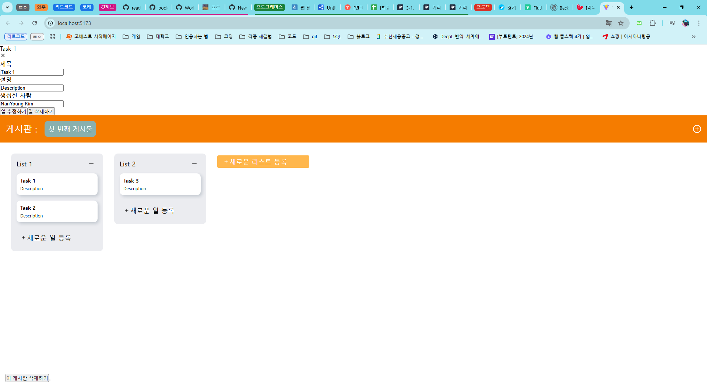
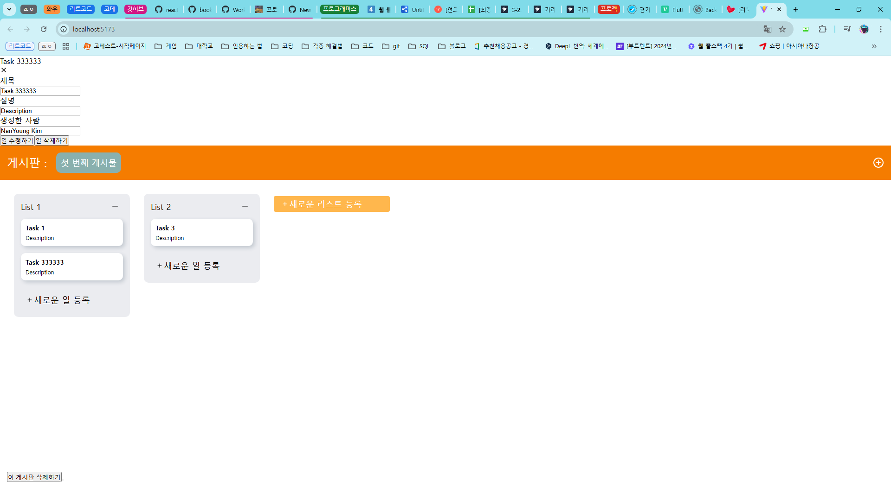
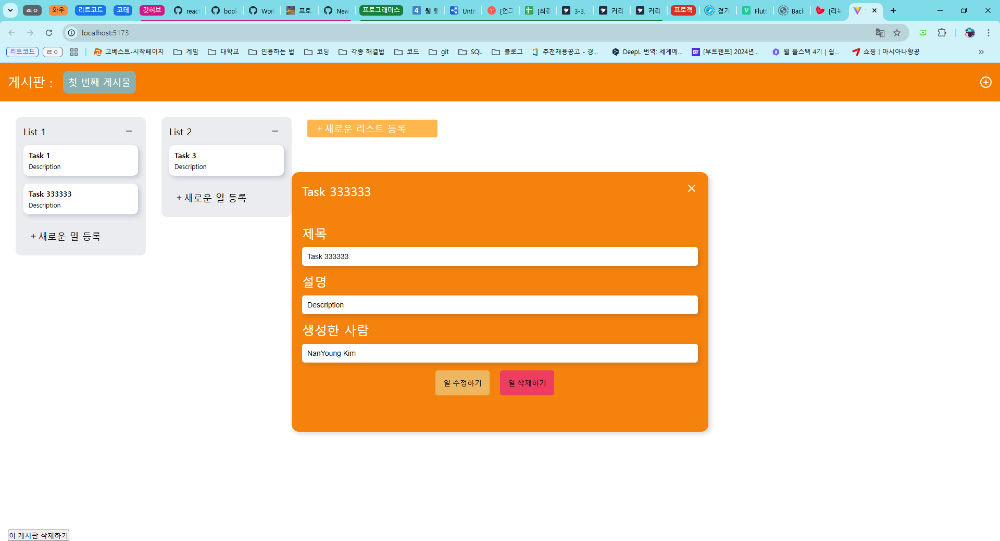
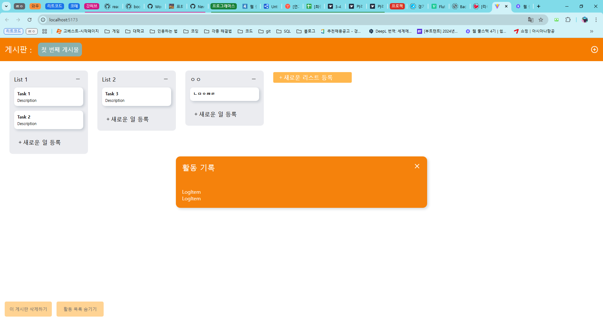
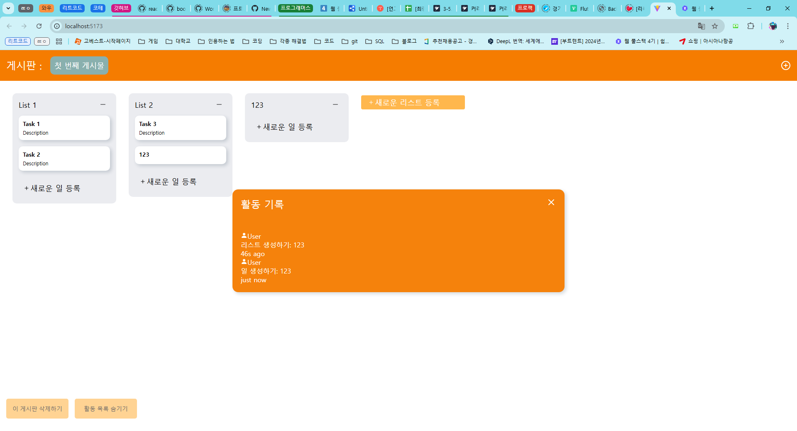

# 프로그래머스 풀스택 50
프론트엔드 심화: 상태 관리와 비동기 처리(3)

## 🌊 3-1. Modal Edit 컴포넌트 생성하기
<span style="color:lightseagreen">💫 **Modal Edit 컴포넌트 생성하기**</span><br>

<br>
- 잘 작동함<br><br/>

## 🌊 3-2. Modal Edit 기능 생성하기

<span style="color:lightseagreen">💫 **Modal Edit 기능 생성하기**</span><br>

<br>
- 잘 작동함<br><br/>

## 🌊 3-3. Modal Edit Style 생성하기

<span style="color:lightseagreen">💫 **Modal Edit Style 생성하기**</span><br>

<br>
- 잘 작동함<br><br/>

## 🌊 3-4. LoggerModal 컴포넌트 생성하기

<span style="color:lightseagreen">💫 **LoggerModal 컴포넌트 생성하기**</span><br>

<br>
- 로그 확인 가능!<br><br/>

## 🌊 3-5. LogItem 컴포넌트 생성하기

<span style="color:lightseagreen">💫 **LogItem 컴포넌트 생성하기**</span><br>

<br>
```tsx
  const showOffsetTime = `
  ${timeOffset.getMinutes() > 0 ? `${timeOffset.getMinutes()}m` : ""}
  ${timeOffset.getSeconds() > 0 ? `${timeOffset.getSeconds()}s ago` : ""}
  ${timeOffset.getSeconds() === 0 ? `just now` : ""}
  `
```
- 로그의 시간을 나타내는 걸 배움!<br><br/>

## 🌊 3-6. LogItem 스타일 생성하기

<span style="color:lightseagreen">💫 **LogItem 스타일 생성하기**</span><br>


<br><br/>

## 🌊 3-4. LoggerModal 컴포넌트 생성하기

<span style="color:lightseagreen">💫 **LoggerModal 컴포넌트 생성하기**</span><br>


<br><br/>


## 🌊 느낀 점(YWT)

**Y 일을 통해 명확히 알게 되었거나 이해한 부분(한 일)에 대해 정리 :**<br>
폼과 스타일을 생성할 수 있게 됨

**W 배운 점과 시사점 :**<br>

blur와 Click 이벤트 순서 잘 생각하기<br>
blur　　onMouseDown　　mouseup　　Click<br>　

**1. blur** : 포커즈를 잃을 때 발생.<br>
- 보통 클릭하기 전에 기존에 포커즈를 가지고 있는 요소가 있을 경우 그 요소에서 blur 이벤트가 먼저 발생<br>

**2. onMouseDown** : 마우스 버튼을 누르는 순간 발생<br>　

**3. mouseup** : 마우스 버튼을 떼는 순간 발생<br>　

**4. Click** : mouseup 이후에 실제 클릭이 이루어지면 발생<br><br>


**T 응용하여 배운 것을 어디에 어떻게 적용할지:**<br>
작동하는 웹 페이지를 만들 때 응용 가능<br>