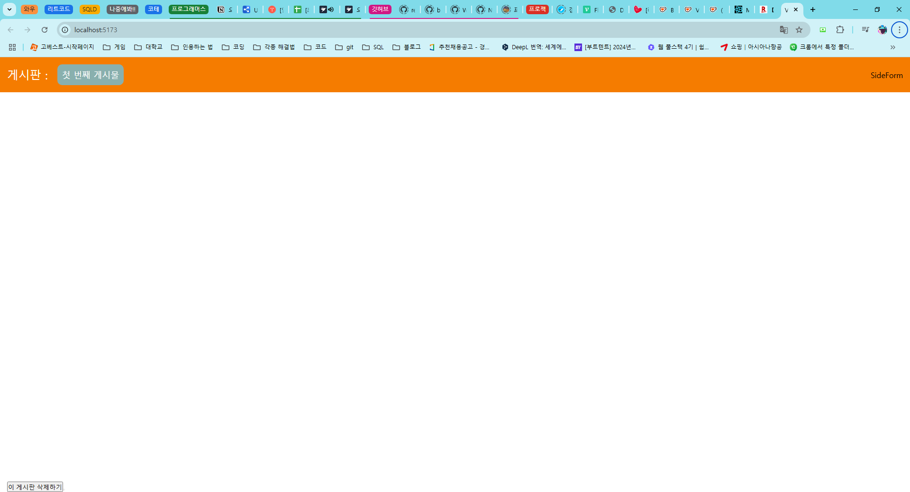

# 프로그래머스 풀스택 50
프론트엔드 심화: 상태 관리와 비동기 처리(3)

## 🌊 2-1. Board List 생성하기
<span style="color:lightseagreen">💫 **Board List 생성하기**</span><br>

<br>
- useState 스니펫을 이용하면 구조를 쉽게 짤 수 있음<br>
- FiPlusCircle를 통해 아이콘 추가<br>
- 아이콘 클릭 시 SideForm으로 바뀜<br><br/>

## 🌊 2-2. Board List Style 생성하기

<span style="color:lightseagreen">💫 **Board List Style 생성하기**</span><br>

<br>
- 스타일을 적용하여 생성 완료<br><br/>

## 🌊 2-3. SideForm 생성하기

<span style="color:lightseagreen">💫 **SideForm 생성하기**</span><br>

Blur 이벤트 : 포커즈했다가 안하면 발생함<br>

ref 객체 : 클릭하자마자 포커징 가능하도록 함<br>

```tsx
const handleClick = () => {
    setIsFormOpen(!isFormOpen)
    setTimeout(() => {
      inputRef.current?.focus();
    }, 0);
  }
``` 
- 호출할 시간을 주는 걸 잊지말기!<br>
- `setTimeout`을 안했을 때는 자동 포커징이 안됐음!<br>
- 하지만 더 간단하게...`autoFocus`를 이용하면 됨<br>

<br>
- 오토 포커징으로 폼에 바로 입력이 가능해지고, 폼을 벗어나서 클릭하면 꺼짐<br><br/>

## 🌊 2-4. SideForm Style 생성하기

<span style="color:lightseagreen">💫 **SideForm Style 생성하기**</span><br>

`import { v4 as uuidv4 } from 'uuid';` : v4 사용할 때 import문<br>
👉 uuid 선언 파일 찾을 수 없다는 오류가 발생한다면<br>
터미널에서 `npm i --save-dev @types/uuid` 시도하거나<br>
`declare module 'uuid';`를 포함하는 새 선언(.d.ts) 파일 추가<br><br>

---
blur와 Click 이벤트 순서 잘 생각하기<br>
blur　　onMouseDown　　mouseup　　Click<br>　

**1. blur** : 포커즈를 잃을 때 발생.<br>
- 보통 클릭하기 전에 기존에 포커즈를 가지고 있는 요소가 있을 경우 그 요소에서 blur 이벤트가 먼저 발생<br>

**2. onMouseDown** : 마우스 버튼을 누르는 순간 발생<br>　

**3. mouseup** : 마우스 버튼을 떼는 순간 발생<br>　

**4. Click** : mouseup 이후에 실제 클릭이 이루어지면 발생<br><br>

<br>
- 게시판이 잘 생성됨<br><br/>

## 🌊 2-5. List Container 생성하기 ~ 2-11. DropDownForm Style 생성하기

<br>

## 🌊 느낀 점(YWT)

**Y 일을 통해 명확히 알게 되었거나 이해한 부분(한 일)에 대해 정리 :**<br>
폼과 스타일을 생성할 수 있게 됨

**W 배운 점과 시사점 :**<br>

blur와 Click 이벤트 순서 잘 생각하기<br>
blur　　onMouseDown　　mouseup　　Click<br>　

**1. blur** : 포커즈를 잃을 때 발생.<br>
- 보통 클릭하기 전에 기존에 포커즈를 가지고 있는 요소가 있을 경우 그 요소에서 blur 이벤트가 먼저 발생<br>

**2. onMouseDown** : 마우스 버튼을 누르는 순간 발생<br>　

**3. mouseup** : 마우스 버튼을 떼는 순간 발생<br>　

**4. Click** : mouseup 이후에 실제 클릭이 이루어지면 발생<br><br>


**T 응용하여 배운 것을 어디에 어떻게 적용할지:**<br>
작동하는 웹 페이지를 만들 때 응용 가능<br>