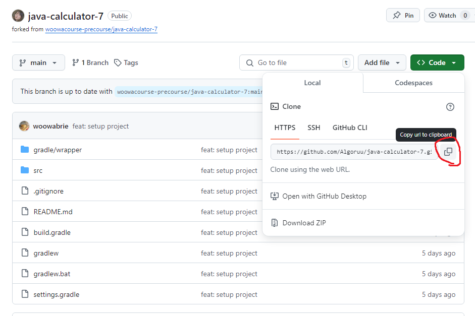
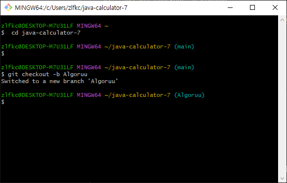
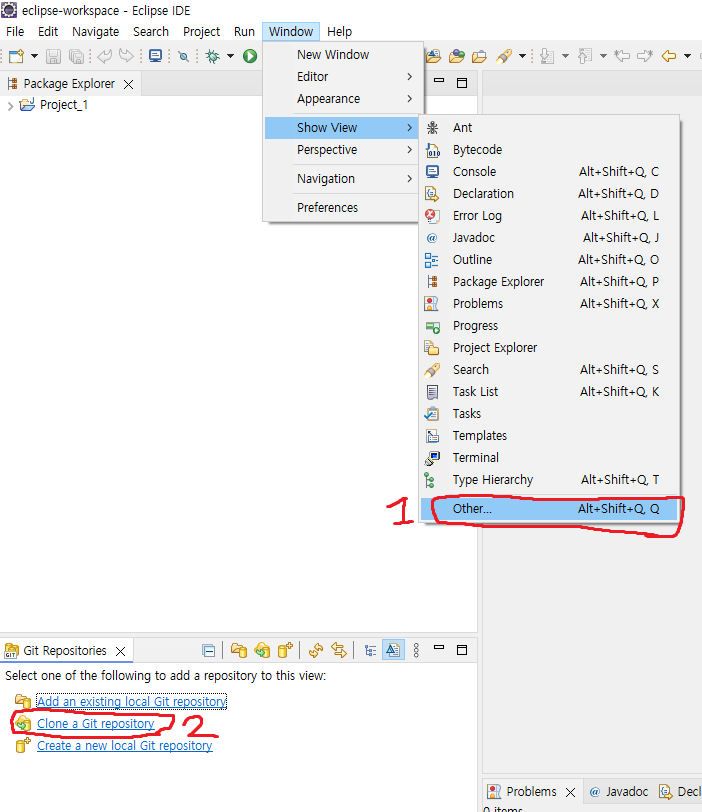
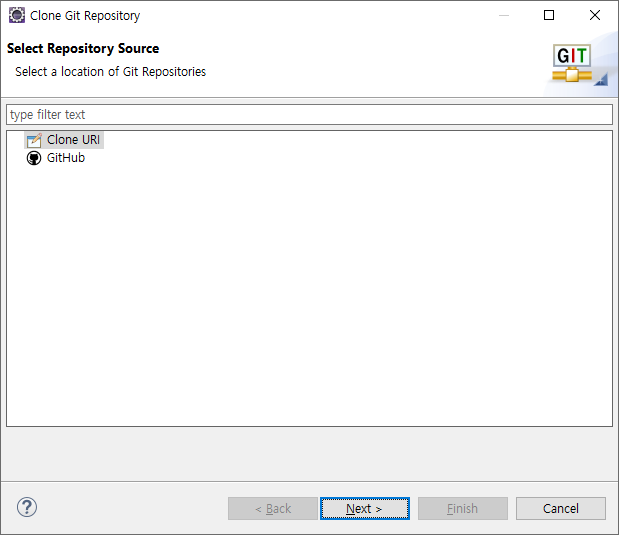
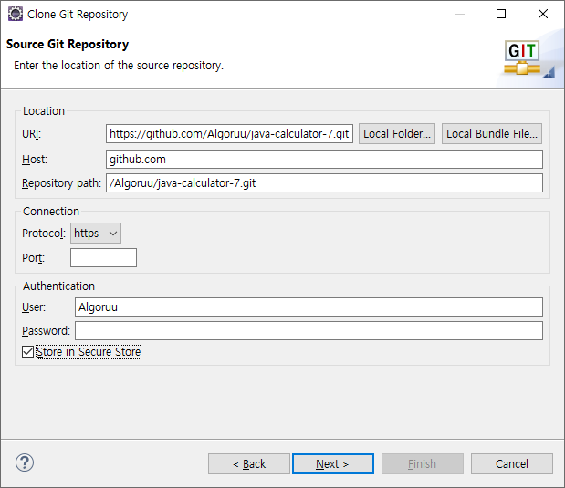
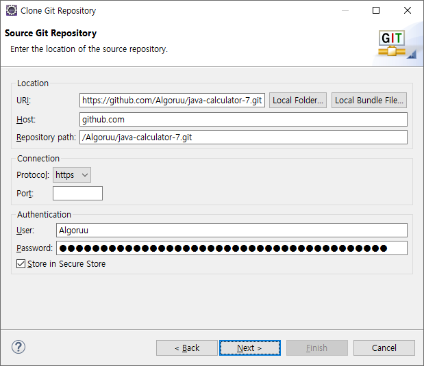
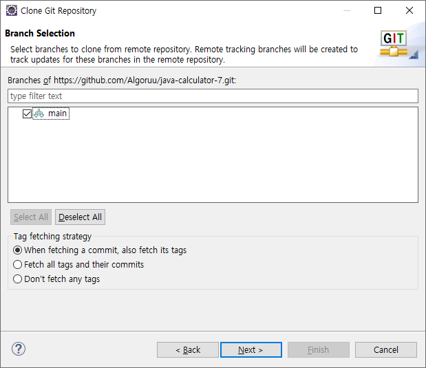
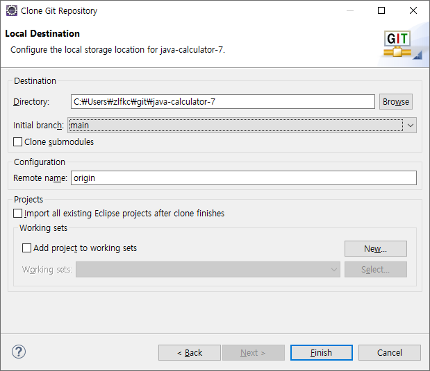
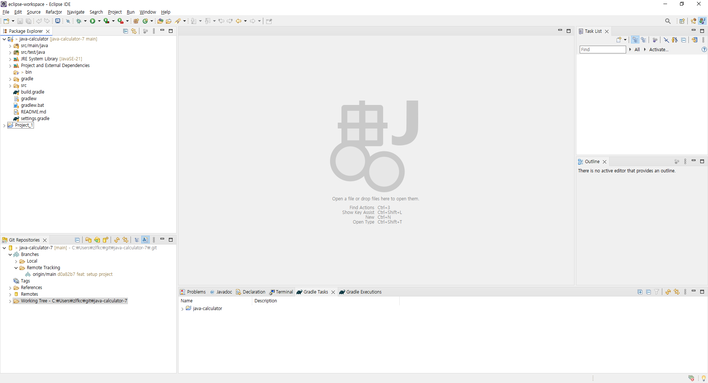

# 우아한테크코스 프리코스 01
문자열 덧셈 계산기

## 🌊 진행 가이드부터 따라하기

### 1. 프로젝트를 포크하고 

원하는 레포지토리에 들어가서 fork를 하면 됨!<br>

---
### 2. git bash를 켜서 fork한 저장소를 자신의 컴퓨터로 clone

 ```bash
git clone https://github.com/{본인_아이디}/{저장소 아이디}.git
ex) git clone https://github.com/Algoruu/java-calculator-7.git
```
- 클론을 진행할 때 뒤의 링크는 쉽게 복사할 해당 레포지토리 - <>Code - 복사 아이콘을 클릭하면 복사할 수 있음!!<br>
<br>
```bash
// clone한 폴더로 이동하는 방법
cd {저장소 아이디}
```

<br>

---
### 3. 기능 구현을 위한 브랜치 생성

```bash
git checkout -b {본인 아이디}
ex) git checkout -b Algoruu
```
- 나같은 경우 여기서부터 무엇을 입력하든 `bash: git: command not found` 라는 오류가 발생했는데<br>
- 찾아보다가 Docker Desktop이 켜져있어서 문제인 거 같아서 Docker를 종료하고, git bash를 재시작해보니 잘 작동했음!!<br><br>

<br><br>
- 잘 작동하는 모습!(오류나던 화면은 캡쳐를 못했음😭)<br><br>

---
### 4. 통합 개발 환경(IDE)으로 가져오기

나는 원래 java는 Eclipse을 사용했으므로 Eclipse와 git을 연결하는 방법을 따로 찾아보았음!<br>

<br>
- Window - Show View - Other 선택!<br>
- Git Repositories 선택 후 아래의 Clone a Git repository를 선택해줌!<br><br>

<br>
- 그러면 Clone URI를 선택해서<br><br>

<br>
- 아까 깃 클론할 때 썼던 링크를 적으면<br>
- 자동으로 Host와 Repository path를 입력해줌.<br>
(근데 URI링크를 복사한 상태라 그런건지 혹은 git bash에서 작업을 진행중이라 그런지 알아서 URI부분도 입력이 되어 있었음..!)<br><br>

<br>
- Authentication 부분에서 Password 부분은 깃허브 토큰을 발급받아서 하면 됨!<br><br>

<br>
<br>
- 다음 단계는 그대로 지나가면 됨! 파일 위치를 수정하고싶다면 수정OK<br><br>
- 
<br>
- 현재 프로젝트는 Gradle project (build.gradle file을 가지고 있는 경우)이므로<br>
- `File > Import...: Gradle > Existing Gradle Project`<br>
이걸 통해 불러와줌<br>
- 처음에는 Package Explorer에서 시도했을 땐 안됐는데(Import 과정만 놓고보면 똑같은 거 같은데..!)<br>
일단 ["Connecting Git team provider failed"..."no Git repositories found"](https://stackoverflow.com/questions/36191347/cannot-import-local-git-into-eclipse-to-create-a-new-project-throws-error-conn) 이걸 보고 해결함!<br>


<br><br/>

